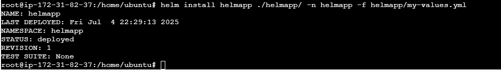

# Deploy with Helm[pp[]]

As we progress with understanding deployment in a cloud native environment. Deployment with Helm is another Key part. Helm is the package manager for Kubernetes, like:
- apt for Ubuntu
- yum for CentOS
- pip for Python

However Helm  does more, it helps you define, install, and manage Kubernetes applications using ***reusable*** packages called charts.
 ## Key Concepts

 | Concept        | Meaning                                                                                    |
| -------------- | ------------------------------------------------------------------------------------------ |
| **Chart**      | A Helm package that contains all the Kubernetes manifest files (Deployment, Service, etc.) |
| **Release**    | An instance of a chart running in a Kubernetes cluster                                     |
| **Repository** | A collection of charts available for use (like DockerHub for Helm)                         |
| **Values**     | Configuration parameters used to customize a chart during installation                     |


## Deploy same Student Project Tracker App using Helm

### 1. Install Helm on your VM
```
# Download Helm
curl -fsSL -o get_helm.sh https://raw.githubusercontent.com/helm/helm/main/scripts/get-helm-3
chmod 700 get_helm.sh
./get_helm.sh

#Verify installation
helm version
```

### 2. Create Helm Chart for app
- Prep  the chat, rm the content in templetes folder or modify the manifest file to suit your app deployment. Create deployment, service,secret, ingress etc.

```
helm create student-tracker 
cd student-tracker
rm -r ./templates/*
cd templates
touch deployment.yaml service.yaml ingress.yml secret.yml
```

### 3. install ingress controller using Helm

```
helm repo add ingress-nginx https://kubernetes.github.io/ingress-nginx

helm repo update

helm install ingress-nginx ingress-nginx/ingress-nginx \
  --namespace ingress-nginx --create-namespace
```

### 4. Update your the chart folder to suit your deployment 

- create your values.yaml folder eg `my-value.yml` or `prod-value.yml`
- update your Chart.yaml with your app details

### 5. Install your helm chart

```
helm install student-tracker ./student-tracker -n my-app -f my-values.yaml
```


### Final Structure

```
student-tracker/
├── templates/
│   ├── deployment.yaml
│   ├── service.yaml
|   ├── secret.yml 
│   ├── ingress.yaml    
├── values.yaml
├── my-values.yaml      👈 OVERRIDES

```

### usefull command

helm uninstall helpapp -n helmapp
helm upgrade helpapp ./helmapp/ -n helmapp -f helmapp/my-values.yml
helm list -n helmapp

