# 🚀 CI/CD Pipeline Guide

## 📋 **Overview**

This project uses a modern CI/CD pipeline with GitHub Actions and ArgoCD for GitOps deployment. The pipeline automatically builds, tests, and deploys the Student Tracker application.

## 🔄 **Pipeline Flow**

```mermaid
graph LR
    A[📝 Code Push] --> B[🧪 Tests]
    A --> C[🔒 Security Scan]
    B --> D[🐳 Build Image]
    C --> D
    D --> E[📦 Push to Registry]
    E --> F[🔄 ArgoCD Sync]
    F --> G[🚀 Deploy to K8s]
    
    style A fill:#e1f5fe
    style G fill:#c8e6c9
```



## 🏗️ **Pipeline Components**

### 1. **🧪 Test Job**
- **Purpose**: Validate code quality and functionality
- **Actions**:
  - Code formatting check (Black)
  - Linting (Flake8)
  - Unit tests (pytest)
  - Coverage reporting
- **Trigger**: All pushes and pull requests

### 2. **🔒 Security Scan Job**
- **Purpose**: Identify security vulnerabilities
- **Actions**:
  - Trivy vulnerability scanner
  - Upload results to GitHub Security tab
- **Trigger**: All pushes and pull requests

### 3. **🐳 Build and Push Job**
- **Purpose**: Create and publish Docker image
- **Actions**:
  - Build Docker image
  - Push to GitHub Container Registry
  - Tag with branch/commit information
- **Trigger**: Only on main branch pushes

### 4. **🔄 ArgoCD Sync Job**
- **Purpose**: Deploy to Kubernetes via GitOps
- **Actions**:
  - Install ArgoCD CLI
  - Sync application to cluster
  - Verify deployment status
- **Trigger**: Only on main branch pushes

### 5. **📊 Notification Job**
- **Purpose**: Provide deployment summary
- **Actions**:
  - Display deployment status
  - Show access URLs
  - Report pipeline results
- **Trigger**: Always runs after other jobs

## 🎯 **Usage**

### **Automatic Deployment**
1. Push code to `main` branch
2. Pipeline automatically runs
3. Application deploys to production

### **Manual Deployment**
```bash
# Check pipeline status
# Go to GitHub Actions tab

# Manual ArgoCD sync
argocd app sync student-tracker --server http://18.206.89.183:30080
```

## 🔧 **Configuration**

### **GitHub Actions**
- **File**: `.github/workflows/argocd-ci-cd.yml`
- **Registry**: GitHub Container Registry (ghcr.io)
- **Image**: `ghcr.io/bonaventuresimeon/nativeseries`

### **ArgoCD Application**
- **File**: `argocd/app.yaml`
- **Name**: `student-tracker`
- **Namespace**: `argocd`
- **Source**: Helm chart from `infra/helm/`

### **Helm Values**
- **File**: `infra/helm/values.yaml`
- **Replicas**: 2 (auto-scaling enabled)
- **Resources**: CPU/Memory limits configured
- **Health Checks**: Liveness and readiness probes

## 📊 **Monitoring**

### **Pipeline Status**
- GitHub Actions: Check Actions tab
- ArgoCD UI: http://18.206.89.183:30080
- Application: http://18.206.89.183:8011

### **Health Checks**
```bash
# Application health
curl http://18.206.89.183:8011/health

# ArgoCD app status
argocd app get student-tracker

# Kubernetes pods
kubectl get pods -l app=student-tracker
```

## 🛠️ **Troubleshooting**

### **Common Issues**

1. **Pipeline Fails on Tests**
   ```bash
   # Run tests locally
   pytest app/ -v
   
   # Check formatting
   black --check app/
   flake8 app/
   ```

2. **Docker Build Fails**
   ```bash
   # Build locally
   docker build -t student-tracker .
   
   # Check Dockerfile
   cat Dockerfile
   ```

3. **ArgoCD Sync Issues**
   ```bash
   # Check ArgoCD app status
   argocd app get student-tracker
   
   # Check logs
   argocd app logs student-tracker
   
   # Force sync
   argocd app sync student-tracker
   ```

4. **Application Not Accessible**
   ```bash
   # Check Kubernetes resources
   kubectl get pods,svc,ingress
   
   # Check application logs
   kubectl logs -l app=student-tracker
   
   # Check service endpoints
   kubectl get endpoints
   ```

### **Debug Commands**

```bash
# Check pipeline status
gh run list

# View pipeline logs
gh run view <run-id>

# Check ArgoCD status
argocd app list

# Check Kubernetes resources
kubectl get all -l app=student-tracker

# Check application health
curl -v http://18.206.89.183:8011/health
```

## 🔐 **Security**

### **Secrets Management**
- GitHub Token: Automatically provided
- ArgoCD Credentials: Configure in production
- Database Credentials: Use Kubernetes secrets

### **Best Practices**
- All images scanned for vulnerabilities
- Code quality checks enforced
- Automated testing before deployment
- GitOps for deployment tracking

## 📈 **Scaling**

### **Horizontal Pod Autoscaler**
- **Min Replicas**: 2
- **Max Replicas**: 10
- **CPU Target**: 70%
- **Memory Target**: 80%

### **Manual Scaling**
```bash
# Scale application
kubectl scale deployment student-tracker --replicas=5

# Check HPA status
kubectl get hpa
```

## 🎉 **Success Indicators**

✅ **Pipeline Success**
- All tests pass
- Security scan clean
- Image built and pushed
- ArgoCD sync successful

✅ **Deployment Success**
- Application accessible at http://18.206.89.183:8011
- Health checks passing
- All pods running
- No errors in logs

✅ **Production Ready**
- Monitoring active
- Logs flowing
- Metrics available
- Backup configured

---

**🚀 Your CI/CD pipeline is ready for production!**