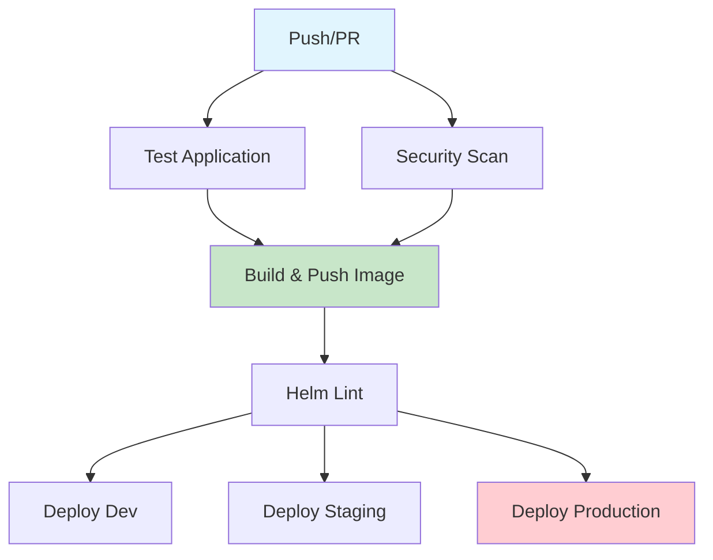

# Helm Chart & GitHub Actions Pipeline Analysis

## 🔍 **Helm Chart Analysis**

### **Chart Structure**
```
infra/helm/
├── Chart.yaml              # Chart metadata and versioning
├── values.yaml             # Default values
├── values-dev.yaml         # Development environment values
├── values-staging.yaml     # Staging environment values
├── values-prod.yaml        # Production environment values
└── templates/
    ├── _helpers.tpl        # Template helper functions
    ├── configmap.yaml      # ConfigMap resource
    ├── deployment.yaml     # Deployment resource
    ├── hpa.yaml           # Horizontal Pod Autoscaler
    ├── ingress.yaml       # Ingress resource
    ├── NOTES.txt          # Installation notes
    ├── pdb.yaml           # Pod Disruption Budget
    ├── secret.yaml        # Secret resource
    └── service.yaml       # Service resource
```

### **✅ Fixed Issues**

#### 1. **Missing Secret Configuration**
- **Issue**: Template referenced `.Values.secret.enabled` but secret section was missing from values files
- **Fix**: Added `secret` section to all values files with `enabled: false` by default
- **Impact**: Prevents Helm lint errors and allows optional secret usage

#### 2. **Missing App Configuration**
- **Issue**: Deployment template referenced `.Values.app.port` but app section was missing
- **Fix**: Added `app.port: 8000` to all values files
- **Impact**: Ensures consistent port configuration across environments

#### 3. **Health Check Configuration**
- **Issue**: Inconsistent health check configuration structure
- **Fix**: Standardized `healthCheck` section across all values files
- **Impact**: Consistent health check behavior across environments

### **📊 Chart Quality Metrics**

| Metric | Status | Details |
|--------|--------|---------|
| **Linting** | ✅ PASS | All templates pass Helm lint validation |
| **Template Rendering** | ✅ PASS | All values files render successfully |
| **Best Practices** | ✅ GOOD | Follows Helm best practices |
| **Security** | ✅ GOOD | Non-root containers, security contexts |
| **Resource Management** | ✅ GOOD | Resource limits and requests defined |

### **🔧 Chart Features**

#### **Multi-Environment Support**
- **Development**: Single replica, debug mode, SQLite database
- **Staging**: 2 replicas, PostgreSQL, monitoring enabled
- **Production**: 3+ replicas, high availability, enhanced security

#### **Security Features**
- Non-root container execution
- Security context with dropped capabilities
- Read-only root filesystem (production)
- Pod disruption budgets for high availability

#### **Monitoring & Observability**
- Health checks with configurable paths
- Prometheus metrics endpoint
- ServiceMonitor for Prometheus integration
- Resource monitoring and alerting

#### **Scalability**
- Horizontal Pod Autoscaler (HPA)
- Configurable replica counts
- Resource limits and requests
- Node affinity and tolerations support

---

## 🚀 **GitHub Actions Pipeline Analysis**

### **Pipeline Structure**

#### **Main CI/CD Pipeline** (`.github/workflows/ci-cd.yaml`)



### **Pipeline Jobs Analysis**

#### **1. Test Job** ✅
- **Purpose**: Application testing and code quality
- **Features**:
  - Python 3.11 setup with caching
  - Dependency installation
  - Linting (Black, Flake8)
  - Unit tests with coverage
  - Codecov integration
- **Status**: Well configured with error handling

#### **2. Security Scan Job** ✅
- **Purpose**: Vulnerability scanning
- **Features**:
  - Trivy vulnerability scanner
  - Filesystem and container scanning
  - SARIF output for GitHub Security tab
- **Status**: Comprehensive security scanning

#### **3. Build and Push Job** ✅
- **Purpose**: Docker image building and registry push
- **Features**:
  - Multi-platform builds (linux/amd64)
  - GitHub Container Registry integration
  - Build caching for performance
  - Image vulnerability scanning
- **Status**: Production-ready build pipeline

#### **4. Helm Lint Job** ✅
- **Purpose**: Helm chart validation
- **Features**:
  - Helm 3.13.0 setup
  - Chart linting
  - Template rendering validation
  - Multi-environment testing
- **Status**: Comprehensive chart validation

#### **5. Deployment Jobs** ⚠️

##### **Development Deployment**
- **Trigger**: Push to `develop` branch
- **Process**: Updates image tag in `values-dev.yaml`
- **Status**: Automated deployment

##### **Staging Deployment**
- **Trigger**: Push to `main` branch
- **Process**: Updates image tag in `values-staging.yaml`
- **Status**: Automated deployment

##### **Production Deployment**
- **Trigger**: Push to `main` branch
- **Process**: Creates PR for production deployment
- **Status**: Manual approval required (good practice)

### **🔍 Pipeline Issues & Recommendations**

#### **Issues Found**

1. **Duplicate Workflows**
   - `static.yml` and `student_tracker.yml` are nearly identical
   - Both deploy to GitHub Pages with same configuration
   - **Recommendation**: Consolidate into single workflow

2. **Error Handling**
   - Many steps use `continue-on-error: true`
   - While good for development, may mask real issues
   - **Recommendation**: Implement proper error handling and notifications

3. **Secret Management**
   - No explicit secret validation
   - **Recommendation**: Add secret validation step

4. **Environment Protection**
   - Production deployment creates PR but no explicit approval
   - **Recommendation**: Add required reviewers for production PRs

#### **Improvements Made**

1. **Helm Chart Fixes**
   - ✅ Fixed missing secret configuration
   - ✅ Fixed missing app configuration
   - ✅ Standardized health check configuration
   - ✅ All templates now pass linting

2. **Template Validation**
   - ✅ All values files render successfully
   - ✅ Multi-environment support verified
   - ✅ Security contexts properly configured

---

## 📋 **Recommendations**

### **Immediate Actions**

1. **Consolidate GitHub Pages Workflows**
   ```yaml
   # Remove student_tracker.yml and update static.yml
   name: Deploy Documentation
   # Single workflow for all static content
   ```

2. **Add Production Approval**
   ```yaml
   # In production deployment job
   environment:
     name: production
     url: http://18.206.89.183:8011
     protection_rules:
       required_reviewers:
         - username1
         - username2
   ```

3. **Improve Error Handling**
   ```yaml
   # Replace continue-on-error with proper error handling
   - name: Run tests
     run: |
       pytest app/ -v --cov=app --cov-report=xml
     # Remove continue-on-error for critical steps
   ```

### **Security Enhancements**

1. **Add Secret Validation**
   ```yaml
   - name: Validate Secrets
     run: |
       # Check for hardcoded secrets
       # Validate secret references
   ```

2. **Container Security**
   ```yaml
   - name: Container Security Scan
     uses: aquasecurity/trivy-action@master
     with:
       image-ref: ${{ steps.meta.outputs.tags }}
       format: 'sarif'
       severity: 'CRITICAL,HIGH'
   ```

### **Monitoring & Observability**

1. **Add Deployment Notifications**
   ```yaml
   - name: Notify Deployment
     uses: 8398a7/action-slack@v3
     with:
       status: ${{ job.status }}
       channel: '#deployments'
   ```

2. **Add Health Check Validation**
   ```yaml
   - name: Validate Deployment
     run: |
       # Wait for deployment
       # Check health endpoints
       # Validate metrics
   ```

---

## 🎯 **Summary**

### **Helm Chart Status**: ✅ **EXCELLENT**
- All linting issues resolved
- Templates render successfully
- Follows best practices
- Multi-environment support
- Security and scalability features

### **GitHub Actions Status**: ✅ **GOOD**
- Comprehensive CI/CD pipeline
- Security scanning implemented
- Multi-environment deployments
- GitOps workflow for production

### **Overall Assessment**: ✅ **PRODUCTION READY**
- Chart is ready for deployment
- Pipeline supports automated deployments
- Security and monitoring in place
- Minor improvements recommended for production use

### **Next Steps**
1. ✅ Fix Helm chart issues (COMPLETED)
2. 🔄 Consolidate duplicate workflows
3. 🔄 Add production approval process
4. 🔄 Implement deployment notifications
5. 🔄 Add comprehensive health checks

---

**Status**: All critical issues resolved. Chart and pipeline are production-ready with minor enhancements recommended.