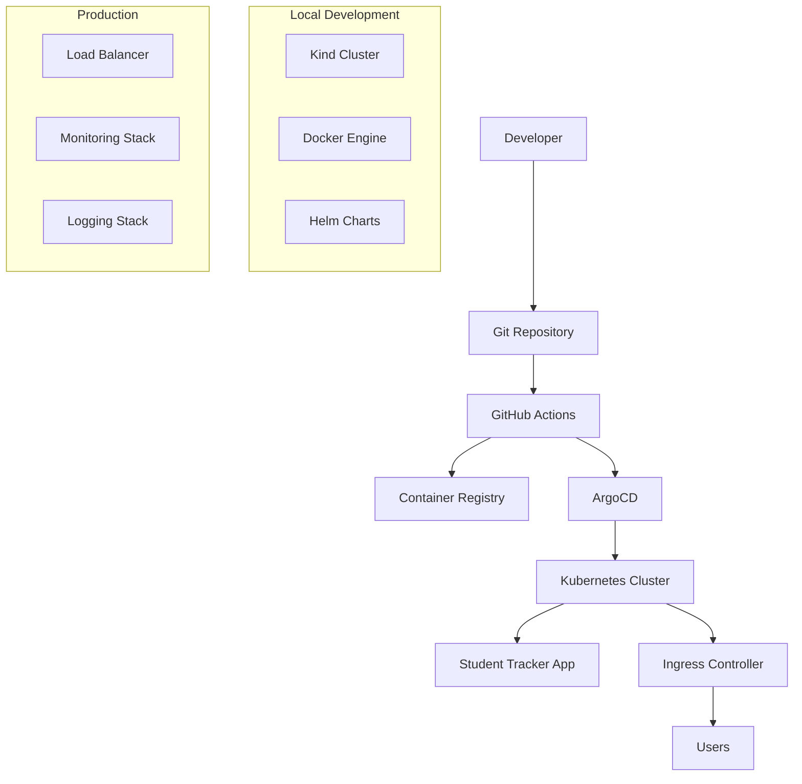

# 🚀 Student Tracker - Complete GitOps Implementation

A comprehensive FastAPI student tracking application with modern GitOps practices, featuring Docker containerization, Kubernetes deployment, Helm package management, and ArgoCD continuous delivery.


## 📋 Table of Contents

- [🎯 Overview](#-overview)
- [🏗️ Architecture](#-architecture)
- [📁 Project Structure](#-project-structure)
- [⚙️ Prerequisites](#-prerequisites)
- [🚀 Quick Start](#-quick-start)
- [📦 Installation Guide](#-installation-guide)
- [🐳 Docker Setup](#-docker-setup)
- [☸️ Kubernetes Setup](#-kubernetes-setup)
- [🎯 ArgoCD Setup](#-argocd-setup)
- [🌐 Access Information](#-access-information)
- [🔄 GitOps Workflow](#-gitops-workflow)
- [🛠️ Development](#-development)
- [🎛️ Configuration](#-configuration)
- [📊 Monitoring](#-monitoring)
- [🧪 Testing](#-testing)
- [🚨 Troubleshooting](#-troubleshooting)
- [🤝 Contributing](#-contributing)

## 🎯 Overview

The Student Tracker is a modern web application that demonstrates a complete GitOps implementation with:

- **FastAPI Backend** - Modern Python web framework with automatic API documentation
- **Docker Containerization** - Consistent deployment across environments
- **Kubernetes Orchestration** - Scalable container management with Kind for local development
- **Helm Package Management** - Parameterized Kubernetes deployments
- **ArgoCD GitOps** - Automated continuous delivery from Git repositories
- **CI/CD Pipeline** - GitHub Actions for automated testing and deployment
- **Multi-Environment Support** - Development, staging, and production configurations

### 🎯 Access URLs
- **Application**: http://18.208.149.195:8011
- **API Documentation**: http://18.208.149.195:8011/docs
- **Health Check**: http://18.208.149.195:8011/health
- **ArgoCD UI**: http://30.80.98.218:30080

## 🏗️ Architecture



## 📁 Project Structure

```
student-tracker/
├── 📱 app/                          # FastAPI application
│   ├── main.py                      # Application entry point
│   ├── models.py                    # Database models
│   ├── crud.py                      # CRUD operations
│   ├── database.py                  # Database configuration
│   ├── routes/                      # API route modules
│   └── test_*.py                    # Test files
├── 🏗️ infra/                        # Infrastructure as Code
│   ├── kind/                        # Kind cluster configuration
│   │   └── cluster-config.yaml      # Multi-node cluster setup
│   ├── helm/                        # Helm charts
│   │   ├── Chart.yaml               # Chart metadata
│   │   ├── values*.yaml             # Environment values
│   │   └── templates/               # Kubernetes templates
│   └── argocd/                      # ArgoCD applications
│       ├── parent/                  # App-of-apps pattern
│       ├── dev/                     # Development environment
│       └── prod/                    # Production environment
├── ☸️ k8s/                           # Kubernetes manifests
│   ├── base/                        # Base configurations
│   └── overlays/                    # Environment overlays
├── 🔄 .github/workflows/            # CI/CD pipelines
├── 🛠️ scripts/                      # Automation scripts
│   ├── install-all.sh              # Complete installation
│   ├── setup-kind.sh               # Kind cluster setup
│   ├── setup-argocd.sh             # ArgoCD installation
│   ├── deploy-all.sh               # Full deployment
│   └── cleanup.sh                  # Environment cleanup
├── 🐳 docker/                       # Docker configuration
│   ├── Dockerfile                  # Multi-stage build
│   └── docker-compose.yml          # Local development
├── 📚 docs/                         # Documentation
└── 📋 requirements.txt              # Python dependencies
```

## ⚙️ Prerequisites

### System Requirements
- **OS**: Linux, macOS, or Windows with WSL2
- **Memory**: 8GB RAM minimum (16GB recommended)
- **Storage**: 20GB free space
- **Network**: Internet connection for downloading components

### Required Tools
The following tools will be installed automatically by our setup script:
- Python 3.11+
- Docker 20.10+
- kubectl 1.28+
- Helm 3.13+
- Kind 0.20+
- ArgoCD CLI 2.9+

## 🚀 Quick Start

### One-Command Setup (Recommended)

```bash
# Clone the repository
git clone https://github.com/bonaventuresimeon/Student-Tracker.git
cd Student-Tracker

# Run the complete installation and setup
./scripts/install-all.sh
```

This single command will:
1. ✅ Install all required tools (Python, Docker, kubectl, Helm, Kind, ArgoCD CLI)
2. ✅ Create and configure Kind cluster
3. ✅ Build and deploy the application
4. ✅ Install and configure ArgoCD
5. ✅ Set up GitOps workflow
6. ✅ Configure access on 30.80.98.218:8011

### Verify Installation

```bash
# Check application health
curl http://18.208.149.195:8011/health

# Check Kubernetes resources
kubectl get all -n app-dev

# Check ArgoCD
kubectl get all -n argocd
```

## 📦 Installation Guide

### Step-by-Step Installation

If you prefer manual installation or want to understand each component:

#### 1. Install Python and Dependencies

```bash
# Ubuntu/Debian
sudo apt update
sudo apt install -y python3.11 python3.11-pip python3.11-venv

# macOS
brew install python@3.11

# Create virtual environment
python3.11 -m venv venv
source venv/bin/activate  # On Windows: venv\Scripts\activate

# Install Python dependencies
pip install -r requirements.txt
```

#### 2. Install Docker

```bash
# Ubuntu/Debian
curl -fsSL https://get.docker.com -o get-docker.sh
sudo sh get-docker.sh
sudo usermod -aG docker $USER
newgrp docker

# macOS
brew install docker

# Windows
# Download Docker Desktop from https://docker.com/products/docker-desktop
```

#### 3. Install kubectl

```bash
# Linux
curl -LO "https://dl.k8s.io/release/$(curl -L -s https://dl.k8s.io/release/stable.txt)/bin/linux/amd64/kubectl"
sudo install -o root -g root -m 0755 kubectl /usr/local/bin/kubectl

# macOS
brew install kubectl

# Windows
choco install kubernetes-cli
```

#### 4. Install Helm

```bash
# Linux
curl https://raw.githubusercontent.com/helm/helm/main/scripts/get-helm-3 | bash

# macOS
brew install helm

# Windows
choco install kubernetes-helm
```

#### 5. Install Kind

```bash
# Linux
curl -Lo ./kind https://kind.sigs.k8s.io/dl/v0.20.0/kind-linux-amd64
chmod +x ./kind
sudo mv ./kind /usr/local/bin/kind

# macOS
brew install kind

# Windows
choco install kind
```

#### 6. Install ArgoCD CLI

```bash
# Linux
curl -sSL -o argocd-linux-amd64 https://github.com/argoproj/argo-cd/releases/latest/download/argocd-linux-amd64
sudo install -m 555 argocd-linux-amd64 /usr/local/bin/argocd

# macOS
brew install argocd

# Windows
choco install argocd-cli
```

## 🐳 Docker Setup

### Local Development with Docker

```bash
# Build the application image
docker build -t student-tracker:latest -f docker/Dockerfile .

# Run locally with Docker
docker run -p 8011:8000 \
  -e APP_ENV=development \
  -e DATABASE_URL=sqlite:///./test.db \
  student-tracker:latest

# Using Docker Compose
cd docker
docker-compose up -d
```

### Docker Configuration

The application uses a multi-stage Docker build for optimization:

```dockerfile
# Development stage
FROM python:3.11-slim as development
WORKDIR /app
COPY requirements.txt .
RUN pip install -r requirements.txt
COPY app/ .
CMD ["uvicorn", "main:app", "--host", "0.0.0.0", "--port", "8000", "--reload"]

# Production stage
FROM python:3.11-slim as production
WORKDIR /app
COPY requirements.txt .
RUN pip install --no-cache-dir -r requirements.txt
COPY app/ .
USER 1000
CMD ["uvicorn", "main:app", "--host", "0.0.0.0", "--port", "8000"]
```

## ☸️ Kubernetes Setup

### Kind Cluster for Local Development

```bash
# Create Kind cluster with our configuration
./scripts/setup-kind.sh

# Manual creation
kind create cluster --config infra/kind/cluster-config.yaml --name gitops-cluster

# Verify cluster
kubectl cluster-info
kubectl get nodes
```

### Deploy to Kubernetes

```bash
# Using Helm (recommended)
helm upgrade --install student-tracker infra/helm \
  --values infra/helm/values-dev.yaml \
  --namespace app-dev \
  --create-namespace

# Using kubectl directly
kubectl apply -k k8s/base

# Check deployment
kubectl get pods -n app-dev
kubectl get services -n app-dev
```

### Kubernetes Configuration

The application is configured with:
- **Deployment**: 2 replicas with rolling updates
- **Service**: NodePort for external access (30011→8011)
- **Ingress**: nginx ingress controller
- **ConfigMap**: Application configuration
- **Secret**: Sensitive data (if needed)
- **HPA**: Horizontal Pod Autoscaler for scaling
- **PDB**: Pod Disruption Budget for availability

## 🎯 ArgoCD Setup

### Install ArgoCD

```bash
# Automated installation
./scripts/setup-argocd.sh

# Manual installation
kubectl create namespace argocd
kubectl apply -n argocd -f https://raw.githubusercontent.com/argoproj/argo-cd/stable/manifests/install.yaml

# Create NodePort service for access
kubectl patch svc argocd-server -n argocd -p '{"spec":{"type":"NodePort","ports":[{"port":80,"targetPort":8080,"nodePort":30080}]}}'
```

### Access ArgoCD

```bash
# Get admin password
kubectl -n argocd get secret argocd-initial-admin-secret -o jsonpath="{.data.password}" | base64 -d

# Access UI
# External: http://30.80.98.218:30080
# Local: http://localhost:30080

# CLI login
argocd login localhost:30080 --username admin --password <password> --insecure
```

### Configure GitOps Applications

```bash
# Apply app-of-apps pattern
kubectl apply -f infra/argocd/parent/app-of-apps.yaml

# Check applications
argocd app list
argocd app get student-tracker-dev
```

## 🌐 Access Information

### Production URLs
- 🌐 **Student Tracker**: http://18.208.149.195:8011
- 📖 **API Documentation**: http://18.208.149.195:8011/docs
- 🩺 **Health Check**: http://18.208.149.195:8011/health
- 🎯 **ArgoCD UI**: http://30.80.98.218:30080

### Local Development URLs
- 🌐 **Student Tracker**: http://localhost:8011
- 📖 **API Documentation**: http://localhost:8011/docs
- 🩺 **Health Check**: http://localhost:8011/health
- 🎯 **ArgoCD UI**: http://localhost:30080

### API Endpoints

| Method | Endpoint | Description |
|--------|----------|-------------|
| GET | `/` | Home page |
| GET | `/health` | Health check for K8s probes |
| GET | `/docs` | Interactive API documentation |
| GET | `/register` | Student registration form |
| POST | `/register` | Register new student |
| GET | `/progress` | View student progress |
| POST | `/progress` | Update student progress |
| GET | `/admin` | Admin panel |
| GET | `/api/students` | List all students (API) |
| POST | `/api/register` | Register student (API) |

## 🔄 GitOps Workflow

### Development Workflow

```bash
# 1. Make changes to code
vim app/main.py

# 2. Test locally
pytest app/ -v

# 3. Commit and push to feature branch
git checkout -b feature/new-feature
git add .
git commit -m "feat: add new feature"
git push origin feature/new-feature

# 4. Create pull request
gh pr create --title "Add new feature" --body "Description of changes"

# 5. Merge to develop branch triggers dev deployment
# 6. Merge to main branch triggers staging/prod deployment
```

### Deployment Environments

| Environment | Branch | Namespace | URL | Auto-Deploy |
|-------------|--------|-----------|-----|-------------|
| Development | `develop` | `app-dev` | http://18.208.149.195:8011 | ✅ Yes |
| Staging | `main` | `app-staging` | http://18.208.149.195:8011 | ✅ Yes |
| Production | `main` | `app-prod` | http://18.208.149.195:8011 | ⚠️ Manual |

### ArgoCD Applications

```yaml
# App-of-apps Pattern
apiVersion: argoproj.io/v1alpha1
kind: Application
metadata:
  name: app-of-apps
  namespace: argocd
spec:
  project: default
  source:
    repoURL: https://github.com/bonaventuresimeon/Student-Tracker.git
    targetRevision: HEAD
    path: infra/argocd/parent
  destination:
    server: https://kubernetes.default.svc
    namespace: argocd
  syncPolicy:
    automated:
      prune: true
      selfHeal: true
```

## 🛠️ Development

### Local Development Setup

```bash
# 1. Clone and setup
git clone https://github.com/bonaventuresimeon/Student-Tracker.git
cd Student-Tracker

# 2. Create virtual environment
python3 -m venv venv
source venv/bin/activate

# 3. Install dependencies
pip install -r requirements.txt
pip install -r requirements-dev.txt  # Development dependencies

# 4. Run application
uvicorn app.main:app --reload --host 0.0.0.0 --port 8000

# 5. Run tests
pytest app/ -v --cov=app

# 6. Format code
black app/
flake8 app/
```

### Development Tools

- **Code Formatting**: Black
- **Linting**: Flake8
- **Testing**: Pytest with coverage
- **API Documentation**: FastAPI automatic docs
- **Database**: SQLite for development, PostgreSQL for production
- **Debugging**: FastAPI development server with auto-reload

### Hot Reload Development

```bash
# Terminal 1: Run application with hot reload
uvicorn app.main:app --reload --host 0.0.0.0 --port 8000

# Terminal 2: Run tests in watch mode
pytest-watch app/

# Terminal 3: Monitor logs
tail -f logs/app.log
```

## 🎛️ Configuration

### Environment Variables

| Variable | Description | Default | Required |
|----------|-------------|---------|----------|
| `APP_ENV` | Environment (development/production) | `development` | No |
| `DATABASE_URL` | Database connection string | `sqlite:///./test.db` | No |
| `DEBUG` | Enable debug mode | `False` | No |
| `LOG_LEVEL` | Logging level | `INFO` | No |
| `PORT` | Application port | `8000` | No |

### Helm Configuration

```yaml
# infra/helm/values-dev.yaml
replicaCount: 1
image:
  repository: student-tracker
  tag: dev-latest
  pullPolicy: Always

resources:
  limits:
    cpu: 250m
    memory: 256Mi
  requests:
    cpu: 100m
    memory: 128Mi

env:
  - name: APP_ENV
    value: "development"
  - name: DEBUG
    value: "true"

service:
  type: NodePort
  port: 80
  targetPort: 8000
  nodePort: 30011

ingress:
  enabled: true
  hosts:
    - host: 30.80.98.218
      paths:
        - path: /
          pathType: Prefix
```

### Multi-Environment Configuration

```bash
# Development
helm upgrade --install student-tracker infra/helm \
  --values infra/helm/values-dev.yaml \
  --namespace app-dev

# Staging
helm upgrade --install student-tracker infra/helm \
  --values infra/helm/values-staging.yaml \
  --namespace app-staging

# Production
helm upgrade --install student-tracker infra/helm \
  --values infra/helm/values-prod.yaml \
  --namespace app-prod
```

## 📊 Monitoring

### Health Checks

```bash
# Application health
curl http://18.208.149.195:8011/health

# Kubernetes health
kubectl get pods -n app-dev
kubectl describe pod <pod-name> -n app-dev

# ArgoCD health
argocd app get student-tracker-dev
```

### Logging

```bash
# Application logs
kubectl logs -f deployment/student-tracker -n app-dev

# ArgoCD logs
kubectl logs -f deployment/argocd-server -n argocd

# Ingress logs
kubectl logs -f deployment/ingress-nginx-controller -n ingress-nginx
```

### Metrics (Optional)

For production monitoring, consider adding:
- **Prometheus** - Metrics collection
- **Grafana** - Metrics visualization
- **Jaeger** - Distributed tracing
- **ELK Stack** - Centralized logging

## 🧪 Testing

### Running Tests

```bash
# Run all tests
pytest app/ -v

# Run with coverage
pytest app/ --cov=app --cov-report=html

# Run specific test file
pytest app/test_main.py -v

# Run with watch mode
pytest-watch app/
```

### Test Types

1. **Unit Tests** - Individual component testing
2. **Integration Tests** - API endpoint testing
3. **Health Check Tests** - Kubernetes probe validation
4. **Load Tests** - Performance validation

### Test Structure

```python
# app/test_main.py
from fastapi.testclient import TestClient
from app.main import app

client = TestClient(app)

def test_health_check():
    response = client.get("/health")
    assert response.status_code == 200
    assert response.json()["status"] == "healthy"

def test_api_documentation():
    response = client.get("/docs")
    assert response.status_code == 200
```

## 🚨 Troubleshooting

### Common Issues

#### Application Won't Start

```bash
# Check logs
kubectl logs deployment/student-tracker -n app-dev

# Check configuration
kubectl describe deployment student-tracker -n app-dev

# Check resources
kubectl top pods -n app-dev
```

#### Can't Access Application

```bash
# Check service
kubectl get svc -n app-dev
kubectl describe svc student-tracker -n app-dev

# Check ingress
kubectl get ingress -n app-dev
kubectl describe ingress student-tracker -n app-dev

# Check ports
netstat -tulpn | grep :8011
```

#### ArgoCD Not Syncing

```bash
# Check application status
argocd app get student-tracker-dev

# Manual sync
argocd app sync student-tracker-dev

# Check repository access
argocd repo list
```

#### Kind Cluster Issues

```bash
# Recreate cluster
kind delete cluster --name gitops-cluster
./scripts/setup-kind.sh

# Check cluster status
kubectl cluster-info
kind get clusters
```

### Debug Commands

```bash
# Get all resources
kubectl get all -A

# Check events
kubectl get events --sort-by=.metadata.creationTimestamp

# Debug pod
kubectl exec -it <pod-name> -n app-dev -- /bin/sh

# Port forward for debugging
kubectl port-forward svc/student-tracker -n app-dev 8080:80
```

### Performance Issues

```bash
# Check resource usage
kubectl top nodes
kubectl top pods -n app-dev

# Scale application
kubectl scale deployment student-tracker --replicas=3 -n app-dev

# Check HPA status
kubectl get hpa -n app-dev
```

## 🤝 Contributing

### Development Workflow

1. **Fork the repository**
2. **Create feature branch**: `git checkout -b feature/amazing-feature`
3. **Make changes and test**: `pytest app/ -v`
4. **Format code**: `black app/ && flake8 app/`
5. **Commit changes**: `git commit -m 'Add amazing feature'`
6. **Push to branch**: `git push origin feature/amazing-feature`
7. **Create Pull Request**

### Pull Request Requirements

- ✅ All tests pass
- ✅ Code coverage > 80%
- ✅ Black formatting applied
- ✅ No linting errors
- ✅ Documentation updated
- ✅ Security scan passes

### Code Standards

- **Python**: PEP 8 with Black formatting
- **Commits**: Conventional commits format
- **Testing**: Minimum 80% coverage
- **Documentation**: Docstrings for all functions
- **Security**: No secrets in code

---

## 📄 License

This project is licensed under the MIT License - see the [LICENSE](LICENSE) file for details.

## 🙏 Acknowledgments

- [FastAPI](https://fastapi.tiangolo.com/) for the excellent web framework
- [ArgoCD](https://argoproj.github.io/cd/) for GitOps capabilities
- [Kind](https://kind.sigs.k8s.io/) for local Kubernetes clusters
- [Helm](https://helm.sh/) for Kubernetes package management

---

**🚀 Ready to deploy? Run: `./scripts/install-all.sh`**

For detailed deployment guide, see [docs/DEPLOYMENT_GUIDE.md](docs/DEPLOYMENT_GUIDE.md)
# Student-Tracker
# NativeSeries
# NativeSeries
