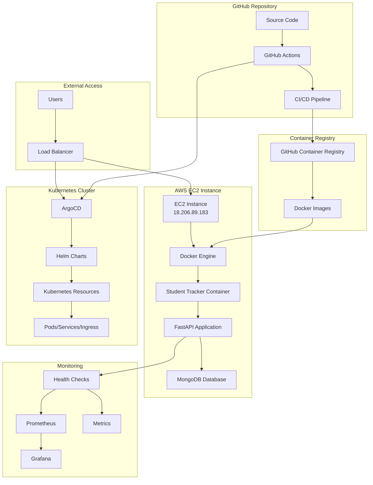
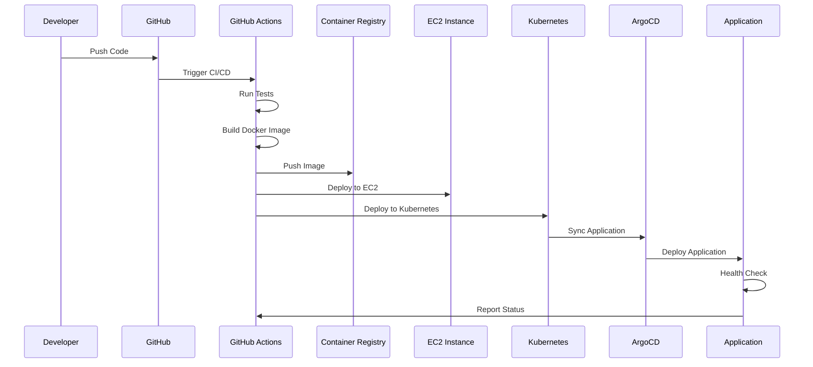
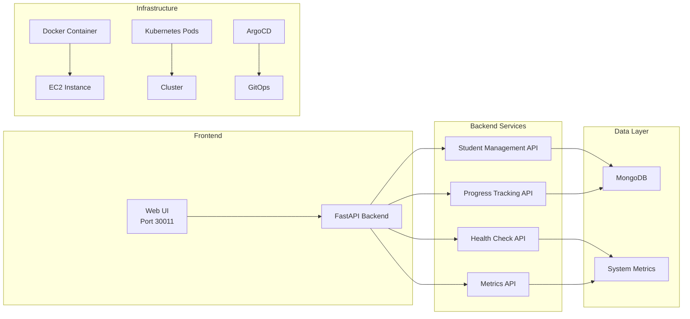
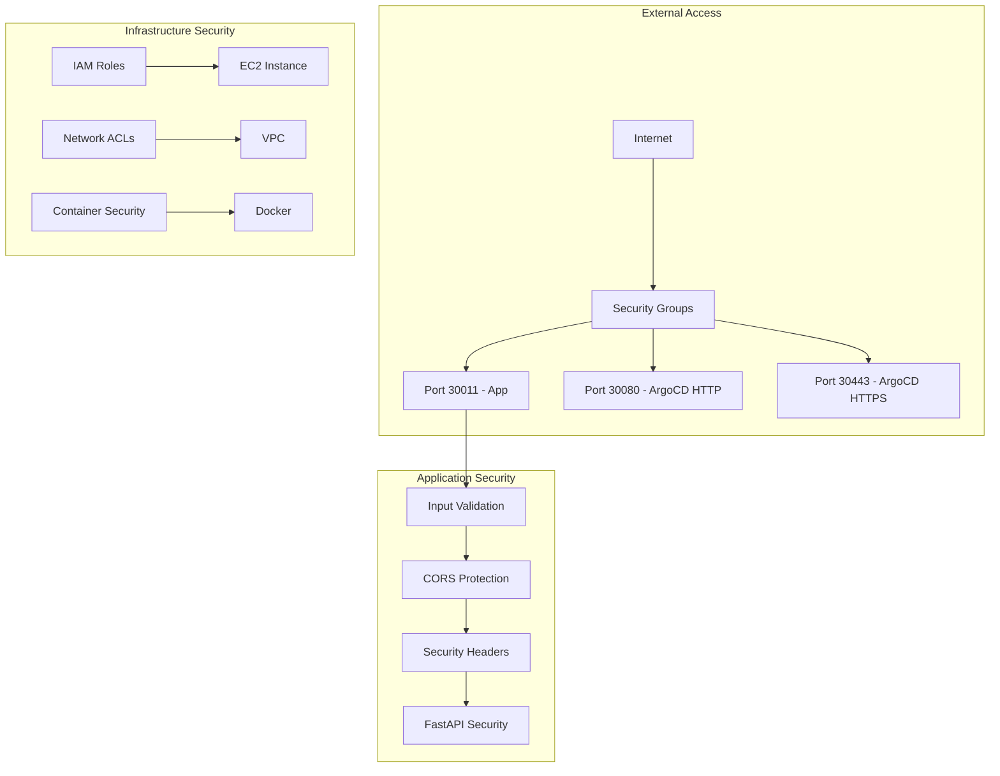
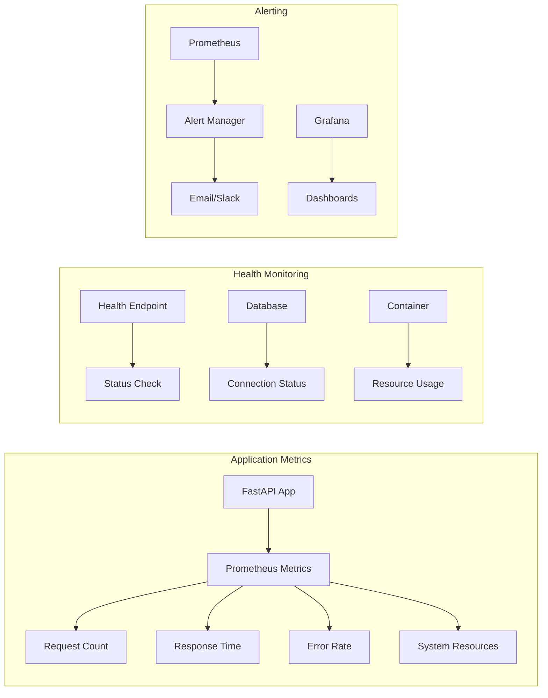

# 🎓 Student Tracker Application

A comprehensive student management system built with FastAPI, featuring modern deployment with Docker, Kubernetes, Helm, and ArgoCD. This application provides a complete solution for tracking student progress and managing educational data.

## 🌐 Live Application

- **Production URL**: http://18.206.89.183:30011
- **API Documentation**: http://18.206.89.183:30011/docs
- **Health Check**: http://18.206.89.183:30011/health
- **Metrics**: http://18.206.89.183:30011/metrics
- **Students Interface**: http://18.206.89.183:30011/students/

## 🚀 ArgoCD URLs

- **Production ArgoCD**: https://argocd-prod.18.206.89.183.nip.io
- **Development ArgoCD**: https://argocd-dev.18.206.89.183.nip.io
- **Staging ArgoCD**: https://argocd-staging.18.206.89.183.nip.io

## 📋 Table of Contents

- [Features](#-features)
- [Quick Start](#-quick-start)
- [Deployment Options](#-deployment-options)
- [EC2 Deployment Guide](#-ec2-deployment-guide)
- [ArgoCD Configuration](#-argocd-configuration)
- [Architecture](#-architecture)
- [Development](#-development)
- [API Documentation](#-api-documentation)
- [Monitoring](#-monitoring)
- [Troubleshooting](#-troubleshooting)
- [Contributing](#-contributing)

## ✨ Features

### Core Features
- **Student Management**: Add, update, and track student information
- **Progress Tracking**: Monitor student progress across multiple weeks
- **RESTful API**: Comprehensive API with OpenAPI/Swagger documentation
- **Health Monitoring**: Built-in health checks and metrics
- **Responsive UI**: Modern web interface for student management

### Technical Features
- **FastAPI Backend**: High-performance async Python framework
- **MongoDB Integration**: Flexible document-based data storage
- **Docker Containerization**: Consistent deployment across environments
- **Kubernetes Ready**: Helm charts for scalable deployments
- **ArgoCD GitOps**: Automated deployment with GitOps principles
- **GitHub Actions**: CI/CD pipeline with automated testing and deployment
- **Security Scanning**: Integrated security checks with Trivy and Bandit
- **Code Quality**: Automated linting with Black, Flake8, and MyPy
- **Monitoring**: Prometheus metrics and health endpoints

## 🚀 Quick Start

### Option 1: Docker Deployment (Recommended)
```bash
# Clone the repository
git clone https://github.com/bonaventuresimeon/NativeSeries.git
cd NativeSeries

# Quick Docker deployment
./deploy.sh docker
```

### Option 2: EC2 Deployment
```bash
# Full EC2 setup and deployment
./deploy.sh ec2
```

### Option 3: Kubernetes Deployment
```bash
# Full Kubernetes deployment with ArgoCD
./deploy.sh kubernetes
```

## 🎯 Deployment Options

The application supports multiple deployment methods:

| Method | Use Case | Command | Requirements |
|--------|----------|---------|-------------|
| **Docker** | Quick testing, development | `./deploy.sh docker` | Docker |
| **EC2** | Production on EC2 | `./deploy.sh ec2` | EC2 instance |
| **Kubernetes** | Scalable production | `./deploy.sh kubernetes` | K8s cluster |
| **Helm Fix** | Troubleshooting | `./deploy.sh helm-fix` | kubectl, helm |
| **Validation** | Configuration check | `./deploy.sh validate` | Python |

### Deployment Script Options

```bash
./deploy.sh [OPTION]

OPTIONS:
  docker           Quick Docker deployment (recommended for EC2)
  ec2              Full EC2 deployment with system setup
  kubernetes       Full Kubernetes deployment with ArgoCD
  helm-fix         Fix Helm deployment issues
  validate         Validate configuration only
  build            Build Docker image only
  argocd           Install ArgoCD only
  monitoring       Deploy with Prometheus monitoring
  health-check     Check deployment health
  status           Show deployment status
  clean            Clean up deployments
  help             Show help message
```

## 🚀 Complete EC2 Deployment Guide

### 📋 Prerequisites

#### EC2 Instance Requirements
- **OS**: Amazon Linux 2 or Ubuntu 20.04+
- **Instance Type**: t2.micro (minimum) or t2.small (recommended)
- **Storage**: 8GB minimum
- **Security Groups**: Configure as shown below

#### Security Group Configuration
| Type | Protocol | Port Range | Source | Description |
|------|----------|------------|--------|-------------|
| SSH | TCP | 22 | Your IP | SSH Access |
| HTTP | TCP | 80 | 0.0.0.0/0 | HTTP Traffic |
| Custom TCP | TCP | 30011 | 0.0.0.0/0 | Application Port |
| Custom TCP | TCP | 30080 | 0.0.0.0/0 | ArgoCD HTTP |
| Custom TCP | TCP | 30443 | 0.0.0.0/0 | ArgoCD HTTPS |

### 🔧 Step-by-Step EC2 Setup

#### Step 1: Launch EC2 Instance
1. **Go to AWS Console** → EC2 → Launch Instance
2. **Choose Amazon Linux 2** AMI
3. **Select Instance Type**: t2.small (recommended)
4. **Configure Security Groups** as shown above
5. **Launch and Download Key Pair**

#### Step 2: Connect to EC2
```bash
# Connect using SSH
ssh -i your-key.pem ec2-user@18.206.89.183

# Verify connection
whoami  # Should show: ec2-user
pwd     # Should show: /home/ec2-user
```

#### Step 3: System Setup
```bash
# Update system
sudo yum update -y

# Install required packages
sudo yum install -y \
    docker \
    git \
    curl \
    wget \
    unzip \
    python3 \
    python3-pip

# Start and enable Docker
sudo systemctl start docker
sudo systemctl enable docker
sudo usermod -aG docker ec2-user

# Logout and login again to apply docker group
exit
# Reconnect: ssh -i your-key.pem ec2-user@18.206.89.183
```

#### Step 4: Clone Repository
```bash
# Clone the repository
git clone https://github.com/bonaventuresimeon/NativeSeries.git
cd NativeSeries

# Verify files
ls -la
```

#### Step 5: Deploy Application
```bash
# Make deploy script executable
chmod +x deploy.sh

# Run EC2 deployment
./deploy.sh ec2
```

### 🎯 Deployment Verification

#### Health Check Commands
```bash
# Check if container is running
sudo docker ps

# Test health endpoint
curl http://18.206.89.183:30011/health

# Test API documentation
curl http://18.206.89.183:30011/docs

# Test students interface
curl http://18.206.89.183:30011/students/

# Check container logs
sudo docker logs -f student-tracker
```

#### Expected Output

**Docker Container Status**
```
CONTAINER ID   IMAGE                    COMMAND                  CREATED         STATUS         PORTS                      NAMES
abc123def456   student-tracker:latest   "python app/main.py"     2 minutes ago   Up 2 minutes   0.0.0.0:30011->8000/tcp    student-tracker
```

**Health Check Response**
```json
{
  "status": "healthy",
  "service": "student-tracker",
  "timestamp": "2024-01-15T10:30:00.000Z",
  "version": "1.0.0",
  "uptime_seconds": 3600,
  "request_count": 150,
  "production_url": "http://18.206.89.183:30011",
  "database": "healthy",
  "environment": "production"
}
```

### 🔍 Troubleshooting Guide

#### Common Issues and Solutions

**1. Docker Not Running**
```bash
# Check Docker status
sudo systemctl status docker

# Start Docker if not running
sudo systemctl start docker
sudo systemctl enable docker

# Verify Docker is working
sudo docker info
```

**2. Port Already in Use**
```bash
# Check what's using port 30011
sudo netstat -tlnp | grep 30011

# Kill process if needed
sudo kill -9 <PID>

# Or stop existing container
sudo docker stop student-tracker
```

**3. Container Won't Start**
```bash
# Check container logs
sudo docker logs student-tracker

# Check Docker daemon
sudo systemctl status docker

# Restart Docker
sudo systemctl restart docker

# Try running container manually
sudo docker run -d -p 30011:8000 --name student-tracker student-tracker:latest
```

**4. Health Check Fails**
```bash
# Check if container is running
sudo docker ps

# Check container logs
sudo docker logs student-tracker

# Check if port is exposed
sudo docker port student-tracker

# Test from inside container
sudo docker exec student-tracker curl http://localhost:8000/health
```

**5. Permission Issues**
```bash
# Fix file permissions
sudo chown -R ec2-user:ec2-user /home/ec2-user/NativeSeries
chmod +x deploy.sh

# Add user to docker group
sudo usermod -aG docker ec2-user
# Logout and login again
```

### 📊 Monitoring and Maintenance

#### System Monitoring
```bash
# Monitor system resources
htop

# Monitor Docker
sudo docker stats

# Monitor logs
sudo journalctl -f

# Monitor application logs
sudo docker logs -f student-tracker
```

#### Backup and Recovery
```bash
# Backup container
sudo docker commit student-tracker student-tracker-backup

# Save image to file
sudo docker save student-tracker:latest > student-tracker-backup.tar

# Restore from backup
sudo docker load < student-tracker-backup.tar
```

#### Updates and Maintenance
```bash
# Update application
cd NativeSeries
git pull origin main
./deploy.sh docker

# Update system packages
sudo yum update -y

# Clean up Docker
sudo docker system prune -f
```

### 🔒 Security Best Practices

#### Network Security
- Use security groups to restrict access
- Consider using a VPN for SSH access
- Regularly update security group rules

#### Application Security
- Keep system packages updated
- Monitor logs for suspicious activity
- Use HTTPS in production
- Implement proper authentication

#### Container Security
- Regularly update base images
- Scan images for vulnerabilities
- Use non-root user in containers
- Limit container capabilities

### 📈 Performance Optimization

#### Resource Monitoring
```bash
# Check CPU usage
top

# Check memory usage
free -h

# Check disk usage
df -h

# Check network usage
iftop
```

#### Performance Tuning
```bash
# Increase Docker memory limit
sudo docker run -d -p 30011:8000 --memory=1g --name student-tracker student-tracker:latest

# Monitor performance
sudo docker stats student-tracker
```

### 🎉 Success Criteria

Your deployment is successful when:

✅ **Container is running**: `sudo docker ps` shows student-tracker  
✅ **Health check passes**: `curl http://18.206.89.183:30011/health` returns 200  
✅ **All endpoints work**: Health, docs, students, metrics all accessible  
✅ **External access**: Application accessible from internet  
✅ **Logs are clean**: No errors in container logs  
✅ **GitHub Actions pass**: All workflow steps complete successfully  

### 📞 Support

If you encounter issues:

1. **Check logs**: `sudo docker logs student-tracker`
2. **Verify configuration**: Review this guide
3. **Test manually**: Run deployment script step by step
4. **Check GitHub Actions**: Review workflow logs
5. **Contact support**: Create GitHub issue

#### Useful Commands Reference
```bash
# Quick health check
curl -f http://18.206.89.183:30011/health || echo "Health check failed"

# Check all endpoints
for endpoint in health docs students metrics; do
    echo "Testing $endpoint..."
    curl -I http://18.206.89.183:30011/$endpoint
done

# Monitor real-time
watch -n 5 'curl -s http://18.206.89.183:30011/health | jq .'
```

## 🎯 ArgoCD Configuration

### Environment Configurations

#### Production (`application-production.yaml`)
- **Application URL**: http://18.206.89.183:30011
- **ArgoCD URL**: https://argocd-prod.18.206.89.183.nip.io
- **Branch**: `main`
- **Namespace**: `student-tracker-prod`
- **Replicas**: 2-10 (auto-scaling)
- **Environment**: production

#### Staging (`application-staging.yaml`)
- **Application URL**: http://staging.18.206.89.183:30011
- **ArgoCD URL**: https://argocd-staging.18.206.89.183.nip.io
- **Branch**: `develop`
- **Namespace**: `student-tracker-staging`
- **Replicas**: 2-5 (auto-scaling)
- **Environment**: staging

#### Development (`application-development.yaml`)
- **Application URL**: http://dev.18.206.89.183:30011
- **ArgoCD URL**: https://argocd-dev.18.206.89.183.nip.io
- **Branch**: `develop`
- **Namespace**: `student-tracker-dev`
- **Replicas**: 1-3 (auto-scaling)
- **Environment**: development

### Deployment Process

#### Automatic Deployments
The GitHub Actions workflows automatically deploy to different environments:

1. **Development**: Triggered on pushes to `develop` branch
2. **Staging**: Triggered on workflow dispatch with staging environment selected
3. **Production**: Triggered on pushes to `main` branch

#### Manual Deployment
You can manually deploy using ArgoCD CLI:

```bash
# Deploy to development
kubectl apply -f argocd/application-development.yaml
argocd app sync student-tracker-development

# Deploy to staging
kubectl apply -f argocd/application-staging.yaml
argocd app sync student-tracker-staging

# Deploy to production
kubectl apply -f argocd/application-production.yaml
argocd app sync student-tracker-production
```

### Configuration Details

#### Helm Parameters
Each environment uses different Helm parameters:

- **Image tag**: `latest` (prod), `staging` (staging), `develop` (dev)
- **Environment variables**: Set according to environment
- **Resource limits**: Production has higher limits
- **Ingress hosts**: Different domains for each environment

#### Sync Policies
All environments use:
- **Automated sync**: Enabled with prune and self-heal
- **Retry policy**: Exponential backoff with environment-specific limits
- **Sync options**: CreateNamespace, PrunePropagationPolicy, PruneLast

## 🏗️ Architecture & Diagrams

### System Architecture Overview



### Deployment Flow



### Infrastructure Components



### Security Architecture



### Monitoring and Observability



### Technology Stack
- **Backend**: FastAPI (Python)
- **Database**: MongoDB
- **Containerization**: Docker
- **Orchestration**: Kubernetes
- **Package Manager**: Helm
- **GitOps**: ArgoCD
- **CI/CD**: GitHub Actions
- **Infrastructure**: AWS EC2
- **Monitoring**: Prometheus + Grafana
- **Security**: Trivy, Bandit, Safety

## 💻 Development

### Local Development Setup

#### Prerequisites
- Python 3.11+
- Docker
- Git

#### Setup Steps
```bash
# Clone repository
git clone https://github.com/bonaventuresimeon/NativeSeries.git
cd NativeSeries

# Create virtual environment
python -m venv venv
source venv/bin/activate  # On Windows: venv\Scripts\activate

# Install dependencies
pip install -r requirements.txt

# Run locally
python app/main.py
```

#### Development Commands
```bash
# Run tests
python app/test_basic.py

# Format code
black app/

# Lint code
flake8 app/

# Type checking
mypy app/

# Run with hot reload
uvicorn app.main:app --reload --host 0.0.0.0 --port 8000
```

### Project Structure
```
NativeSeries/
├── app/                    # Application source code
│   ├── main.py            # FastAPI application
│   ├── crud.py            # Database operations
│   ├── models.py          # Data models
│   ├── database.py        # Database connection
│   └── routes/            # API routes
├── helm-chart/            # Helm deployment charts
│   ├── templates/         # Kubernetes templates
│   ├── Chart.yaml         # Chart metadata
│   └── values.yaml        # Configuration values
├── argocd/                # ArgoCD application configs
│   ├── application-production.yaml
│   ├── application-staging.yaml
│   └── application-development.yaml
├── .github/workflows/     # GitHub Actions workflows
├── deploy.sh              # Unified deployment script
├── Dockerfile             # Container definition
├── requirements.txt       # Python dependencies
└── README.md              # This file
```

## 📚 API Documentation

### Core Endpoints

#### Health and Monitoring
- `GET /health` - Application health check
- `GET /metrics` - Prometheus metrics
- `GET /docs` - Interactive API documentation
- `GET /redoc` - Alternative API documentation

#### Student Management
- `GET /students/` - List all students (Web UI)
- `GET /api/students` - Get all students (JSON)
- `POST /api/register` - Register new student
- `POST /register` - Register student (Form)
- `GET /progress` - Student progress page
- `POST /progress` - Update student progress
- `GET /update` - Update student page
- `POST /update` - Update student data
- `GET /admin` - Admin interface

### API Examples

#### Register a Student
```bash
curl -X POST "http://18.206.89.183:30011/api/register?name=John%20Doe" \
     -H "accept: application/json"
```

#### Get All Students
```bash
curl -X GET "http://18.206.89.183:30011/api/students" \
     -H "accept: application/json"
```

#### Health Check
```bash
curl -X GET "http://18.206.89.183:30011/health" \
     -H "accept: application/json"
```

### Response Examples

#### Health Check Response
```json
{
  "status": "healthy",
  "service": "student-tracker",
  "timestamp": "2024-01-15T10:30:00.000Z",
  "version": "1.0.0",
  "uptime_seconds": 3600,
  "request_count": 150,
  "production_url": "http://18.206.89.183:30011",
  "database": "healthy",
  "environment": "production"
}
```

## 📸 Screenshots & Visual Guide

### 🖥️ AWS Console Setup

#### 1. EC2 Instance Launch

*Launch a new EC2 instance with Amazon Linux 2*

#### 2. Security Group Configuration

*Configure security groups to allow required ports*

#### 3. Key Pair Creation

*Download and secure your SSH key pair*

### 🔧 System Setup

#### 4. SSH Connection

*Connect to EC2 instance using SSH*

#### 5. System Update

*Update system packages and install dependencies*

#### 6. Docker Installation

*Install and configure Docker*

### 🚀 Application Deployment

#### 7. Repository Clone

*Clone the Student Tracker repository*

#### 8. Deployment Script Execution

*Run the deployment script*

#### 9. Docker Build Process

*Build the Docker image*

### ✅ Verification and Testing

#### 10. Container Status

*Verify container is running*

#### 11. Health Check

*Test application health endpoint*

#### 12. Application Interface

*Access the Student Tracker web interface*

### 📱 Application Screenshots

#### 13. Main Dashboard

*Student Tracker main interface*

#### 14. Student Registration

*Add new students to the system*

#### 15. Progress Tracking

*Track student progress over time*

#### 16. API Documentation

*Interactive API documentation*

### 🎯 Success Indicators

#### 17. Deployment Success

*All systems operational*

#### 18. Health Status

*Application health metrics*

---

## 📊 Monitoring

### Application Monitoring
- **Health Check**: http://18.206.89.183:30011/health
- **Metrics**: http://18.206.89.183:30011/metrics
- **API Docs**: http://18.206.89.183:30011/docs

### System Monitoring
```bash
# Monitor system resources
htop

# Monitor Docker
sudo docker stats

# Monitor logs
sudo journalctl -f

# Monitor application logs
sudo docker logs -f student-tracker
```

### Metrics Available
- Request count and duration
- Response status codes
- Database connection status
- Memory and CPU usage
- Application uptime
- Error rates

## 🔧 Troubleshooting

### Common Issues and Solutions

#### Application Won't Start
```bash
# Check container logs
sudo docker logs student-tracker

# Check if port is available
sudo netstat -tlnp | grep 30011

# Restart container
sudo docker restart student-tracker
```

#### Database Connection Issues
```bash
# Check MongoDB connectivity
sudo docker exec student-tracker curl http://18.206.89.183:27017

# Check environment variables
sudo docker exec student-tracker env | grep MONGO
```

#### Performance Issues
```bash
# Check resource usage
sudo docker stats student-tracker

# Check system resources
free -h
df -h
```

#### Network Issues
```bash
# Test connectivity
curl -v http://18.206.89.183:30011/health

# Check firewall
sudo iptables -L

# Check security groups (EC2)
# Ensure ports 30011, 30080, 30443 are open
```

### Debug Commands
```bash
# Check system resources
free -h
df -h
top

# Check Docker status
sudo docker info
sudo docker version

# Check network connectivity
curl -v http://18.206.89.183:30011/health
telnet 18.206.89.183 30011

# Check firewall
sudo iptables -L
```

### ArgoCD Troubleshooting

#### Common Issues
1. **Application not syncing**: Check the source repository and branch
2. **Image pull errors**: Verify GitHub Container Registry permissions
3. **Ingress issues**: Check cert-manager and NGINX ingress controller

#### Useful Commands
```bash
# Check application status
argocd app get student-tracker-production

# View application logs
argocd app logs student-tracker-production

# Force sync
argocd app sync student-tracker-production --force

# Rollback to previous version
argocd app rollback student-tracker-production
```

## 🔒 Security

### Security Features
- Input validation and sanitization
- CORS protection
- Security headers
- Container security scanning
- Dependency vulnerability scanning
- Code security analysis

### Security Best Practices
1. **Use HTTPS** in production
2. **Restrict security groups** to specific IPs
3. **Regular updates** of system packages
4. **Monitor logs** for suspicious activity
5. **Use IAM roles** instead of access keys
6. **Enable CloudWatch** monitoring

### Security Commands
```bash
# Update system regularly
sudo yum update -y

# Check for security updates
sudo yum check-update

# Monitor failed login attempts
sudo tail -f /var/log/secure

# Check open ports
sudo netstat -tlnp
```

## 🎯 Success Criteria

Your deployment is successful when:

✅ **Container is running**: `sudo docker ps` shows student-tracker  
✅ **Health check passes**: `curl http://18.206.89.183:30011/health` returns 200  
✅ **All endpoints work**: Health, docs, students, metrics all accessible  
✅ **External access**: Application accessible from internet  
✅ **Logs are clean**: No errors in container logs  
✅ **GitHub Actions pass**: All workflow steps complete successfully  

## 🤝 Contributing

### How to Contribute
1. Fork the repository
2. Create a feature branch (`git checkout -b feature/amazing-feature`)
3. Commit your changes (`git commit -m 'Add amazing feature'`)
4. Push to the branch (`git push origin feature/amazing-feature`)
5. Open a Pull Request

### Development Guidelines
- Follow PEP 8 style guidelines
- Add tests for new features
- Update documentation
- Ensure all checks pass

### Code Quality
- **Formatting**: Black
- **Linting**: Flake8
- **Type Checking**: MyPy
- **Security**: Bandit
- **Testing**: pytest

### Pull Request Template

When creating a pull request, please use the following template:

#### 🎯 Overview
Brief description of what this PR accomplishes

#### ✨ What's Changed
List the main changes in this PR

**Infrastructure Changes**
- [ ] Kubernetes manifests
- [ ] Helm charts
- [ ] ArgoCD applications
- [ ] CI/CD pipeline

**Application Changes**
- [ ] FastAPI endpoints
- [ ] Database models
- [ ] Business logic
- [ ] Configuration

**Documentation**
- [ ] README updates
- [ ] API documentation
- [ ] Deployment guides
- [ ] Configuration examples

#### 🎯 Deployment URLs
If this affects deployed services, list the access URLs:
- 🌐 **Application**: http://18.206.89.183:30011
- 📖 **API Docs**: http://18.206.89.183:30011/docs
- 🩺 **Health Check**: http://18.206.89.183:30011/health
- 🎯 **ArgoCD**: http://30.80.98.218:30080

#### 🚀 How to Test
```bash
# Deployment
./scripts/deploy-all.sh

# Testing
pytest app/ -v

# Health check
curl http://localhost:30011/health
```

#### 📋 Files Changed
List the key files modified in this PR:
- `app/` - Application code changes
- `infra/` - Infrastructure configuration
- `scripts/` - Deployment and utility scripts
- `.github/` - CI/CD workflow changes

#### ✅ Checklist

**Before Submitting**
- [ ] Code follows project style guidelines
- [ ] Tests have been added/updated and pass
- [ ] Documentation has been updated
- [ ] CI/CD pipeline passes
- [ ] Security considerations addressed

**Deployment Verification**
- [ ] Local deployment tested
- [ ] Health endpoints working
- [ ] ArgoCD sync successful
- [ ] No breaking changes to existing APIs

**Security & Quality**
- [ ] No secrets in code
- [ ] Vulnerability scans pass
- [ ] Resource limits configured
- [ ] Security contexts applied

#### 🔗 Related Issues
Link any related issues:
- Fixes #
- Closes #
- Related to #

#### 🎉 Additional Notes
Any additional context or considerations for reviewers

## 📞 Support

If you encounter issues:

1. **Check logs**: `sudo docker logs student-tracker`
2. **Verify configuration**: Review this guide
3. **Test manually**: Run deployment script step by step
4. **Check GitHub Actions**: Review workflow logs
5. **Contact support**: Create GitHub issue

### Useful Resources
- [FastAPI Documentation](https://fastapi.tiangolo.com/)
- [Docker Documentation](https://docs.docker.com/)
- [Kubernetes Documentation](https://kubernetes.io/docs/)
- [ArgoCD Documentation](https://argo-cd.readthedocs.io/)
- [Helm Documentation](https://helm.sh/docs/)

## 📄 License

This project is licensed under the MIT License - see the [LICENSE](LICENSE) file for details.

## 🙏 Acknowledgments

- FastAPI team for the excellent framework
- Docker for containerization platform
- Kubernetes community for orchestration
- ArgoCD team for GitOps solution
- GitHub for CI/CD platform

---

**🎉 Congratulations! Your Student Tracker is now deployed and running at http://18.206.89.183:30011!**

For the latest updates and documentation, visit the [GitHub repository](https://github.com/bonaventuresimeon/NativeSeries).
