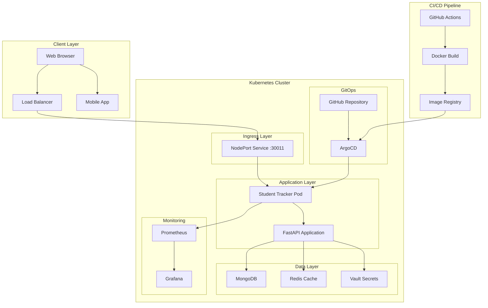
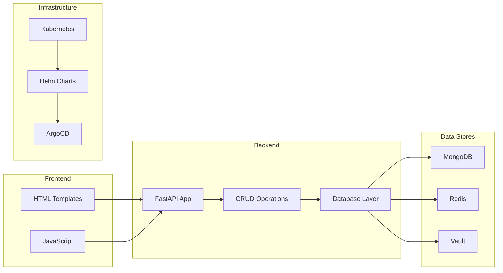
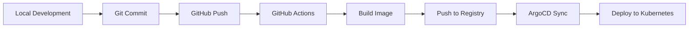

# 🎓 Student Tracker - Complete Student Management Platform

<div align="center">


**A comprehensive student management application with GitOps automation**

[](http://18.206.89.183:30011)
[](http://18.206.89.183:30080)

</div>

---

## 📋 Table of Contents

- [🎯 Overview](#-overview)
- [🏗️ Architecture](#️-architecture)
- [🚀 Quick Start](#-quick-start)
- [📦 Installation](#-installation)
- [🔧 Deployment](#-deployment)
- [📊 Monitoring](#-monitoring)
- [🔒 Security](#-security)
- [📚 API Documentation](#-api-documentation)
- [🛠️ Development](#️-development)
- [🤝 Contributing](#-contributing)
- [📄 License](#-license)

---

## 🎯 Overview

Student Tracker is a modern, cloud-native student management platform built with **FastAPI**, deployed on **Kubernetes** using **Helm**, and managed through **ArgoCD** for GitOps automation. The application provides comprehensive student tracking, progress monitoring, and administrative capabilities.

### 🌟 Key Features

- **📚 Student Management**: Complete CRUD operations for student records
- **📈 Progress Tracking**: Weekly progress monitoring and analytics
- **🔐 Secure Authentication**: Vault-integrated secret management
- **📊 Real-time Monitoring**: Prometheus metrics and health checks
- **🚀 Auto-scaling**: Horizontal Pod Autoscaler for performance
- **🔄 GitOps**: Automated deployment with ArgoCD
- **🔒 Security**: Non-root containers, read-only filesystems

### 🌐 Production Access

| Service | URL | Description |
|---------|-----|-------------|
| **Student Tracker App** | [http://18.206.89.183:30011](http://18.206.89.183:30011) | Main application |
| **API Documentation** | [http://18.206.89.183:30011/docs](http://18.206.89.183:30011/docs) | Interactive API docs |
| **ArgoCD UI (HTTP)** | [http://18.206.89.183:30080](http://18.206.89.183:30080) | GitOps management |
| **ArgoCD UI (HTTPS)** | [https://18.206.89.183:30443](https://18.206.89.183:30443) | Secure GitOps access |

---

## 🏗️ Architecture

### System Architecture Diagram



### Component Architecture



---

## 🚀 Quick Start

### Prerequisites

- **Kubernetes Cluster** (minikube, kind, or cloud provider)
- **kubectl** configured
- **Helm** v3.12.0+
- **Docker** (for local development)
- **Git**

### One-Command Deployment

```bash
# Clone the repository
git clone https://github.com/bonaventuresimeon/NativeSeries.git
cd NativeSeries

# Make deployment script executable
chmod +x scripts/deploy.sh

# Run deployment (interactive menu)
./scripts/deploy.sh
```

**🎉 Your application will be live in minutes!**

---

## 📦 Installation

### Step 1: Clone Repository

```bash
git clone https://github.com/bonaventuresimeon/NativeSeries.git
cd NativeSeries
```

### Step 2: Install Prerequisites

#### Install kubectl
```bash
# Linux
curl -LO "https://dl.k8s.io/release/$(curl -L -s https://dl.k8s.io/release/stable.txt)/bin/linux/amd64/kubectl"
sudo install -o root -g root -m 0755 kubectl /usr/local/bin/kubectl

# macOS
brew install kubectl

# Windows
choco install kubernetes-cli
```

#### Install Helm
```bash
# Linux/macOS
curl https://raw.githubusercontent.com/helm/helm/main/scripts/get-helm-3 | bash

# Windows
choco install kubernetes-helm
```

#### Install Docker
```bash
# Ubuntu/Debian
sudo apt-get update
sudo apt-get install docker.io
sudo systemctl start docker
sudo usermod -aG docker $USER

# macOS
brew install --cask docker

# Windows
# Download from https://www.docker.com/products/docker-desktop
```

### Step 3: Set Up Kubernetes Cluster

#### Option A: Minikube (Local Development)
```bash
# Install minikube
curl -LO https://storage.googleapis.com/minikube/releases/latest/minikube-linux-amd64
sudo install minikube-linux-amd64 /usr/local/bin/minikube

# Start cluster
minikube start --driver=docker

# Enable addons
minikube addons enable ingress
minikube addons enable metrics-server
```

#### Option B: Kind (Local Development)
```bash
# Install kind
curl -Lo ./kind https://kind.sigs.k8s.io/dl/v0.20.0/kind-linux-amd64
chmod +x ./kind
sudo mv ./kind /usr/local/bin/kind

# Create cluster
kind create cluster --name student-tracker
```

#### Option C: Cloud Provider (Production)
```bash
# AWS EKS
eksctl create cluster --name student-tracker --region us-west-2

# Google GKE
gcloud container clusters create student-tracker --zone us-central1-a

# Azure AKS
az aks create --resource-group myResourceGroup --name student-tracker --node-count 3
```

---

## 🔧 Deployment

### Automated Deployment (Recommended)

The deployment script provides an interactive menu with multiple options:

```bash
./scripts/deploy.sh
```

#### Deployment Options:

1. **🚀 Full Deployment** - Install ArgoCD and deploy application
2. **📱 Application Only** - Deploy application (ArgoCD already installed)
3. **🐳 Image Only** - Build and push Docker image
4. **✅ Validate Only** - Validate configuration without deployment

### Manual Deployment Steps

#### Step 1: Install ArgoCD

```bash
# Add ArgoCD repository
helm repo add argo https://argoproj.github.io/argo-helm
helm repo update

# Install ArgoCD
helm install argocd argo/argo-cd \
  --namespace argocd \
  --create-namespace \
  --set server.extraArgs="{--insecure}" \
  --set server.ingress.enabled=true
```

#### Step 2: Build and Push Docker Image

```bash
# Build image
docker build -t student-tracker:latest .

# Tag for registry
docker tag student-tracker:latest ghcr.io/bonaventuresimeon/student-tracker:latest

# Push to registry
docker push ghcr.io/bonaventuresimeon/student-tracker:latest
```

#### Step 3: Deploy Helm Chart

```bash
# Add Bitnami repository
helm repo add bitnami https://charts.bitnami.com/bitnami
helm repo update

# Install application
helm install student-tracker ./helm-chart \
  --namespace student-tracker \
  --create-namespace \
  --set app.image.repository=ghcr.io/bonaventuresimeon/student-tracker \
  --set app.image.tag=latest
```

#### Step 4: Configure ArgoCD Application

```bash
# Apply ArgoCD application
kubectl apply -f argocd/application.yaml

# Verify deployment
kubectl get applications -n argocd
```

### Verification Commands

```bash
# Check pods
kubectl get pods -n student-tracker

# Check services
kubectl get svc -n student-tracker

# Check ArgoCD
kubectl get pods -n argocd

# Get ArgoCD admin password
kubectl -n argocd get secret argocd-initial-admin-secret -o jsonpath="{.data.password}" | base64 -d
```

---

## 📊 Monitoring

### Health Checks

The application provides comprehensive health monitoring:

```bash
# Application health
curl http://18.206.89.183:30011/health

# Metrics endpoint
curl http://18.206.89.183:30011/metrics

# Readiness check
curl http://18.206.89.183:30011/ready
```

### Prometheus Metrics

The application exposes Prometheus-compatible metrics:

- **Request Count**: Total HTTP requests
- **Response Time**: Average response times
- **Error Rate**: Error percentage
- **Uptime**: Application uptime
- **Memory Usage**: Container memory consumption
- **CPU Usage**: Container CPU utilization

### Logging

```bash
# View application logs
kubectl logs -f deployment/student-tracker -n student-tracker

# View ArgoCD logs
kubectl logs -f deployment/argocd-server -n argocd
```

---

## 🔒 Security

### Security Features

- **🔐 Non-root Containers**: All containers run as non-root user
- **📁 Read-only Filesystems**: Immutable container filesystems
- **🚫 Privilege Escalation**: Disabled privilege escalation
- **🛡️ Security Contexts**: Kubernetes security contexts applied
- **🔑 Vault Integration**: Secure secret management
- **🌐 Network Policies**: Restricted network access

### Security Best Practices

```yaml
# Security context example
securityContext:
  runAsNonRoot: true
  runAsUser: 1000
  fsGroup: 1000
  capabilities:
    drop:
    - ALL
  readOnlyRootFilesystem: true
  allowPrivilegeEscalation: false
```

---

## 📚 API Documentation

### Interactive API Documentation

Access the complete API documentation at: [http://18.206.89.183:30011/docs](http://18.206.89.183:30011/docs)

### Key Endpoints

| Endpoint | Method | Description |
|----------|--------|-------------|
| `/` | GET | Main application interface |
| `/health` | GET | Health check endpoint |
| `/metrics` | GET | Prometheus metrics |
| `/docs` | GET | Interactive API documentation |
| `/students` | GET | List all students |
| `/students/{id}` | GET | Get student by ID |
| `/students` | POST | Create new student |
| `/students/{id}` | PUT | Update student |
| `/students/{id}` | DELETE | Delete student |

### Example API Usage

```bash
# Get all students
curl http://18.206.89.183:30011/students

# Create a student
curl -X POST http://18.206.89.183:30011/students \
  -H "Content-Type: application/json" \
  -d '{"name": "John Doe", "email": "john@example.com"}'

# Get health status
curl http://18.206.89.183:30011/health
```

---

## 🛠️ Development

### Local Development Setup

```bash
# Clone repository
git clone https://github.com/bonaventuresimeon/NativeSeries.git
cd NativeSeries

# Create virtual environment
python3 -m venv venv
source venv/bin/activate  # Linux/macOS
# or
venv\Scripts\activate  # Windows

# Install dependencies
pip install -r requirements.txt

# Run development server
uvicorn app.main:app --reload --host 0.0.0.0 --port 8000
```

### Project Structure

```
NativeSeries/
├── 📁 app/                    # Application source code
│   ├── 🐍 main.py            # FastAPI application entry point
│   ├── 🗃️ models.py          # Database models
│   ├── 🔌 database.py        # Database configuration
│   ├── 🔄 crud.py           # CRUD operations
│   └── 🛣️ routes/           # API routes
├── 📁 helm-chart/            # Helm chart for Kubernetes deployment
│   ├── 📁 templates/         # Kubernetes manifests
│   ├── 📄 Chart.yaml         # Chart metadata
│   └── ⚙️ values.yaml        # Configuration values
├── 📁 argocd/               # ArgoCD application manifests
├── 📁 scripts/              # Deployment and utility scripts
├── 📁 templates/            # HTML templates
├── 📁 .github/workflows/    # CI/CD pipelines
├── 🐳 Dockerfile            # Container image definition
├── 📋 requirements.txt      # Python dependencies
└── 📖 README.md            # Project documentation
```

### Development Workflow



---

## 🤝 Contributing

### Contributing Guidelines

1. **Fork** the repository
2. **Create** a feature branch (`git checkout -b feature/amazing-feature`)
3. **Commit** your changes (`git commit -m 'Add amazing feature'`)
4. **Push** to the branch (`git push origin feature/amazing-feature`)
5. **Open** a Pull Request

### Development Standards

- **Code Style**: Follow PEP 8 for Python code
- **Testing**: Write tests for new features
- **Documentation**: Update documentation for changes
- **Security**: Follow security best practices

---

## 📄 License

This project is licensed under the MIT License - see the [LICENSE](LICENSE) file for details.

---

## 👨‍💻 Author

**Bonaventure Simeon**  
📧 Email: [contact@bonaventure.org.ng](mailto:contact@bonaventure.org.ng)  
📱 Phone: [+234 (812) 222 5406](tel:+2348122225406)  
🌐 GitHub: [@bonaventuresimeon](https://github.com/bonaventuresimeon)

---

## 🆘 Support

### Getting Help

- **📖 Documentation**: [http://18.206.89.183:30011/docs](http://18.206.89.183:30011/docs)
- **🐛 Issues**: [GitHub Issues](https://github.com/bonaventuresimeon/NativeSeries/issues)
- **💬 Discussions**: [GitHub Discussions](https://github.com/bonaventuresimeon/NativeSeries/discussions)
- **📧 Email**: [contact@bonaventure.org.ng](mailto:contact@bonaventure.org.ng)

### Troubleshooting

#### Common Issues

1. **ArgoCD not accessible**
   ```bash
   kubectl port-forward svc/argocd-server 8080:443 -n argocd
   ```

2. **Application not starting**
   ```bash
   kubectl logs deployment/student-tracker -n student-tracker
   ```

3. **Database connection issues**
   ```bash
   kubectl exec -it deployment/student-tracker -n student-tracker -- env | grep VAULT
   ```

---

<div align="center">

**Made with ❤️ by Bonaventure Simeon**

[](https://github.com/bonaventuresimeon)
[](https://linkedin.com/in/bonaventuresimeon)
[](mailto:contact@bonaventure.org.ng)

</div>
