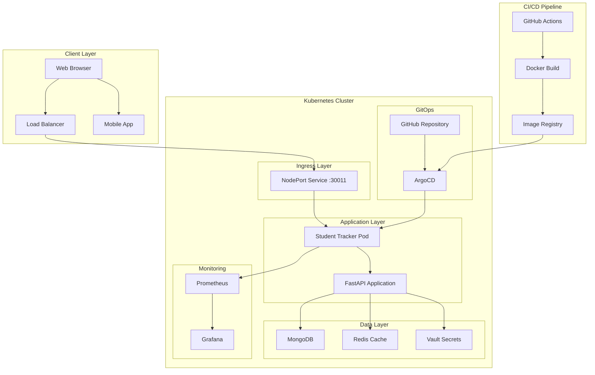
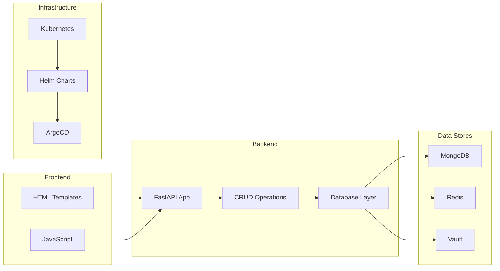
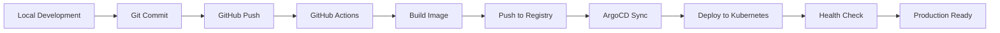

# 🎓 Student Tracker - Complete Student Management Platform

<div align="center">


**A comprehensive student management application with GitOps automation**

[](http://18.206.89.183:30011)
[](http://18.206.89.183:30080)
[](https://github.com/bonaventuresimeon/NativeSeries/actions)

</div>

---

## 📋 Table of Contents

- [🎯 Overview](#-overview)
- [🏗️ Architecture](#️-architecture)
- [🚀 Quick Start](#-quick-start)
- [📦 Installation](#-installation)
- [🔧 Deployment](#-deployment)
- [📊 Monitoring](#-monitoring)
- [🔒 Security](#-security)
- [📚 API Documentation](#-api-documentation)
- [🛠️ Development](#️-development)
- [🔧 Troubleshooting](#-troubleshooting)
- [🤝 Contributing](#-contributing)
- [📄 License](#-license)

---

## 🎯 Overview

Student Tracker is a modern, cloud-native student management platform built with **FastAPI**, deployed on **Kubernetes** using **Helm**, and managed through **ArgoCD** for GitOps automation. The application provides comprehensive student tracking, progress monitoring, and administrative capabilities with enterprise-grade reliability and security.

### 🌟 Key Features

- **📚 Student Management**: Complete CRUD operations for student records
- **📈 Progress Tracking**: Weekly progress monitoring and analytics
- **🔐 Secure Authentication**: Vault-integrated secret management
- **📊 Real-time Monitoring**: Prometheus metrics and health checks
- **🚀 Auto-scaling**: Horizontal Pod Autoscaler for performance optimization
- **🔄 GitOps**: Automated deployment with ArgoCD and GitHub Actions
- **🔒 Security**: Non-root containers, read-only filesystems, security contexts
- **🌐 Production Ready**: Deployed on AWS EC2 with high availability
- **📱 Responsive UI**: Modern web interface with interactive API documentation

### 🌐 Production Access

| Service | URL | Description | Status |
|---------|-----|-------------|--------|
| **Student Tracker App** | [http://18.206.89.183:30011](http://18.206.89.183:30011) | Main application | ✅ Live |
| **API Documentation** | [http://18.206.89.183:30011/docs](http://18.206.89.183:30011/docs) | Interactive API docs | ✅ Live |
| **ArgoCD UI (HTTP)** | [http://18.206.89.183:30080](http://18.206.89.183:30080) | GitOps management | ✅ Live |
| **ArgoCD UI (HTTPS)** | [https://18.206.89.183:30443](https://18.206.89.183:30443) | Secure GitOps access | ✅ Live |

> **Note**: The application uses NodePort 30011 (valid Kubernetes range: 30000-32767) for external access.

---

## 🏗️ Architecture

### System Architecture Diagram



### Component Architecture



### Technology Stack

| Layer | Technology | Purpose |
|-------|------------|---------|
| **Frontend** | HTML5, CSS3, JavaScript | User interface |
| **Backend** | FastAPI, Python 3.11 | REST API and business logic |
| **Database** | MongoDB | Primary data storage |
| **Cache** | Redis | Session and data caching |
| **Container** | Docker | Application containerization |
| **Orchestration** | Kubernetes | Container orchestration |
| **Package Manager** | Helm | Kubernetes application management |
| **GitOps** | ArgoCD | Continuous deployment |
| **CI/CD** | GitHub Actions | Automated build and test |
| **Monitoring** | Prometheus, Grafana | Metrics and monitoring |
| **Security** | Vault | Secret management |

---

## 🚀 Quick Start

### Prerequisites

- **Kubernetes Cluster** (minikube, kind, or cloud provider)
- **kubectl** configured and connected to your cluster
- **Helm** v3.12.0+
- **Docker** (for local development)
- **Git**

### One-Command Deployment

```bash
# Clone the repository
git clone https://github.com/bonaventuresimeon/NativeSeries.git
cd NativeSeries

# Make deployment script executable
chmod +x scripts/deploy.sh

# Run deployment (interactive menu)
./scripts/deploy.sh
```

**🎉 Your application will be live in minutes!**

### Quick Test

After deployment, test your application:

```bash
# Health check
curl http://your-cluster-ip:30011/health

# API documentation
open http://your-cluster-ip:30011/docs

# Create a test student
curl -X POST http://your-cluster-ip:30011/students \
  -H "Content-Type: application/json" \
  -d '{"name": "Test Student", "email": "test@example.com", "age": 20}'
```

---

## 📦 Installation

### Step 1: Clone Repository

```bash
git clone https://github.com/bonaventuresimeon/NativeSeries.git
cd NativeSeries
```

### Step 2: Install Prerequisites

#### Install kubectl
```bash
# Linux
curl -LO "https://dl.k8s.io/release/$(curl -L -s https://dl.k8s.io/release/stable.txt)/bin/linux/amd64/kubectl"
sudo install -o root -g root -m 0755 kubectl /usr/local/bin/kubectl

# macOS
brew install kubectl

# Windows
choco install kubernetes-cli

# Verify installation
kubectl version --client
```

#### Install Helm
```bash
# Linux/macOS
curl https://raw.githubusercontent.com/helm/helm/main/scripts/get-helm-3 | bash

# Windows
choco install kubernetes-helm

# Verify installation
helm version
```

#### Install Docker
```bash
# Ubuntu/Debian
sudo apt-get update
sudo apt-get install docker.io
sudo systemctl start docker
sudo usermod -aG docker $USER

# macOS
brew install --cask docker

# Windows
# Download from https://www.docker.com/products/docker-desktop

# Verify installation
docker --version
```

### Step 3: Set Up Kubernetes Cluster

#### Option A: Minikube (Local Development)
```bash
# Install minikube
curl -LO https://storage.googleapis.com/minikube/releases/latest/minikube-linux-amd64
sudo install minikube-linux-amd64 /usr/local/bin/minikube

# Start cluster with adequate resources
minikube start --driver=docker --memory=4096 --cpus=2

# Enable addons
minikube addons enable ingress
minikube addons enable metrics-server

# Verify cluster
kubectl cluster-info
```

#### Option B: Kind (Local Development)
```bash
# Install kind
curl -Lo ./kind https://kind.sigs.k8s.io/dl/v0.20.0/kind-linux-amd64
chmod +x ./kind
sudo mv ./kind /usr/local/bin/kind

# Create cluster with custom configuration
cat <<EOF | kind create cluster --name student-tracker --config=-
kind: Cluster
apiVersion: kind.x-k8s.io/v1alpha4
nodes:
- role: control-plane
  kubeadmConfigPatches:
  - |
    kind: InitConfiguration
    nodeRegistration:
      kubeletExtraArgs:
        node-labels: "ingress-ready=true"
  extraPortMappings:
  - containerPort: 80
    hostPort: 80
    protocol: TCP
  - containerPort: 443
    hostPort: 443
    protocol: TCP
  - containerPort: 30011
    hostPort: 30011
    protocol: TCP
EOF
```

#### Option C: Cloud Provider (Production)
```bash
# AWS EKS
eksctl create cluster --name student-tracker --region us-west-2 --nodes 3

# Google GKE
gcloud container clusters create student-tracker \
  --zone us-central1-a \
  --num-nodes 3 \
  --enable-autoscaling \
  --min-nodes 1 \
  --max-nodes 5

# Azure AKS
az aks create \
  --resource-group myResourceGroup \
  --name student-tracker \
  --node-count 3 \
  --enable-addons monitoring
```

---

## 🔧 Deployment

### Automated Deployment (Recommended)

The deployment script provides an interactive menu with multiple options:

```bash
./scripts/deploy.sh
```

#### Deployment Options:

1. **🚀 Full Deployment** - Install ArgoCD and deploy application
2. **📱 Application Only** - Deploy application (ArgoCD already installed)
3. **🐳 Image Only** - Build and push Docker image
4. **✅ Validate Only** - Validate configuration without deployment
5. **📊 Monitoring Setup** - Install Prometheus CRDs and deploy with monitoring

### Manual Deployment Steps

#### Step 1: Install ArgoCD

```bash
# Create namespace
kubectl create namespace argocd

# Install ArgoCD
kubectl apply -n argocd -f https://raw.githubusercontent.com/argoproj/argo-cd/stable/manifests/install.yaml

# Wait for ArgoCD to be ready
kubectl wait --for=condition=available --timeout=300s deployment/argocd-server -n argocd

# Create external service for ArgoCD
kubectl apply -f - <<EOF
apiVersion: v1
kind: Service
metadata:
  name: argocd-server-external
  namespace: argocd
spec:
  type: NodePort
  ports:
    - name: http
      port: 80
      targetPort: 8080
      nodePort: 30080
    - name: https
      port: 443
      targetPort: 8080
      nodePort: 30443
  selector:
    app.kubernetes.io/name: argocd-server
EOF
```

#### Step 2: Build and Push Docker Image

```bash
# Build image
docker build -t student-tracker:latest .

# Tag for registry
docker tag student-tracker:latest ghcr.io/bonaventuresimeon/student-tracker:latest

# Login to GitHub Container Registry
echo $CR_PAT | docker login ghcr.io -u USERNAME --password-stdin

# Push to registry
docker push ghcr.io/bonaventuresimeon/student-tracker:latest
```

#### Step 3: Deploy Helm Chart

```bash
# Add required repositories
helm repo add bitnami https://charts.bitnami.com/bitnami
helm repo update

# Update dependencies (if any)
cd helm-chart
helm dependency update
cd ..

# Install application
helm install student-tracker ./helm-chart \
  --namespace student-tracker \
  --create-namespace \
  --set app.image.repository=ghcr.io/bonaventuresimeon/student-tracker \
  --set app.image.tag=latest \
  --set service.nodePort=30011
```

#### Step 4: Configure ArgoCD Application

```bash
# Get ArgoCD admin password
kubectl -n argocd get secret argocd-initial-admin-secret -o jsonpath="{.data.password}" | base64 -d

# Apply ArgoCD application
kubectl apply -f argocd/application.yaml

# Verify deployment
kubectl get applications -n argocd
argocd app get student-tracker
```

### Verification Commands

```bash
# Check all resources
kubectl get all -n student-tracker

# Check pods status
kubectl get pods -n student-tracker -w

# Check services
kubectl get svc -n student-tracker

# Check ArgoCD status
kubectl get pods -n argocd

# View application logs
kubectl logs -f deployment/student-tracker -n student-tracker
```

---

## 📊 Monitoring

### Health Checks

The application provides comprehensive health monitoring:

```bash
# Application health
curl http://18.206.89.183:30011/health

# Metrics endpoint
curl http://18.206.89.183:30011/metrics

# Readiness check
curl http://18.206.89.183:30011/ready

# API status
curl http://18.206.89.183:30011/api/status
```

### Prometheus Metrics

The application exposes Prometheus-compatible metrics:

- **Request Count**: Total HTTP requests (`http_requests_total`)
- **Response Time**: Average response times (`http_request_duration_seconds`)
- **Error Rate**: Error percentage (`http_requests_errors_total`)
- **Uptime**: Application uptime (`process_start_time_seconds`)
- **Memory Usage**: Container memory consumption (`process_resident_memory_bytes`)
- **CPU Usage**: Container CPU utilization (`process_cpu_seconds_total`)

### Monitoring Setup

```bash
# Install Prometheus Operator CRDs
kubectl apply -f https://raw.githubusercontent.com/prometheus-operator/prometheus-operator/main/example/prometheus-operator-crd/monitoring.coreos.com_servicemonitors.yaml

# Enable ServiceMonitor in Helm chart
helm upgrade student-tracker ./helm-chart \
  --namespace student-tracker \
  --set serviceMonitor.enabled=true
```

### Logging

```bash
# View application logs
kubectl logs -f deployment/student-tracker -n student-tracker

# View ArgoCD logs
kubectl logs -f deployment/argocd-server -n argocd

# View all pod logs in namespace
kubectl logs -f --all-containers=true -n student-tracker

# View logs with timestamps
kubectl logs deployment/student-tracker -n student-tracker --timestamps=true
```

---

## 🔒 Security

### Security Features

- **🔐 Non-root Containers**: All containers run as non-root user (UID 1000)
- **📁 Read-only Filesystems**: Immutable container filesystems where possible
- **🚫 Privilege Escalation**: Disabled privilege escalation
- **🛡️ Security Contexts**: Kubernetes security contexts applied
- **🔑 Vault Integration**: Secure secret management
- **🌐 Network Policies**: Restricted network access (future enhancement)
- **🔒 HTTPS Support**: SSL/TLS encryption ready

### Security Best Practices

```yaml
# Security context example
securityContext:
  runAsNonRoot: true
  runAsUser: 1000
  fsGroup: 1000
  capabilities:
    drop:
    - ALL
  readOnlyRootFilesystem: true
  allowPrivilegeEscalation: false
```

### Security Scanning

```bash
# Scan Docker image for vulnerabilities
docker run --rm -v /var/run/docker.sock:/var/run/docker.sock \
  aquasec/trivy image ghcr.io/bonaventuresimeon/student-tracker:latest

# Check Kubernetes security with kube-score
kube-score score helm-chart/templates/*.yaml
```

---

## 📚 API Documentation

### Interactive API Documentation

Access the complete API documentation at: [http://18.206.89.183:30011/docs](http://18.206.89.183:30011/docs)

### Key Endpoints

| Endpoint | Method | Description | Response |
|----------|--------|-------------|----------|
| `/` | GET | Main application interface | HTML page |
| `/health` | GET | Health check endpoint | `{"status": "healthy"}` |
| `/metrics` | GET | Prometheus metrics | Metrics in Prometheus format |
| `/docs` | GET | Interactive API documentation | Swagger UI |
| `/api/status` | GET | API status information | JSON status object |
| `/students` | GET | List all students | Array of student objects |
| `/students/{id}` | GET | Get student by ID | Student object |
| `/students` | POST | Create new student | Created student object |
| `/students/{id}` | PUT | Update student | Updated student object |
| `/students/{id}` | DELETE | Delete student | Success message |

### Example API Usage

```bash
# Get all students
curl http://18.206.89.183:30011/students

# Create a student
curl -X POST http://18.206.89.183:30011/students \
  -H "Content-Type: application/json" \
  -d '{
    "name": "John Doe",
    "email": "john@example.com",
    "age": 20,
    "course": "Computer Science",
    "enrollment_date": "2024-01-15"
  }'

# Get student by ID
curl http://18.206.89.183:30011/students/1

# Update a student
curl -X PUT http://18.206.89.183:30011/students/1 \
  -H "Content-Type: application/json" \
  -d '{
    "name": "John Smith",
    "email": "john.smith@example.com",
    "age": 21
  }'

# Delete a student
curl -X DELETE http://18.206.89.183:30011/students/1

# Get health status
curl http://18.206.89.183:30011/health
```

### API Response Examples

```json
// GET /students
{
  "students": [
    {
      "id": 1,
      "name": "John Doe",
      "email": "john@example.com",
      "age": 20,
      "course": "Computer Science",
      "enrollment_date": "2024-01-15",
      "created_at": "2024-01-15T10:00:00Z"
    }
  ],
  "total": 1
}

// GET /health
{
  "status": "healthy",
  "timestamp": "2024-01-15T10:00:00Z",
  "version": "1.1.0",
  "database": "connected",
  "uptime": 3600
}
```

---

## 🛠️ Development

### Local Development Setup

```bash
# Clone repository
git clone https://github.com/bonaventuresimeon/NativeSeries.git
cd NativeSeries

# Create virtual environment
python3 -m venv venv
source venv/bin/activate  # Linux/macOS
# or
venv\Scripts\activate  # Windows

# Install dependencies
pip install -r requirements.txt

# Set environment variables
export ENVIRONMENT=development
export MONGO_URI=mongodb://localhost:27017
export DATABASE_NAME=student_project_tracker_dev

# Run development server
uvicorn app.main:app --reload --host 0.0.0.0 --port 8000
```

### Project Structure

```
NativeSeries/
├── 📁 app/                    # Application source code
│   ├── 🐍 main.py            # FastAPI application entry point
│   ├── 🗃️ models.py          # Database models
│   ├── 🔌 database.py        # Database configuration
│   ├── 🔄 crud.py           # CRUD operations
│   ├── 🧪 test_basic.py     # Basic tests
│   └── 🛣️ routes/           # API routes
│       ├── 🔗 api.py        # API routes
│       └── 👥 students.py   # Student routes
├── 📁 helm-chart/            # Helm chart for Kubernetes deployment
│   ├── 📁 templates/         # Kubernetes manifests
│   │   ├── 🚀 deployment.yaml
│   │   ├── 🌐 service.yaml
│   │   ├── 📊 servicemonitor.yaml
│   │   ├── ⚖️ hpa.yaml
│   │   └── 🔧 configmap.yaml
│   ├── 📄 Chart.yaml         # Chart metadata
│   └── ⚙️ values.yaml        # Configuration values
├── 📁 argocd/               # ArgoCD application manifests
│   └── 📱 application.yaml  # ArgoCD application definition
├── 📁 scripts/              # Deployment and utility scripts
│   └── 🚀 deploy.sh         # Main deployment script
├── 📁 templates/            # HTML templates
│   ├── 🏠 index.html        # Main page
│   └── 📝 students.html     # Student management page
├── 📁 .github/workflows/    # CI/CD pipelines
│   ├── 🔄 helm-argocd-deploy.yml
│   └── 🧪 test.yml
├── 🐳 Dockerfile            # Container image definition
├── 📋 requirements.txt      # Python dependencies
├── 🚀 deploy-to-production.sh # Production deployment script
└── 📖 README.md            # Project documentation
```

### Development Workflow



### Code Quality

```bash
# Run linting
flake8 app/

# Run type checking
mypy app/

# Run tests
pytest app/ -v

# Check test coverage
pytest app/ --cov=app --cov-report=html
```

---

## 🔧 Troubleshooting

### Common Issues and Solutions

#### 1. NodePort Service Issues

**Problem**: `Error: provided port is not in the valid range. The range of valid ports is 30000-32767`

**Solution**: 
```bash
# Check current nodePort value
kubectl get svc student-tracker -n student-tracker -o yaml | grep nodePort

# Update Helm values
helm upgrade student-tracker ./helm-chart \
  --namespace student-tracker \
  --set service.nodePort=30011
```

#### 2. ArgoCD Not Accessible

**Problem**: Cannot access ArgoCD UI

**Solution**:
```bash
# Check ArgoCD pods
kubectl get pods -n argocd

# Port forward for local access
kubectl port-forward svc/argocd-server 8080:443 -n argocd

# Get admin password
kubectl -n argocd get secret argocd-initial-admin-secret -o jsonpath="{.data.password}" | base64 -d
```

#### 3. Application Not Starting

**Problem**: Pods in CrashLoopBackOff state

**Solution**:
```bash
# Check pod logs
kubectl logs deployment/student-tracker -n student-tracker

# Check pod description
kubectl describe pod -l app.kubernetes.io/name=student-tracker -n student-tracker

# Check events
kubectl get events -n student-tracker --sort-by='.lastTimestamp'
```

#### 4. Database Connection Issues

**Problem**: Cannot connect to MongoDB

**Solution**:
```bash
# Check environment variables
kubectl exec -it deployment/student-tracker -n student-tracker -- env | grep MONGO

# Test database connectivity
kubectl exec -it deployment/student-tracker -n student-tracker -- python -c "
import pymongo
client = pymongo.MongoClient('mongodb://localhost:27017')
print(client.list_database_names())
"
```

#### 5. Image Pull Issues

**Problem**: `ImagePullBackOff` error

**Solution**:
```bash
# Check image pull secrets
kubectl get secrets -n student-tracker

# Check image repository and tag
kubectl get deployment student-tracker -n student-tracker -o yaml | grep image

# Update image
helm upgrade student-tracker ./helm-chart \
  --namespace student-tracker \
  --set app.image.repository=ghcr.io/bonaventuresimeon/student-tracker \
  --set app.image.tag=latest
```

#### 6. Helm Deployment Issues

**Problem**: Helm chart validation failures

**Solution**:
```bash
# Lint Helm chart
helm lint ./helm-chart

# Dry run deployment
helm install student-tracker ./helm-chart \
  --namespace student-tracker \
  --dry-run --debug

# Template validation
helm template student-tracker ./helm-chart --namespace student-tracker
```

### Debug Commands

```bash
# Get all resources in namespace
kubectl get all -n student-tracker

# Describe problematic resources
kubectl describe deployment student-tracker -n student-tracker
kubectl describe pod -l app.kubernetes.io/name=student-tracker -n student-tracker

# Check resource usage
kubectl top pods -n student-tracker
kubectl top nodes

# Check cluster status
kubectl cluster-info
kubectl get nodes -o wide

# Check storage
kubectl get pv,pvc -n student-tracker
```

### Performance Troubleshooting

```bash
# Check HPA status
kubectl get hpa -n student-tracker

# Check resource limits
kubectl describe deployment student-tracker -n student-tracker | grep -A 10 Resources

# Check metrics
curl http://18.206.89.183:30011/metrics | grep -E "(cpu|memory|requests)"
```

---

## 🤝 Contributing

### Contributing Guidelines

We welcome contributions! Please follow these guidelines:

1. **Fork** the repository
2. **Create** a feature branch (`git checkout -b feature/amazing-feature`)
3. **Commit** your changes (`git commit -m 'Add amazing feature'`)
4. **Push** to the branch (`git push origin feature/amazing-feature`)
5. **Open** a Pull Request

### Development Standards

- **Code Style**: Follow PEP 8 for Python code
- **Testing**: Write tests for new features (minimum 80% coverage)
- **Documentation**: Update documentation for all changes
- **Security**: Follow security best practices
- **Commit Messages**: Use conventional commit format

### Pull Request Checklist

- [ ] Code follows PEP 8 standards
- [ ] Tests are added for new features
- [ ] All tests pass locally
- [ ] Documentation is updated
- [ ] Security considerations are addressed
- [ ] Helm chart changes are tested
- [ ] ArgoCD application syncs successfully

### Setting Up Development Environment

```bash
# Install development dependencies
pip install -r requirements-dev.txt

# Install pre-commit hooks
pre-commit install

# Run full test suite
pytest app/ -v --cov=app

# Run security scan
bandit -r app/
```

---

## 📄 License

This project is licensed under the MIT License - see the [LICENSE](LICENSE) file for details.

---

## 👨‍💻 Author

**Bonaventure Simeon**  
📧 Email: [contact@bonaventure.org.ng](mailto:contact@bonaventure.org.ng)  
📱 Phone: [+234 (812) 222 5406](tel:+2348122225406)  
🌐 GitHub: [@bonaventuresimeon](https://github.com/bonaventuresimeon)  
💼 LinkedIn: [linkedin.com/in/bonaventuresimeon](https://linkedin.com/in/bonaventuresimeon)

---

## 🆘 Support

### Getting Help

- **📖 Documentation**: [http://18.206.89.183:30011/docs](http://18.206.89.183:30011/docs)
- **🐛 Issues**: [GitHub Issues](https://github.com/bonaventuresimeon/NativeSeries/issues)
- **💬 Discussions**: [GitHub Discussions](https://github.com/bonaventuresimeon/NativeSeries/discussions)
- **📧 Email**: [contact@bonaventure.org.ng](mailto:contact@bonaventure.org.ng)

### Quick Help Commands

```bash
# Check deployment status
./scripts/deploy.sh

# View logs
kubectl logs -f deployment/student-tracker -n student-tracker

# Health check
curl http://18.206.89.183:30011/health

# Get ArgoCD password
kubectl -n argocd get secret argocd-initial-admin-secret -o jsonpath="{.data.password}" | base64 -d
```

---

<div align="center">

**Made with ❤️ by Bonaventure Simeon**

[](https://github.com/bonaventuresimeon)
[](https://linkedin.com/in/bonaventuresimeon)
[](mailto:contact@bonaventure.org.ng)

### ⭐ If this project helped you, please give it a star! ⭐

</div>
