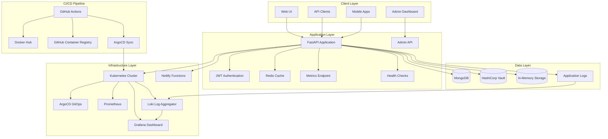

# NativeSeries - Enterprise-Grade Student Tracking Platform

[](https://kubernetes.io/)
[](https://www.docker.com/)
[](https://fastapi.tiangolo.com/)
[](https://prometheus.io/)
[](https://grafana.com/)
[](https://argoproj.github.io/argo-cd/)
[](https://helm.sh/)
[](https://grafana.com/oss/loki/)
[](https://netlify.com/)
[](https://github.com/features/actions)

## 📋 Table of Contents

- [Overview](#overview)
- [Key Features](#key-features)
- [Architecture](#architecture)
- [Quick Start](#quick-start)
- [Installation](#installation)
- [Deployment Options](#deployment-options)
- [API Documentation](#api-documentation)
- [Monitoring & Observability](#monitoring--observability)
- [Development Guide](#development-guide)
- [Documentation](#documentation)
- [Troubleshooting](#troubleshooting)
- [Contributing](#contributing)

## 🎯 Overview

NativeSeries is a comprehensive, enterprise-grade student tracking platform built on modern cloud-native technologies. It demonstrates full-stack DevOps practices including containerization, Kubernetes orchestration, GitOps workflows, CI/CD automation, and comprehensive monitoring.

### Core Objectives

- **Student Management**: Complete CRUD operations for student records and progress tracking
- **Production-Ready Infrastructure**: Kubernetes deployment with monitoring, logging, and security
- **GitOps Implementation**: Automated deployment using ArgoCD and Helm
- **Multi-Platform Support**: Docker containers, Kubernetes orchestration, and serverless deployment
- **Full Observability**: Integrated Prometheus, Grafana, and Loki for comprehensive monitoring
- **Security-First Design**: Secrets management, network policies, and RBAC implementation
- **Auto-scaling Capabilities**: Horizontal Pod Autoscaler with intelligent scaling policies
- **High Availability**: Pod Disruption Budgets and health checks for reliability

## ✨ Key Features

### 🚀 **Core Application**
- **FastAPI Backend**: High-performance REST API with automatic documentation
- **Student Tracking**: Complete student registration and progress monitoring
- **Course Management**: Track courses and student enrollments
- **Progress Analytics**: Monitor student performance and achievements
- **Admin Dashboard**: Comprehensive administrative interface
- **Database Integration**: MongoDB with in-memory fallback for Netlify

### 🔍 **Monitoring & Observability**
- **Prometheus Metrics**: Custom application metrics and Kubernetes monitoring
- **Grafana Dashboards**: Real-time visualization and alerting
- **Loki Log Aggregation**: Centralized log collection and querying
- **Custom Alert Rules**: Application-specific monitoring and alerting
- **Service Monitoring**: Automatic service discovery and monitoring

### 🛡️ **Security & Configuration**
- **Kubernetes Secrets**: Secure credential management
- **ConfigMaps**: Environment-specific configuration
- **Network Policies**: Traffic control and security
- **RBAC Implementation**: Role-based access control
- **Security Contexts**: Pod and container security policies

### ⚡ **Auto-scaling & High Availability**
- **Horizontal Pod Autoscaler**: CPU and memory-based scaling
- **Pod Disruption Budget**: Ensures minimum availability during updates
- **Health Checks**: Liveness and readiness probes
- **Resource Limits**: CPU and memory constraints
- **Rolling Updates**: Zero-downtime deployments

### 🌐 **Multi-Platform Deployment**
- **Docker Containers**: Containerized application deployment
- **Kubernetes Orchestration**: Production-grade container orchestration
- **Netlify Functions**: Serverless deployment option
- **GitHub Actions**: Automated CI/CD pipeline
- **ArgoCD GitOps**: Declarative deployment management

## 🏗️ Architecture

### System Architecture



## 🛠️ Technology Stack

### Backend
- **FastAPI**: Modern Python web framework with automatic API documentation
- **Python 3.11**: Latest stable Python version
- **Uvicorn**: ASGI server for FastAPI
- **Pydantic**: Data validation and settings management
- **JWT**: JSON Web Token authentication

### Database & Caching
- **MongoDB**: Document database for data persistence
- **Redis**: In-memory caching layer
- **In-Memory Storage**: Graceful degradation for Netlify Functions

### Containerization & Orchestration
- **Docker**: Container runtime and image building
- **Kubernetes**: Container orchestration platform
- **Kind**: Local Kubernetes cluster for development
- **Helm**: Kubernetes package manager

### GitOps & CI/CD
- **ArgoCD**: GitOps continuous deployment
- **GitHub Actions**: CI/CD pipeline automation
- **Git**: Version control and collaboration

### Monitoring & Observability
- **Prometheus**: Metrics collection and storage
- **Grafana**: Metrics visualization and dashboards
- **Loki**: Log aggregation and querying
- **ServiceMonitor**: Kubernetes service monitoring
- **PodMonitor**: Pod-level metrics collection

### Security & Scaling
- **Kubernetes Secrets**: Secure credential management
- **ConfigMaps**: Configuration management
- **Network Policies**: Traffic control and security
- **Horizontal Pod Autoscaler**: Automatic scaling
- **Pod Disruption Budget**: High availability

### Serverless
- **Netlify Functions**: Serverless deployment option
- **Netlify**: Static site hosting and serverless functions

## 🚀 Quick Start

### Prerequisites

- **Operating System**: Linux (Ubuntu 20.04+, CentOS 8+, Amazon Linux 2)
- **Memory**: Minimum 8GB RAM (16GB recommended for monitoring stack)
- **Storage**: Minimum 50GB free space (for monitoring data)
- **Network**: Internet connection for downloading dependencies

### Automated Installation

```bash
# Clone the repository
git clone https://github.com/bonaventuresimeon/nativeseries.git
cd nativeseries

# Run the automated installation script
chmod +x scripts/install-all.sh
./scripts/install-all.sh
```

This script will install:
1. All required tools (Docker, kubectl, Helm, Kind, ArgoCD)
2. Kubernetes cluster with Kind
3. Application deployment
4. Monitoring stack (Prometheus + Grafana)
5. Logging stack (Loki)
6. Secrets and ConfigMaps
7. Auto-scaling configuration (HPA)
8. Network policies and security

### Manual Installation

```bash
# Clone the repository
git clone https://github.com/bonaventuresimeon/nativeseries.git
cd nativeseries

# Install Python dependencies
pip install -r requirements.txt

# Build Docker image
docker build -t ghcr.io/bonaventuresimeon/nativeseries:latest .

# Run locally
docker run -p 8000:8000 ghcr.io/bonaventuresimeon/nativeseries:latest
```

## 📦 Installation

For detailed installation instructions, see [INSTALLATION.md](INSTALLATION.md).

### System Requirements

- **Operating System**: Linux (Ubuntu 20.04+, CentOS 8+, Amazon Linux 2)
- **Memory**: Minimum 8GB RAM (16GB recommended for monitoring stack)
- **Storage**: Minimum 50GB free space (for monitoring data)
- **Network**: Internet connection for downloading dependencies

### Required Tools

- **Python**: 3.11 or higher
- **Docker**: 20.10 or higher
- **kubectl**: 1.28 or higher
- **Helm**: 3.13 or higher
- **Kind**: 0.20.0 or higher (for local Kubernetes)
- **ArgoCD CLI**: 2.9.3 or higher

## 🌐 Deployment Options

### 1. Kubernetes Production Deployment

**Production Environment:**
- **Application**: http://54.166.101.159:30011
- **ArgoCD UI**: http://54.166.101.159:30080
- **Grafana**: http://54.166.101.159:30081
- **Prometheus**: http://54.166.101.159:30082
- **Loki**: http://54.166.101.159:30083

**Features:**
- Full Kubernetes orchestration
- ArgoCD GitOps deployment
- Comprehensive monitoring stack
- Auto-scaling capabilities
- High availability configuration

### 2. Netlify Serverless Deployment

**Features:**
- Serverless functions for API endpoints
- Static site hosting
- Automatic CI/CD from GitHub
- Global CDN distribution
- Built-in security headers

**Access:**
- **Application**: https://nativeseries.netlify.app
- **Health Check**: https://nativeseries.netlify.app/.netlify/functions/health
- **API Documentation**: https://nativeseries.netlify.app/api.html
- **Database Viewer**: https://nativeseries.netlify.app/database.html

### 3. Local Development

**Features:**
- Docker containerization
- Local Kubernetes with Kind
- Development environment setup
- Hot reloading for development

## 📚 API Documentation

### Interactive Documentation

**Kubernetes Deployment:**
- **Swagger UI**: http://54.166.101.159:30011/docs
- **ReDoc**: http://54.166.101.159:30011/redoc
- **OpenAPI JSON**: http://54.166.101.159:30011/openapi.json

**Netlify Deployment:**
- **API Documentation**: https://nativeseries.netlify.app/api.html
- **Interactive Testing**: Available in the API documentation page

### API Endpoints

#### Health & System
- `GET /health` - Application health check
- `GET /metrics` - Prometheus metrics
- `GET /` - Application homepage
- `GET /about` - Application information

#### Students API
- `GET /students` - List all students
- `POST /students` - Create new student
- `GET /students/{id}` - Get student by ID
- `PUT /students/{id}` - Update student
- `DELETE /students/{id}` - Delete student

#### Courses API
- `GET /courses` - List all courses
- `POST /courses` - Create new course
- `GET /courses/{id}` - Get course by ID
- `PUT /courses/{id}` - Update course
- `DELETE /courses/{id}` - Delete course

#### Progress API
- `GET /progress` - List all progress records
- `POST /progress` - Create new progress record
- `GET /progress/{id}` - Get progress by ID
- `PUT /progress/{id}` - Update progress
- `DELETE /progress/{id}` - Delete progress

#### Admin API
- `GET /admin` - Admin dashboard
- `GET /admin/students` - Admin student management
- `GET /admin/courses` - Admin course management
- `GET /admin/progress` - Admin progress management

## 🔍 Monitoring & Observability

### Prometheus & Grafana

**Access URLs:**
- Grafana: `http://54.166.101.159:30081` (admin/admin123)
- Prometheus: `http://54.166.101.159:30082`

**Components:**
- Prometheus Operator for metrics collection
- Grafana dashboards for visualization
- ServiceMonitor for application metrics
- PodMonitor for pod-level metrics
- PrometheusRule for alerting

### Loki Logging

**Access URL:**
- Loki: `http://54.166.101.159:30083`

**Components:**
- Loki server for log aggregation
- Log forwarding from application pods
- Log querying and visualization in Grafana

### Application Metrics

The application exposes the following metrics:
- **Health Status**: Application health and readiness
- **Request Metrics**: HTTP request counts and latencies
- **Resource Usage**: CPU and memory consumption
- **Custom Metrics**: Application-specific metrics

### Alerting Rules

Configured alerts for:
- **High CPU Usage**: CPU > 80% for 5 minutes
- **High Memory Usage**: Memory > 85% for 5 minutes
- **Pod Restarts**: Pod restart count > 3 in 10 minutes
- **Service Availability**: Service down for > 2 minutes

## 🧪 Testing

### Health Checks

```bash
# Application health
curl http://54.166.101.159:30011/health

# Metrics endpoint
curl http://54.166.101.159:30011/metrics

# API documentation
curl http://54.166.101.159:30011/docs
```

### Monitoring Tests

```bash
# Run monitoring tests
./scripts/test-monitoring.sh

# Check application status
kubectl get pods -n nativeseries

# Check monitoring stack
kubectl get pods -n monitoring

# Check logging stack
kubectl get pods -n logging
```

### Smoke Tests

```bash
# Run smoke tests
./scripts/smoke-tests.sh

# Validate deployment
./scripts/validate-deployment.sh
```

## 🛠️ Development Guide

### Environment Setup

1. **Clone Repository**
   ```bash
   git clone https://github.com/bonaventuresimeon/nativeseries.git
   cd nativeseries
   ```

2. **Install Dependencies**
   ```bash
   python3 -m venv venv
   source venv/bin/activate
   pip install -r requirements.txt
   ```

3. **Run Locally**
   ```bash
   uvicorn app.main:app --host 0.0.0.0 --port 8000 --reload
   ```

4. **Access Application**
   - **API**: http://localhost:8000
   - **Docs**: http://localhost:8000/docs
   - **Health**: http://localhost:8000/health

### Docker Development

```bash
# Build development image
docker build -t nativeseries:dev .

# Run with volume mounting for development
docker run -p 8000:8000 -v $(pwd):/app nativeseries:dev
```

### Kubernetes Development

```bash
# Create Kind cluster
kind create cluster --name nativeseries-dev

# Deploy to development cluster
kubectl apply -f deployment/development/

# Access application
kubectl port-forward svc/nativeseries-service 8000:80
```

## 📖 Documentation

This project includes comprehensive documentation for different aspects of the application:

### 📚 **Step-by-Step Guides**
- **[1.0 Setup your Environment](doc/1.0%20Setup%20your%20Enviroment/readme.md)** - Environment setup for Ubuntu VM
- **[2.0 Dockerise your App](doc/2.0%20-%20Dockerise%20your%20App/readme.md)** - Containerization guide
- **[3.0 Kubernetes](doc/3.0%20-%20Kubernetes/readme.md)** - Kubernetes basics and setup
- **[4.0 Deploy to K8s](doc/4.0%20-%20Deploy%20to%20K8s/readme.md)** - Kubernetes deployment with Ingress
- **[6.0 Git Actions](doc/6.0%20-%20%20Git%20Actions/readme.md)** - CI/CD with GitHub Actions
- **[7.0 GitOps](doc/7.0%20-%20GitOps/readme.md)** - GitOps implementation with ArgoCD

### 📋 **Installation & Deployment**
- **[INSTALLATION.md](INSTALLATION.md)** - Comprehensive installation guide
- **[scripts/install-all.sh](scripts/install-all.sh)** - Automated installation script

### 🔧 **Configuration Files**
- **[netlify.toml](netlify.toml)** - Netlify configuration
- **[build.sh](build.sh)** - Build script for Netlify
- **[Dockerfile](Dockerfile)** - Docker container configuration
- **[helm-chart/](helm-chart/)** - Helm charts for Kubernetes deployment
- **[argocd/](argocd/)** - ArgoCD application configuration

## 🐛 Troubleshooting

### Common Issues

#### Installation Issues
1. **Docker not starting**: Check Docker daemon and permissions
2. **kubectl not found**: Ensure kubectl is in PATH
3. **Helm installation failed**: Check network connectivity
4. **Kind cluster creation failed**: Ensure Docker is running

#### Application Issues
1. **Application not starting**: Check logs with `kubectl logs`
2. **Database connection failed**: Verify MongoDB configuration
3. **Health checks failing**: Check application configuration
4. **Metrics not appearing**: Verify ServiceMonitor configuration

#### Monitoring Issues
1. **Grafana not accessible**: Check NodePort service
2. **Prometheus not collecting metrics**: Verify ServiceMonitor
3. **Loki logs not appearing**: Check log forwarding configuration
4. **Alerts not firing**: Verify PrometheusRule configuration

### Debug Commands

```bash
# Check application logs
kubectl logs -f deployment/nativeseries -n nativeseries

# Check monitoring logs
kubectl logs -f deployment/prometheus -n monitoring
kubectl logs -f deployment/grafana -n monitoring

# Check Loki logs
kubectl logs -f deployment/loki -n logging

# Check cluster status
kubectl get nodes
kubectl get pods --all-namespaces

# Check services
kubectl get svc --all-namespaces

# Check events
kubectl get events --all-namespaces --sort-by='.lastTimestamp'
```

### Log Locations

- **Application Logs**: `/app/logs/app.log`
- **Container Logs**: `kubectl logs <pod-name>`
- **System Logs**: `/var/log/`
- **Docker Logs**: `docker logs <container-id>`

## 🤝 Contributing

### Development Setup

1. Fork the repository
2. Create a feature branch
3. Make your changes
4. Add tests for new functionality
5. Ensure all tests pass
6. Submit a pull request

### Code Standards

- **Python**: Follow PEP 8 style guide
- **Docker**: Use multi-stage builds
- **Kubernetes**: Follow best practices
- **Documentation**: Keep README updated

### Testing

```bash
# Run unit tests
python -m pytest

# Run integration tests
python -m pytest tests/integration/

# Run monitoring tests
./scripts/test-monitoring.sh
```

## 📄 License

This project is licensed under the MIT License - see the [LICENSE](LICENSE) file for details.

## 🙏 Acknowledgments

- **FastAPI**: Modern Python web framework
- **Kubernetes**: Container orchestration platform
- **Prometheus**: Metrics collection and monitoring
- **Grafana**: Metrics visualization and dashboards
- **Loki**: Log aggregation and querying
- **ArgoCD**: GitOps continuous deployment
- **Netlify**: Serverless platform and hosting

---

**🎉 Happy coding with NativeSeries! 🚀**

*Built with ❤️ for modern cloud-native development*
