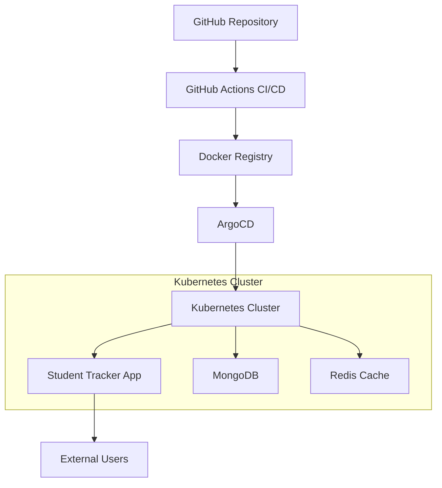

# 🎓 Student Tracker - Complete Student Management Platform

<div align="center">


**A comprehensive student management application with GitOps automation and containerized deployment**

[](http://18.206.89.183:30011)
[](http://18.206.89.183:30011/health)
[](http://18.206.89.183:30011/docs)
[](https://github.com/bonaventuresimeon/NativeSeries/actions/workflows/pipeline.yml)

</div>

---

## 📋 Table of Contents

- [🎯 Overview](#-overview)
- [🏗️ Architecture](#️-architecture)
- [🚀 Quick Start](#-quick-start)
- [📦 Installation](#-installation)
- [🔧 Development](#-development)
- [📊 Monitoring & Health](#-monitoring--health)
- [📚 API Documentation](#-api-documentation)
- [🛠️ Troubleshooting](#️-troubleshooting)
- [🤝 Contributing](#-contributing)
- [📄 License](#-license)

---

## 🎯 Overview

Student Tracker is a modern, cloud-native student management platform built with **FastAPI**, deployed on **Kubernetes** using **Helm**, and managed through **ArgoCD** for GitOps automation. The application provides comprehensive student tracking, progress monitoring, and administrative capabilities with enterprise-grade reliability and security.

### 🌟 Key Features

- **📚 Student Management**: Complete CRUD operations for student records
- **📈 Progress Tracking**: Weekly progress monitoring and analytics
- **🔐 Secure Authentication**: Vault-integrated secret management
- **📊 Real-time Monitoring**: Prometheus metrics and health checks
- **🚀 Auto-Deployment**: GitOps with ArgoCD for continuous deployment
- **🐳 Containerized**: Docker-based deployment with Kubernetes orchestration
- **⚡ High Performance**: Async FastAPI with optimized database queries
- **📱 Responsive UI**: Modern web interface with real-time updates

### 🌐 Live Application

- **Application**: [http://18.206.89.183:30011](http://18.206.89.183:30011)
- **API Documentation**: [http://18.206.89.183:30011/docs](http://18.206.89.183:30011/docs)
- **Health Check**: [http://18.206.89.183:30011/health](http://18.206.89.183:30011/health)
- **ArgoCD UI**: [http://18.206.89.183:30080](http://18.206.89.183:30080)

---

## 🏗️ Architecture

### System Architecture



### Technology Stack

#### **Backend**
- **FastAPI**: Modern, fast web framework for building APIs
- **Python 3.11**: Latest Python with enhanced performance
- **Pydantic**: Data validation using Python type annotations
- **Motor**: Async MongoDB driver for Python
- **Redis**: In-memory data structure store for caching

#### **Infrastructure**
- **Kubernetes**: Container orchestration platform
- **Docker**: Containerization platform
- **Helm**: Kubernetes package manager
- **ArgoCD**: GitOps continuous delivery tool
- **Kind**: Kubernetes in Docker for local development

#### **CI/CD & Monitoring**
- **GitHub Actions**: Automated CI/CD pipeline
- **Prometheus**: Metrics collection and monitoring
- **Grafana**: Metrics visualization and dashboards
- **Trivy**: Container vulnerability scanning

---

## 🚀 Quick Start

### Prerequisites
- Docker and Docker Compose
- Python 3.11+
- Git

### Local Development

```bash
# Clone the repository
git clone https://github.com/bonaventuresimeon/NativeSeries.git
cd NativeSeries

# Create and activate virtual environment
python3.11 -m venv venv
source venv/bin/activate  # On Windows: venv\Scripts\activate

# Install dependencies
pip install -r requirements.txt

# Run the application
uvicorn app.main:app --reload --host 0.0.0.0 --port 8000
```

The application will be available at:
- **Main App**: http://localhost:8000
- **API Docs**: http://localhost:8000/docs
- **Health Check**: http://localhost:8000/health

### Docker Quick Start

```bash
# Build and run with Docker
docker build -t student-tracker .
docker run -p 8000:8000 student-tracker

# Or use Docker Compose (if available)
docker-compose up -d
```

---

## 📦 Installation

For complete installation instructions including Kubernetes, Helm, ArgoCD, and production deployment, see:

### 📖 [**INSTALLATION.md**](INSTALLATION.md)

The installation guide covers:
- ✅ **Tool Installation**: Python, Docker, kubectl, Helm, Kind, ArgoCD
- ✅ **Cluster Setup**: Kubernetes cluster creation and configuration
- ✅ **Application Deployment**: Helm charts and ArgoCD setup
- ✅ **CI/CD Pipeline**: GitHub Actions configuration
- ✅ **Verification**: Complete testing and validation commands

---

## 🔧 Development

### Project Structure

```
student-tracker/
├── app/                    # FastAPI application
│   ├── main.py            # Application entry point
│   ├── models.py          # Data models
│   ├── crud.py            # Database operations
│   ├── database.py        # Database configuration
│   └── routes/            # API route handlers
├── helm-chart/            # Helm chart for Kubernetes deployment
├── argocd/               # ArgoCD application configurations
├── scripts/              # Deployment and utility scripts
├── tests/                # Test files
├── Dockerfile            # Container definition
├── requirements.txt      # Python dependencies
└── README.md            # This file
```

### Development Workflow

1. **Feature Development**
   ```bash
   # Create feature branch
   git checkout -b feature/new-feature
   
   # Make changes and test
   pytest app/test_*.py -v
   black app/
   flake8 app/
   
   # Commit and push
   git commit -m "Add new feature"
   git push origin feature/new-feature
   ```

2. **Pull Request**
   - Create PR to `main` branch
   - Automated tests run via GitHub Actions
   - Code review and approval required

3. **Deployment**
   - Merge to `main` triggers automatic deployment
   - ArgoCD syncs changes to Kubernetes cluster
   - Production deployment with health checks

### Running Tests

```bash
# Run all tests
pytest app/test_*.py -v

# Run with coverage
pytest app/test_*.py --cov=app --cov-report=html

# Run specific test file
pytest app/test_main.py -v

# Run linting and formatting
black app/
flake8 app/
```

---

## 📊 Monitoring & Health

### Health Endpoints

- **Health Check**: `/health` - Application health status
- **Metrics**: `/metrics` - Prometheus metrics
- **API Status**: `/docs` - Interactive API documentation

### Monitoring Stack

The application includes comprehensive monitoring:

- **Application Metrics**: Request latency, error rates, throughput
- **System Metrics**: CPU, memory, disk usage
- **Database Metrics**: Connection pool, query performance
- **Custom Metrics**: Student operations, progress tracking

### Health Check Response

```json
{
  "status": "healthy",
  "timestamp": "2024-01-01T12:00:00Z",
  "version": "1.0.0",
  "database": "connected",
  "cache": "connected"
}
```

---

## 📚 API Documentation

### Interactive Documentation

Visit the live API documentation:
- **Swagger UI**: [http://18.206.89.183:30011/docs](http://18.206.89.183:30011/docs)
- **ReDoc**: [http://18.206.89.183:30011/redoc](http://18.206.89.183:30011/redoc)

### Key API Endpoints

#### Students
- `GET /students` - List all students
- `POST /students` - Create new student
- `GET /students/{id}` - Get student by ID
- `PUT /students/{id}` - Update student
- `DELETE /students/{id}` - Delete student

#### Progress Tracking
- `GET /students/{id}/progress` - Get student progress
- `POST /students/{id}/progress` - Add progress entry
- `GET /analytics/progress` - Progress analytics

#### Health & Monitoring
- `GET /health` - Health check
- `GET /metrics` - Prometheus metrics
- `GET /version` - Application version

---

## 🛠️ Troubleshooting

### Common Issues

#### Application Won't Start
```bash
# Check logs
kubectl logs deployment/student-tracker -n student-tracker

# Check pod status
kubectl get pods -n student-tracker

# Describe pod for detailed info
kubectl describe pod <pod-name> -n student-tracker
```

#### Database Connection Issues
```bash
# Check database connectivity
kubectl exec -it deployment/student-tracker -n student-tracker -- python -c "from app.database import test_connection; test_connection()"

# Check environment variables
kubectl exec -it deployment/student-tracker -n student-tracker -- env | grep DATABASE
```

#### ArgoCD Sync Issues
```bash
# Check ArgoCD application status
kubectl get applications -n argocd

# Manual sync
argocd app sync student-tracker --server localhost:30080 --username admin --password "$(cat .argocd-password)" --insecure
```

### Getting Help

1. **Check the logs** first using the commands above
2. **Review the [Installation Guide](INSTALLATION.md)** for setup issues
3. **Check GitHub Issues** for known problems
4. **Create a new issue** with detailed error information

---

## 🤝 Contributing

We welcome contributions! Please see our contributing guidelines:

### How to Contribute

1. **Fork the repository**
2. **Create a feature branch**: `git checkout -b feature/amazing-feature`
3. **Make your changes** and add tests
4. **Run tests**: `pytest app/test_*.py -v`
5. **Check code quality**: `black app/ && flake8 app/`
6. **Commit changes**: `git commit -m 'Add amazing feature'`
7. **Push to branch**: `git push origin feature/amazing-feature`
8. **Open a Pull Request**

### Development Guidelines

- Follow PEP 8 style guidelines
- Add tests for new features
- Update documentation as needed
- Ensure all CI checks pass

---

## 📄 License

This project is licensed under the MIT License - see the [LICENSE](LICENSE) file for details.

---

<div align="center">

**🎓 Built with ❤️ for Education**

[](https://github.com/bonaventuresimeon/NativeSeries/stargazers)
[](https://github.com/bonaventuresimeon/NativeSeries/network/members)

</div>
