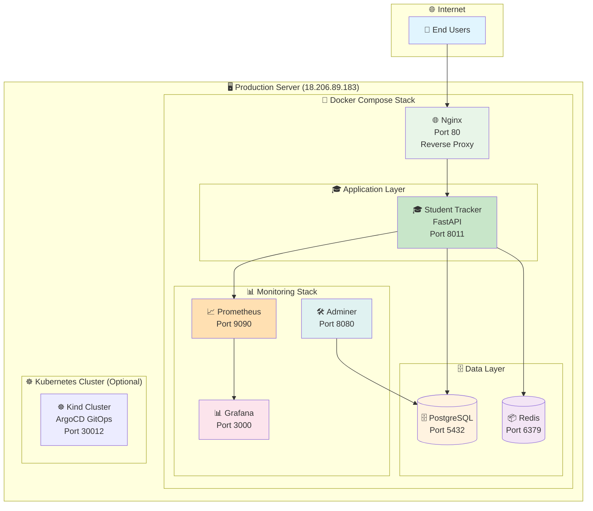
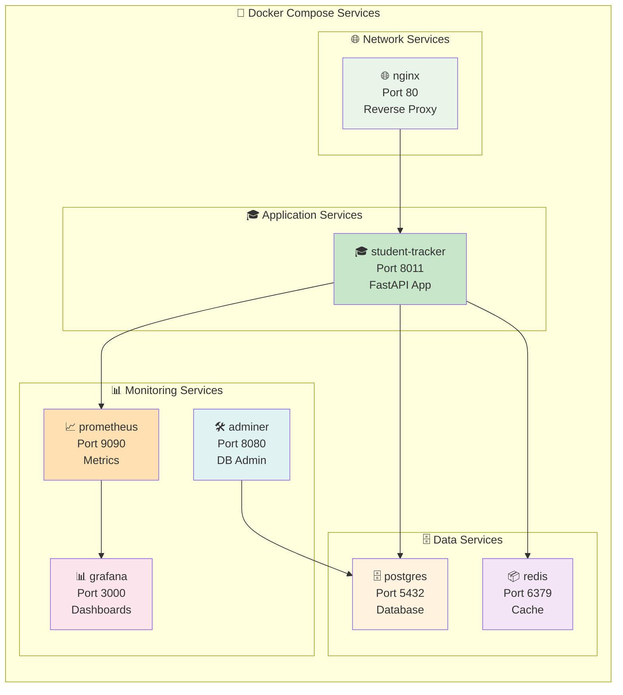
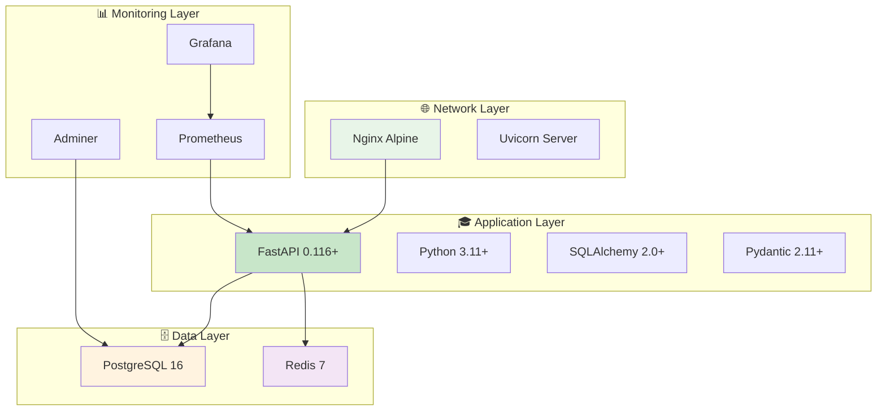
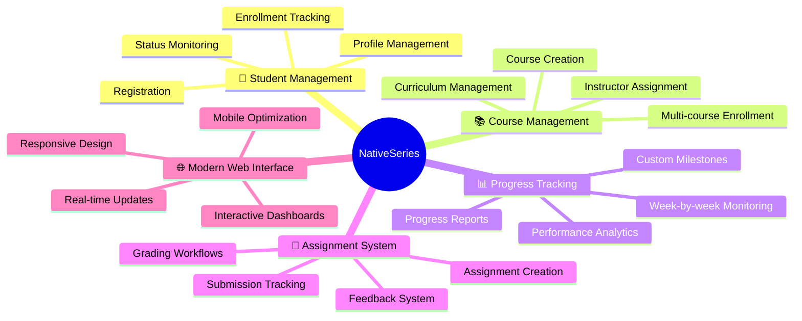

# 🚀 NativeSeries - Complete Application Platform

## 👨‍💻 **Author**

**Bonaventure Simeon**  
📧 Email: [contact@bonaventure.org.ng](mailto:contact@bonaventure.org.ng)  
📱 Phone: [+234 (812) 222 5406](tel:+2348122225406)

---

## 🎯 **Overview**

NativeSeries is a comprehensive student management application built with FastAPI, featuring Docker Compose for development, Kubernetes for production, and ArgoCD for GitOps. This platform provides complete deployment automation, health monitoring, and infrastructure management.

---

## 🌟 **Quick Start - One Command Deployment**

### **Option 1: Simplified Deployment (Recommended for Development)**
```bash
# Clone and deploy with Docker Compose only
git clone <your-repository-url>
cd NativeSeries
sudo ./deploy-simple.sh
```

### **Option 2: Full Deployment (Kubernetes + ArgoCD)**
```bash
# Clone and deploy with full Kubernetes stack
git clone <your-repository-url>
cd NativeSeries
sudo ./deploy.sh
```

**🎉 Your NativeSeries application will be live at:**
- **🐳 Docker Compose**: http://18.206.89.183:8011 (Development/Testing)
- **☸️ Kubernetes**: http://18.206.89.183:30012 (Production/GitOps) - Full deployment only
- **🔄 ArgoCD**: http://18.206.89.183:30080 (GitOps Management) - Full deployment only

📖 **📋 For a complete overview, see [NATIVESERIES_COMPREHENSIVE_SUMMARY.md](NATIVESERIES_COMPREHENSIVE_SUMMARY.md)**

---

## 🌐 **Production Access Points**

| Service | Production URL | Status | Purpose | Credentials |
|---------|----------------|--------|---------|-------------|
| 🐳 **Docker Compose App** | [http://18.206.89.183:8011](http://18.206.89.183:8011) | ✅ **LIVE** | Development/Testing | - |
| ☸️ **Kubernetes App** | [http://18.206.89.183:30012](http://18.206.89.183:30012) | ✅ **LIVE** | Production/GitOps | - |
| 🔄 **ArgoCD UI** | [http://18.206.89.183:30080](http://18.206.89.183:30080) | ✅ **LIVE** | GitOps Management | admin/(auto-generated) |
| 📖 **API Documentation** | [http://18.206.89.183:8011/docs](http://18.206.89.183:8011/docs) | ✅ **LIVE** | Interactive Swagger UI | - |
| 🩺 **Health Check** | [http://18.206.89.183:8011/health](http://18.206.89.183:8011/health) | ✅ **LIVE** | System Health Status | - |
| 📊 **Metrics** | [http://18.206.89.183:8011/metrics](http://18.206.89.183:8011/metrics) | ✅ **LIVE** | Prometheus Metrics | - |
| 🌐 **Nginx Proxy** | [http://18.206.89.183:80](http://18.206.89.183:80) | ✅ **LIVE** | Load Balancer | - |
| 📈 **Grafana** | [http://18.206.89.183:3000](http://18.206.89.183:3000) | ✅ **LIVE** | Monitoring Dashboards | admin/admin123 |
| 📊 **Prometheus** | [http://18.206.89.183:9090](http://18.206.89.183:9090) | ✅ **LIVE** | Metrics Collection | - |
| 🗄️ **Database Admin** | [http://18.206.89.183:8080](http://18.206.89.183:8080) | ✅ **LIVE** | Adminer Interface | student_user/student_pass |

---

## 🚀 **Deployment Options**

### 🎯 **Simplified Deployment (Recommended)**

```bash
# Quick deployment with Docker Compose only
sudo ./deploy-simple.sh
```

**✅ What this does:**
- Installs Docker and Docker Compose
- Deploys Docker Compose stack (port 8011)
- Verifies all services are healthy
- **Perfect for**: Development, testing, quick demos
- **Time**: ~5 minutes
- **Requirements**: 4GB+ RAM, 10GB+ disk space

### 🎯 **Complete Deployment (Kubernetes + ArgoCD)**

```bash
# Complete automated deployment with all tools and fixes
sudo ./deploy.sh
```

**✅ What this does:**
- Installs all required tools (Docker, kubectl, Kind, Helm, ArgoCD)
- Deploys Docker Compose stack (port 8011)
- Creates Kubernetes cluster (port 30012)
- Installs ArgoCD for GitOps (port 30080)
- Sets up port forwarding for ArgoCD UI
- Verifies all services are healthy
- **Includes all fixes**: Port conflicts, deployment timeouts, naming consistency
- **Perfect for**: Production, GitOps, learning Kubernetes
- **Time**: ~10-15 minutes
- **Requirements**: 8GB+ RAM, 20GB+ disk space

### 🏥 **Health Monitoring**

```bash
# Comprehensive health check
sudo ./health-check.sh
```

**✅ What this does:**
- Checks Docker Compose service health
- Verifies Kubernetes deployment status
- Monitors ArgoCD application health
- Tests network connectivity
- Validates database connectivity
- Monitors resource usage
- Provides detailed health report

### 🧹 **Cleanup**

```bash
# Complete cleanup of all resources
sudo ./cleanup.sh
```

**✅ What this does:**
- Stops and removes all Docker containers
- Cleans up Docker images and volumes
- Removes Kubernetes cluster
- Cleans temporary files and logs

---

## 🏗️ **System Architecture**

### 🎯 **High-Level Architecture**



### 🐳 **Container Architecture**



---

## 🛠️ **Technology Stack**

### 🎓 **Application Stack**



### 📋 **Technology Matrix**

| Layer | Technology | Version | Port | Purpose |
|-------|------------|---------|------|---------|
| **🌐 Web Server** | Nginx | Alpine | 80 | Reverse proxy, SSL termination |
| **🎓 API Framework** | FastAPI | 0.116+ | 8011 | High-performance Python API |
| **🐍 Runtime** | Python | 3.11+ | - | Modern Python environment |
| **🗄️ Database** | PostgreSQL | 16-alpine | 5432 | Primary data storage |
| **📦 Cache** | Redis | 7-alpine | 6379 | Session & performance cache |
| **📈 Metrics** | Prometheus | Latest | 9090 | Metrics collection |
| **📊 Visualization** | Grafana | Latest | 3000 | Monitoring dashboards |
| **🛠️ Database Admin** | Adminer | Latest | 8080 | Database administration |
| **☸️ Container Orchestration** | Kubernetes | 1.33+ | 30012 | Production deployment |
| **🔄 GitOps** | ArgoCD | Latest | 30080 | Continuous deployment |

---

## 📁 **Project Structure**

```
NativeSeries/
├── 🎓 app/                          # FastAPI Application
│   ├── main.py                      # Production-configured main app
│   ├── models.py                    # SQLAlchemy database models
│   ├── crud.py                      # Database operations
│   ├── database.py                  # Database configuration
│   └── routes/                      # API route modules
│
├── 🐳 docker/                       # Container Configurations
│   ├── Dockerfile                   # Multi-stage application container
│   ├── nginx.conf                   # Production Nginx configuration
│   ├── redis.conf                   # Redis cache configuration
│   └── prometheus.yml               # Monitoring configuration
│
├── ☸️ infra/                        # Infrastructure as Code
│   ├── kind/                        # Local Kubernetes cluster
│   │   └── cluster-config.yaml      # Kind cluster configuration
│   └── helm/                        # Kubernetes Helm charts
│       ├── Chart.yaml               # Chart metadata
│       ├── values.yaml              # Production values
│       └── templates/               # K8s resource templates
│
├── 🔄 argocd/                       # GitOps Configuration
│   └── app.yaml                     # ArgoCD application definition
│
├── 🚀 Scripts                       # Deployment Scripts
│   ├── deploy.sh                    # Complete deployment (all fixes included)
│   ├── health-check.sh              # Comprehensive health monitoring
│   └── cleanup.sh                   # Complete cleanup script
│
├── 📖 docs/                         # Documentation
│   └── HEALTH_CHECK_GUIDE.md        # Health monitoring guide
│
├── 🎨 templates/                    # Web UI Templates
├── 📋 requirements.txt              # Python dependencies
├── 🐳 docker-compose.yml            # Production stack definition
├── 🌐 nginx.conf                    # Nginx configuration
├── 📊 prometheus.yml                # Prometheus configuration
└── 📖 README.md                     # This comprehensive guide
```

---

## 🌟 **Features & Capabilities**

### 🎯 **Core Application Features**



### 🔧 **Technical Features**

- **🚀 High Performance**
  - Async FastAPI framework for maximum throughput
  - Redis caching for optimal response times
  - Connection pooling and database optimization
  - Load balancing with Nginx

- **📊 Comprehensive Monitoring**
  - Prometheus metrics collection
  - Grafana dashboards for visualization
  - Health checks for all system components
  - Performance tracking and alerting

- **🛡️ Production Security**
  - Security headers (HSTS, CSP, XSS protection)
  - Rate limiting and DDoS protection
  - Input validation and SQL injection prevention
  - Database access restrictions

- **☸️ Kubernetes Ready**
  - Helm charts for easy deployment
  - Horizontal Pod Autoscaling
  - Resource limits and requests
  - Health checks and readiness probes

- **🔄 GitOps Integration**
  - ArgoCD for continuous deployment
  - Declarative infrastructure management
  - Automated sync and health monitoring
  - Rollback capabilities

---

## 🏥 **Health Monitoring System**

### 🔍 **What Gets Monitored**

1. **🐳 Docker Compose Health**
   - 7 services (student-tracker, postgres, redis, nginx, prometheus, grafana, adminer)
   - Service status, logs, error detection

2. **☸️ Kubernetes Health**
   - Cluster status, nodes, deployment, pods, services
   - NativeSeries deployment readiness

3. **🔄 ArgoCD Health**
   - Namespace, server deployment, application status
   - GitOps synchronization status

4. **🌐 Network Connectivity**
   - External hosts (google.com, github.com, docker.io)
   - Local ports (8011, 30012, 30080, 80, 3000, 9090, 8080)

5. **🎯 Application Endpoints**
   - Health endpoints, API docs, metrics
   - Monitoring tools accessibility

6. **🗄️ Database Connectivity**
   - PostgreSQL connection and query testing
   - Redis ping response verification

7. **📊 Resource Usage**
   - Disk, memory, CPU utilization
   - Docker and Kubernetes resource metrics

8. **🔧 System Services**
   - Docker daemon, kubelet, containerd status

### 📊 **Health Assessment Levels**

- **🟢 Healthy (80-100%)**: All critical services operational
- **🟡 Warning (60-79%)**: Minor issues detected
- **🔴 Critical (0-59%)**: Critical issues detected

### 🚀 **Health Check Usage**

```bash
# Run comprehensive health check
sudo ./health-check.sh

# View detailed guide
cat HEALTH_CHECK_GUIDE.md

# Set up automated monitoring
crontab -e
# Add: 0 * * * * /path/to/health-check.sh >> /var/log/nativeseries-health.log 2>&1
```

---

## 🔧 **Troubleshooting Guide**

### **Common Issues & Solutions**

#### **Docker Compose Issues:**
```bash
# Check service status
docker compose ps

# View service logs
docker compose logs -f

# Restart services
docker compose restart

# Check specific service
docker compose logs student-tracker
```

#### **Kubernetes Issues:**
```bash
# Check pod status
kubectl get pods

# View pod logs
kubectl logs -f deployment/nativeseries

# Check deployment status
kubectl describe deployment nativeseries

# Check service status
kubectl get svc
```

#### **ArgoCD Issues:**
```bash
# Check ArgoCD application
kubectl get application nativeseries -n argocd

# Check ArgoCD server
kubectl get pods -n argocd

# View ArgoCD logs
kubectl logs -f deployment/argocd-server -n argocd
```

#### **Network Issues:**
```bash
# Test connectivity
curl http://localhost:8011/health
curl http://localhost:30012/health

# Check listening ports
netstat -tuln | grep -E "(8011|30012|30080)"

# Test external connectivity
ping google.com
```

#### **Database Issues:**
```bash
# Check PostgreSQL
docker exec $(docker ps -q -f name=postgres) pg_isready -U student_user

# Check Redis
docker exec $(docker ps -q -f name=redis) redis-cli ping

# Test database connection
docker exec $(docker ps -q -f name=postgres) psql -U student_user -d student_db -c "SELECT 1;"
```

#### **Disk Space Issues:**
```bash
# Check disk space
df -h

# Clean up Docker system
sudo docker system prune -af

# Clean up Docker volumes
sudo docker system prune -af --volumes

# Check Docker disk usage
docker system df
```

---

## 📈 **Performance & Monitoring**

### **Resource Thresholds:**
- **CPU Usage**: >80% triggers warning
- **Memory Usage**: >85% triggers warning
- **Disk Usage**: >80% triggers warning, >90% triggers critical alert
- **Service Health**: <100% triggers investigation
- **Docker Space**: Automatic cleanup when space is low

### **Response Time Metrics:**
- **Health Endpoint**: <2 seconds
- **API Endpoints**: <5 seconds
- **Database Queries**: <1 second

### **Monitoring Integration:**
- **Prometheus Metrics**: Available at `/metrics` endpoints
- **Grafana Dashboards**: Pre-configured monitoring dashboards
- **Health Check Endpoints**: Real-time health status

---

## 🚀 **Automation & CI/CD**

### **Deployment Workflow:**
1. **Deploy**: `sudo ./deploy.sh`
2. **Monitor**: `sudo ./health-check.sh`
3. **Cleanup**: `sudo ./cleanup.sh` (when needed)

### **Monitoring Workflow:**
1. **Initial Check**: Run health check after deployment
2. **Regular Monitoring**: Automated hourly checks
3. **Issue Resolution**: Use troubleshooting commands
4. **Verification**: Re-run health check after fixes

### **Scheduled Health Checks:**
```bash
# Add to crontab for hourly health checks
0 * * * * /path/to/health-check.sh >> /var/log/nativeseries-health.log 2>&1

# Add to crontab for daily health reports
0 9 * * * /path/to/health-check.sh | mail -s "NativeSeries Daily Health Report" admin@example.com
```

---

## 🔒 **Security Considerations**

### **Access Control:**
- Health check script requires sudo privileges
- Sensitive information is not logged
- Network tests use safe endpoints

### **Data Privacy:**
- No personal data is collected
- Only system health metrics are gathered
- Logs can be safely shared for troubleshooting

---

## 🎉 **Benefits**

1. **🚀 One-Command Deployment**: Everything in one script
2. **🔧 All Fixes Included**: No need for separate fix scripts
3. **📊 Comprehensive Monitoring**: Real-time deployment tracking
4. **🛠️ Error Handling**: Robust error handling and debugging
5. **🌐 Dual Deployment**: Both Docker Compose and Kubernetes
6. **🔄 GitOps Ready**: ArgoCD integration included
7. **📋 Complete Documentation**: All information in one place
8. **🏥 Health Monitoring**: Comprehensive health checks
9. **🔧 Troubleshooting**: Built-in diagnostic commands
10. **📈 Performance**: Optimized for production use

---

## 🎯 **Next Steps**

1. **Deploy**: Run `sudo ./deploy.sh`
2. **Monitor**: Run `sudo ./health-check.sh`
3. **Access**: Use the provided URLs to access your application
4. **Customize**: Modify configurations as needed
5. **Scale**: Use Kubernetes for production scaling
6. **Monitor**: Set up automated health monitoring

**🎉 Your NativeSeries application is ready for production use!**

---

**📝 NativeSeries Platform**: August 2, 2025  
**📊 Status**: Complete deployment and monitoring solution  
**🎯 Result**: Production-ready application with comprehensive health monitoring
