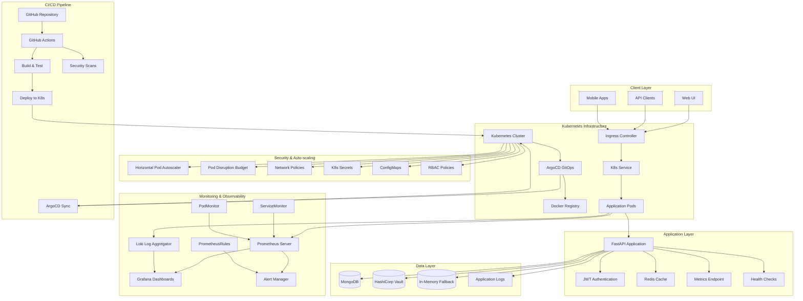
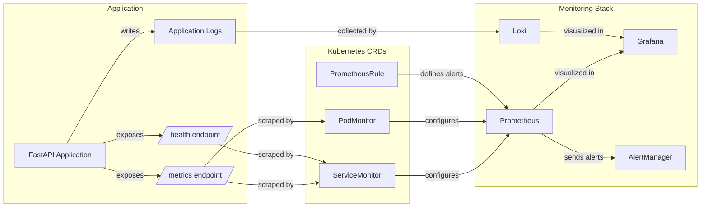
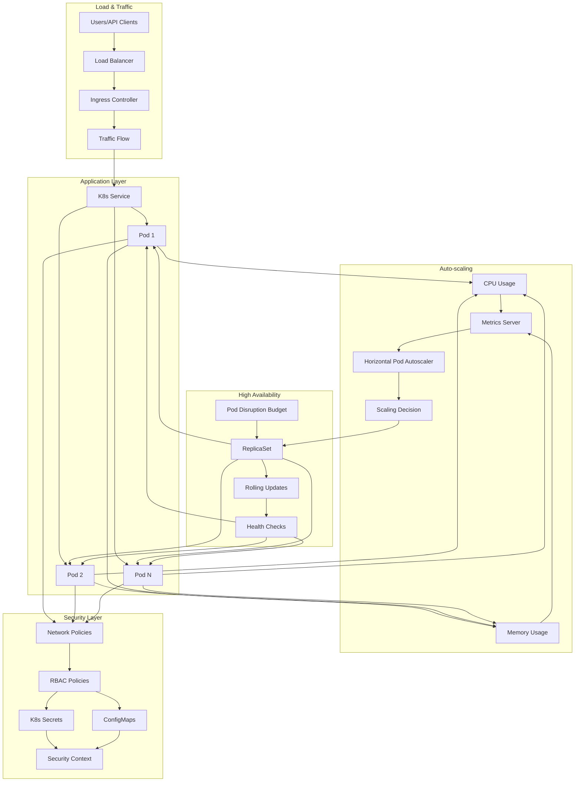

# NativeSeries - Enterprise-Grade Kubernetes Application Platform

[](https://kubernetes.io/)
[](https://www.docker.com/)
[](https://fastapi.tiangolo.com/)
[](https://prometheus.io/)
[](https://grafana.com/)
[](https://argoproj.github.io/argo-cd/)
[](https://helm.sh/)

## 📋 Table of Contents

- [Overview](#overview)
- [Key Features](#key-features)
- [Architecture](#architecture)
- [Technology Stack](#technology-stack)
- [Quick Start](#quick-start)
- [Installation](#installation)
- [Configuration](#configuration)
- [Monitoring & Observability](#monitoring--observability)
- [Security & Auto-scaling](#security--auto-scaling)
- [Development](#development)
- [Production Deployment](#production-deployment)
- [API Documentation](#api-documentation)
- [Troubleshooting](#troubleshooting)
- [Contributing](#contributing)

## 🎯 Overview

NativeSeries is a comprehensive, enterprise-grade application platform built on Kubernetes that demonstrates modern DevOps practices, GitOps workflows, and full-stack observability. This platform serves as a complete reference implementation for deploying scalable, secure, and observable applications in production environments.

### Core Objectives

- **Production-Ready Infrastructure**: Complete Kubernetes deployment with monitoring, logging, and security
- **GitOps Implementation**: Automated deployment using ArgoCD and Helm
- **Full Observability**: Integrated Prometheus, Grafana, and Loki for comprehensive monitoring
- **Security-First Design**: Secrets management, network policies, and RBAC implementation
- **Auto-scaling Capabilities**: Horizontal Pod Autoscaler with intelligent scaling policies
- **High Availability**: Pod Disruption Budgets and health checks for reliability

## ✨ Key Features

### 🚀 **Core Application**
- **FastAPI Backend**: High-performance REST API with automatic documentation
- **MongoDB Integration**: Scalable document database with connection pooling
- **Redis Caching**: In-memory caching for improved performance
- **JWT Authentication**: Secure token-based authentication system
- **Comprehensive API**: CRUD operations with validation and error handling

### 🔍 **Monitoring & Observability**
- **Prometheus Metrics**: Custom application metrics and Kubernetes monitoring
- **Grafana Dashboards**: Real-time visualization and alerting
- **Loki Log Aggregation**: Centralized log collection and querying
- **Custom Alert Rules**: Application-specific monitoring and alerting
- **Service Monitoring**: Automatic service discovery and monitoring

### 🛡️ **Security & Configuration**
- **Kubernetes Secrets**: Secure credential management
- **ConfigMaps**: Environment-specific configuration
- **Network Policies**: Traffic control and security
- **RBAC Implementation**: Role-based access control
- **Security Contexts**: Pod and container security policies

### ⚡ **Auto-scaling & High Availability**
- **Horizontal Pod Autoscaler**: CPU and memory-based scaling
- **Pod Disruption Budget**: Ensures minimum availability during updates
- **Health Checks**: Liveness and readiness probes
- **Resource Limits**: CPU and memory constraints
- **Rolling Updates**: Zero-downtime deployments

## 🏗️ Architecture

### System Architecture



### Monitoring Architecture



### Auto-scaling & Security Architecture



## 🛠️ Technology Stack

### Backend Technologies
- **FastAPI**: Modern, high-performance web framework for building APIs
- **Python 3.11+**: Latest Python features and performance improvements
- **Pydantic**: Data validation and settings management
- **Uvicorn**: ASGI server for production deployment

### Database & Caching
- **MongoDB**: Document-oriented NoSQL database
- **Redis**: In-memory data structure store for caching
- **Motor**: Async MongoDB driver for Python

### Containerization & Orchestration
- **Docker**: Containerization platform
- **Kubernetes**: Container orchestration platform
- **Helm**: Kubernetes package manager
- **Kind**: Kubernetes in Docker for local development

### CI/CD & GitOps
- **GitHub Actions**: Automated CI/CD pipeline
- **ArgoCD**: GitOps continuous delivery tool
- **Docker Hub**: Container registry

### Monitoring & Observability
- **Prometheus**: Metrics collection and monitoring
- **Grafana**: Data visualization and dashboards
- **Loki**: Log aggregation system
- **AlertManager**: Alert routing and notification

### Security & Configuration
- **Kubernetes Secrets**: Secure credential storage
- **ConfigMaps**: Configuration management
- **Network Policies**: Traffic control
- **RBAC**: Role-based access control
- **HashiCorp Vault**: Secrets management (optional)

### Auto-scaling & High Availability
- **Horizontal Pod Autoscaler**: Automatic scaling
- **Pod Disruption Budget**: Availability guarantees
- **Health Checks**: Liveness and readiness probes
- **Resource Limits**: CPU and memory constraints

## 🚀 Quick Start

### Prerequisites

- **Docker**: Version 20.10 or higher
- **Kind**: Version 0.20 or higher
- **kubectl**: Version 1.28 or higher
- **Helm**: Version 3.12 or higher
- **System Resources**: Minimum 8GB RAM, 4 CPU cores, 20GB storage

### Automated Installation

```bash
# Clone the repository
git clone https://github.com/your-username/nativeseries.git
cd nativeseries

# Run the complete installation script
chmod +x scripts/install-all.sh
./scripts/install-all.sh
```

### Manual Installation

```bash
# 1. Create Kubernetes cluster
kind create cluster --config infra/kind/cluster-config.yaml

# 2. Install ArgoCD
kubectl create namespace argocd
kubectl apply -n argocd -f https://raw.githubusercontent.com/argoproj/argo-cd/stable/manifests/install.yaml

# 3. Deploy application with Helm
helm install nativeseries ./helm-chart \
  --namespace default \
  --set monitoring.enabled=true \
  --set logging.enabled=true \
  --set hpa.enabled=true \
  --set networkPolicy.enabled=true
```

## 📦 Installation

### Complete Setup Process

The installation process includes the following components:

1. **Kubernetes Cluster Setup**
   - Kind cluster creation with custom configuration
   - Namespace creation (default, monitoring, logging)
   - Resource allocation and port mapping

2. **Application Deployment**
   - Helm chart deployment with all features enabled
   - Secrets and ConfigMaps creation
   - Service and ingress configuration

3. **Monitoring Stack Installation**
   - Prometheus and Grafana deployment
   - Loki log aggregation setup
   - Custom dashboards and alert rules

4. **Security & Auto-scaling Configuration**
   - Network policies implementation
   - HPA and PDB configuration
   - RBAC and security contexts

### Verification Steps

```bash
# Check application status
kubectl get pods -n default
kubectl get services -n default

# Verify monitoring stack
kubectl get pods -n monitoring
kubectl get pods -n logging

# Test application endpoints
curl http://localhost:30080/health
curl http://localhost:30080/metrics
```

## ⚙️ Configuration

### Environment Variables

| Variable | Description | Default Value |
|----------|-------------|---------------|
| `MONGODB_URL` | MongoDB connection string | `mongodb://localhost:27017` |
| `REDIS_URL` | Redis connection string | `redis://localhost:6379` |
| `JWT_SECRET` | JWT signing secret | `your-secret-key` |
| `LOG_LEVEL` | Application log level | `INFO` |
| `API_PORT` | Application port | `8000` |

### Helm Chart Configuration

```yaml
# Application Configuration
replicaCount: 3
image:
  repository: your-registry/nativeseries
  tag: latest
  pullPolicy: IfNotPresent

# Resource Management
resources:
  requests:
    cpu: 100m
    memory: 128Mi
  limits:
    cpu: 500m
    memory: 512Mi

# Auto-scaling Configuration
hpa:
  enabled: true
  minReplicas: 2
  maxReplicas: 10
  targetCPUUtilizationPercentage: 70
  targetMemoryUtilizationPercentage: 80

# Monitoring Configuration
monitoring:
  enabled: true
  serviceMonitor:
    enabled: true
    path: /metrics
    interval: 30s
  prometheusRules:
    enabled: true

# Security Configuration
security:
  networkPolicy:
    enabled: true
  secrets:
    enabled: true
  configMaps:
    enabled: true
```

## 📊 Monitoring & Observability

### Prometheus Metrics

The application exposes custom metrics for comprehensive monitoring:

```python
# Custom application metrics
http_requests_total{method="GET", endpoint="/api/items"}
http_request_duration_seconds{method="POST", endpoint="/api/items"}
database_connections_active
cache_hit_ratio
```

### Grafana Dashboards

Pre-configured dashboards provide insights into:

- **Application Performance**: Request rates, response times, error rates
- **Resource Utilization**: CPU, memory, and network usage
- **Database Metrics**: Connection pools, query performance
- **Cache Performance**: Hit ratios and eviction rates
- **Kubernetes Metrics**: Pod status, scaling events

### Loki Log Aggregation

Centralized log collection with LogQL queries:

```logql
# Application logs
{app="nativeseries", namespace="default"}

# Error logs
{app="nativeseries", level="ERROR"}

# Performance logs
{app="nativeseries", component="database"}
```

### Alert Rules

Custom Prometheus alert rules for proactive monitoring:

```yaml
# Application down alert
- alert: AppDown
  expr: up{app="nativeseries"} == 0
  for: 1m
  labels:
    severity: critical
  annotations:
    summary: "Application is down"

# High CPU usage alert
- alert: HighCPUUsage
  expr: container_cpu_usage_seconds_total{container="nativeseries"} > 0.8
  for: 5m
  labels:
    severity: warning
  annotations:
    summary: "High CPU usage detected"
```

### Access URLs

| Component | URL | Credentials |
|-----------|-----|-------------|
| Application | http://localhost:30080 | N/A |
| Grafana | http://localhost:30081 | admin/admin |
| Prometheus | http://localhost:30082 | N/A |
| Loki | http://localhost:30083 | N/A |
| ArgoCD | http://localhost:30084 | admin/argocd-server |

## 🛡️ Security & Auto-scaling

### Secrets Management

Kubernetes secrets provide secure credential storage:

```yaml
# Database credentials
apiVersion: v1
kind: Secret
metadata:
  name: nativeseries-db-secret
type: Opaque
data:
  username: <base64-encoded>
  password: <base64-encoded>
```

### Network Security

Network policies control traffic flow:

```yaml
# Ingress traffic control
apiVersion: networking.k8s.io/v1
kind: NetworkPolicy
metadata:
  name: nativeseries-network-policy
spec:
  podSelector:
    matchLabels:
      app: nativeseries
  policyTypes:
  - Ingress
  - Egress
  ingress:
  - from:
    - namespaceSelector:
        matchLabels:
          name: ingress-nginx
    ports:
    - protocol: TCP
      port: 8000
```

### Auto-scaling Configuration

Horizontal Pod Autoscaler with intelligent scaling:

```yaml
apiVersion: autoscaling/v2
kind: HorizontalPodAutoscaler
metadata:
  name: nativeseries-hpa
spec:
  scaleTargetRef:
    apiVersion: apps/v1
    kind: Deployment
    name: nativeseries
  minReplicas: 2
  maxReplicas: 10
  metrics:
  - type: Resource
    resource:
      name: cpu
      target:
        type: Utilization
        averageUtilization: 70
  - type: Resource
    resource:
      name: memory
      target:
        type: Utilization
        averageUtilization: 80
  behavior:
    scaleDown:
      stabilizationWindowSeconds: 300
      policies:
      - type: Percent
        value: 10
        periodSeconds: 60
```

### High Availability Features

- **Pod Disruption Budget**: Ensures minimum availability during voluntary disruptions
- **Health Checks**: Liveness and readiness probes for automatic recovery
- **Rolling Updates**: Zero-downtime deployments with configurable strategies
- **Resource Limits**: Prevents resource exhaustion and ensures fair scheduling

## 🧪 Development

### Local Development Setup

```bash
# Clone repository
git clone https://github.com/your-username/nativeseries.git
cd nativeseries

# Install dependencies
pip install -r requirements.txt

# Run application locally
uvicorn main:app --reload --host 0.0.0.0 --port 8000
```

### Testing

```bash
# Run unit tests
pytest tests/

# Run integration tests
pytest tests/integration/

# Test monitoring setup
./scripts/test-monitoring.sh

# Load testing for HPA
kubectl run load-test --image=busybox --rm -it --restart=Never -- \
  sh -c "while true; do wget -qO- http://nativeseries-service:8000/health; sleep 0.1; done"
```

### Code Quality

```bash
# Linting
flake8 .
black .
isort .

# Type checking
mypy .

# Security scanning
bandit -r .
```

## 🚀 Production Deployment

### Production Checklist

- [ ] **Security Configuration**
  - [ ] Secrets properly configured
  - [ ] Network policies applied
  - [ ] RBAC policies implemented
  - [ ] Security contexts configured

- [ ] **Monitoring Setup**
  - [ ] Prometheus metrics collection
  - [ ] Grafana dashboards configured
  - [ ] Alert rules defined
  - [ ] Log aggregation working

- [ ] **Auto-scaling Configuration**
  - [ ] HPA properly configured
  - [ ] Resource limits set
  - [ ] Health checks implemented
  - [ ] PDB configured

- [ ] **High Availability**
  - [ ] Multiple replicas deployed
  - [ ] Rolling update strategy
  - [ ] Backup and recovery procedures
  - [ ] Disaster recovery plan

### Deployment Commands

```bash
# Production deployment
helm install nativeseries ./helm-chart \
  --namespace production \
  --set replicaCount=3 \
  --set monitoring.enabled=true \
  --set logging.enabled=true \
  --set hpa.enabled=true \
  --set networkPolicy.enabled=true \
  --set security.secrets.enabled=true \
  --set security.configMaps.enabled=true

# Verify deployment
kubectl get pods -n production
kubectl get hpa -n production
kubectl get networkpolicies -n production
```

## 📚 API Documentation

### Health Endpoints

```bash
# Application health
GET /health
Response: {"status": "healthy", "timestamp": "2024-01-01T00:00:00Z"}

# Metrics endpoint
GET /metrics
Response: Prometheus-formatted metrics

# Readiness probe
GET /ready
Response: {"status": "ready"}
```

### Core API Endpoints

```bash
# Authentication
POST /auth/login
POST /auth/refresh
POST /auth/logout

# CRUD Operations
GET /api/items
POST /api/items
GET /api/items/{item_id}
PUT /api/items/{item_id}
DELETE /api/items/{item_id}

# Search and Filtering
GET /api/items?search={query}&page={page}&limit={limit}
```

### API Response Format

```json
{
  "success": true,
  "data": {
    "id": "item_123",
    "name": "Sample Item",
    "description": "Item description",
    "created_at": "2024-01-01T00:00:00Z",
    "updated_at": "2024-01-01T00:00:00Z"
  },
  "message": "Item retrieved successfully",
  "timestamp": "2024-01-01T00:00:00Z"
}
```

## 🔧 Troubleshooting

### Common Issues

#### Application Not Starting

```bash
# Check pod status
kubectl get pods -n default
kubectl describe pod <pod-name>

# Check logs
kubectl logs <pod-name> -n default
kubectl logs <pod-name> -n default --previous

# Check events
kubectl get events -n default --sort-by='.lastTimestamp'
```

#### Monitoring Issues

```bash
# Check Prometheus targets
kubectl port-forward svc/prometheus-kube-prometheus-prometheus 9090:9090 -n monitoring

# Check Grafana connectivity
kubectl port-forward svc/grafana 3000:80 -n monitoring

# Verify ServiceMonitor
kubectl get servicemonitor -n default
kubectl describe servicemonitor nativeseries-monitor
```

#### Auto-scaling Issues

```bash
# Check HPA status
kubectl get hpa -n default
kubectl describe hpa nativeseries-hpa

# Check metrics server
kubectl top pods -n default
kubectl top nodes

# Test scaling
kubectl run load-test --image=busybox --rm -it --restart=Never -- \
  sh -c "while true; do wget -qO- http://nativeseries-service:8000/health; sleep 0.1; done"
```

### Performance Optimization

#### Database Optimization

```python
# Connection pooling
MONGODB_URL = "mongodb://localhost:27017/?maxPoolSize=10&minPoolSize=5"

# Index optimization
db.items.create_index([("name", 1)])
db.items.create_index([("created_at", -1)])
```

#### Caching Strategy

```python
# Redis caching
@cache(expire=300)  # 5 minutes
async def get_item(item_id: str):
    return await db.items.find_one({"_id": item_id})
```

#### Resource Optimization

```yaml
# Resource requests and limits
resources:
  requests:
    cpu: 100m
    memory: 128Mi
  limits:
    cpu: 500m
    memory: 512Mi
```

## 🤝 Contributing

### Development Workflow

1. **Fork the Repository**
   ```bash
   git clone https://github.com/your-username/nativeseries.git
   cd nativeseries
   ```

2. **Create Feature Branch**
   ```bash
   git checkout -b feature/your-feature-name
   ```

3. **Make Changes**
   - Follow coding standards
   - Add tests for new features
   - Update documentation

4. **Test Changes**
   ```bash
   # Run tests
   pytest tests/
   
   # Test monitoring
   ./scripts/test-monitoring.sh
   
   # Build and test locally
   docker build -t nativeseries:test .
   ```

5. **Submit Pull Request**
   - Provide clear description
   - Include test results
   - Update documentation

### Code Standards

- **Python**: PEP 8 compliance, type hints, docstrings
- **YAML**: Consistent indentation, clear structure
- **Documentation**: Clear, concise, and up-to-date
- **Testing**: Minimum 80% code coverage

### Testing Guidelines

```bash
# Unit tests
pytest tests/unit/ -v

# Integration tests
pytest tests/integration/ -v

# End-to-end tests
pytest tests/e2e/ -v

# Performance tests
pytest tests/performance/ -v
```

## 📄 License

This project is licensed under the MIT License - see the [LICENSE](LICENSE) file for details.

## 🙏 Acknowledgments

- **Kubernetes Community**: For the excellent orchestration platform
- **Prometheus Team**: For comprehensive monitoring solutions
- **Grafana Labs**: For powerful visualization tools
- **ArgoCD Team**: For GitOps implementation
- **FastAPI Community**: For the modern web framework
- **Open Source Contributors**: For continuous improvements

## 📞 Support

For support and questions:

- **Documentation**: [Project Wiki](https://github.com/your-username/nativeseries/wiki)
- **Issues**: [GitHub Issues](https://github.com/your-username/nativeseries/issues)
- **Discussions**: [GitHub Discussions](https://github.com/your-username/nativeseries/discussions)
- **Email**: support@nativeseries.com

---

**NativeSeries** - Enterprise-Grade Kubernetes Application Platform

*Built with ❤️ for modern DevOps practices and production excellence.*