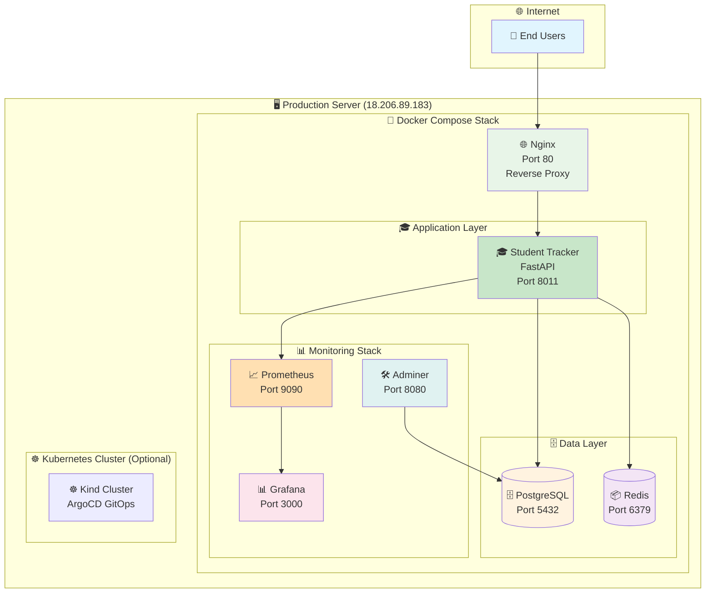
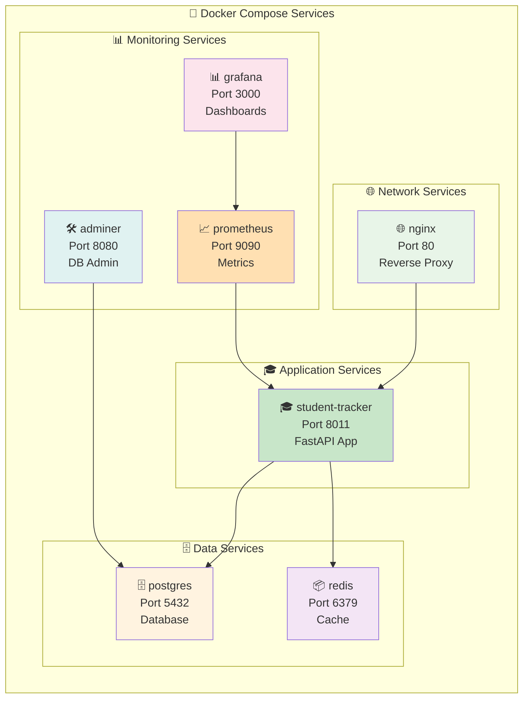
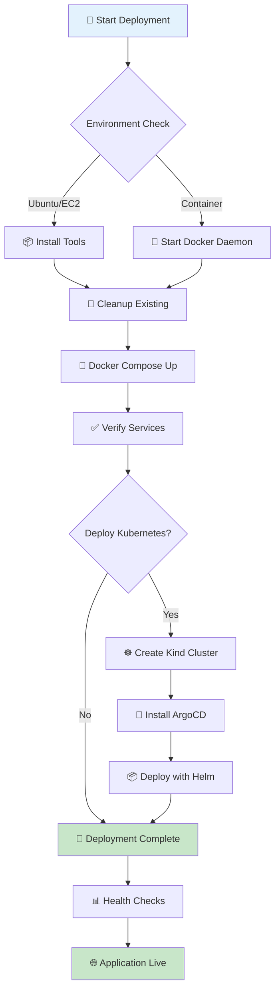
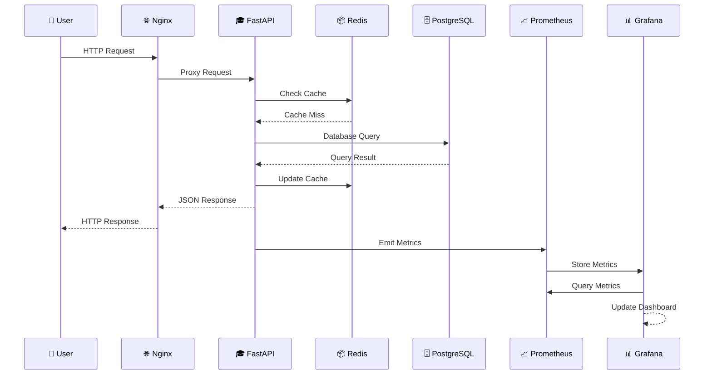
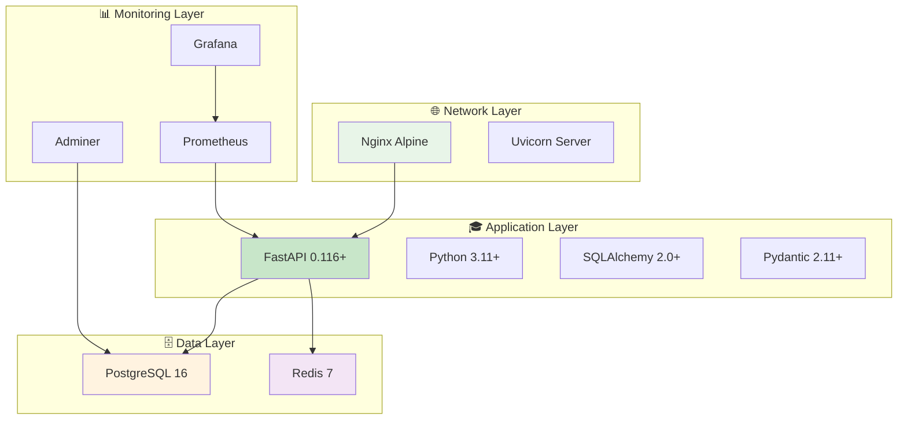
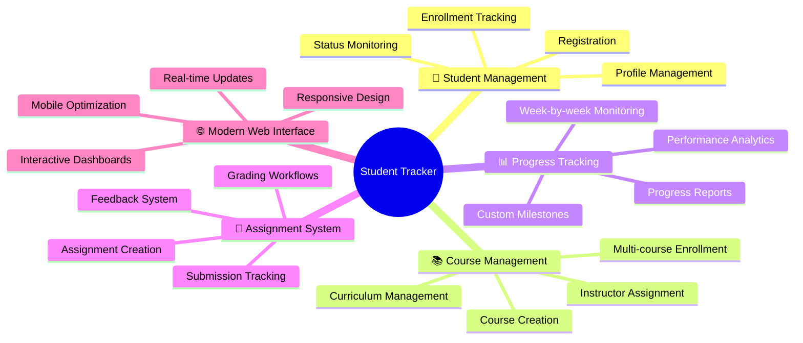
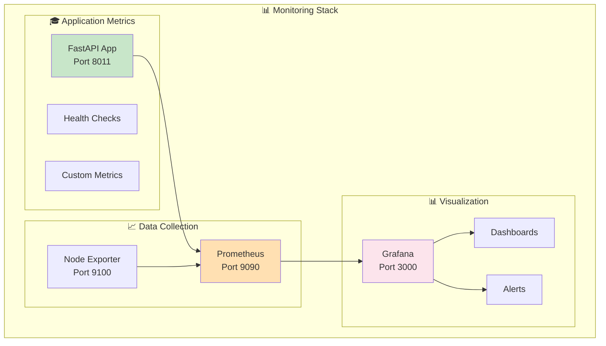
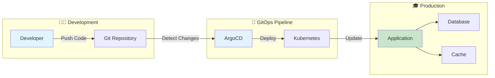
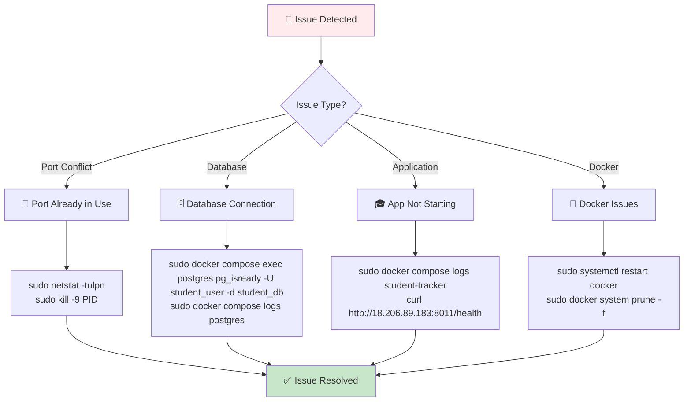

# 🎓 Student Tracker - Cloud-Native Production Application

[](http://18.206.89.183:8011)
[](https://fastapi.tiangolo.com)
[](https://docker.com)
[](https://kubernetes.io)
[](https://argoproj.github.io/argo-cd/)
[](https://postgresql.org)
[](https://redis.io)

**🚀 LIVE PRODUCTION:** [http://18.206.89.183:8011](http://18.206.89.183:8011)

A production-ready, cloud-native student tracking application demonstrating modern DevOps practices, containerization, monitoring, and scalable architecture. Built with FastAPI and deployed with Docker, Kubernetes, and ArgoCD GitOps.

---

## 🌟 **Quick Start - One Command Deployment**

```bash
# Clone and deploy in one command
git clone <your-repository-url>
cd student-tracker
sudo ./deploy.sh
```

**🎉 Your application will be live at: http://18.206.89.183:8011**

---

## 🌐 **Production Access Points**

| Service | Production URL | Status | Purpose | Credentials |
|---------|----------------|--------|---------|-------------|
| 🎓 **Main Application** | [http://18.206.89.183:8011](http://18.206.89.183:8011) | ✅ **LIVE** | Student Tracker Interface | - |
| 📖 **API Documentation** | [http://18.206.89.183:8011/docs](http://18.206.89.183:8011/docs) | ✅ **LIVE** | Interactive Swagger UI | - |
| 🩺 **Health Check** | [http://18.206.89.183:8011/health](http://18.206.89.183:8011/health) | ✅ **LIVE** | System Health Status | - |
| 📊 **Metrics** | [http://18.206.89.183:8011/metrics](http://18.206.89.183:8011/metrics) | ✅ **LIVE** | Prometheus Metrics | - |
| 🌐 **Nginx Proxy** | [http://18.206.89.183:80](http://18.206.89.183:80) | ✅ **LIVE** | Load Balancer | - |
| 📈 **Grafana** | [http://18.206.89.183:3000](http://18.206.89.183:3000) | ✅ **LIVE** | Monitoring Dashboards | admin/admin123 |
| 📊 **Prometheus** | [http://18.206.89.183:9090](http://18.206.89.183:9090) | ✅ **LIVE** | Metrics Collection | - |
| 🗄️ **Database Admin** | [http://18.206.89.183:8080](http://18.206.89.183:8080) | ✅ **LIVE** | Adminer Interface | student_user/student_pass |

---

## 🏗️ **System Architecture**

### 🎯 **High-Level Architecture**



### 🐳 **Container Architecture**



### 🔄 **Deployment Workflow**



### 📊 **Data Flow Architecture**



---

## 🚀 **Deployment Options**

### 🎯 **Option 1: Complete Deployment (Recommended)**

```bash
# Complete automated deployment with all tools
sudo ./deploy.sh
```

**✅ What this does:**
- Installs all required tools (Docker, kubectl, Kind, Helm)
- Starts Docker daemon
- Deploys all services with Docker Compose
- Creates Kubernetes cluster (optional)
- Installs ArgoCD for GitOps
- Verifies all services are healthy

### 🐳 **Option 2: Docker Compose Only**

```bash
# Quick Docker Compose deployment
sudo ./docker-compose.sh
```

**✅ What this does:**
- Quick Docker Compose deployment
- Health verification
- Service status display
- Perfect for development and simple production

### 🧹 **Option 3: Cleanup**

```bash
# Complete cleanup of all resources
sudo ./cleanup.sh
```

**✅ What this does:**
- Stops and removes all Docker containers
- Cleans up Docker images and volumes
- Removes Kubernetes cluster
- Cleans temporary files and logs

---

## 🛠️ **Technology Stack**

### 🎓 **Application Stack**



### 📋 **Technology Matrix**

| Layer | Technology | Version | Port | Purpose |
|-------|------------|---------|------|---------|
| **🌐 Web Server** | Nginx | Alpine | 80 | Reverse proxy, SSL termination |
| **🎓 API Framework** | FastAPI | 0.116+ | 8011 | High-performance Python API |
| **🐍 Runtime** | Python | 3.11+ | - | Modern Python environment |
| **🗄️ Database** | PostgreSQL | 16-alpine | 5432 | Primary data storage |
| **📦 Cache** | Redis | 7-alpine | 6379 | Session & performance cache |
| **📈 Metrics** | Prometheus | Latest | 9090 | Metrics collection |
| **📊 Visualization** | Grafana | Latest | 3000 | Monitoring dashboards |
| **🛠️ DB Admin** | Adminer | Latest | 8080 | Database administration |

---

## 📁 **Project Structure**

```
Student-Tracker/
├── 🎓 app/                          # FastAPI Application
│   ├── main.py                      # Production-configured main app
│   ├── models.py                    # SQLAlchemy database models
│   ├── crud.py                      # Database operations
│   ├── database.py                  # Database configuration
│   └── routes/                      # API route modules
│
├── 🐳 docker/                       # Container Configurations
│   ├── Dockerfile                   # Multi-stage application container
│   ├── nginx.conf                   # Production Nginx configuration
│   ├── redis.conf                   # Redis cache configuration
│   └── prometheus.yml               # Monitoring configuration
│
├── ☸️ infra/                        # Infrastructure as Code
│   ├── kind/                        # Local Kubernetes cluster
│   │   └── cluster-config.yaml      # Kind cluster configuration
│   └── helm/                        # Kubernetes Helm charts
│       ├── Chart.yaml               # Chart metadata
│       ├── values.yaml              # Production values
│       └── templates/               # K8s resource templates
│
├── 🔄 argocd/                       # GitOps Configuration
│   └── app.yaml                     # ArgoCD application definition
│
├── 🚀 Scripts                       # Deployment Scripts
│   ├── deploy.sh                    # Complete deployment script
│   ├── docker-compose.sh            # Docker Compose deployment
│   └── cleanup.sh                   # Cleanup script
│
├── 📖 docs/                         # Documentation
│   └── DEPLOYMENT_SUCCESS.md        # Success summary
│
├── 🎨 templates/                    # Web UI Templates
├── 📋 requirements.txt              # Python dependencies
├── 🐳 docker-compose.yml            # Production stack definition
├── 🌐 nginx.conf                    # Nginx configuration
├── 📊 prometheus.yml                # Prometheus configuration
└── 📖 README.md                     # This comprehensive guide
```

---

## 🌟 **Features & Capabilities**

### 🎯 **Core Application Features**



### 🔧 **Technical Features**

- **🚀 High Performance**
  - Async FastAPI framework for maximum throughput
  - Redis caching for optimal response times
  - Connection pooling and database optimization
  - Load balancing with Nginx

- **📊 Comprehensive Monitoring**
  - Prometheus metrics collection
  - Grafana dashboards for visualization
  - Health checks for all system components
  - Performance tracking and alerting

- **🛡️ Production Security**
  - Security headers (HSTS, CSP, XSS protection)
  - Rate limiting and DDoS protection
  - Input validation and SQL injection prevention
  - Database access restrictions

- **🔄 DevOps Ready**
  - Docker containerization with multi-stage builds
  - Kubernetes deployment with Helm charts
  - GitOps workflow with ArgoCD
  - One-command deployment automation

---

## 🔧 **Management & Operations**

### 🐳 **Docker Compose Management**

```bash
# View all services
sudo docker compose ps

# View logs
sudo docker compose logs -f student-tracker

# Restart application
sudo docker compose restart student-tracker

# Scale application
sudo docker compose up -d --scale student-tracker=3

# Stop all services
sudo docker compose down

# Update application
sudo docker compose pull && sudo docker compose up -d
```

### ☸️ **Kubernetes Management**

```bash
# Check application status
kubectl get applications -n argocd

# View pods
kubectl get pods -n default

# View logs
kubectl logs -f deployment/simple-app -n default

# Scale application
kubectl scale deployment simple-app --replicas=3 -n default

# Update with Helm
helm upgrade simple-app infra/helm/ -n default
```

### 📊 **Monitoring & Health Checks**

```bash
# Check deployment status
sudo docker compose ps

# Application health
curl http://18.206.89.183:8011/health

# Database connectivity
sudo docker compose exec postgres pg_isready -U student_user -d student_db

# Redis connectivity
sudo docker compose exec redis redis-cli ping
```

---

## 📊 **Monitoring & Observability**

### 📈 **Metrics Dashboard**



### 🔍 **Key Metrics**

- **Application Metrics**
  - Request counts and response times
  - Error rates and availability
  - Database connection status
  - Redis cache hit rates

- **System Metrics**
  - CPU, Memory, and Disk usage
  - Network traffic and bandwidth
  - Container resource utilization
  - Service health status

---

## 🔄 **CI/CD & GitOps**

### 🔄 **GitOps Workflow**



### 🚀 **Deployment Pipeline**

1. **Code Changes**: Push to Git repository
2. **ArgoCD Detection**: Automatic change detection
3. **Deployment**: Automated deployment to Kubernetes
4. **Verification**: Health checks and monitoring
5. **Rollback**: Automatic rollback on failures

---

## 🛠️ **Development & Contributing**

### 🚀 **Local Development Setup**

```bash
# Quick development setup
python -m venv venv
source venv/bin/activate
pip install -r requirements.txt
uvicorn app.main:app --reload
```

### 🧪 **Testing**

```bash
# Run tests
pytest

# Run with coverage
pytest --cov=app

# Run specific test file
pytest app/test_main.py
```

### 📝 **Code Quality**

- Type hints and mypy validation
- Black code formatting
- Flake8 linting
- Pre-commit hooks

---

## 📚 **API Documentation**

### 🔗 **Interactive Documentation**

- **Swagger UI**: [http://18.206.89.183:8011/docs](http://18.206.89.183:8011/docs)
- **ReDoc**: [http://18.206.89.183:8011/redoc](http://18.206.89.183:8011/redoc)
- **OpenAPI Schema**: [http://18.206.89.183:8011/openapi.json](http://18.206.89.183:8011/openapi.json)

### 🎯 **Key Endpoints**

| Endpoint | Method | Description | Status |
|----------|--------|-------------|--------|
| `/` | GET | Application home page | ✅ Live |
| `/health` | GET | Health check endpoint | ✅ Live |
| `/metrics` | GET | Prometheus metrics | ✅ Live |
| `/docs` | GET | Interactive API documentation | ✅ Live |
| `/students` | GET | Student management | ✅ Live |
| `/courses` | GET | Course management | ✅ Live |

---

## 🆘 **Troubleshooting**

### 🔍 **Common Issues & Solutions**



### 📋 **Quick Fixes**

1. **Port Already in Use**
   ```bash
   sudo netstat -tulpn | grep :8011
   sudo kill -9 <PID>
   ```

2. **Database Connection Issues**
   ```bash
   sudo docker compose exec postgres pg_isready -U student_user -d student_db
   sudo docker compose logs postgres
   ```

3. **Application Not Starting**
   ```bash
   sudo docker compose logs student-tracker
   curl http://18.206.89.183:8011/health
   ```

4. **Docker Issues**
   ```bash
   sudo systemctl restart docker
   sudo docker system prune -f
   ```

---

## 📞 **Support & Resources**

### 📚 **Documentation**

- **Success Summary**: `DEPLOYMENT_SUCCESS.md`
- **Application Docs**: [http://18.206.89.183:8011/docs](http://18.206.89.183:8011/docs)

### 📊 **Monitoring & Status**

- **Health Check**: [http://18.206.89.183:8011/health](http://18.206.89.183:8011/health)
- **Metrics**: [http://18.206.89.183:8011/metrics](http://18.206.89.183:8011/metrics)
- **Status Check**: `sudo docker compose ps`

### 🆘 **Contact & Support**

- **GitHub Issues**: [Report bugs and feature requests](https://github.com/bonaventuresimeon/NativeSeries/issues)
- **Documentation**: Comprehensive guides and tutorials
- **Community**: Join our development community

---

## 📄 **License**

This project is licensed under the MIT License - see the [License.md](License.md) file for details.

---

## 🙏 **Acknowledgments**

- **FastAPI** - Modern, fast web framework for building APIs
- **Docker** - Containerization platform
- **Kubernetes** - Container orchestration
- **ArgoCD** - GitOps continuous delivery
- **PostgreSQL** - Reliable database system
- **Redis** - In-memory data structure store
- **Prometheus & Grafana** - Monitoring and observability

---

## 🎉 **Ready to Deploy?**

**🚀 One Command Deployment:**
```bash
sudo ./deploy.sh
```

**🌐 Live Demo**: [http://18.206.89.183:8011](http://18.206.89.183:8011)

**📊 All Services Status**: ✅ **LIVE AND OPERATIONAL**

---

*Built with ❤️ using modern cloud-native technologies*
