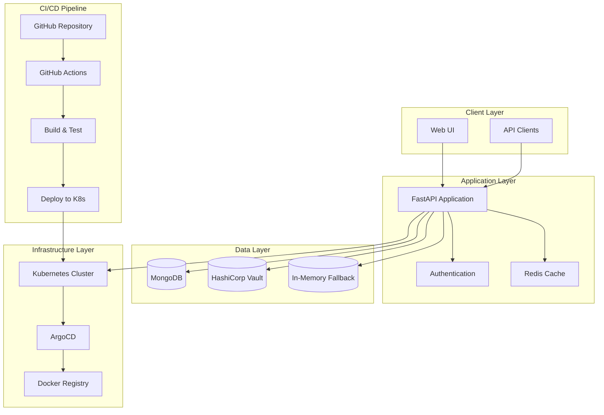
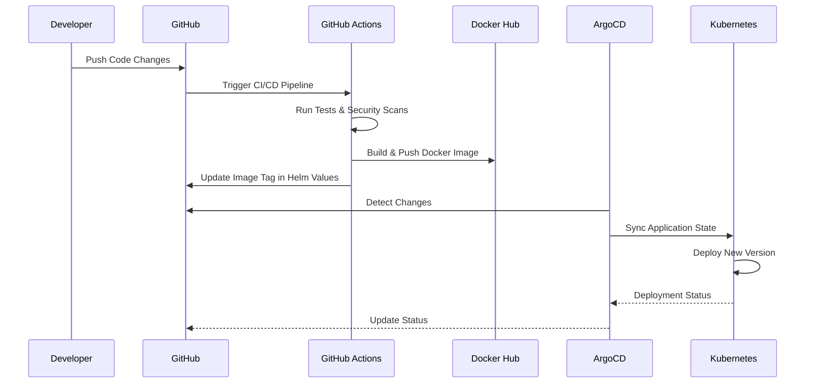
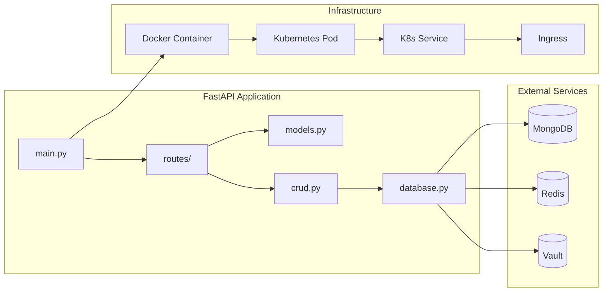

# Student Tracker API - Cloud Native Application

[](https://github.com/bonaventuresimeon/NativeSeries/actions)
[](https://hub.docker.com/r/biwunor/student-tracker)
[](https://opensource.org/licenses/MIT)
[](https://www.python.org/downloads/)
[](https://fastapi.tiangolo.com/)

## 📋 Table of Contents

- [Overview](#overview)
- [Features](#features)
- [Architecture](#architecture)
- [Technology Stack](#technology-stack)
- [Quick Start](#quick-start)
- [Development](#development)
- [Deployment](#deployment)
- [API Documentation](#api-documentation)
- [Monitoring & Health Checks](#monitoring--health-checks)
- [Contributing](#contributing)
- [Contact Information](#contact-information)

## 🎯 Overview

The Student Tracker API is a comprehensive cloud-native application built with FastAPI that provides complete student management capabilities. It's designed as a modern, scalable solution for educational institutions to track student progress, manage courses, and handle assignments.

**Production URL**: [http://18.206.89.183:30011](http://18.206.89.183:30011)

### Key Highlights

- **Cloud Native**: Built with Kubernetes, Docker, and modern DevOps practices
- **GitOps Workflow**: Automated deployment using ArgoCD and GitHub Actions
- **Scalable Architecture**: Microservices-ready with MongoDB integration
- **Modern UI**: Responsive web interface with real-time updates
- **Production Ready**: Health checks, monitoring, and security features

## ✨ Features

### Core Functionality
- **Student Management**: Complete CRUD operations for student records
- **Course Management**: Multi-course enrollment system
- **Progress Tracking**: Weekly progress monitoring and analytics
- **Assignment System**: Assignment creation, submission, and grading
- **Real-time Updates**: Live data synchronization

### Technical Features
- **RESTful API**: Full REST API with OpenAPI/Swagger documentation
- **Database Integration**: MongoDB with fallback to in-memory storage
- **Authentication**: JWT-based authentication system
- **Caching**: Redis integration for performance optimization
- **Security**: Vault integration for secrets management
- **Monitoring**: Health checks, metrics, and logging

## 🏗️ Architecture

### System Architecture Diagram



### GitOps Workflow



### Application Components



## 🛠️ Technology Stack

### Backend
- **Framework**: FastAPI 0.110.0+
- **Language**: Python 3.11
- **Server**: Uvicorn with Gunicorn
- **Database**: MongoDB with Motor (async driver)
- **Caching**: Redis
- **Authentication**: JWT with python-jose
- **Secrets**: HashiCorp Vault

### Frontend
- **Templates**: Jinja2
- **Styling**: Modern CSS with responsive design
- **JavaScript**: Vanilla JS for dynamic interactions

### Infrastructure
- **Containerization**: Docker
- **Orchestration**: Kubernetes
- **GitOps**: ArgoCD
- **CI/CD**: GitHub Actions
- **Registry**: Docker Hub / GitHub Container Registry

### Development Tools
- **Testing**: pytest, pytest-asyncio
- **Linting**: flake8, black
- **Security**: Trivy vulnerability scanner
- **Monitoring**: Built-in health checks and metrics

## 🚀 Quick Start

### Prerequisites
- Python 3.11+
- Docker
- Kubernetes cluster (minikube/kind for local development)
- ArgoCD (for GitOps deployment)

### Local Development

1. **Clone the repository**
   ```bash
   git clone https://github.com/bonaventuresimeon/NativeSeries.git
   cd NativeSeries
   ```

2. **Install dependencies**
   ```bash
   pip install -r requirements.txt
   ```

3. **Run the application**
   ```bash
   uvicorn app.main:app --reload --host 0.0.0.0 --port 8000
   ```

4. **Access the application**
   - Web UI: http://localhost:8000
   - API Docs: http://localhost:8000/docs
   - Health Check: http://localhost:8000/health

### Docker Deployment

1. **Build the image**
   ```bash
   docker build -t student-tracker:latest .
   ```

2. **Run the container**
   ```bash
   docker run -p 8000:8000 student-tracker:latest
   ```

### Kubernetes Deployment

1. **Install ArgoCD**
   ```bash
   kubectl create namespace argocd
   kubectl apply -n argocd -f https://raw.githubusercontent.com/argoproj/argo-cd/stable/manifests/install.yaml
   ```

2. **Deploy the application**
   ```bash
   kubectl apply -f argocd/application.yaml
   ```

## 🔧 Development

### Project Structure
```
NativeSeries/
├── app/                    # Application source code
│   ├── main.py            # FastAPI application entry point
│   ├── models.py          # Pydantic models
│   ├── database.py        # Database configuration
│   ├── crud.py           # CRUD operations
│   └── routes/           # API route handlers
├── templates/             # HTML templates
├── helm-chart/           # Kubernetes Helm chart
├── argocd/               # ArgoCD configuration
├── .github/workflows/    # GitHub Actions CI/CD
├── scripts/              # Utility scripts
├── tests/                # Test files
└── docs/                 # Documentation
```

### Running Tests
```bash
# Run all tests
pytest app/test_*.py -v

# Run with coverage
pytest --cov=app app/test_*.py

# Run linting
flake8 app/ --count --select=E9,F63,F7,F82 --show-source --statistics
black --check app/
```

### Code Quality
- **Linting**: flake8 with custom configuration
- **Formatting**: Black code formatter
- **Type Checking**: Pydantic models for type safety
- **Security**: Trivy vulnerability scanning

## 🚀 Deployment

### Production Deployment

The application is deployed using a GitOps workflow:

1. **Code Push**: Developer pushes changes to GitHub
2. **CI Pipeline**: GitHub Actions runs tests and builds Docker image
3. **Image Push**: New image is pushed to Docker Hub
4. **GitOps Sync**: ArgoCD detects changes and deploys to Kubernetes
5. **Health Check**: Application health is monitored

### Environment Variables

| Variable | Description | Default |
|----------|-------------|---------|
| `MONGO_URI` | MongoDB connection string | `mongodb://localhost:27017` |
| `DATABASE_NAME` | Database name | `student_project_tracker` |
| `COLLECTION_NAME` | Collection name | `students` |
| `VAULT_ADDR` | Vault server address | - |
| `VAULT_ROLE_ID` | Vault role ID | - |
| `VAULT_SECRET_ID` | Vault secret ID | - |
| `REDIS_URL` | Redis connection string | - |

### Helm Chart Configuration

The application is deployed using a Helm chart with the following features:
- **Multi-environment support** (staging, production)
- **Resource limits and requests**
- **Health checks and readiness probes**
- **Horizontal Pod Autoscaler**
- **Ingress configuration**

## 📚 API Documentation

### Core Endpoints

| Method | Endpoint | Description |
|--------|----------|-------------|
| `GET` | `/` | Web interface home page |
| `GET` | `/docs` | Interactive API documentation |
| `GET` | `/health` | Health check endpoint |
| `GET` | `/metrics` | Application metrics |
| `GET` | `/students` | List all students |
| `POST` | `/students` | Create new student |
| `GET` | `/students/{id}` | Get student by ID |
| `PUT` | `/students/{id}` | Update student |
| `DELETE` | `/students/{id}` | Delete student |

### API Response Format

```json
{
  "status": "success",
  "data": {
    "id": "student_123",
    "name": "John Doe",
    "progress": {
      "week1": true,
      "week2": false
    }
  },
  "message": "Student retrieved successfully"
}
```

## 📊 Monitoring & Health Checks

### Health Check Endpoint
```bash
curl http://localhost:8000/health
```

Response:
```json
{
  "status": "healthy",
  "timestamp": "2024-01-15T10:30:00Z",
  "version": "1.1.0",
  "uptime": "2h 15m 30s",
  "database": "connected",
  "cache": "connected"
}
```

### Metrics Endpoint
```bash
curl http://localhost:8000/metrics
```

### Logging
- **Application logs**: `/app/logs/app.log`
- **Log level**: INFO
- **Format**: Structured JSON logging
- **Rotation**: Daily log rotation

## 🤝 Contributing

We welcome contributions! Please follow these steps:

1. **Fork the repository**
2. **Create a feature branch**: `git checkout -b feature/amazing-feature`
3. **Make your changes** and add tests
4. **Run the test suite**: `pytest app/test_*.py -v`
5. **Commit your changes**: `git commit -m 'Add amazing feature'`
6. **Push to the branch**: `git push origin feature/amazing-feature`
7. **Open a Pull Request**

### Development Guidelines
- Follow PEP 8 style guidelines
- Write comprehensive tests
- Update documentation for new features
- Ensure all tests pass before submitting PR

## 📞 Contact Information

### Primary Contact
- **Name**: Bonaventure Simeon
- **Email**: contact@bonaventure.org.ng
- **GitHub**: [@bonaventuresimeon](https://github.com/bonaventuresimeon)
- **LinkedIn**: [Bonaventure Simeon](https://linkedin.com/in/bonaventuresimeon)

### Project Links
- **Repository**: https://github.com/bonaventuresimeon/NativeSeries
- **Issues**: https://github.com/bonaventuresimeon/NativeSeries/issues
- **Discussions**: https://github.com/bonaventuresimeon/NativeSeries/discussions
- **Wiki**: https://github.com/bonaventuresimeon/NativeSeries/wiki

### Support Channels
- **Technical Support**: Open an issue on GitHub
- **Feature Requests**: Use GitHub Discussions
- **Security Issues**: Email security@bonaventure.org.ng
- **General Inquiries**: contact@bonaventure.org.ng

### Office Hours
- **Monday - Friday**: 9:00 AM - 6:00 PM (WAT)
- **Weekend**: Available for urgent issues
- **Response Time**: Within 24 hours

## 📄 License

This project is licensed under the MIT License - see the [LICENSE](LICENSE) file for details.

## 🙏 Acknowledgments

- **FastAPI Community** for the excellent web framework
- **ArgoCD Team** for the GitOps platform
- **Kubernetes Community** for container orchestration
- **Open Source Contributors** who made this project possible

---

**Made with ❤️ by Bonaventure Simeon**

*Building the future of cloud-native applications, one commit at a time.*