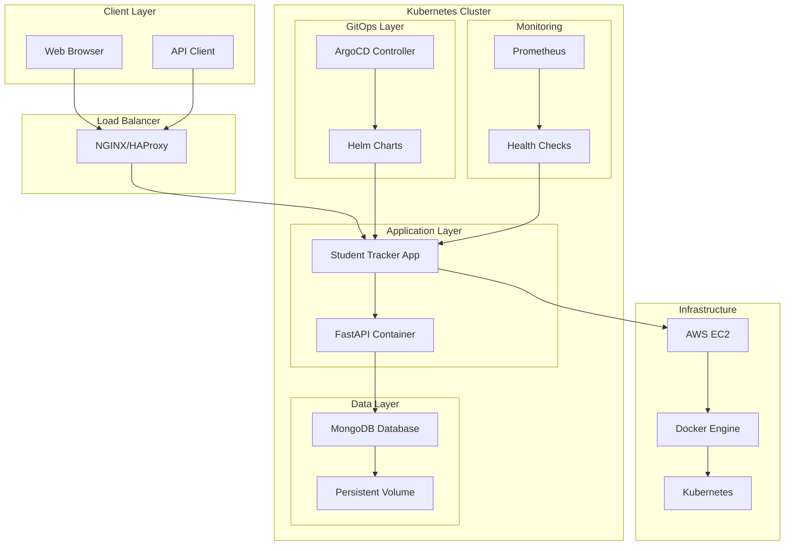
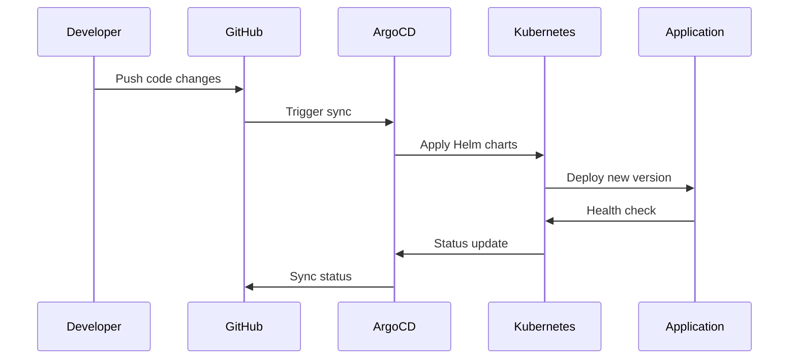
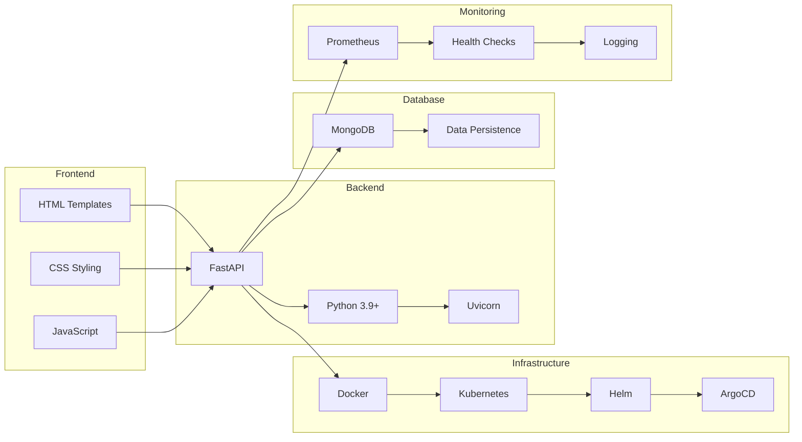
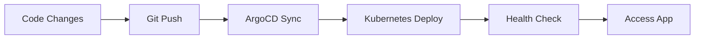
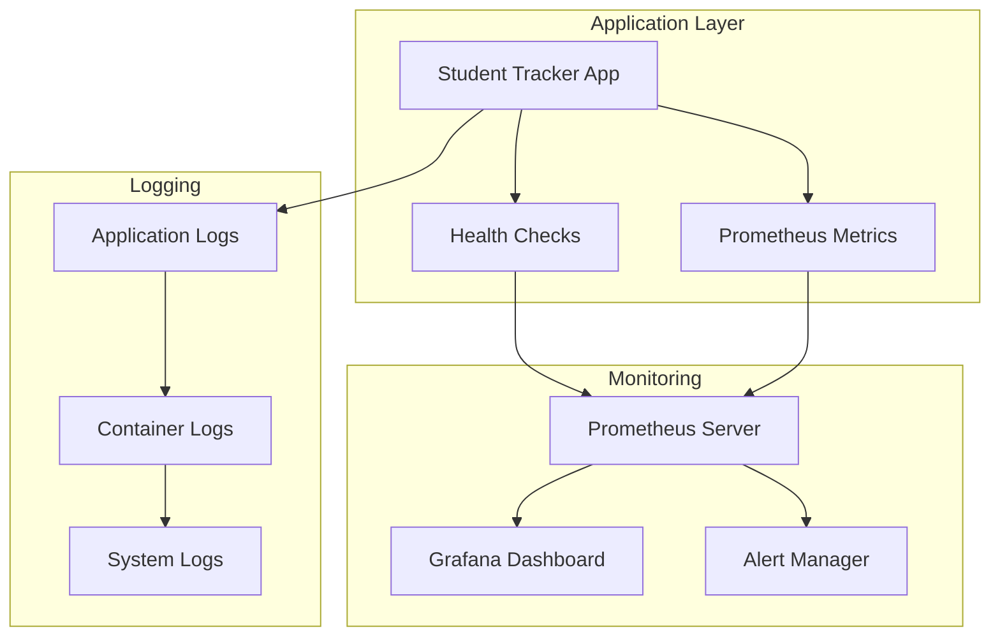

# 🎓 Student Tracker - Complete Student Management Platform

<div align="center">


**A comprehensive student management application with GitOps automation and containerized deployment**

[](http://18.206.89.183:30011)
[](http://18.206.89.183:30011/health)
[](http://18.206.89.183:30011/docs)
[](https://github.com/bonaventuresimeon/NativeSeries/actions)

</div>

---

## 📋 Table of Contents

- [🎯 Overview](#-overview)
- [🏗️ Architecture](#️-architecture)
- [🚀 Quick Start](#-quick-start)
- [📦 Installation & Deployment](#-installation--deployment)
- [🔧 Development Environment](#-development-environment)
- [📊 Monitoring & Health](#-monitoring--health)
- [🔒 Security](#-security)
- [📚 API Documentation](#-api-documentation)
- [🛠️ Troubleshooting](#️-troubleshooting)
- [🤝 Contributing](#-contributing)
- [📄 License](#-license)

---

## 🎯 Overview

Student Tracker is a modern, cloud-native student management platform built with **FastAPI**, deployed on **Kubernetes** using **Helm**, and managed through **ArgoCD** for GitOps automation. The application provides comprehensive student tracking, progress monitoring, and administrative capabilities with enterprise-grade reliability and security.

### 🌟 Key Features

- **📚 Student Management**: Complete CRUD operations for student records
- **📈 Progress Tracking**: Weekly progress monitoring and analytics
- **🔐 Secure Authentication**: Vault-integrated secret management
- **📊 Real-time Monitoring**: Prometheus metrics and health checks
- **🚀 Auto-scaling**: Horizontal Pod Autoscaler for performance optimization
- **🔄 GitOps**: Automated deployment with ArgoCD and GitHub Actions
- **🔒 Security**: Non-root containers, read-only filesystems, security contexts
- **🌐 Production Ready**: Deployed on AWS EC2 with high availability
- **📱 Responsive UI**: Modern web interface with interactive API documentation
- **🐳 Containerized**: Docker-based deployment with health checks
- **📋 Template System**: Jinja2 templates with modern CSS styling
- **🔍 API-First**: RESTful API with comprehensive documentation

### 🌐 Production Access

| Service | URL | Description | Status |
|---------|-----|-------------|--------|
| **Student Tracker App** | [http://18.206.89.183:30011](http://18.206.89.183:30011) | Main application | ✅ Live |
| **API Documentation** | [http://18.206.89.183:30011/docs](http://18.206.89.183:30011/docs) | Interactive API docs | ✅ Live |
| **Health Check** | [http://18.206.89.183:30011/health](http://18.206.89.183:30011/health) | Application health status | ✅ Live |
| **Metrics** | [http://18.206.89.183:30011/metrics](http://18.206.89.183:30011/metrics) | Prometheus metrics | ✅ Live |
| **Students Management** | [http://18.206.89.183:30011/students/](http://18.206.89.183:30011/students/) | Student interface | ✅ Live |
| **ArgoCD UI (HTTP)** | [http://18.206.89.183:30080](http://18.206.89.183:30080) | GitOps management | ✅ Live |
| **ArgoCD UI (HTTPS)** | [https://18.206.89.183:30443](https://18.206.89.183:30443) | Secure GitOps access | ✅ Live |

---

## 🏗️ Architecture

### System Architecture Diagram



### Deployment Flow



### Technology Stack



---

## 🚀 Quick Start

### Prerequisites

- **Docker**: For containerized deployment
- **Kubernetes**: For orchestration (optional)
- **Helm**: For package management (optional)
- **ArgoCD**: For GitOps (optional)

### One-Command Deployment

```bash
# Clone the repository
git clone https://github.com/bonaventuresimeon/NativeSeries.git
cd NativeSeries

# Run the deployment script
./scripts/deploy.sh

# Or create a complete Kubernetes environment
./scripts/deploy.sh --setup-cluster
```

### Manual Docker Deployment

```bash
# Build and run with Docker
docker build -t student-tracker .
docker run -p 30011:8000 student-tracker

# Access the application
open http://localhost:30011
```

---

## 📦 Installation & Deployment

### Automated Deployment Script

Our comprehensive `deploy.sh` script handles everything automatically:

#### Features
- ✅ **Tool Installation**: kubectl, helm, docker, argocd, jq, yq
- ✅ **Cluster Creation**: kind/minikube with automatic fallback
- ✅ **ArgoCD Setup**: Complete GitOps environment
- ✅ **Docker Management**: Automatic daemon setup and group configuration
- ✅ **Validation**: Comprehensive project structure and prerequisite checks
- ✅ **Error Handling**: Graceful fallbacks for container environments
- ✅ **Reporting**: Detailed validation reports for troubleshooting

#### Usage Options

```bash
# Standard deployment
./scripts/deploy.sh

# Create Kubernetes cluster and install ArgoCD
./scripts/deploy.sh --setup-cluster

# Start ArgoCD port-forward for UI access
./scripts/deploy.sh --argocd-portforward

# With Docker Hub username
DOCKER_USERNAME=yourusername ./scripts/deploy.sh

# With custom production host
PRODUCTION_HOST=your-host-ip ./scripts/deploy.sh
```

#### What the Script Does

1. **Validates Project Structure**: Checks for required files
2. **Installs Tools**: kubectl, helm, docker, argocd, jq, yq
3. **Sets Up Docker**: Configures access and group membership
4. **Creates Kubernetes Cluster**: kind/minikube with ArgoCD
5. **Builds Docker Image**: Creates application container
6. **Deploys Application**: Kubernetes deployment with Helm
7. **Prepares Production**: Production deployment configuration
8. **Generates Reports**: Detailed validation and status reports

### Environment Variables

| Variable | Default | Description |
|----------|---------|-------------|
| `DOCKER_USERNAME` | - | Your Docker Hub username |
| `PRODUCTION_HOST` | 18.206.89.183 | Production server IP |
| `PRODUCTION_PORT` | 30011 | Production server port |

### Kubernetes Deployment

#### Prerequisites
```bash
# Install kubectl
curl -LO "https://dl.k8s.io/release/$(curl -L -s https://dl.k8s.io/release/stable.txt)/bin/linux/amd64/kubectl"
sudo install -o root -g root -m 0755 kubectl /usr/local/bin/kubectl

# Install Helm
curl https://raw.githubusercontent.com/helm/helm/main/scripts/get-helm-3 | bash

# Install ArgoCD
curl -sSL -o argocd-linux-amd64 https://github.com/argoproj/argo-cd/releases/latest/download/argocd-linux-amd64
sudo install -m 555 argocd-linux-amd64 /usr/local/bin/argocd
```

#### Deployment Steps

```bash
# 1. Create namespace
kubectl create namespace student-tracker

# 2. Install ArgoCD
kubectl create namespace argocd
kubectl apply -n argocd -f https://raw.githubusercontent.com/argoproj/argo-cd/stable/manifests/install.yaml

# 3. Deploy application
helm upgrade --install student-tracker ./helm-chart \
  --namespace student-tracker \
  --set image.repository=student-tracker \
  --set image.tag=latest

# 4. Apply ArgoCD application
kubectl apply -f argocd/application.yaml
```

### Production Deployment

#### AWS EC2 Setup

```bash
# Update system
sudo yum update -y

# Install Docker
sudo yum install -y docker
sudo systemctl enable docker
sudo systemctl start docker
sudo usermod -a -G docker ec2-user

# Install Kubernetes tools
curl -LO "https://dl.k8s.io/release/$(curl -L -s https://dl.k8s.io/release/stable.txt)/bin/linux/amd64/kubectl"
sudo install -o root -g root -m 0755 kubectl /usr/local/bin/kubectl

# Deploy application
./scripts/deploy.sh
```

---

## 🔧 Development Environment

### Local Development Setup

#### Option 1: Automated Setup
```bash
# Complete development environment
./scripts/deploy.sh --setup-cluster

# Access ArgoCD UI
./scripts/deploy.sh --argocd-portforward
# Visit http://localhost:8080 (admin/password)
```

#### Option 2: Manual Setup
```bash
# Install kind
curl -Lo ./kind https://kind.sigs.k8s.io/dl/v0.20.0/kind-linux-amd64
chmod +x ./kind
sudo mv ./kind /usr/local/bin/kind

# Create cluster
kind create cluster

# Install ArgoCD
kubectl create namespace argocd
kubectl apply -n argocd -f https://raw.githubusercontent.com/argoproj/argo-cd/stable/manifests/install.yaml

# Deploy application
helm upgrade --install student-tracker ./helm-chart --namespace student-tracker
```

### Development Workflow



### Useful Commands

```bash
# Check cluster status
kubectl get nodes
kubectl get pods -A

# View application logs
kubectl logs -f deployment/student-tracker -n student-tracker

# Port forward to application
kubectl port-forward svc/student-tracker 30011:8000 -n student-tracker

# Access ArgoCD UI
kubectl port-forward svc/argocd-server 8080:443 -n argocd

# Get ArgoCD password
kubectl -n argocd get secret argocd-initial-admin-secret -o jsonpath="{.data.password}" | base64 -d
```

---

## 📊 Monitoring & Health

### Health Check Endpoints

| Endpoint | Method | Description | Response |
|----------|--------|-------------|----------|
| `/health` | GET | Application health status | `{"status":"healthy","version":"1.1.0"}` |
| `/metrics` | GET | Prometheus metrics | Metrics data |
| `/docs` | GET | API documentation | Swagger UI |

### Monitoring Stack



### Health Check Implementation

```python
@app.get("/health")
async def health_check():
    return {
        "status": "healthy",
        "version": "1.1.0",
        "timestamp": datetime.utcnow().isoformat(),
        "uptime": get_uptime()
    }
```

### Metrics Collection

```python
from prometheus_client import Counter, Histogram, generate_latest

# Define metrics
REQUEST_COUNT = Counter('http_requests_total', 'Total HTTP requests')
REQUEST_LATENCY = Histogram('http_request_duration_seconds', 'HTTP request latency')

@app.middleware("http")
async def metrics_middleware(request: Request, call_next):
    start_time = time.time()
    response = await call_next(request)
    REQUEST_COUNT.inc()
    REQUEST_LATENCY.observe(time.time() - start_time)
    return response
```

---

## 🔒 Security

### Security Features

- **Non-root Containers**: Application runs as non-root user
- **Read-only Filesystem**: Container filesystem is read-only
- **Security Contexts**: Proper Kubernetes security contexts
- **Network Policies**: Restricted network access
- **Secret Management**: Kubernetes secrets for sensitive data
- **RBAC**: Role-based access control
- **Pod Security Standards**: Enforced security policies

### Security Configuration

```yaml
# Pod Security Context
securityContext:
  runAsNonRoot: true
  runAsUser: 1000
  readOnlyRootFilesystem: true
  allowPrivilegeEscalation: false
  capabilities:
    drop:
      - ALL

# Container Security
containers:
  - name: student-tracker
    securityContext:
      allowPrivilegeEscalation: false
      readOnlyRootFilesystem: true
      runAsNonRoot: true
      runAsUser: 1000
```

### Network Security

```yaml
# Network Policy
apiVersion: networking.k8s.io/v1
kind: NetworkPolicy
metadata:
  name: student-tracker-network-policy
spec:
  podSelector:
    matchLabels:
      app: student-tracker
  policyTypes:
    - Ingress
    - Egress
  ingress:
    - from:
        - namespaceSelector:
            matchLabels:
              name: ingress-nginx
      ports:
        - protocol: TCP
          port: 8000
```

---

## 📚 API Documentation

### Interactive API Documentation

Access the complete API documentation at: [http://18.206.89.183:30011/docs](http://18.206.89.183:30011/docs)

### Core Endpoints

| Endpoint | Method | Description | Parameters |
|----------|--------|-------------|------------|
| `/students/` | GET | List all students | `page`, `size` |
| `/students/{id}` | GET | Get student by ID | `id` |
| `/students/` | POST | Create new student | Student data |
| `/students/{id}` | PUT | Update student | `id`, Student data |
| `/students/{id}` | DELETE | Delete student | `id` |
| `/health` | GET | Health check | None |
| `/metrics` | GET | Prometheus metrics | None |

### API Response Examples

#### Get All Students
```bash
curl http://18.206.89.183:30011/students/
```

Response:
```json
{
  "students": [
    {
      "id": 1,
      "name": "John Doe",
      "email": "john@example.com",
      "grade": "A",
      "progress": 85
    }
  ],
  "total": 1,
  "page": 1,
  "size": 10
}
```

#### Create Student
```bash
curl -X POST http://18.206.89.183:30011/students/ \
  -H "Content-Type: application/json" \
  -d '{
    "name": "Jane Smith",
    "email": "jane@example.com",
    "grade": "B+",
    "progress": 78
  }'
```

---

## 🛠️ Troubleshooting

### Common Issues

#### 1. Docker Not Available
```bash
# Error: Cannot connect to Docker daemon
# Solution: Start Docker service
sudo systemctl start docker
sudo usermod -a -G docker $USER
newgrp docker
```

#### 2. Kubernetes Cluster Issues
```bash
# Check cluster status
kubectl cluster-info

# Reset cluster (kind)
kind delete cluster
kind create cluster

# Reset cluster (minikube)
minikube delete
minikube start
```

#### 3. ArgoCD Connection Issues
```bash
# Check ArgoCD status
kubectl get pods -n argocd

# Get ArgoCD password
kubectl -n argocd get secret argocd-initial-admin-secret -o jsonpath="{.data.password}" | base64 -d

# Port forward ArgoCD
kubectl port-forward svc/argocd-server 8080:443 -n argocd
```

#### 4. Application Not Starting
```bash
# Check pod status
kubectl get pods -n student-tracker

# View logs
kubectl logs -f deployment/student-tracker -n student-tracker

# Check events
kubectl get events -n student-tracker
```

### Debug Commands

```bash
# Check all resources
kubectl get all -A

# Check persistent volumes
kubectl get pv,pvc -A

# Check services
kubectl get svc -A

# Check ingress
kubectl get ingress -A

# Check configmaps and secrets
kubectl get cm,secrets -A
```

### Validation Reports

The deployment script generates detailed validation reports:

```bash
# View validation report
cat deployment_validation_report.txt
```

Report includes:
- ✅ Project structure validation
- ✅ Tools installation status
- ✅ Environment configuration
- ✅ Kubernetes cluster status
- ✅ Recommendations for issues

---

## 🤝 Contributing

### Development Setup

1. **Fork the repository**
2. **Create a feature branch**
   ```bash
   git checkout -b feature/amazing-feature
   ```
3. **Make your changes**
4. **Test your changes**
   ```bash
   ./scripts/deploy.sh --setup-cluster
   ```
5. **Commit your changes**
   ```bash
   git commit -m 'Add amazing feature'
   ```
6. **Push to the branch**
   ```bash
   git push origin feature/amazing-feature
   ```
7. **Open a Pull Request**

### Code Style

- Follow PEP 8 for Python code
- Use type hints for function parameters
- Add docstrings for all functions
- Include tests for new features

### Testing

```bash
# Run tests
python -m pytest tests/

# Run with coverage
python -m pytest --cov=app tests/

# Run linting
flake8 app/
black app/
```

---

## 📄 License

This project is licensed under the MIT License - see the [LICENSE](LICENSE) file for details.

---

<div align="center">

**Built with ❤️ using FastAPI, Kubernetes, and ArgoCD**

[](https://github.com/bonaventuresimeon/NativeSeries)
[](https://github.com/bonaventuresimeon/NativeSeries)
[](https://github.com/bonaventuresimeon/NativeSeries/issues)

</div>
