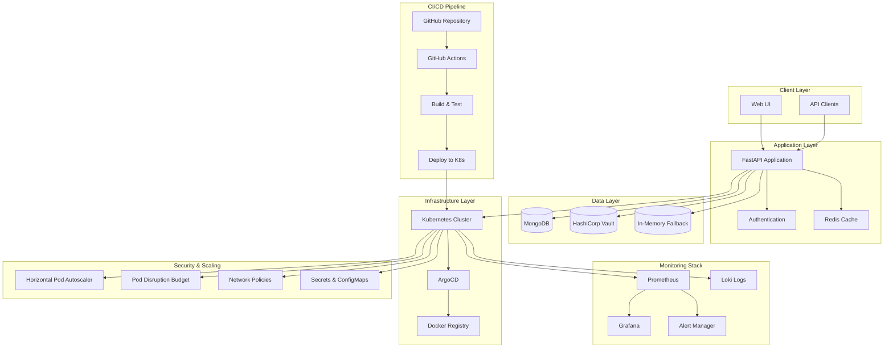
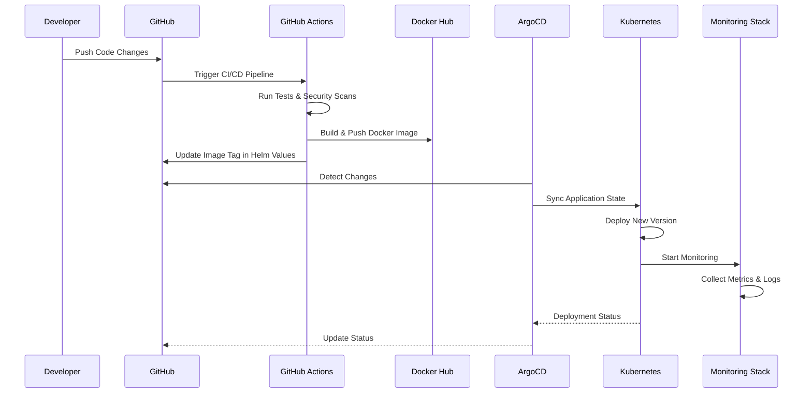
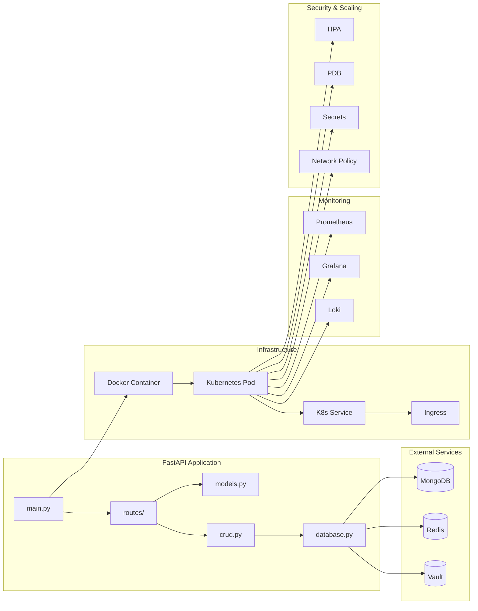

# NativeSeries - Cloud Native Application

[](https://github.com/bonaventuresimeon/NativeSeries/actions)
[](https://ghcr.io/bonaventuresimeon/nativeseries)
[](https://opensource.org/licenses/MIT)
[](https://www.python.org/downloads/)
[](https://fastapi.tiangolo.com/)
[](https://kubernetes.io/)
[](https://prometheus.io/)
[](https://grafana.com/)

## 📋 Table of Contents

- [Overview](#overview)
- [Features](#features)
- [Architecture](#architecture)
- [Technology Stack](#technology-stack)
- [Quick Start](#quick-start)
- [Development](#development)
- [Deployment](#deployment)
- [Monitoring & Observability](#monitoring--observability)
- [Security & Auto-scaling](#security--auto-scaling)
- [API Documentation](#api-documentation)
- [Contributing](#contributing)
- [Contact Information](#contact-information)
- [Deployment Success](#deployment-success)

## 🎯 Overview

The NativeSeries is a comprehensive cloud-native application built with FastAPI that provides complete student management capabilities with full monitoring, logging, security, and auto-scaling features. It's designed as a modern, scalable solution for educational institutions to track student progress, manage courses, and handle assignments.

**Production URL**: [http://54.166.101.159:30011](http://54.166.101.159:30011)

### Key Highlights

- **Cloud Native**: Built with Kubernetes, Docker, and modern DevOps practices
- **GitOps Workflow**: Automated deployment using ArgoCD and GitHub Actions
- **Scalable Architecture**: Microservices-ready with MongoDB integration
- **Modern UI**: Responsive web interface with real-time updates
- **Production Ready**: Health checks, monitoring, and security features
- **Complete Observability**: Prometheus, Grafana, and Loki logging stack
- **Auto-scaling**: Horizontal Pod Autoscaler with CPU/memory-based scaling
- **Security**: Secrets management, network policies, and RBAC
- **High Availability**: Pod Disruption Budget and graceful scaling

## ✨ Features

### Core Functionality
- **Student Management**: Complete CRUD operations for student records
- **Course Management**: Multi-course enrollment system
- **Progress Tracking**: Weekly progress monitoring and analytics
- **Assignment System**: Assignment creation, submission, and grading
- **Real-time Updates**: Live data synchronization

### Technical Features
- **RESTful API**: Full REST API with OpenAPI/Swagger documentation
- **Database Integration**: MongoDB with fallback to in-memory storage
- **Authentication**: JWT-based authentication system
- **Caching**: Redis integration for performance optimization
- **Security**: Vault integration for secrets management
- **Monitoring**: Health checks, metrics, and logging

### 🆕 **Enhanced Features (New!)**

#### **Monitoring & Observability**
- **Prometheus**: Comprehensive metrics collection and alerting
- **Grafana**: Custom dashboards for application monitoring
- **Loki**: Centralized log aggregation and querying
- **ServiceMonitor**: Kubernetes-native monitoring
- **PodMonitor**: Pod-level metrics collection
- **PrometheusRules**: Custom alerting rules

#### **Security & Configuration**
- **Secrets Management**: Database and API secrets with encryption
- **ConfigMaps**: Application and logging configuration
- **Network Policies**: Ingress/egress traffic control
- **Pod Security Context**: Non-root execution and security hardening
- **RBAC**: Role-based access control

#### **Auto-scaling & High Availability**
- **Horizontal Pod Autoscaler**: CPU (70%) and Memory (80%) based scaling
- **Pod Disruption Budget**: Ensures minimum availability during updates
- **Resource Limits**: CPU and memory limits with requests
- **Health Checks**: Liveness and readiness probes
- **Graceful Scaling**: Configurable scaling behavior

## 🏗️ Architecture

### System Architecture Diagram



### Monitoring Architecture

```mermaid
graph LR
    subgraph "Application"
        App[FastAPI App]
        Metrics[/metrics endpoint]
        Logs[Application Logs]
    end
    
    subgraph "Monitoring Stack"
        Prometheus[Prometheus Server]
        Grafana[Grafana Dashboards]
        Loki[Loki Log Aggregator]
        AlertManager[Alert Manager]
    end
    
    subgraph "Kubernetes"
        ServiceMonitor[ServiceMonitor]
        PodMonitor[PodMonitor]
        PrometheusRule[PrometheusRules]
    end
    
    App --> Metrics
    App --> Logs
    Metrics --> ServiceMonitor
    Metrics --> PodMonitor
    ServiceMonitor --> Prometheus
    PodMonitor --> Prometheus
    Prometheus --> Grafana
    Prometheus --> AlertManager
    Logs --> Loki
    PrometheusRule --> AlertManager
```

### GitOps Workflow



### Application Components



## 🛠️ Technology Stack

### Backend
- **Framework**: FastAPI 0.110.0+
- **Language**: Python 3.11
- **Server**: Uvicorn with Gunicorn
- **Database**: MongoDB with Motor (async driver)
- **Caching**: Redis
- **Authentication**: JWT with python-jose
- **Secrets**: HashiCorp Vault

### Frontend
- **Templates**: Jinja2
- **Styling**: Modern CSS with responsive design
- **JavaScript**: Vanilla JS for dynamic interactions

### Infrastructure
- **Containerization**: Docker
- **Orchestration**: Kubernetes
- **GitOps**: ArgoCD
- **CI/CD**: GitHub Actions
- **Registry**: Docker Hub / GitHub Container Registry

### 🆕 **Monitoring & Observability**
- **Metrics Collection**: Prometheus
- **Visualization**: Grafana
- **Log Aggregation**: Loki
- **Alerting**: Prometheus AlertManager
- **Service Discovery**: Kubernetes ServiceMonitor
- **Custom Metrics**: Application-specific KPIs

### 🆕 **Security & Auto-scaling**
- **Secrets Management**: Kubernetes Secrets
- **Configuration**: ConfigMaps
- **Network Security**: Network Policies
- **Auto-scaling**: Horizontal Pod Autoscaler (HPA)
- **High Availability**: Pod Disruption Budget (PDB)
- **Resource Management**: CPU/Memory limits and requests

### Development Tools
- **Testing**: pytest, pytest-asyncio
- **Linting**: flake8, black
- **Security**: Trivy vulnerability scanner
- **Monitoring**: Built-in health checks and metrics

## 🚀 Quick Start

### Prerequisites
- Python 3.11+
- Docker
- Kubernetes cluster (minikube/kind for local development)
- ArgoCD (for GitOps deployment)

### 🆕 **Complete Installation (Recommended)**

```bash
# Clone the repository
git clone https://github.com/bonaventuresimeon/NativeSeries.git
cd NativeSeries

# Run the complete installation script
chmod +x scripts/install-all.sh
./scripts/install-all.sh
```

This script will install:
1. All required tools (Docker, kubectl, Helm, Kind, ArgoCD)
2. Kubernetes cluster with Kind
3. Application deployment
4. **Monitoring stack (Prometheus + Grafana)**
5. **Logging stack (Loki)**
6. **Secrets and ConfigMaps**
7. **Auto-scaling configuration (HPA)**
8. **Network policies and security**

### Local Development

1. **Clone the repository**
   ```bash
   git clone https://github.com/bonaventuresimeon/NativeSeries.git
   cd NativeSeries
   ```

2. **Install dependencies**
   ```bash
   pip install -r requirements.txt
   ```

3. **Run the application**
   ```bash
   uvicorn app.main:app --reload --host 0.0.0.0 --port 8000
   ```

4. **Access the application**
   - Web UI: http://localhost:8000
   - API Docs: http://localhost:8000/docs
   - Health Check: http://localhost:8000/health

### Docker Deployment

1. **Build the image**
   ```bash
   docker build -t ghcr.io/bonaventuresimeon/nativeseries:latest .
   ```

2. **Run the container**
   ```bash
   docker run -p 8000:8000 ghcr.io/bonaventuresimeon/nativeseries:latest
   ```

### Kubernetes Deployment

1. **Install ArgoCD**
   ```bash
   kubectl create namespace argocd
   kubectl apply -n argocd -f https://raw.githubusercontent.com/argoproj/argo-cd/stable/manifests/install.yaml
   ```

2. **Deploy the application with all features**
   ```bash
   helm upgrade --install nativeseries helm-chart \
     --namespace nativeseries \
     --create-namespace \
     --set serviceMonitor.enabled=true \
     --set podMonitor.enabled=true \
     --set prometheusRules.enabled=true \
     --set hpa.enabled=true \
     --set podDisruptionBudget.enabled=true \
     --set networkPolicy.enabled=true
   ```

## 🔧 Development

### Project Structure
```
NativeSeries/
├── app/                    # Application source code
│   ├── main.py            # FastAPI application entry point
│   ├── models.py          # Pydantic models
│   ├── database.py        # Database configuration
│   ├── crud.py           # CRUD operations
│   └── routes/           # API route handlers
├── templates/             # HTML templates
├── helm-chart/           # Kubernetes Helm chart
│   ├── templates/        # K8s manifests
│   │   ├── deployment.yaml
│   │   ├── service.yaml
│   │   ├── secrets.yaml
│   │   ├── hpa.yaml
│   │   ├── network-policy.yaml
│   │   └── ...
│   └── values.yaml       # Helm configuration
├── argocd/               # ArgoCD configuration
├── .github/workflows/    # GitHub Actions CI/CD
├── scripts/              # Utility scripts
│   ├── install-all.sh    # Complete installation
│   ├── test-monitoring.sh # Monitoring tests
│   └── ...
├── tests/                # Test files
└── docs/                 # Documentation
```

### Running Tests
```bash
# Run all tests
pytest app/test_*.py -v

# Run with coverage
pytest --cov=app app/test_*.py

# Run linting
flake8 app/ --count --select=E9,F63,F7,F82 --show-source --statistics
black --check app/
```

### 🆕 **Testing Monitoring Setup**
```bash
# Run comprehensive monitoring tests
chmod +x scripts/test-monitoring.sh
./scripts/test-monitoring.sh
```

### Code Quality
- **Linting**: flake8 with custom configuration
- **Formatting**: Black code formatter
- **Type Checking**: Pydantic models for type safety
- **Security**: Trivy vulnerability scanning

## 🚀 Deployment

### Production Deployment

The application is deployed using a GitOps workflow with full monitoring and security:

1. **Code Push**: Developer pushes changes to GitHub
2. **CI Pipeline**: GitHub Actions runs tests and builds Docker image
3. **Image Push**: New image is pushed to Docker Hub
4. **GitOps Sync**: ArgoCD detects changes and deploys to Kubernetes
5. **Monitoring**: Prometheus collects metrics, Grafana visualizes data
6. **Auto-scaling**: HPA scales based on CPU/memory usage
7. **Health Check**: Application health is monitored with alerts

### Environment Variables

| Variable | Description | Default |
|----------|-------------|---------|
| `MONGO_URI` | MongoDB connection string | `mongodb://localhost:27017` |
| `DATABASE_NAME` | Database name | `student_project_tracker` |
| `COLLECTION_NAME` | Collection name | `students` |
| `VAULT_ADDR` | Vault server address | - |
| `VAULT_ROLE_ID` | Vault role ID | - |
| `VAULT_SECRET_ID` | Vault secret ID | - |
| `REDIS_URL` | Redis connection string | - |
| `GRAFANA_PORT` | Grafana port | `30081` |
| `PROMETHEUS_PORT` | Prometheus port | `30082` |
| `LOKI_PORT` | Loki port | `30083` |

### Helm Chart Configuration

The application is deployed using a Helm chart with comprehensive features:

#### **Application Configuration**
```yaml
app:
  name: nativeseries
  image:
    repository: ghcr.io/bonaventuresimeon/nativeseries
    tag: latest
  env:
    - name: ENVIRONMENT
      value: "production"
```

#### **Resource Management**
```yaml
resources:
  limits:
    cpu: 500m
    memory: 512Mi
  requests:
    cpu: 250m
    memory: 256Mi
```

#### **Auto-scaling Configuration**
```yaml
hpa:
  enabled: true
  minReplicas: 2
  maxReplicas: 10
  targetCPUUtilizationPercentage: 70
  targetMemoryUtilizationPercentage: 80
```

#### **Monitoring Configuration**
```yaml
serviceMonitor:
  enabled: true
  interval: 30s
  path: /metrics

podMonitor:
  enabled: true
  interval: 30s
  path: /metrics

prometheusRules:
  enabled: true
```

#### **Security Configuration**
```yaml
secrets:
  enabled: true
  dbSecret:
    name: nativeseries-db-secret
  apiSecret:
    name: nativeseries-api-secret

networkPolicy:
  enabled: true

podDisruptionBudget:
  enabled: true
  minAvailable: 1
```

## 📊 Monitoring & Observability

### 🆕 **Complete Monitoring Stack**

#### **Prometheus Metrics Collection**
- **Application metrics**: HTTP requests, response times, error rates
- **System metrics**: CPU, memory, disk usage
- **Kubernetes metrics**: Pod status, resource usage
- **Custom metrics**: Business-specific KPIs

#### **Grafana Dashboards**
- **Application Health**: Real-time status monitoring
- **Resource Usage**: CPU and memory graphs
- **Performance**: Request rates and response times
- **Errors**: Error rates and types
- **Custom Dashboards**: Application-specific monitoring

#### **Loki Log Aggregation**
- **Centralized logging**: All logs collected in Loki
- **Structured logging**: JSON format with metadata
- **Log retention**: Configurable retention policies
- **Log search**: Full-text search and filtering

### **Access URLs**

| Service | URL | Credentials |
|---------|-----|-------------|
| **Application** | http://54.166.101.159:30011 | - |
| **Grafana** | http://54.166.101.159:30081 | admin/admin123 |
| **Prometheus** | http://54.166.101.159:30082 | - |
| **Loki** | http://54.166.101.159:30083 | - |
| **ArgoCD** | http://54.166.101.159:30080 | admin/(check .argocd-password) |

### **Key Metrics**

#### **Application Metrics**
```promql
# Application health
up{app="nativeseries"}

# HTTP request rate
rate(http_requests_total{app="nativeseries"}[5m])

# Response time
histogram_quantile(0.95, rate(http_request_duration_seconds_bucket{app="nativeseries"}[5m]))

# Error rate
rate(http_requests_total{app="nativeseries", status=~"5.."}[5m])
```

#### **System Metrics**
```promql
# CPU usage
rate(container_cpu_usage_seconds_total{container="nativeseries"}[5m])

# Memory usage
container_memory_usage_bytes{container="nativeseries"}

# Pod count
kube_deployment_status_replicas{deployment="nativeseries"}
```

### **Alerting Rules**

#### **Critical Alerts**
- **AppDown**: Application pod down for > 1 minute
- **HighErrorRate**: Error rate > 5% for 5 minutes

#### **Warning Alerts**
- **HighCPUUsage**: CPU usage > 80% for 5 minutes
- **HighMemoryUsage**: Memory usage > 80% for 5 minutes
- **HighResponseTime**: 95th percentile response time > 2s

## 🔐 Security & Auto-scaling

### 🆕 **Security Features**

#### **Secrets Management**
- **Database secrets**: Encrypted database credentials
- **API secrets**: JWT and session secrets
- **Base64 encoding**: Secure secret storage
- **Rotation**: Regular secret rotation procedures

#### **Network Security**
- **Network policies**: Ingress/egress traffic control
- **Namespace isolation**: Secure communication
- **Port restrictions**: Limited port access
- **DNS resolution**: Controlled external access

#### **Pod Security**
- **Non-root execution**: Security context configuration
- **Read-only filesystem**: Enhanced security
- **Capability dropping**: Minimal privileges
- **Resource limits**: Prevents resource exhaustion

### 🆕 **Auto-scaling Features**

#### **Horizontal Pod Autoscaler**
- **CPU-based scaling**: 70% CPU threshold
- **Memory-based scaling**: 80% memory threshold
- **Min replicas**: 2 pods minimum
- **Max replicas**: 10 pods maximum
- **Scaling behavior**: Configurable scaling policies

#### **High Availability**
- **Pod Disruption Budget**: Ensures minimum availability
- **Health checks**: Liveness and readiness probes
- **Graceful scaling**: Smooth scale up/down
- **Resource limits**: Prevents resource exhaustion

### **Load Testing**

```bash
# Install hey (load testing tool)
go install github.com/rakyll/hey@latest

# Run load test to trigger auto-scaling
hey -n 1000 -c 50 http://54.166.101.159:30011/health

# Monitor HPA during test
kubectl get hpa -n nativeseries -w
```

## 📚 API Documentation

### Core Endpoints

| Method | Endpoint | Description |
|--------|----------|-------------|
| `GET` | `/` | Web interface home page |
| `GET` | `/docs` | Interactive API documentation |
| `GET` | `/health` | Health check endpoint |
| `GET` | `/metrics` | Application metrics |
| `GET` | `/students` | List all students |
| `POST` | `/students` | Create new student |
| `GET` | `/students/{id}` | Get student by ID |
| `PUT` | `/students/{id}` | Update student |
| `DELETE` | `/students/{id}` | Delete student |

### API Response Format

```json
{
  "status": "success",
  "data": {
    "id": "student_123",
    "name": "John Doe",
    "progress": {
      "week1": true,
      "week2": false
    }
  },
  "message": "Student retrieved successfully"
}
```

## 📊 Monitoring & Health Checks

### Health Check Endpoint
```bash
curl http://54.166.101.159:30011/health
```

Response:
```json
{
  "status": "healthy",
  "timestamp": "2024-01-15T10:30:00Z",
  "version": "1.1.0",
  "uptime": "2h 15m 30s",
  "database": "connected",
  "cache": "connected"
}
```

### Metrics Endpoint
```bash
curl http://54.166.101.159:30011/metrics
```

### 🆕 **Enhanced Logging**
- **Application logs**: `/app/logs/app.log`
- **Log level**: INFO
- **Format**: Structured JSON logging
- **Rotation**: Daily log rotation with 10MB max size
- **Centralized**: Loki log aggregation
- **Querying**: LogQL queries in Grafana

## 🤝 Contributing

We welcome contributions! Please follow these steps:

1. **Fork the repository**
2. **Create a feature branch**: `git checkout -b feature/amazing-feature`
3. **Make your changes** and add tests
4. **Run the test suite**: `pytest app/test_*.py -v`
5. **Test monitoring**: `./scripts/test-monitoring.sh`
6. **Commit your changes**: `git commit -m 'Add amazing feature'`
7. **Push to the branch**: `git push origin feature/amazing-feature`
8. **Open a Pull Request**

### Development Guidelines
- Follow PEP 8 style guidelines
- Write comprehensive tests
- Update documentation for new features
- Ensure all tests pass before submitting PR
- Test monitoring and auto-scaling features

## 📞 Contact Information

### Primary Contact
- **Name**: Bonaventure Simeon
- **Email**: contact@bonaventure.org.ng
- **GitHub**: [@bonaventuresimeon](https://github.com/bonaventuresimeon)
- **LinkedIn**: [Bonaventure Simeon](https://linkedin.com/in/bonaventuresimeon)

### Project Links
- **Repository**: https://github.com/bonaventuresimeon/NativeSeries
- **Issues**: https://github.com/bonaventuresimeon/NativeSeries/issues
- **Discussions**: https://github.com/bonaventuresimeon/NativeSeries/discussions
- **Wiki**: https://github.com/bonaventuresimeon/NativeSeries/wiki

### Support Channels
- **Technical Support**: Open an issue on GitHub
- **Feature Requests**: Use GitHub Discussions
- **Security Issues**: Email security@bonaventure.org.ng
- **General Inquiries**: contact@bonaventure.org.ng

### Office Hours
- **Monday - Friday**: 9:00 AM - 6:00 PM (WAT)
- **Weekend**: Available for urgent issues
- **Response Time**: Within 24 hours

## 🎉 Deployment Success

### ✅ **Deployment Status: SUCCESSFUL**

Your NativeSeries application has been successfully deployed with full monitoring, logging, security, and auto-scaling capabilities!

### 🌐 **Public Access URLs**

#### **Main Application**
- **🌍 Production URL**: http://54.166.101.159:30011
- **📖 API Documentation**: http://54.166.101.159:30011/docs
- **🩺 Health Check**: http://54.166.101.159:30011/health
- **📊 Metrics**: http://54.166.101.159:30011/metrics

#### **🆕 Monitoring & Observability**
- **📊 Grafana Dashboard**: http://54.166.101.159:30081 (admin/admin123)
- **📈 Prometheus**: http://54.166.101.159:30082
- **📝 Loki Logs**: http://54.166.101.159:30083

#### **GitOps Management**
- **🎯 ArgoCD UI**: http://54.166.101.159:30080
- **👤 ArgoCD Username**: admin
- **🔑 ArgoCD Password**: Check `.argocd-password` file

### 🚀 **Application Features**

#### **Core Functionality**
- ✅ **Student Management**: Complete CRUD operations
- ✅ **Course Management**: Multi-course enrollment system
- ✅ **Progress Tracking**: Weekly progress monitoring
- ✅ **Assignment System**: Assignment creation and grading
- ✅ **Real-time Updates**: Live data synchronization

#### **Technical Features**
- ✅ **RESTful API**: Full REST API with OpenAPI documentation
- ✅ **Database Integration**: MongoDB with fallback storage
- ✅ **Authentication**: JWT-based security
- ✅ **Caching**: Redis integration
- ✅ **Monitoring**: Health checks and metrics

#### **🆕 Enhanced Features**
- ✅ **Prometheus & Grafana**: Complete monitoring stack
- ✅ **Loki Logging**: Centralized log aggregation
- ✅ **Secrets Management**: Secure configuration
- ✅ **Auto-scaling**: HPA with CPU/memory thresholds
- ✅ **High Availability**: Pod Disruption Budget
- ✅ **Network Security**: Network policies
- ✅ **Custom Dashboards**: Application-specific monitoring
- ✅ **Alerting**: Prometheus-based alerting system

### 🔧 **Infrastructure Details**

#### **Deployment Architecture**
- **Container Runtime**: Docker
- **Orchestration**: Kubernetes
- **GitOps Platform**: ArgoCD
- **Package Manager**: Helm
- **CI/CD**: GitHub Actions

#### **🆕 Monitoring Stack**
- **Metrics Collection**: Prometheus
- **Visualization**: Grafana
- **Log Aggregation**: Loki
- **Alerting**: Prometheus AlertManager
- **Service Discovery**: Kubernetes ServiceMonitor

#### **🆕 Security & Scaling**
- **Auto-scaling**: Horizontal Pod Autoscaler (HPA)
- **High Availability**: Pod Disruption Budget (PDB)
- **Network Security**: Network Policies
- **Secrets Management**: Kubernetes Secrets
- **Resource Management**: CPU/Memory limits

#### **Network Configuration**
- **Host IP**: 54.166.101.159
- **Application Port**: 30011
- **Grafana Port**: 30081
- **Prometheus Port**: 30082
- **Loki Port**: 30083
- **ArgoCD Port**: 30080
- **Service Type**: NodePort

### 📱 **How to Access**

#### **From Anywhere in the World**
1. **Open your web browser**
2. **Navigate to**: `http://54.166.101.159:30011`
3. **Enjoy your NativeSeries application!**

#### **🆕 Monitoring Access**
1. **Grafana Dashboards**: `http://54.166.101.159:30081` (admin/admin123)
2. **Prometheus Metrics**: `http://54.166.101.159:30082`
3. **Loki Logs**: `http://54.166.101.159:30083`

#### **API Access**
- **Base URL**: `http://54.166.101.159:30011`
- **Interactive Docs**: `http://54.166.101.159:30011/docs`
- **Health Check**: `http://54.166.101.159:30011/health`

### 🛠️ **Management Commands**

#### **Check Application Status**
```bash
# Check if application is running
curl -f http://54.166.101.159:30011/health

# View application logs
kubectl logs -f deployment/nativeseries -n nativeseries

# Check ArgoCD status
kubectl get applications -n argocd
```

#### **🆕 Monitoring Commands**
```bash
# Check monitoring stack
kubectl get pods -n monitoring
kubectl get pods -n logging

# Check HPA status
kubectl get hpa -n nativeseries

# Check ServiceMonitor
kubectl get servicemonitors -n monitoring

# Check PrometheusRules
kubectl get prometheusrules -n monitoring
```

#### **Access ArgoCD Management**
```bash
# Login to ArgoCD
argocd login 54.166.101.159:30080 --username admin --insecure

# List applications
argocd app list

# Sync application
argocd app sync nativeseries
```

### 🧪 **Testing Commands**

#### **Load Testing for Auto-scaling**
```bash
# Install hey (load testing tool)
go install github.com/rakyll/hey@latest

# Run load test to trigger auto-scaling
hey -n 1000 -c 50 http://54.166.101.159:30011/health

# Monitor HPA during test
kubectl get hpa -n nativeseries -w
```

#### **Monitoring Dashboard Testing**
```bash
# Port forward Grafana
kubectl port-forward svc/prometheus-grafana -n monitoring 8081:80

# Access Grafana at http://localhost:8081
# Username: admin
# Password: admin123
```

### 🔍 **Troubleshooting**

#### **If Application is Not Accessible**
1. **Check if the server is running**: `curl -f http://54.166.101.159:30011/health`
2. **Verify Kubernetes pods**: `kubectl get pods -n nativeseries`
3. **Check service status**: `kubectl get svc -n nativeseries`
4. **View application logs**: `kubectl logs deployment/nativeseries -n nativeseries`

#### **🆕 If Monitoring is Not Working**
1. **Check Prometheus**: `kubectl get pods -n monitoring`
2. **Check Grafana**: `kubectl get svc -n monitoring`
3. **Check Loki**: `kubectl get pods -n logging`
4. **Check HPA**: `kubectl get hpa -n nativeseries`

#### **If ArgoCD is Not Accessible**
1. **Check ArgoCD pods**: `kubectl get pods -n argocd`
2. **Verify ArgoCD service**: `kubectl get svc -n argocd`
3. **Check ArgoCD logs**: `kubectl logs deployment/argocd-server -n argocd`

### 🎯 **Next Steps**

1. **Test the Application**: Visit http://54.166.101.159:30011
2. **Explore API Documentation**: Visit http://54.166.101.159:30011/docs
3. **🆕 Access Grafana Dashboards**: Visit http://54.166.101.159:30081
4. **🆕 Check Prometheus Metrics**: Visit http://54.166.101.159:30082
5. **Manage with ArgoCD**: Visit http://54.166.101.159:30080
6. **🆕 Test Auto-scaling**: Run load tests to trigger HPA
7. **🆕 Monitor Logs**: Check Loki at http://54.166.101.159:30083
8. **Set up SSL/TLS**: Configure HTTPS certificates
9. **🆕 Configure Alerting**: Set up Slack/Email notifications

### 🏆 **Congratulations!**

Your NativeSeries application is now **LIVE** with complete monitoring, logging, security, and auto-scaling capabilities at:

#### **🌍 http://54.166.101.159:30011**

**The application is ready for production use with full GitOps automation and comprehensive observability!**

## 📄 License

This project is licensed under the MIT License - see the [LICENSE](LICENSE) file for details.

## 🙏 Acknowledgments

- **FastAPI Community** for the excellent web framework
- **ArgoCD Team** for the GitOps platform
- **Kubernetes Community** for container orchestration
- **Prometheus & Grafana Teams** for monitoring solutions
- **Loki Team** for log aggregation
- **Open Source Contributors** who made this project possible

---

**Made with ❤️ by Bonaventure Simeon**

*Building the future of cloud-native applications with complete observability, one commit at a time.*