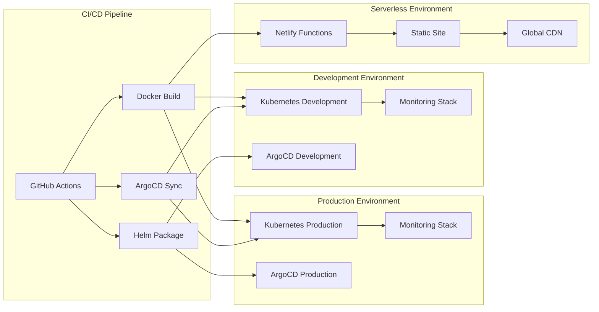

# NativeSeries - Enterprise-Grade Student Tracking Platform

[](https://kubernetes.io/)
[](https://www.docker.com/)
[](https://fastapi.tiangolo.com/)
[](https://prometheus.io/)
[](https://grafana.com/)
[](https://argoproj.github.io/argo-cd/)
[](https://helm.sh/)
[](https://grafana.com/oss/loki/)
[](https://netlify.com/)
[](https://github.com/features/actions)

## 📋 Table of Contents

- [Overview](#overview)
- [Key Features](#key-features)
- [Architecture](#architecture)
- [Technology Stack](#technology-stack)
- [Quick Start](#quick-start)
- [Installation](#installation)
- [Deployment Options](#deployment-options)
- [API Documentation](#api-documentation)
- [Monitoring & Observability](#monitoring--observability)
- [Development Guide](#development-guide)
- [Documentation](#documentation)
- [Troubleshooting](#troubleshooting)
- [Contributing](#contributing)

## 🎯 Overview

**NativeSeries** is a comprehensive, enterprise-grade student tracking platform that demonstrates modern cloud-native development practices. Built with a microservices architecture, it provides a complete solution for educational institutions to manage student data, track academic progress, and maintain comprehensive records with full observability and security.

### 🎓 **Core Purpose**
NativeSeries serves as both a production-ready student management system and a comprehensive demonstration of modern DevOps practices, including:
- **Containerization** with Docker for consistent deployment
- **Kubernetes orchestration** for scalable, resilient infrastructure
- **GitOps workflows** using ArgoCD for automated deployments
- **CI/CD automation** with GitHub Actions
- **Comprehensive monitoring** with Prometheus, Grafana, and Loki
- **Multi-platform deployment** supporting both Kubernetes and serverless architectures
- **Enhanced automation** with comprehensive installation scripts and troubleshooting
- **Advanced database management** with MongoDB and in-memory fallback systems

### 🏗️ **System Components**

#### **Application Layer**
- **FastAPI Backend**: High-performance REST API with automatic OpenAPI documentation
- **Student Management**: Complete CRUD operations for student records
- **Course Tracking**: Academic course management and enrollment
- **Progress Analytics**: Student performance monitoring and reporting
- **Admin Interface**: Administrative dashboard and management tools
- **Health Monitoring**: Built-in health checks and metrics endpoints
- **Static Web Pages**: Interactive HTML pages for database viewing and API testing
- **Serverless Functions**: Netlify functions for edge deployment

#### **Data Layer**
- **MongoDB Integration**: Primary document database for production deployments
- **In-Memory Storage**: Graceful fallback for serverless environments (Netlify)
- **Data Validation**: Pydantic models for type safety and validation
- **Caching Layer**: Redis integration for performance optimization

#### **Infrastructure Layer**
- **Kubernetes Cluster**: Production-grade container orchestration
- **ArgoCD GitOps**: Declarative deployment management
- **Monitoring Stack**: Prometheus metrics, Grafana dashboards, Loki logging
- **Security Framework**: RBAC, network policies, secrets management
- **Auto-scaling**: Horizontal Pod Autoscaler with intelligent scaling policies
- **Enhanced Automation**: Comprehensive installation scripts with kubectl setup and troubleshooting
- **Database Management**: Advanced database initialization and management scripts

#### **Deployment Options**
- **Kubernetes Production**: Full-featured deployment with monitoring
- **Netlify Serverless**: Lightweight serverless deployment
- **Local Development**: Docker and Kind-based development environment

## ✨ Key Features

### 🚀 **Core Application Features**

#### **Student Management System**
- **Student Registration**: Complete student profile creation and management
- **Academic Records**: Track grades, courses, and academic progress
- **Enrollment Management**: Course enrollment and withdrawal tracking
- **Performance Analytics**: Student performance metrics and reporting
- **Data Export**: Export capabilities for reporting and analysis

#### **Course Management**
- **Course Catalog**: Comprehensive course listing and management
- **Enrollment Tracking**: Monitor student course enrollments
- **Academic Calendar**: Course scheduling and timeline management
- **Prerequisites**: Course prerequisite and dependency tracking

#### **Progress Tracking**
- **Academic Progress**: Real-time progress monitoring
- **Grade Tracking**: Comprehensive grade management system
- **Performance Metrics**: Analytics and reporting tools
- **Achievement Tracking**: Student accomplishments and milestones
- **Interactive Dashboards**: Real-time database viewing and analytics
- **API Testing Interface**: Built-in API testing and documentation

### 🔍 **Monitoring & Observability**

#### **Metrics Collection**
- **Application Metrics**: Custom business metrics and KPIs
- **System Metrics**: CPU, memory, and resource utilization
- **Performance Metrics**: Response times and throughput
- **Error Tracking**: Error rates and failure monitoring

#### **Visualization & Dashboards**
- **Grafana Dashboards**: Real-time visualization of all metrics
- **Custom Dashboards**: Application-specific monitoring views
- **Alert Management**: Configurable alerting rules and notifications
- **Historical Analysis**: Long-term trend analysis and reporting

#### **Logging & Tracing**
- **Centralized Logging**: Loki-based log aggregation
- **Structured Logging**: JSON-formatted logs for easy parsing
- **Log Querying**: Powerful log search and filtering capabilities
- **Error Correlation**: Link logs with metrics for troubleshooting

### 🛡️ **Security & Compliance**

#### **Access Control**
- **Role-Based Access Control (RBAC)**: Granular permission management
- **Authentication**: JWT-based authentication system
- **Authorization**: Fine-grained access control policies
- **Audit Logging**: Comprehensive audit trail for compliance

#### **Data Protection**
- **Encryption**: Data encryption at rest and in transit
- **Secrets Management**: Kubernetes secrets for sensitive data
- **Network Security**: Network policies and traffic control
- **Security Scanning**: Container and dependency vulnerability scanning

### ⚡ **Performance & Scalability**

#### **Auto-scaling Capabilities**
- **Horizontal Pod Autoscaler**: CPU and memory-based scaling
- **Resource Optimization**: Efficient resource utilization
- **Load Balancing**: Intelligent traffic distribution
- **Performance Monitoring**: Real-time performance tracking

#### **High Availability**
- **Pod Disruption Budgets**: Ensures minimum availability during updates
- **Health Checks**: Liveness and readiness probes
- **Rolling Updates**: Zero-downtime deployment strategies
- **Backup & Recovery**: Data backup and disaster recovery

### 🌐 **Multi-Platform Support**

#### **Kubernetes Deployment**
- **Production Cluster**: Full-featured Kubernetes deployment
- **Development Environment**: Local Kind cluster for development
- **Helm Charts**: Standardized deployment packages
- **ArgoCD Integration**: GitOps-based deployment automation

#### **Serverless Deployment**
- **Netlify Functions**: Serverless API endpoints with async support
- **Static Site Hosting**: Global CDN distribution with interactive pages
- **Automatic Scaling**: Built-in serverless scaling
- **Cost Optimization**: Pay-per-use pricing model
- **Database Display**: Interactive database viewing pages
- **API Documentation**: Built-in API testing and documentation interface

## 🏗️ Architecture

### **High-Level System Architecture**

```mermaid
graph TB
    subgraph "Client Layer"
        UI[Web UI]
        API[API Clients]
        Mobile[Mobile Apps]
        Admin[Admin Dashboard]
        Docs[API Documentation]
    end
    
    subgraph "Application Layer"
        FastAPI[FastAPI Application]
        Auth[JWT Authentication]
        Cache[Redis Cache]
        Metrics[Metrics Endpoint]
        Health[Health Checks]
        AdminAPI[Admin API]
        Validation[Data Validation]
    end
    
    subgraph "Data Layer"
        MongoDB[(MongoDB)]
        Memory[(In-Memory Storage)]
        Logs[Application Logs]
        CacheStore[(Redis Cache)]
    end
    
    subgraph "Infrastructure Layer"
        K8s[Kubernetes Cluster]
        ArgoCD[ArgoCD GitOps]
        Prometheus[Prometheus]
        Grafana[Grafana Dashboard]
        Loki[Loki Log Aggregator]
        Netlify[Netlify Functions]
    end
    
    subgraph "CI/CD Pipeline"
        GitHub[GitHub Actions]
        DockerHub[Docker Hub]
        GHCR[GitHub Container Registry]
        ArgoCDSync[ArgoCD Sync]
        NetlifyDeploy[Netlify Deploy]
    end
    
    subgraph "Security Layer"
        RBAC[RBAC]
        Secrets[K8s Secrets]
        NetworkPolicies[Network Policies]
        SecurityContext[Security Contexts]
    end
    
    UI --> FastAPI
    API --> FastAPI
    Mobile --> FastAPI
    Admin --> AdminAPI
    Docs --> FastAPI
    
    FastAPI --> Auth
    FastAPI --> Cache
    FastAPI --> Metrics
    FastAPI --> Health
    FastAPI --> Validation
    FastAPI --> MongoDB
    FastAPI --> Memory
    FastAPI --> Logs
    FastAPI --> CacheStore
    
    FastAPI --> K8s
    FastAPI --> Netlify
    
    K8s --> ArgoCD
    K8s --> Prometheus
    K8s --> Grafana
    K8s --> Loki
    K8s --> RBAC
    K8s --> Secrets
    K8s --> NetworkPolicies
    K8s --> SecurityContext
    
    GitHub --> DockerHub
    GitHub --> GHCR
    GitHub --> ArgoCDSync
    GitHub --> NetlifyDeploy
    
    ArgoCDSync --> K8s
    NetlifyDeploy --> Netlify
    Logs --> Loki
    Loki --> Grafana
    Prometheus --> Grafana
```



### **Deployment Architecture**



## 🛠️ Technology Stack

### **Backend Technologies**
- **FastAPI**: Modern Python web framework with automatic API documentation
- **Python 3.11**: Latest stable Python version with enhanced performance
- **Uvicorn**: ASGI server for high-performance FastAPI applications
- **Pydantic**: Data validation and settings management with type hints
- **JWT**: JSON Web Token authentication for secure API access

### **Database & Storage**
- **MongoDB**: Document database for flexible data storage
- **Redis**: In-memory caching layer for performance optimization
- **In-Memory Storage**: Graceful degradation for serverless environments
- **Data Validation**: Comprehensive data validation and sanitization

### **Containerization & Orchestration**
- **Docker**: Container runtime and image building for consistent deployments
- **Kubernetes**: Production-grade container orchestration platform
- **Kind**: Local Kubernetes cluster for development and testing
- **Helm**: Kubernetes package manager for standardized deployments

### **GitOps & CI/CD**
- **ArgoCD**: GitOps continuous deployment for declarative infrastructure
- **GitHub Actions**: CI/CD pipeline automation with comprehensive workflows
- **Git**: Version control and collaboration with branching strategies
- **Container Registry**: GitHub Container Registry for image storage

### **Monitoring & Observability**
- **Prometheus**: Metrics collection, storage, and querying
- **Grafana**: Metrics visualization and dashboard creation
- **Loki**: Log aggregation and querying for centralized logging
- **ServiceMonitor**: Kubernetes service monitoring configuration
- **PodMonitor**: Pod-level metrics collection and monitoring

### **Security & Scaling**
- **Kubernetes Secrets**: Secure credential and sensitive data management
- **ConfigMaps**: Configuration management for environment-specific settings
- **Network Policies**: Traffic control and network security policies
- **Horizontal Pod Autoscaler**: Automatic scaling based on resource usage
- **Pod Disruption Budget**: High availability during cluster maintenance

### **Serverless & Edge Computing**
- **Netlify Functions**: Serverless API endpoints for edge deployment
- **Netlify**: Static site hosting with global CDN distribution
- **Serverless Architecture**: Event-driven, auto-scaling deployment model
- **Edge Functions**: Low-latency API responses from global edge locations

## 🚀 Quick Start

### **Prerequisites**

- **Operating System**: Linux (Ubuntu 20.04+, CentOS 8+, Amazon Linux 2)
- **Memory**: Minimum 8GB RAM (16GB recommended for monitoring stack)
- **Storage**: Minimum 50GB free space (for monitoring data and containers)
- **Network**: Internet connection for downloading dependencies and images
- **Docker**: Docker Engine 20.10 or higher
- **Git**: Version control system for repository access

### **Automated Installation**

The easiest way to get started is using our comprehensive installation script:

```bash
# Clone the repository
git clone https://github.com/bonaventuresimeon/nativeseries.git
cd nativeseries

# Run the automated installation script
chmod +x scripts/install-all.sh
./scripts/install-all.sh
```

This script will automatically:
1. **Install Required Tools**: Docker, kubectl, Helm, Kind, ArgoCD CLI with version management
2. **Create Kubernetes Cluster**: Local Kind cluster for development with kubectl configuration
3. **Deploy Application**: Complete application deployment with all components
4. **Setup Monitoring**: Prometheus, Grafana, and Loki monitoring stack
5. **Configure Security**: RBAC, network policies, and secrets
6. **Enable Auto-scaling**: Horizontal Pod Autoscaler configuration
7. **Validate Deployment**: Comprehensive health checks and verification
8. **Troubleshooting Support**: Built-in kubectl health checks and error resolution
9. **Database Setup**: Advanced database initialization and management

### **Manual Installation**

For users who prefer manual installation or need custom configurations:

```bash
# Clone the repository
git clone https://github.com/bonaventuresimeon/nativeseries.git
cd nativeseries

# Install Python dependencies
python3 -m venv venv
source venv/bin/activate
pip install -r requirements.txt

# Build Docker image
docker build -t ghcr.io/bonaventuresimeon/nativeseries:latest .

# Run locally for testing
docker run -p 8000:8000 ghcr.io/bonaventuresimeon/nativeseries:latest
```

## 📦 Installation

For detailed installation instructions, see [INSTALLATION.md](INSTALLATION.md).

### **System Requirements**

- **Operating System**: Linux (Ubuntu 20.04+, CentOS 8+, Amazon Linux 2)
- **Memory**: Minimum 8GB RAM (16GB recommended for monitoring stack)
- **Storage**: Minimum 50GB free space (for monitoring data and containers)
- **Network**: Internet connection for downloading dependencies and images
- **CPU**: Multi-core processor for optimal performance

### **Required Tools**

- **Python**: 3.11 or higher with pip package manager
- **Docker**: 20.10 or higher with Docker Compose support
- **kubectl**: 1.28 or higher for Kubernetes cluster management
- **Helm**: 3.13 or higher for Kubernetes package management
- **Kind**: 0.20.0 or higher for local Kubernetes cluster creation
- **ArgoCD CLI**: 2.9.3 or higher for GitOps deployment management

## 🌐 Deployment Options

### **1. Kubernetes Production Deployment**

**Production Environment URLs:**
- **Application**: http://54.166.101.159:30011
- **ArgoCD UI**: http://54.166.101.159:30080
- **Grafana**: http://54.166.101.159:30081
- **Prometheus**: http://54.166.101.159:30082
- **Loki**: http://54.166.101.159:30083

**Production Features:**
- **Full Kubernetes Orchestration**: Complete container orchestration with high availability
- **ArgoCD GitOps**: Automated deployment management with Git as source of truth
- **Comprehensive Monitoring**: Full observability stack with metrics, logs, and dashboards
- **Auto-scaling Capabilities**: Intelligent scaling based on resource usage and demand
- **High Availability**: Pod disruption budgets and rolling update strategies
- **Security Framework**: RBAC, network policies, and secrets management
- **Load Balancing**: Intelligent traffic distribution across multiple pods
- **Resource Management**: CPU and memory limits with efficient resource utilization

### **2. Netlify Serverless Deployment**

**Netlify Environment URLs:**
- **Application**: https://nativeseries.netlify.app
- **Health Check**: https://nativeseries.netlify.app/.netlify/functions/health
- **API Documentation**: https://nativeseries.netlify.app/api.html
- **Database Viewer**: https://nativeseries.netlify.app/database.html
- **Admin Interface**: https://nativeseries.netlify.app/admin.html
- **Student Management**: https://nativeseries.netlify.app/students.html
- **Progress Tracking**: https://nativeseries.netlify.app/progress.html

**Serverless Features:**
- **Serverless Functions**: API endpoints running on Netlify Functions with async support
- **Static Site Hosting**: Fast, globally distributed static content with interactive pages
- **Automatic CI/CD**: GitHub Actions integration for automated deployments
- **Global CDN**: Content delivery network for optimal performance
- **Built-in Security**: Automatic HTTPS and security headers
- **Cost Optimization**: Pay-per-use pricing model
- **Auto-scaling**: Automatic scaling based on demand
- **Edge Computing**: Low-latency responses from global edge locations
- **Interactive Database**: Real-time database viewing and management
- **API Testing Interface**: Built-in API testing and documentation

### **3. Local Development Environment**

**Development Features:**
- **Docker Containerization**: Consistent development environment
- **Local Kubernetes**: Kind cluster for local testing and development
- **Hot Reloading**: Automatic code reloading for rapid development
- **Development Tools**: Integrated debugging and testing capabilities
- **Local Monitoring**: Development monitoring stack for testing
- **Database Localization**: Local database instances for development

## 📚 API Documentation

### **Interactive Documentation**

**Kubernetes Deployment:**
- **Swagger UI**: http://54.166.101.159:30011/docs
- **ReDoc**: http://54.166.101.159:30011/redoc
- **OpenAPI JSON**: http://54.166.101.159:30011/openapi.json

**Netlify Deployment:**
- **API Documentation**: https://nativeseries.netlify.app/api.html
- **Interactive Testing**: Available in the API documentation page
- **Endpoint Testing**: Direct API testing capabilities

### **API Endpoints Overview**

#### **Health & System Management**
- `GET /health` - Application health check with detailed status
- `GET /metrics` - Prometheus-compatible metrics endpoint
- `GET /` - Application homepage with system information
- `GET /about` - Detailed application information and version

#### **Student Management API**
- `GET /students` - List all students with pagination and filtering
- `POST /students` - Create new student with validation
- `GET /students/{id}` - Get specific student by unique identifier
- `PUT /students/{id}` - Update existing student information
- `DELETE /students/{id}` - Remove student from system
- `GET /students/{id}/progress` - Get student's academic progress

#### **Course Management API**
- `GET /courses` - List all available courses
- `POST /courses` - Create new course with prerequisites
- `GET /courses/{id}` - Get specific course details
- `PUT /courses/{id}` - Update course information
- `DELETE /courses/{id}` - Remove course from catalog
- `GET /courses/{id}/enrollments` - Get course enrollment list

#### **Progress Tracking API**
- `GET /progress` - List all progress records
- `POST /progress` - Create new progress record
- `GET /progress/{id}` - Get specific progress details
- `PUT /progress/{id}` - Update progress information
- `DELETE /progress/{id}` - Remove progress record
- `GET /progress/analytics` - Get progress analytics and reports

#### **Administrative API**
- `GET /admin` - Admin dashboard access
- `GET /admin/students` - Administrative student management
- `GET /admin/courses` - Administrative course management
- `GET /admin/progress` - Administrative progress management
- `GET /admin/analytics` - System-wide analytics and reporting
- `GET /admin/users` - User management and access control

#### **Statistics & Analytics API**
- `GET /stats` - System-wide statistics and metrics
- `GET /stats/students` - Student-related statistics
- `GET /stats/courses` - Course-related statistics
- `GET /stats/progress` - Progress-related statistics
- `GET /stats/performance` - Performance metrics and KPIs

## 🔍 Monitoring & Observability

### **Prometheus & Grafana Monitoring**

**Access URLs:**
- **Grafana Dashboard**: `http://54.166.101.159:30081` (admin/admin123)
- **Prometheus UI**: `http://54.166.101.159:30082`

**Monitoring Components:**
- **Prometheus Operator**: Advanced metrics collection and storage
- **Grafana Dashboards**: Real-time visualization and alerting
- **ServiceMonitor**: Automatic application metrics discovery
- **PodMonitor**: Pod-level metrics collection and monitoring
- **PrometheusRule**: Configurable alerting rules and thresholds
- **Custom Metrics**: Application-specific business metrics

### **Loki Logging System**

**Access URL:**
- **Loki UI**: `http://54.166.101.159:30083`

**Logging Components:**
- **Loki Server**: High-performance log aggregation
- **Log Forwarding**: Automatic log collection from application pods
- **Log Querying**: Powerful log search and filtering capabilities
- **Log Visualization**: Integrated log viewing in Grafana
- **Structured Logging**: JSON-formatted logs for easy parsing

### **Application Metrics**

The application exposes comprehensive metrics for monitoring:

#### **Health & Performance Metrics**
- **Application Health**: Overall system health and readiness status
- **Request Metrics**: HTTP request counts, latencies, and error rates
- **Resource Usage**: CPU and memory consumption patterns
- **Response Times**: API endpoint performance metrics

#### **Business Metrics**
- **Student Metrics**: Student registration and activity statistics
- **Course Metrics**: Course enrollment and completion rates
- **Progress Metrics**: Academic progress tracking and analytics
- **System Metrics**: Database performance and connection statistics

### **Alerting & Notifications**

Configured alerting rules for proactive monitoring:

#### **Performance Alerts**
- **High CPU Usage**: CPU utilization > 80% for 5 minutes
- **High Memory Usage**: Memory consumption > 85% for 5 minutes
- **High Response Time**: API response time > 2 seconds
- **Error Rate Spike**: Error rate > 5% for 2 minutes

#### **Availability Alerts**
- **Pod Restarts**: Pod restart count > 3 in 10 minutes
- **Service Unavailable**: Service down for > 2 minutes
- **Database Issues**: Database connection failures
- **Health Check Failures**: Application health check failures

#### **Business Alerts**
- **Low Enrollment**: Course enrollment below threshold
- **Progress Issues**: Student progress tracking problems
- **Data Integrity**: Data validation and consistency issues

## 🧪 Testing & Quality Assurance

### **Health Checks**

```bash
# Application health verification
curl http://54.166.101.159:30011/health

# Metrics endpoint validation
curl http://54.166.101.159:30011/metrics

# API documentation access
curl http://54.166.101.159:30011/docs

# Database connectivity test
curl http://54.166.101.159:30011/health/database
```

### **Monitoring Tests**

```bash
# Run comprehensive monitoring tests
./scripts/test-monitoring.sh

# Check application deployment status
kubectl get pods -n nativeseries

# Verify monitoring stack health
kubectl get pods -n monitoring

# Check logging system status
kubectl get pods -n logging

# Validate service endpoints
kubectl get svc -n nativeseries
```

### **Smoke Tests & Validation**

```bash
# Run end-to-end smoke tests
./scripts/smoke-tests.sh

# Validate complete deployment
./scripts/validate-deployment.sh

# Test API functionality
./scripts/test-api.sh

# Verify monitoring integration
./scripts/test-monitoring-integration.sh
```

## 🛠️ Development Guide

### **Environment Setup**

1. **Repository Setup**
   ```bash
   git clone https://github.com/bonaventuresimeon/nativeseries.git
   cd nativeseries
   ```

2. **Python Environment**
   ```bash
   python3 -m venv venv
   source venv/bin/activate
   pip install -r requirements.txt
   ```

3. **Local Development Server**
   ```bash
   uvicorn app.main:app --host 0.0.0.0 --port 8000 --reload
   ```

4. **Access Development Environment**
   - **API**: http://localhost:8000
   - **Documentation**: http://localhost:8000/docs
   - **Health Check**: http://localhost:8000/health
   - **Metrics**: http://localhost:8000/metrics

### **Docker Development**

```bash
# Build development Docker image
docker build -t nativeseries:dev .

# Run with volume mounting for live development
docker run -p 8000:8000 -v $(pwd):/app nativeseries:dev

# Run with environment variables
docker run -p 8000:8000 -e DEBUG=true -e LOG_LEVEL=debug nativeseries:dev
```

### **Kubernetes Development**

```bash
# Create local Kind cluster for development
kind create cluster --name nativeseries-dev

# Deploy to development cluster
kubectl apply -f deployment/development/

# Access application through port forwarding
kubectl port-forward svc/nativeseries-service 8000:80

# View application logs
kubectl logs -f deployment/nativeseries -n nativeseries
```

### **Testing & Quality Assurance**

```bash
# Run unit tests
python -m pytest tests/unit/

# Run integration tests
python -m pytest tests/integration/

# Run API tests
python -m pytest tests/api/

# Run monitoring tests
./scripts/test-monitoring.sh

# Run security scans
./scripts/security-scan.sh
```

## 📖 Documentation

This project includes comprehensive documentation covering all aspects of the application:

### **📚 Step-by-Step Implementation Guides**
- **[1.0 Setup your Environment](doc/1.0%20Setup%20your%20Enviroment/readme.md)** - Complete environment setup for Ubuntu VM
- **[2.0 Dockerise your App](doc/2.0%20-%20Dockerise%20your%20App/readme.md)** - Application containerization guide
- **[3.0 Kubernetes](doc/3.0%20-%20Kubernetes/readme.md)** - Kubernetes basics and cluster setup
- **[4.0 Deploy to K8s](doc/4.0%20-%20Deploy%20to%20K8s/readme.md)** - Kubernetes deployment with Ingress
- **[6.0 Git Actions](doc/6.0%20-%20%20Git%20Actions/readme.md)** - CI/CD implementation with GitHub Actions
- **[7.0 GitOps](doc/7.0%20-%20GitOps/readme.md)** - GitOps implementation with ArgoCD

### **📋 Installation & Deployment Documentation**
- **[INSTALLATION.md](INSTALLATION.md)** - Comprehensive installation and setup guide
- **[scripts/install-all.sh](scripts/install-all.sh)** - Enhanced automated installation script with kubectl setup and troubleshooting
- **[scripts/cleanup-direct.sh](scripts/cleanup-direct.sh)** - Direct cleanup script for development environments
- **[scripts/cleanup-with-backup.sh](scripts/cleanup-with-backup.sh)** - Safe cleanup script with backup functionality
- **[scripts/fix-helm-deployment.sh](scripts/fix-helm-deployment.sh)** - Helm deployment troubleshooting script
- **[scripts/setup-netlify-env.sh](scripts/setup-netlify-env.sh)** - Netlify environment setup script
- **[scripts/validate-workflow.sh](scripts/validate-workflow.sh)** - Workflow validation and testing script

### **🔧 Configuration & Infrastructure Files**
- **[netlify.toml](netlify.toml)** - Netlify configuration for serverless deployment
- **[build.sh](build.sh)** - Enhanced build script for Netlify static site generation with interactive pages
- **[Dockerfile](Dockerfile)** - Docker container configuration and optimization
- **[helm-chart/](helm-chart/)** - Helm charts for Kubernetes deployment
- **[argocd/](argocd/)** - ArgoCD application configuration for GitOps
- **[netlify/functions/](netlify/functions/)** - Netlify serverless functions with async support
- **[public/](public/)** - Static HTML pages for database viewing and API testing

### **📊 Architecture & Design Documents**
- **System Architecture**: Complete system design and component relationships
- **Deployment Architecture**: Multi-environment deployment strategies
- **Security Architecture**: Security framework and compliance considerations
- **Monitoring Architecture**: Observability and monitoring system design

## 🐛 Troubleshooting

### **Common Issues & Solutions**

#### **Installation Issues**
1. **Docker Service Not Starting**
   - **Symptoms**: Docker daemon fails to start
   - **Solution**: Check Docker installation and permissions
   - **Commands**: `sudo systemctl start docker`, `sudo usermod -aG docker $USER`

2. **kubectl Command Not Found**
   - **Symptoms**: kubectl not recognized in PATH
   - **Solution**: Install kubectl and add to PATH
   - **Commands**: `curl -LO "https://dl.k8s.io/release/$(curl -L -s https://dl.k8s.io/release/stable.txt)/bin/linux/amd64/kubectl"`

3. **Helm Installation Failed**
   - **Symptoms**: Helm installation errors
   - **Solution**: Check network connectivity and permissions
   - **Commands**: `curl https://get.helm.sh/helm-v3.13.0-linux-amd64.tar.gz | tar xz`

4. **Kind Cluster Creation Failed**
   - **Symptoms**: Kind cluster creation errors
   - **Solution**: Ensure Docker is running and has sufficient resources
   - **Commands**: `docker system prune`, `kind create cluster --name gitops-cluster`

#### **Application Issues**
1. **Application Not Starting**
   - **Symptoms**: Pods in CrashLoopBackOff or Error state
   - **Solution**: Check application logs and configuration
   - **Commands**: `kubectl logs -f deployment/nativeseries -n nativeseries`

2. **Database Connection Failed**
   - **Symptoms**: Database connection errors in logs
   - **Solution**: Verify MongoDB configuration and connectivity
   - **Commands**: `kubectl get configmap -n nativeseries`, `kubectl get secret -n nativeseries`

3. **Health Checks Failing**
   - **Symptoms**: Health check endpoints returning errors
   - **Solution**: Check application configuration and dependencies
   - **Commands**: `curl http://localhost:8000/health`, `kubectl describe pod <pod-name>`

4. **Metrics Not Appearing**
   - **Symptoms**: Prometheus not collecting application metrics
   - **Solution**: Verify ServiceMonitor configuration and metrics endpoint
   - **Commands**: `kubectl get servicemonitor -n monitoring`, `curl http://localhost:8000/metrics`

#### **Monitoring Issues**
1. **Grafana Not Accessible**
   - **Symptoms**: Cannot access Grafana dashboard
   - **Solution**: Check NodePort service and firewall rules
   - **Commands**: `kubectl get svc -n monitoring`, `kubectl port-forward svc/grafana 30081:80 -n monitoring`

2. **Prometheus Not Collecting Metrics**
   - **Symptoms**: No metrics appearing in Prometheus
   - **Solution**: Verify ServiceMonitor and target configuration
   - **Commands**: `kubectl get servicemonitor -n monitoring`, `kubectl get prometheus -n monitoring`

3. **Loki Logs Not Appearing**
   - **Symptoms**: No logs visible in Loki
   - **Solution**: Check log forwarding configuration
   - **Commands**: `kubectl get pods -n logging`, `kubectl logs -f deployment/loki -n logging`

4. **Alerts Not Firing**
   - **Symptoms**: PrometheusRule alerts not triggering
   - **Solution**: Verify alert rule configuration and thresholds
   - **Commands**: `kubectl get prometheusrule -n monitoring`, `kubectl describe prometheusrule <rule-name>`

### **Debug Commands & Tools**

#### **Application Debugging**
```bash
# Check application logs
kubectl logs -f deployment/nativeseries -n nativeseries

# Check application configuration
kubectl describe deployment nativeseries -n nativeseries

# Check application resources
kubectl get pods,svc,configmap,secret -n nativeseries

# Check application events
kubectl get events -n nativeseries --sort-by='.lastTimestamp'
```

#### **Monitoring Debugging**
```bash
# Check monitoring stack logs
kubectl logs -f deployment/prometheus -n monitoring
kubectl logs -f deployment/grafana -n monitoring
kubectl logs -f deployment/loki -n logging

# Check monitoring stack status
kubectl get pods -n monitoring
kubectl get pods -n logging

# Check monitoring services
kubectl get svc -n monitoring
kubectl get svc -n logging
```

#### **Cluster Debugging**
```bash
# Check cluster status
kubectl get nodes
kubectl get pods --all-namespaces

# Check cluster events
kubectl get events --all-namespaces --sort-by='.lastTimestamp'

# Check cluster resources
kubectl top nodes
kubectl top pods --all-namespaces

# Check cluster configuration
kubectl cluster-info
kubectl config view
```

### **Log Locations & Analysis**

#### **Application Logs**
- **Container Logs**: `kubectl logs <pod-name> -n nativeseries`
- **Application Logs**: `/app/logs/app.log` (inside container)
- **System Logs**: `/var/log/` (host system)
- **Docker Logs**: `docker logs <container-id>`

#### **Monitoring Logs**
- **Prometheus Logs**: `kubectl logs -f deployment/prometheus -n monitoring`
- **Grafana Logs**: `kubectl logs -f deployment/grafana -n monitoring`
- **Loki Logs**: `kubectl logs -f deployment/loki -n logging`

#### **Infrastructure Logs**
- **Kubernetes Logs**: `/var/log/kubernetes/` (on cluster nodes)
- **Docker Logs**: `journalctl -u docker.service`
- **System Logs**: `journalctl -f`

## 🤝 Contributing

### **Development Setup**

1. **Fork the Repository**
   ```bash
   git clone https://github.com/your-username/nativeseries.git
   cd nativeseries
   ```

2. **Create Feature Branch**
   ```bash
   git checkout -b feature/your-feature-name
   ```

3. **Make Your Changes**
   - Follow the established code patterns
   - Add comprehensive tests for new functionality
   - Update documentation as needed

4. **Test Your Changes**
   ```bash
   # Run unit tests
   python -m pytest tests/unit/
   
   # Run integration tests
   python -m pytest tests/integration/
   
   # Run API tests
   python -m pytest tests/api/
   ```

5. **Submit Pull Request**
   - Ensure all tests pass
   - Update documentation
   - Provide clear description of changes

### **Code Standards & Guidelines**

#### **Python Code Standards**
- **Style Guide**: Follow PEP 8 style guide
- **Type Hints**: Use type hints for all function parameters and return values
- **Documentation**: Include docstrings for all functions and classes
- **Testing**: Maintain minimum 80% code coverage

#### **Docker Best Practices**
- **Multi-stage Builds**: Use multi-stage builds for optimization
- **Security**: Run containers as non-root users
- **Size Optimization**: Minimize image size and layers
- **Caching**: Optimize layer caching for faster builds

#### **Kubernetes Best Practices**
- **Resource Limits**: Always define CPU and memory limits
- **Security Contexts**: Use appropriate security contexts
- **Health Checks**: Implement liveness and readiness probes
- **Labels**: Use consistent labeling strategy

#### **Documentation Standards**
- **README Updates**: Keep README.md current with changes
- **API Documentation**: Update OpenAPI documentation
- **Code Comments**: Include inline comments for complex logic
- **Change Log**: Maintain changelog for version tracking

### **Testing Strategy**

#### **Unit Testing**
```bash
# Run unit tests
python -m pytest tests/unit/

# Run with coverage
python -m pytest tests/unit/ --cov=app --cov-report=html

# Run specific test file
python -m pytest tests/unit/test_students.py
```

#### **Integration Testing**
```bash
# Run integration tests
python -m pytest tests/integration/

# Run with database
python -m pytest tests/integration/ --db-url=mongodb://localhost:27017

# Run API tests
python -m pytest tests/api/
```

#### **Monitoring Tests**
```bash
# Run monitoring tests
./scripts/test-monitoring.sh

# Test specific monitoring components
./scripts/test-prometheus.sh
./scripts/test-grafana.sh
./scripts/test-loki.sh
```

## 📄 License

This project is licensed under the MIT License - see the [LICENSE](LICENSE) file for details.

## 🙏 Acknowledgments

### **Open Source Technologies**
- **FastAPI**: Modern Python web framework for building APIs
- **Kubernetes**: Container orchestration platform for scalable deployments
- **Prometheus**: Metrics collection and monitoring system
- **Grafana**: Metrics visualization and dashboard platform
- **Loki**: Log aggregation and querying system
- **ArgoCD**: GitOps continuous deployment tool
- **Netlify**: Serverless platform for static sites and functions

### **Development Tools**
- **Docker**: Containerization platform for consistent deployments
- **Helm**: Kubernetes package manager for application deployment
- **GitHub Actions**: CI/CD automation platform
- **Kind**: Local Kubernetes cluster for development and testing

### **Community & Support**
- **Open Source Community**: Contributors and maintainers
- **Documentation**: Comprehensive guides and tutorials
- **Best Practices**: Industry standards and recommendations

---

**🎉 Happy coding with NativeSeries! 🚀**

*Built with ❤️ for modern cloud-native development and educational excellence*

*Empowering educational institutions with enterprise-grade student management solutions*
