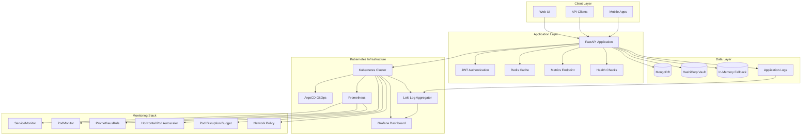

# NativeSeries - Enterprise-Grade Kubernetes Application Platform

[](https://kubernetes.io/)
[](https://www.docker.com/)
[](https://fastapi.tiangolo.com/)
[](https://prometheus.io/)
[](https://grafana.com/)
[](https://argoproj.github.io/argo-cd/)
[](https://helm.sh/)
[](https://grafana.com/oss/loki/)

## 📋 Table of Contents

- [Overview](#overview)
- [Key Features](#key-features)
- [Architecture](#architecture)
- [Technology Stack](#technology-stack)
- [Quick Start](#quick-start)
- [Installation](#installation)
- [Production Deployment](#production-deployment)
- [Monitoring & Observability](#monitoring--observability)
- [Security & Auto-scaling](#security--auto-scaling)
- [Development](#development)
- [API Documentation](#api-documentation)
- [Troubleshooting](#troubleshooting)
- [Contributing](#contributing)

## 🎯 Overview

NativeSeries is a comprehensive, enterprise-grade application platform built on Kubernetes that demonstrates modern DevOps practices, GitOps workflows, and full-stack observability. This platform serves as a complete reference implementation for deploying scalable, secure, and observable applications in production environments.

### Core Objectives

- **Production-Ready Infrastructure**: Complete Kubernetes deployment with monitoring, logging, and security
- **GitOps Implementation**: Automated deployment using ArgoCD and Helm
- **Full Observability**: Integrated Prometheus, Grafana, and Loki for comprehensive monitoring
- **Security-First Design**: Secrets management, network policies, and RBAC implementation
- **Auto-scaling Capabilities**: Horizontal Pod Autoscaler with intelligent scaling policies
- **High Availability**: Pod Disruption Budgets and health checks for reliability

## ✨ Key Features

### 🚀 **Core Application**
- **FastAPI Backend**: High-performance REST API with automatic documentation
- **MongoDB Integration**: Scalable document database with connection pooling
- **Redis Caching**: In-memory caching for improved performance
- **JWT Authentication**: Secure token-based authentication system
- **Comprehensive API**: CRUD operations with validation and error handling

### 🔍 **Monitoring & Observability**
- **Prometheus Metrics**: Custom application metrics and Kubernetes monitoring
- **Grafana Dashboards**: Real-time visualization and alerting
- **Loki Log Aggregation**: Centralized log collection and querying
- **Custom Alert Rules**: Application-specific monitoring and alerting
- **Service Monitoring**: Automatic service discovery and monitoring

### 🛡️ **Security & Configuration**
- **Kubernetes Secrets**: Secure credential management
- **ConfigMaps**: Environment-specific configuration
- **Network Policies**: Traffic control and security
- **RBAC Implementation**: Role-based access control
- **Security Contexts**: Pod and container security policies

### ⚡ **Auto-scaling & High Availability**
- **Horizontal Pod Autoscaler**: CPU and memory-based scaling
- **Pod Disruption Budget**: Ensures minimum availability during updates
- **Health Checks**: Liveness and readiness probes
- **Resource Limits**: CPU and memory constraints
- **Rolling Updates**: Zero-downtime deployments

## 🏗️ Architecture

### System Architecture



### Monitoring Architecture

```
┌─────────────────┐    ┌─────────────────┐    ┌─────────────────┐
│   Application   │    │   Prometheus    │    │     Grafana     │
│   (nativeseries)│◄──►│   (Monitoring)  │◄──►│   (Dashboard)   │
└─────────────────┘    └─────────────────┘    └─────────────────┘
         │                       │                       │
         │                       │                       │
         ▼                       ▼                       ▼
┌─────────────────┐    ┌─────────────────┐    ┌─────────────────┐
│      Loki       │    │  ServiceMonitor │    │  PrometheusRule│
│   (Logging)     │    │   (Metrics)     │    │   (Alerts)     │
└─────────────────┘    └─────────────────┘    └─────────────────┘
```

## 🛠️ Technology Stack

### Backend
- **FastAPI**: Modern Python web framework
- **Python 3.13**: Latest Python version
- **Uvicorn**: ASGI server for FastAPI
- **Pydantic**: Data validation and settings management

### Database & Caching
- **MongoDB**: Document database for data persistence
- **Redis**: In-memory caching layer
- **In-Memory Fallback**: Graceful degradation when external DB unavailable

### Containerization & Orchestration
- **Docker**: Container runtime and image building
- **Kubernetes**: Container orchestration platform
- **Kind**: Local Kubernetes cluster for development
- **Helm**: Kubernetes package manager

### GitOps & CI/CD
- **ArgoCD**: GitOps continuous deployment
- **GitHub Actions**: CI/CD pipeline automation
- **Git**: Version control and collaboration

### Monitoring & Observability
- **Prometheus**: Metrics collection and storage
- **Grafana**: Metrics visualization and dashboards
- **Loki**: Log aggregation and querying
- **ServiceMonitor**: Kubernetes service monitoring
- **PodMonitor**: Pod-level metrics collection

### Security & Scaling
- **Kubernetes Secrets**: Secure credential management
- **ConfigMaps**: Configuration management
- **Network Policies**: Traffic control and security
- **Horizontal Pod Autoscaler**: Automatic scaling
- **Pod Disruption Budget**: High availability

## 🚀 Quick Start

### Prerequisites

- **Operating System**: Linux (Ubuntu 20.04+, CentOS 8+, Amazon Linux 2)
- **Memory**: Minimum 8GB RAM (16GB recommended for monitoring stack)
- **Storage**: Minimum 50GB free space (for monitoring data)
- **Network**: Internet connection for downloading dependencies

### Automated Installation

```bash
# Clone the repository
git clone https://github.com/bonaventuresimeon/nativeseries.git
cd nativeseries

# Run the automated installation script
chmod +x scripts/install-all.sh
./scripts/install-all.sh
```

This script will install:
1. All required tools (Docker, kubectl, Helm, Kind, ArgoCD)
2. Kubernetes cluster with Kind
3. Application deployment
4. **Monitoring stack (Prometheus + Grafana)**
5. **Logging stack (Loki)**
6. **Secrets and ConfigMaps**
7. **Auto-scaling configuration (HPA)**
8. **Network policies and security**

### Manual Installation

```bash
# Clone the repository
git clone https://github.com/bonaventuresimeon/nativeseries.git
cd nativeseries

# Install Python dependencies
pip install -r requirements.txt

# Build Docker image
docker build -t ghcr.io/bonaventuresimeon/nativeseries:latest .

# Run locally
docker run -p 8000:8000 ghcr.io/bonaventuresimeon/nativeseries:latest
```

## 📦 Installation

### System Requirements

- **Operating System**: Linux (Ubuntu 20.04+, CentOS 8+, Amazon Linux 2)
- **Memory**: Minimum 8GB RAM (16GB recommended for monitoring stack)
- **Storage**: Minimum 50GB free space (for monitoring data)
- **Network**: Internet connection for downloading dependencies

### Required Tools

- **Python**: 3.11 or higher
- **Docker**: 20.10 or higher
- **kubectl**: 1.28 or higher
- **Helm**: 3.13 or higher
- **Kind**: 0.20.0 or higher (for local Kubernetes)
- **ArgoCD CLI**: 2.9.3 or higher

### Installation Steps

1. **System Dependencies**: Install curl, wget, git, unzip, jq
2. **Docker**: Install Docker with daemon setup
3. **kubectl**: Install latest stable kubectl
4. **Kind**: Install Kind for local Kubernetes cluster
5. **Helm**: Install Helm for package management
6. **Python**: Install Python with virtual environment
7. **ArgoCD**: Install ArgoCD CLI and server
8. **Application**: Build and deploy the application
9. **Monitoring**: Install Prometheus, Grafana, and Loki
10. **Security**: Configure secrets, ConfigMaps, and network policies

## 🌐 Production Deployment

### Production Environment

The application is deployed to production at:
- **Application**: http://54.166.101.159:30011
- **ArgoCD UI**: http://54.166.101.159:30080
- **Grafana**: http://54.166.101.159:30081
- **Prometheus**: http://54.166.101.159:30082
- **Loki**: http://54.166.101.159:30083

### Deployment Components

#### Application Deployment
- **Namespace**: `nativeseries`
- **Service**: NodePort on port 30011
- **Replicas**: 2-10 (auto-scaled)
- **Health Checks**: Liveness and readiness probes
- **Resource Limits**: CPU and memory constraints

#### Monitoring Stack
- **Namespace**: `monitoring`
- **Prometheus**: Metrics collection and storage
- **Grafana**: Dashboards and visualization
- **ServiceMonitor**: Application metrics monitoring
- **PodMonitor**: Pod-level metrics collection

#### Logging Stack
- **Namespace**: `logging`
- **Loki**: Log aggregation and querying
- **Log Forwarding**: Application logs to Loki
- **Grafana Integration**: Log visualization in Grafana

#### Security Configuration
- **Secrets**: Database and API credentials
- **ConfigMaps**: Application configuration
- **Network Policies**: Traffic control and security
- **RBAC**: Role-based access control

#### Auto-scaling
- **HPA**: Horizontal Pod Autoscaler
- **Min Replicas**: 2
- **Max Replicas**: 10
- **CPU Threshold**: 70%
- **Memory Threshold**: 80%

## 🔍 Monitoring & Observability

### Prometheus & Grafana

**Access URLs:**
- Grafana: `http://54.166.101.159:30081` (admin/admin123)
- Prometheus: `http://54.166.101.159:30082`

**Components:**
- Prometheus Operator for metrics collection
- Grafana dashboards for visualization
- ServiceMonitor for application metrics
- PodMonitor for pod-level metrics
- PrometheusRule for alerting

### Loki Logging

**Access URL:**
- Loki: `http://54.166.101.159:30083`

**Components:**
- Loki server for log aggregation
- Log forwarding from application pods
- Log querying and visualization in Grafana

### Application Metrics

The application exposes the following metrics:
- **Health Status**: Application health and readiness
- **Request Metrics**: HTTP request counts and latencies
- **Resource Usage**: CPU and memory consumption
- **Custom Metrics**: Application-specific metrics

### Alerting Rules

Configured alerts for:
- **High CPU Usage**: CPU > 80% for 5 minutes
- **High Memory Usage**: Memory > 85% for 5 minutes
- **Pod Restarts**: Pod restart count > 3 in 10 minutes
- **Service Availability**: Service down for > 2 minutes

## 🛡️ Security & Auto-scaling

### Security Features

#### Kubernetes Secrets
- **Database Credentials**: MongoDB connection secrets
- **API Keys**: JWT secrets and API keys
- **Base64 Encoded**: Secure credential storage

#### ConfigMaps
- **Application Config**: Environment-specific settings
- **Logging Config**: Log level and format configuration
- **Monitoring Config**: Metrics collection settings

#### Network Policies
- **Ingress Rules**: Allow traffic from ingress-nginx and monitoring
- **Egress Rules**: Allow database access and DNS resolution
- **Pod Isolation**: Restrict unnecessary network access

#### Security Contexts
- **Non-root Execution**: Containers run as non-root user
- **Read-only Filesystem**: Where applicable
- **Resource Limits**: CPU and memory constraints

### Auto-scaling Configuration

#### Horizontal Pod Autoscaler
- **Min Replicas**: 2
- **Max Replicas**: 10
- **CPU Threshold**: 70%
- **Memory Threshold**: 80%
- **Scale Down Delay**: 5 minutes
- **Scale Up Delay**: 3 minutes

#### Pod Disruption Budget
- **Min Available**: 1 pod
- **Ensures**: High availability during updates
- **Rolling Updates**: Zero-downtime deployments

#### Resource Management
- **CPU Requests**: 100m
- **CPU Limits**: 500m
- **Memory Requests**: 128Mi
- **Memory Limits**: 512Mi

## 🧪 Testing

### Health Checks

```bash
# Application health
curl http://54.166.101.159:30011/health

# Metrics endpoint
curl http://54.166.101.159:30011/metrics

# API documentation
curl http://54.166.101.159:30011/docs
```

### Monitoring Tests

```bash
# Run monitoring tests
./scripts/test-monitoring.sh

# Check application status
kubectl get pods -n nativeseries

# Check monitoring stack
kubectl get pods -n monitoring

# Check logging stack
kubectl get pods -n logging
```

### Smoke Tests

```bash
# Run smoke tests
./scripts/smoke-tests.sh

# Validate deployment
./scripts/validate-deployment.sh
```

## 🔧 Development

### Local Development

```bash
# Create virtual environment
python3 -m venv venv
source venv/bin/activate

# Install dependencies
pip install -r requirements.txt

# Run development server
uvicorn app.main:app --reload --host 0.0.0.0 --port 8000
```

### Docker Development

```bash
# Build development image
docker build -t nativeseries:dev .

# Run with volume mount
docker run -p 8000:8000 -v $(pwd):/app nativeseries:dev
```

### Kubernetes Development

```bash
# Create Kind cluster
kind create cluster --name nativeseries

# Deploy to cluster
kubectl apply -f helm-chart/

# Access application
kubectl port-forward svc/nativeseries 30011:30011
```

## 📚 API Documentation

### Interactive Documentation

- **Swagger UI**: http://54.166.101.159:30011/docs
- **ReDoc**: http://54.166.101.159:30011/redoc
- **OpenAPI JSON**: http://54.166.101.159:30011/openapi.json

### API Endpoints

#### Health & System
- `GET /health` - Application health check
- `GET /metrics` - Prometheus metrics
- `GET /` - Application homepage
- `GET /about` - Application information

#### Students API
- `GET /students` - List all students
- `POST /students` - Create new student
- `GET /students/{id}` - Get student by ID
- `PUT /students/{id}` - Update student
- `DELETE /students/{id}` - Delete student

#### Courses API
- `GET /courses` - List all courses
- `POST /courses` - Create new course
- `GET /courses/{id}` - Get course by ID
- `PUT /courses/{id}` - Update course
- `DELETE /courses/{id}` - Delete course

## 🐛 Troubleshooting

### Common Issues

#### Installation Issues
1. **Docker not starting**: Check Docker daemon and permissions
2. **kubectl not found**: Ensure kubectl is in PATH
3. **Helm installation failed**: Check network connectivity
4. **Kind cluster creation failed**: Ensure Docker is running

#### Application Issues
1. **Application not starting**: Check logs with `kubectl logs`
2. **Database connection failed**: Verify MongoDB configuration
3. **Health checks failing**: Check application configuration
4. **Metrics not appearing**: Verify ServiceMonitor configuration

#### Monitoring Issues
1. **Grafana not accessible**: Check NodePort service
2. **Prometheus not collecting metrics**: Verify ServiceMonitor
3. **Loki logs not appearing**: Check log forwarding configuration
4. **Alerts not firing**: Verify PrometheusRule configuration

### Debug Commands

```bash
# Check application logs
kubectl logs -f deployment/nativeseries -n nativeseries

# Check monitoring logs
kubectl logs -f deployment/prometheus -n monitoring
kubectl logs -f deployment/grafana -n monitoring

# Check Loki logs
kubectl logs -f deployment/loki -n logging

# Check cluster status
kubectl get nodes
kubectl get pods --all-namespaces

# Check services
kubectl get svc --all-namespaces

# Check events
kubectl get events --all-namespaces --sort-by='.lastTimestamp'
```

### Log Locations

- **Application Logs**: `/app/logs/app.log`
- **Container Logs**: `kubectl logs <pod-name>`
- **System Logs**: `/var/log/`
- **Docker Logs**: `docker logs <container-id>`

## 🤝 Contributing

### Development Setup

1. Fork the repository
2. Create a feature branch
3. Make your changes
4. Add tests for new functionality
5. Ensure all tests pass
6. Submit a pull request

### Code Standards

- **Python**: Follow PEP 8 style guide
- **Docker**: Use multi-stage builds
- **Kubernetes**: Follow best practices
- **Documentation**: Keep README updated

### Testing

```bash
# Run unit tests
python -m pytest

# Run integration tests
python -m pytest tests/integration/

# Run monitoring tests
./scripts/test-monitoring.sh
```

## 📄 License

This project is licensed under the MIT License - see the [LICENSE](LICENSE) file for details.

## 🙏 Acknowledgments

- **FastAPI**: Modern Python web framework
- **Kubernetes**: Container orchestration platform
- **Prometheus**: Metrics collection and monitoring
- **Grafana**: Metrics visualization and dashboards
- **Loki**: Log aggregation and querying
- **ArgoCD**: GitOps continuous deployment

---

**🎉 Happy coding with GitOps! 🚀**
