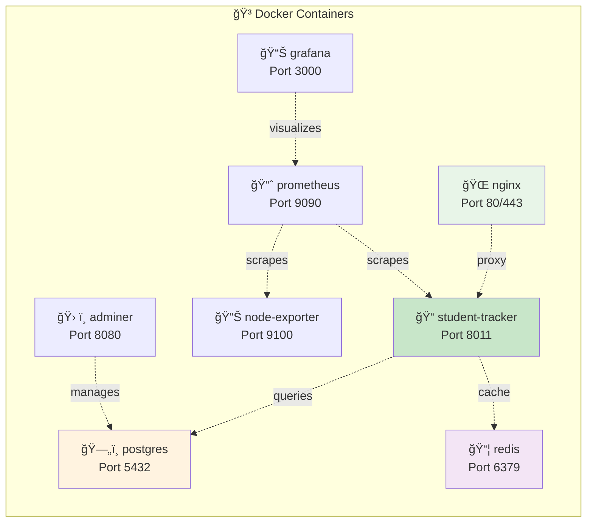

# 🎓 Student Tracker - Production Cloud-Native Application

[](http://18.206.89.183:8011)
[](https://fastapi.tiangolo.com)
[](https://docker.com)
[](https://kubernetes.io)
[](https://argoproj.github.io/argo-cd/)
[](https://postgresql.org)

**Live Production Deployment:** [http://18.206.89.183:8011](http://18.206.89.183:8011)

A production-ready, cloud-native student tracking application demonstrating modern DevOps practices, containerization, monitoring, and scalable architecture. Built with FastAPI and deployed with Docker, Kubernetes, and ArgoCD GitOps.

---

## 🌐 **Production Access Points**

| Service | Production URL | Purpose | Credentials |
|---------|----------------|---------|-------------|
| 🎓 **Main Application** | [http://18.206.89.183:8011](http://18.206.89.183:8011) | Student Tracker Interface | - |
| 📖 **API Documentation** | [http://18.206.89.183:8011/docs](http://18.206.89.183:8011/docs) | Interactive Swagger UI | - |
| 🩺 **Health Check** | [http://18.206.89.183:8011/health](http://18.206.89.183:8011/health) | System Health Status | - |
| 📊 **Metrics** | [http://18.206.89.183:8011/metrics](http://18.206.89.183:8011/metrics) | Prometheus Metrics | - |
| 🔄 **ArgoCD GitOps** | [http://18.206.89.183:30080](http://18.206.89.183:30080) | GitOps Management | admin / (see .argocd-password) |
| 📈 **Grafana** | [http://18.206.89.183:3000](http://18.206.89.183:3000) | Monitoring Dashboards | admin / admin123 |
| 📊 **Prometheus** | [http://18.206.89.183:9090](http://18.206.89.183:9090) | Metrics Collection | - |
| 🗄️ **Database Admin** | [http://18.206.89.183:8080](http://18.206.89.183:8080) | Adminer Interface | student_user / student_pass |

---

## 🏗️ **System Architecture**

### High-Level Architecture Diagram

```mermaid
graph TB
    User[👤 End Users] --> LB[🌐 Load Balancer<br/>Nginx<br/>18.206.89.183:80/443]
    
    LB --> App[🎓 Student Tracker API<br/>FastAPI<br/>18.206.89.183:8011]
    
    App --> DB[(🗄️ PostgreSQL<br/>Database<br/>18.206.89.183:5432)]
    App --> Cache[(📦 Redis Cache<br/>18.206.89.183:6379)]
    
    App --> Metrics[📊 Metrics Endpoint<br/>/metrics]
    Metrics --> Prom[📈 Prometheus<br/>18.206.89.183:9090]
    Prom --> Graf[📊 Grafana<br/>18.206.89.183:3000]
    
    DB --> Admin[🛠️ Adminer<br/>DB Admin<br/>18.206.89.183:8080]
    
    Git[📚 Git Repository] --> Argo[🔄 ArgoCD<br/>GitOps<br/>18.206.89.183:30080]
    Argo --> K8s[☸️ Kubernetes<br/>Cluster]
    K8s --> App
    
    style User fill:#e1f5fe
    style App fill:#c8e6c9
    style DB fill:#fff3e0
    style Cache fill:#f3e5f5
    style LB fill:#e8f5e8
    style Prom fill:#ffe0b2
    style Graf fill:#fce4ec
    style Argo fill:#e3f2fd
```



### Container Architecture



### GitOps Workflow

```mermaid
sequenceDiagram
    participant Dev as 👨‍💻 Developer
    participant Git as 📚 Git Repository
    participant Argo as 🔄 ArgoCD
    participant K8s as ☸️ Kubernetes
    participant App as 🎓 Application
    
    Dev->>Git: Push code changes
    Git->>Argo: Detect changes
    Argo->>K8s: Deploy new version
    K8s->>App: Update application
    App->>Dev: Confirm deployment
```



---

## 🚀 **Quick Start Guide**

### Option 1: Docker Compose Deployment (Recommended for Quick Setup)

```bash
# 1. Clone the repository on target server
git clone <your-repository-url>
cd student-tracker

# 2. Run the automated deployment script
chmod +x deploy-docker-compose.sh
./deploy-docker-compose.sh

# 3. Verify deployment
./check-deployment.sh
```

### Option 2: ArgoCD GitOps Deployment (Recommended for Production)

```bash
# 1. Clone the repository on target server
git clone <your-repository-url>
cd student-tracker

# 2. Run the automated GitOps deployment script
chmod +x deploy-to-server.sh
./deploy-to-server.sh

# 3. Verify deployment
./check-deployment.sh
```

### Option 3: Local Development

```bash
# 1. Fast development setup
./scripts/dev-setup.sh

# 2. Choose option 1 for Python development
# OR option 2 for full Docker stack
```

---

## 🛠️ **Technology Stack**

### Core Application Stack

| Component | Technology | Version | Production Port | Purpose |
|-----------|------------|---------|-----------------|---------|
| **API Backend** | FastAPI | 0.110+ | 8011 | High-performance Python web framework |
| **Database** | PostgreSQL | 16-alpine | 5432 | Primary data storage with ACID compliance |
| **Cache Layer** | Redis | 7-alpine | 6379 | Session storage and performance caching |
| **Web Server** | Nginx | alpine | 80/443 | Reverse proxy and SSL termination |
| **Runtime** | Python | 3.13+ | - | Modern Python runtime environment |

### Monitoring & Operations Stack

| Component | Technology | Production Port | Purpose |
|-----------|------------|-----------------|---------|
| **GitOps** | ArgoCD | 30080 | Continuous deployment automation |
| **Metrics** | Prometheus | 9090 | Metrics collection and alerting |
| **Dashboards** | Grafana | 3000 | Visualization and analytics |
| **System Metrics** | Node Exporter | 9100 | Host system monitoring |
| **DB Admin** | Adminer | 8080 | Database administration interface |

### Infrastructure & DevOps

| Component | Technology | Purpose |
|-----------|------------|---------|
| **Containerization** | Docker & Docker Compose | Application packaging and deployment |
| **Orchestration** | Kubernetes + Helm | Container orchestration and management |
| **GitOps** | ArgoCD | Continuous deployment automation |
| **CI/CD** | GitHub Actions | Automated testing and deployment |
| **Load Balancing** | Nginx | Traffic distribution and SSL termination |

---

## 📁 **Project Structure**

```
Student-Tracker/
├── 🎓 app/                          # FastAPI Application
│   ├── main.py                      # Production-configured main app
│   ├── models.py                    # SQLAlchemy database models
│   ├── crud.py                      # Database operations
│   ├── database.py                  # Database configuration
│   └── routes/                      # API route modules
│
├── 🐳 docker/                       # Container Configurations
│   ├── Dockerfile                   # Multi-stage application container
│   ├── nginx.conf                   # Production Nginx configuration
│   ├── redis.conf                   # Redis cache configuration
│   └── prometheus.yml               # Monitoring configuration
│
├── ☸️ infra/                        # Infrastructure as Code
│   ├── helm/                        # Kubernetes Helm charts
│   │   ├── Chart.yaml               # Chart metadata
│   │   ├── values.yaml              # Production values
│   │   └── templates/               # K8s resource templates
│   ├── argocd/                      # GitOps configurations
│   └── kind/                        # Local cluster setup
│
├── 🛠️ scripts/                      # Automation Scripts
│   ├── install-all.sh               # Complete production setup
│   ├── dev-setup.sh                 # Development environment
│   ├── deploy-all.sh                # GitOps deployment
│   ├── setup-argocd.sh              # ArgoCD setup
│   └── init-db.sql                  # Database schema & sample data
│
├── 🚀 deploy-*.sh                   # Deployment Scripts
│   ├── deploy-docker-compose.sh     # Docker Compose deployment
│   ├── deploy-to-server.sh          # ArgoCD GitOps deployment
│   └── check-deployment.sh          # Status check script
│
├── 📖 docs/                         # Documentation
│   ├── DEPLOYMENT_GUIDE.md          # Comprehensive deployment guide
│   └── DEPLOYMENT_SUMMARY.md        # Quick reference
│
├── 🎨 templates/                    # Web UI Templates
├── 📋 requirements.txt              # Python dependencies
├── 🐳 docker-compose.yml            # Production stack definition
└── 📖 README.md                     # This comprehensive guide
```

---

## 🌟 **Features & Capabilities**

### 🎯 **Core Application Features**

- **👥 Student Management**
  - Complete CRUD operations for student records
  - Student registration and profile management
  - Enrollment tracking and status monitoring

- **📚 Course Management**
  - Multi-course enrollment system
  - Course creation and administration
  - Instructor assignment and management

- **📊 Progress Tracking**
  - Week-by-week progress monitoring
  - Performance analytics and reporting
  - Custom progress indicators and milestones

- **📝 Assignment System**
  - Assignment creation and distribution
  - Submission tracking and management
  - Grading and feedback workflows

- **🌐 Modern Web Interface**
  - Responsive design for all devices
  - Interactive dashboards and visualizations
  - Real-time updates and notifications

### 🔧 **Technical Features**

- **🚀 High Performance**
  - Async FastAPI framework for maximum throughput
  - Redis caching for optimal response times
  - Connection pooling and database optimization

- **📊 Comprehensive Monitoring**
  - Prometheus metrics collection
  - Grafana dashboards for visualization
  - Health checks for all system components
  - Performance tracking and alerting

- **🛡️ Production Security**
  - SSL/TLS encryption with proper certificates
  - Security headers (HSTS, CSP, XSS protection)
  - Rate limiting and DDoS protection
  - Input validation and SQL injection prevention

- **🔄 DevOps Ready**
  - Docker containerization with multi-stage builds
  - Kubernetes deployment with Helm charts
  - GitOps workflow with ArgoCD
  - CI/CD pipeline with GitHub Actions

---

## 🚀 **Deployment Guide**

### **Production Deployment on 18.206.89.183**

#### Prerequisites
- Ubuntu 20.04+ or CentOS 8+
- Minimum 4GB RAM, 20GB storage
- Open ports: 80, 443, 8011, 5432, 6379, 30080, 9090, 3000, 8080
- Sudo access for installation

#### Automated Deployment Options

**Option A: Docker Compose (Quick Setup)**
```bash
# Clone and deploy
git clone <your-repository-url>
cd student-tracker
chmod +x deploy-docker-compose.sh
./deploy-docker-compose.sh
```

**Option B: ArgoCD GitOps (Production)**
```bash
# Clone and deploy with GitOps
git clone <your-repository-url>
cd student-tracker
chmod +x deploy-to-server.sh
./deploy-to-server.sh
```

#### Manual Deployment Steps

1. **Server Preparation**
   ```bash
   # Update system
   sudo apt update && sudo apt upgrade -y
   
   # Install Docker
   curl -fsSL https://get.docker.com -o get-docker.sh
   sudo sh get-docker.sh
   sudo usermod -aG docker $USER
   ```

2. **Application Deployment**
   ```bash
   # Deploy with Docker Compose
   docker-compose up -d --build
   
   # Or deploy with Kubernetes/ArgoCD
   ./scripts/install-all.sh
   ```

3. **Verification**
   ```bash
   # Check deployment status
   ./check-deployment.sh
   
   # Test application
   curl http://18.206.89.183:8011/health
   ```

---

## 🔧 **Management & Operations**

### **Docker Compose Management**
```bash
# View logs
docker-compose logs -f student-tracker

# Restart application
docker-compose restart student-tracker

# Scale application
docker-compose up -d --scale student-tracker=3

# Stop all services
docker-compose down

# Update application
docker-compose pull && docker-compose up -d
```

### **ArgoCD/Kubernetes Management**
```bash
# Check application status
kubectl get applications -n argocd

# View pods
kubectl get pods -n app-prod

# View logs
kubectl logs -f deployment/student-tracker -n app-prod

# Scale application
kubectl scale deployment student-tracker --replicas=3 -n app-prod

# Update with Helm
helm upgrade student-tracker infra/helm --values infra/helm/values-prod.yaml -n app-prod
```

### **Monitoring & Health Checks**
```bash
# Check deployment status
./check-deployment.sh

# Application health
curl http://18.206.89.183:8011/health

# Database connectivity
docker-compose exec postgres pg_isready -U student_user -d student_db
```

---

## 🔒 **Security & Best Practices**

### **Security Features**
- SSL/TLS encryption with proper certificates
- Security headers (HSTS, CSP, XSS protection)
- Rate limiting and DDoS protection
- Input validation and SQL injection prevention
- Database access restrictions
- Container security scanning

### **Production Hardening**
```bash
# Configure firewall
sudo ufw allow 80/tcp
sudo ufw allow 443/tcp
sudo ufw allow 8011/tcp
sudo ufw allow 5432/tcp
sudo ufw allow 6379/tcp
sudo ufw allow 30080/tcp
sudo ufw allow 9090/tcp
sudo ufw allow 3000/tcp
sudo ufw allow 8080/tcp

# Change default passwords
# Update database credentials
# Configure SSL certificates
# Set up monitoring alerts
```

---

## 📊 **Monitoring & Observability**

### **Metrics & Dashboards**
- **Prometheus**: Metrics collection at `/metrics`
- **Grafana**: Pre-configured dashboards for application and system metrics
- **Health Checks**: Comprehensive health monitoring
- **Log Aggregation**: Centralized logging with structured logs

### **Key Metrics**
- Request counts and response times
- Database connection status and performance
- Redis cache hit rates
- System resource usage (CPU, Memory, Disk)
- Error rates and availability

---

## 🔄 **CI/CD & GitOps**

### **GitOps Workflow**
1. **Code Changes**: Push to Git repository
2. **ArgoCD Detection**: Automatic change detection
3. **Deployment**: Automated deployment to Kubernetes
4. **Verification**: Health checks and monitoring
5. **Rollback**: Automatic rollback on failures

### **GitHub Actions Pipeline**
- Automated testing on pull requests
- Security scanning and vulnerability checks
- Docker image building and pushing
- Deployment to staging and production

---

## 🛠️ **Development & Contributing**

### **Local Development Setup**
```bash
# Quick development setup
./scripts/dev-setup.sh

# Or manual setup
python -m venv venv
source venv/bin/activate
pip install -r requirements.txt
uvicorn app.main:app --reload
```

### **Testing**
```bash
# Run tests
pytest

# Run with coverage
pytest --cov=app

# Run specific test file
pytest app/test_main.py
```

### **Code Quality**
- Type hints and mypy validation
- Black code formatting
- Flake8 linting
- Pre-commit hooks

---

## 📚 **API Documentation**

### **Interactive Documentation**
- **Swagger UI**: [http://18.206.89.183:8011/docs](http://18.206.89.183:8011/docs)
- **ReDoc**: [http://18.206.89.183:8011/redoc](http://18.206.89.183:8011/redoc)
- **OpenAPI Schema**: [http://18.206.89.183:8011/openapi.json](http://18.206.89.183:8011/openapi.json)

### **Key Endpoints**
- `GET /` - Application home page
- `GET /health` - Health check endpoint
- `GET /metrics` - Prometheus metrics
- `GET /docs` - Interactive API documentation
- `GET /students` - Student management
- `GET /courses` - Course management

---

## 🆘 **Troubleshooting**

### **Common Issues**

1. **Port Already in Use**
   ```bash
   sudo netstat -tulpn | grep :8011
   sudo kill -9 <PID>
   ```

2. **Database Connection Issues**
   ```bash
   docker-compose exec postgres pg_isready -U student_user -d student_db
   docker-compose logs postgres
   ```

3. **Application Not Starting**
   ```bash
   docker-compose logs student-tracker
   curl http://18.206.89.183:8011/health
   ```

4. **ArgoCD Sync Issues**
   ```bash
   kubectl get applications -n argocd
   kubectl logs -f deployment/argocd-server -n argocd
   ```

### **Log Locations**
- **Application**: `logs/app.log`
- **Docker**: `docker-compose logs`
- **Kubernetes**: `kubectl logs`
- **System**: `/var/log/syslog`

---

## 📞 **Support & Resources**

### **Documentation**
- **Deployment Guide**: `DEPLOYMENT_GUIDE.md`
- **Quick Reference**: `DEPLOYMENT_SUMMARY.md`
- **Application Docs**: [http://18.206.89.183:8011/docs](http://18.206.89.183:8011/docs)

### **Monitoring & Status**
- **Health Check**: [http://18.206.89.183:8011/health](http://18.206.89.183:8011/health)
- **Metrics**: [http://18.206.89.183:8011/metrics](http://18.206.89.183:8011/metrics)
- **Status Check**: `./check-deployment.sh`

### **Contact & Support**
- **GitHub Issues**: [Report bugs and feature requests](https://github.com/bonaventuresimeon/NativeSeries/issues)
- **Documentation**: Comprehensive guides and tutorials
- **Community**: Join our development community

---

## 📄 **License**

This project is licensed under the MIT License - see the [License.md](License.md) file for details.

---

## 🙏 **Acknowledgments**

- **FastAPI** - Modern, fast web framework for building APIs
- **Docker** - Containerization platform
- **Kubernetes** - Container orchestration
- **ArgoCD** - GitOps continuous delivery
- **PostgreSQL** - Reliable database system
- **Redis** - In-memory data structure store
- **Prometheus & Grafana** - Monitoring and observability

---

**🎉 Ready to deploy?** Choose your deployment method and get started with the Student Tracker application!

**Live Demo**: [http://18.206.89.183:8011](http://18.206.89.183:8011)
