# 🎓 Student Tracker

A comprehensive student tracking application built with FastAPI, featuring modern web interfaces, REST APIs, and production-ready deployment configurations.

## 🏗️ System Architecture


## 🔄 Deployment Pipeline

```mermaid
flowchart TD
    A[Code Push] --> B[GitHub Actions Trigger]
    B --> C[Security Scan]
    B --> D[Code Quality Check]
    B --> E[Helm Validation]
    
    C --> F{All Checks Pass?}
    D --> F
    E --> F
    
    F -->|Yes| G[Build Docker Image]
    F -->|No| H[Fail with Details]
    
    G --> I[Push to Registry]
    I --> J{Environment?}
    
    J -->|Main Branch| K[Deploy to Production]
    J -->|Develop Branch| L[Deploy to Staging]
    J -->|Manual| M[Manual Deployment]
    
    K --> N[Kubernetes + ArgoCD]
    L --> O[Staging Environment]
    M --> P[EC2 Deployment]
    
    N --> Q[Health Check]
    O --> Q
    P --> Q
    
    Q -->|Success| R[✅ Deployment Complete]
    Q -->|Failure| S[❌ Rollback]
    
    style A fill:#e1f5fe
    style R fill:#c8e6c9
    style S fill:#ffcdd2
```



## 🌟 Features

- **Student Management** - Complete CRUD operations for student records
- **Progress Tracking** - Weekly progress monitoring and analytics
- **Modern UI** - Responsive web interface with real-time updates
- **REST API** - Full RESTful API with OpenAPI documentation
- **Production Ready** - Docker, Kubernetes, and ArgoCD deployment
- **Monitoring** - Health checks and metrics for production deployment
- **Security** - Vulnerability scanning and code quality checks

## 🚀 Quick Start

### Prerequisites

- Python 3.11+
- Docker (for production deployment)
- kubectl, Helm, ArgoCD (for Kubernetes deployment)

### Local Development

1. **Clone the repository**
   ```bash
   git clone https://github.com/bonaventuresimeon/NativeSeries.git
   cd NativeSeries
   ```

2. **Install dependencies**
   ```bash
   python3 -m venv venv
   source venv/bin/activate
   pip install -r requirements.txt
   ```

3. **Run the application**
   ```bash
   uvicorn app.main:app --host 0.0.0.0 --port 8000 --reload
   ```

4. **Access the application**
   - Web Interface: http://localhost:8000
   - API Documentation: http://localhost:8000/docs
   - Health Check: http://localhost:8000/health

## 🏗️ Deployment Options

### 1. Docker Deployment (Recommended for Production)

```bash
# Build and deploy to production
./deploy.sh production

# Access the application
curl http://18.206.89.183:30011/health
```

### 2. Local Kubernetes Development

```bash
# Set up local development environment
./deploy.sh local

# Access the application
# Student Tracker: http://student-tracker.local:30011
# ArgoCD UI: http://localhost:30080
```

### 3. GitHub Actions (Automated CI/CD)

The project includes comprehensive GitHub Actions workflows:

- **Unified Deployment Pipeline** (`.github/workflows/unified-deploy.yml`)
  - Security scanning (Trivy + Bandit)
  - Code quality checks (Black, Flake8, MyPy)
  - Helm chart validation
  - Multi-platform Docker builds
  - Staging and production deployments

- **EC2 Deployment Pipeline** (`.github/workflows/ec2-deploy.yml`)
  - Automated EC2 deployment
  - Health checks and verification
  - Rollback capabilities

### 4. Manual Kubernetes Deployment

```bash
# Validate configurations
./deploy.sh validate

# Generate manifests
./deploy.sh manifests

# Apply to cluster
kubectl apply -f manifests/production.yaml
```

## 📁 Project Structure

```
NativeSeries/
├── app/                    # Application source code
│   ├── main.py            # FastAPI application entry point
│   ├── crud.py            # Database operations
│   ├── database.py        # Database configuration
│   ├── models.py          # Data models
│   ├── routes/            # API route modules
│   └── test_*.py          # Test files
├── helm-chart/            # Kubernetes Helm chart
│   ├── Chart.yaml         # Chart metadata
│   ├── values.yaml        # Default values
│   └── templates/         # Kubernetes manifests
├── argocd/                # ArgoCD configuration
│   └── application.yaml   # ArgoCD application
├── .github/workflows/     # GitHub Actions workflows
├── templates/             # HTML templates
├── deploy.sh              # Deployment script
├── Dockerfile             # Docker configuration
├── requirements.txt       # Python dependencies
└── LICENSE               # MIT License with additional terms
```

## 🔧 Configuration

### Environment Variables

| Variable | Description | Default |
|----------|-------------|---------|
| `ENVIRONMENT` | Application environment | `production` |
| `MONGO_URI` | MongoDB connection string | `mongodb://localhost:27017` |
| `DATABASE_NAME` | Database name | `student_project_tracker` |
| `COLLECTION_NAME` | Collection name | `students` |
| `HOST` | Application host | `0.0.0.0` |
| `PORT` | Application port | `8000` |

### Production URLs

- **Application**: http://18.206.89.183:30011
- **API Documentation**: http://18.206.89.183:30011/docs
- **Health Check**: http://18.206.89.183:30011/health
- **Metrics**: http://18.206.89.183:30011/metrics

## 🧪 Testing

### Run Basic Tests

```bash
cd app
python test_basic.py
```

### Run Pytest Tests

```bash
pytest app/test_*.py -v
```

### Code Quality Checks

```bash
# Format code
black app/

# Lint code
flake8 app/ --max-line-length=88 --extend-ignore=E203,W503,F401,F541,W293

# Type checking
mypy app/ --ignore-missing-imports
```

## 📊 Monitoring

### Health Check Endpoint

```bash
curl http://18.206.89.183:30011/health
```

Response:
```json
{
  "status": "healthy",
  "timestamp": "2025-08-03T04:12:54.069431",
  "version": "1.1.0",
  "uptime_seconds": 151,
  "request_count": 5,
  "production_url": "http://18.206.89.183:30011",
  "database": "healthy",
  "environment": "production",
  "services": {
    "api": "healthy",
    "database": "healthy",
    "cache": "healthy"
  }
}
```

### Metrics Endpoint

```bash
curl http://18.206.89.183:30011/metrics
```

Returns Prometheus-compatible metrics including:
- Request count and rate
- Response times
- Error rates
- System uptime
- Memory usage

## 🚀 Deployment Scripts

### deploy.sh

The main deployment script with multiple options:

```bash
# Show help
./deploy.sh help

# Install dependencies
./deploy.sh install-deps

# Validate configurations
./deploy.sh validate

# Deploy to production (Docker)
./deploy.sh production

# Set up local development (kind + ArgoCD)
./deploy.sh local

# Generate deployment manifests
./deploy.sh manifests

# Clean up local environment
./deploy.sh cleanup
```

## 🔒 Security

### Security Scanning

The GitHub Actions workflows include:

- **Trivy** - Container vulnerability scanning
- **Bandit** - Python security linting
- **Code quality checks** - Black, Flake8, MyPy

### Security Features

- Input validation and sanitization
- CORS configuration
- Trusted host middleware
- Security headers
- Non-root container execution

## 🐛 Troubleshooting

### Common Issues

1. **Docker not running**
   ```bash
   sudo systemctl start docker
   sudo usermod -aG docker $USER
   ```

2. **Port already in use**
   ```bash
   sudo lsof -i :30011
   sudo kill -9 <PID>
   ```

3. **Kubernetes cluster not available**
   ```bash
   ./deploy.sh local  # Sets up local cluster
   ```

4. **Application not responding**
   ```bash
   sudo docker logs student-tracker
   curl http://localhost:30011/health
   ```

### Logs

```bash
# View application logs
sudo docker logs -f student-tracker

# View system logs
journalctl -u docker.service -f
```

## 🤝 Contributing

1. Fork the repository
2. Create a feature branch
3. Make your changes
4. Run tests and quality checks
5. Submit a pull request

### Development Guidelines

- Follow PEP 8 style guidelines
- Write tests for new features
- Update documentation
- Use conventional commit messages

## 📄 License

This project is licensed under the **MIT License** with additional terms and conditions.

### License Summary

- **MIT License** - Standard MIT terms apply
- **Attribution Required** - Must include "Student Tracker by Bonaventure Simeon"
- **Educational Use** - Free for educational institutions
- **Commercial Use** - Requires written permission
- **Data Privacy** - Users responsible for compliance with local laws

### Key License Terms

1. **Attribution**: Any distribution must include attribution to the original author
2. **Educational Use**: Free for educational purposes
3. **Commercial Use**: Requires written permission from Bonaventure Simeon
4. **Modifications**: Allowed with proper attribution and modification notice
5. **Liability**: Software provided "as-is" without warranty

### Contact for Licensing

For questions about this license or commercial licensing:

- **Email**: contact@bonaventure.org.ng
- **GitHub**: https://github.com/bonaventuresimeon
- **Full License**: See [LICENSE](LICENSE) file for complete terms

## 🙏 Acknowledgments

- FastAPI for the excellent web framework
- Docker for containerization
- Kubernetes for orchestration
- ArgoCD for GitOps deployment
- GitHub Actions for CI/CD automation

## 📞 Support

For support and questions:

- **Issues**: [GitHub Issues](https://github.com/bonaventuresimeon/NativeSeries/issues)
- **Email**: contact@bonaventure.org.ng
- **Documentation**: [API Docs](http://18.206.89.183:30011/docs)

---

**Made with ❤️ by Bonaventure Simeon**

*Student Tracker - Empowering Education Through Technology*
