# 🚀 My Application - Helm & ArgoCD Deployment

## 👨‍💻 **Author**

**Bonaventure Simeon**  
📧 Email: [contact@bonaventure.org.ng](mailto:contact@bonaventure.org.ng)  
📱 Phone: [+234 (812) 222 5406](tel:+2348122225406)

---

## 🎯 **Overview**

This is a modern application deployment platform using Helm charts and ArgoCD for GitOps automation. The platform provides complete deployment automation, health monitoring, and infrastructure management with integrated CI/CD pipelines and cluster management capabilities.

---

## 🌟 **Quick Start - One Command Deployment**

### **🚀 Helm & ArgoCD Deployment (Recommended)**
```bash
# Clone and deploy with Helm and ArgoCD
git clone <your-repository-url>
cd my-app
chmod +x scripts/deploy.sh
./scripts/deploy.sh
```

**🎉 Your application will be live at:**
- **☸️ Application**: http://your-domain.com (Production)
- **🔄 ArgoCD**: http://localhost:8080 (GitOps Management)

For detailed setup instructions, see [QUICK_START.md](QUICK_START.md).

---

## 🛠️ **Deployment Options**

The deployment script provides comprehensive deployment and management capabilities:

```bash
# Full deployment with ArgoCD and application (default)
./scripts/deploy.sh

# Choose from the following options:
# 1. Install ArgoCD and deploy application
# 2. Deploy application only (ArgoCD already installed)
# 3. Build and push Docker image only
```

### **🔧 What the Deployment Script Does:**

#### **Option 1: Full Deployment**
- ✅ Installs ArgoCD server
- ✅ Builds and pushes Docker image
- ✅ Deploys Helm chart with dependencies
- ✅ Sets up ArgoCD application for GitOps
- ✅ Verifies deployment health

#### **Option 2: Application Only**
- ✅ Builds and pushes Docker image
- ✅ Deploys Helm chart with dependencies
- ✅ Sets up ArgoCD application for GitOps
- ✅ Verifies deployment health

#### **Option 3: Image Only**
- ✅ Builds and pushes Docker image
- ✅ Updates image tags in configuration

---

## 📁 **Project Structure**

```
my-app/
├── app/                    # Application source code
├── helm-chart/            # Helm chart for Kubernetes deployment
│   ├── templates/         # Kubernetes manifests
│   ├── Chart.yaml         # Chart metadata
│   └── values.yaml        # Configuration values
├── argocd/               # ArgoCD application manifests
├── scripts/              # Deployment and utility scripts
├── .github/workflows/    # CI/CD pipelines
├── Dockerfile            # Container image definition
├── requirements.txt      # Python dependencies
└── README.md            # Project documentation
```

## 🚀 **Deployment Flow Diagram**

```mermaid
flowchart TD
    A[🚀 Start Deployment] --> B{Check Environment}
    B -->|Containerized| C[⚠️ Show Alternatives]
    B -->|VM/Bare Metal| D[✅ Proceed with Deployment]
    
    D --> E[📦 Install Tools]
    E --> F[Docker]
    E --> G[kubectl]
    E --> H[Kind]
    E --> I[Helm]
    E --> J[ArgoCD CLI]
    
    F --> K[🧹 Cleanup Existing]
    G --> K
    H --> K
    I --> K
    J --> K
    
    K --> L[☸️ Create Cluster]
    L --> M[Control Plane Node]
    L --> N[Worker Node 1]
    L --> O[Worker Node 2]
    
    M --> P[📦 Deploy Application]
    N --> P
    O --> P
    
    P --> Q[🔄 Install ArgoCD]
    Q --> R[🔗 Setup Port Forwarding]
    R --> S[✅ Verify Deployment]
    S --> T[🎉 Deployment Complete]
    
    C --> U[📋 Alternative Options]
    U --> V[1. VM/Bare Metal]
    U --> W[2. Cloud Kubernetes]
    U --> X[3. Local Kubernetes]
    U --> Y[4. Manual Docker]
    
    style A fill:#e1f5fe
    style T fill:#c8e6c9
    style C fill:#fff3e0
    style U fill:#f3e5f5
```



---

## 🔧 **Troubleshooting Flow Diagram**

```mermaid
flowchart TD
    A[🔧 Start Troubleshooting] --> B{Check kubectl}
    B -->|Not Available| C[📦 Install kubectl]
    B -->|Available| D[🔍 Check Cluster]
    
    C --> D
    D -->|Cannot Connect| E[❌ Cluster Issue]
    D -->|Connected| F[📊 Check Resources]
    
    E --> G[🔄 Recreate Cluster]
    G --> H[✅ Cluster Ready]
    
    F --> I[📋 Check Namespaces]
    I --> J{student-tracker exists?}
    J -->|No| K[📦 Create Namespace]
    J -->|Yes| L[🔍 Check Deployments]
    
    K --> L
    L --> M{Deployment exists?}
    M -->|No| N[📦 Redeploy Application]
    M -->|Yes| O[🔍 Check Pods]
    
    N --> O
    O --> P{Pods Running?}
    P -->|No| Q[📋 Check Pod Logs]
    P -->|Yes| R[🔍 Check Services]
    
    Q --> S[🔧 Fix Pod Issues]
    S --> T[🔄 Restart Pods]
    T --> R
    
    R --> U{Services OK?}
    U -->|No| V[🔧 Fix Service Issues]
    U -->|Yes| W[🔍 Check Endpoints]
    
    V --> W
    W --> X{Endpoints OK?}
    X -->|No| Y[🔧 Fix Endpoint Issues]
    X -->|Yes| Z[✅ Troubleshooting Complete]
    
    Y --> Z
    
    style A fill:#e1f5fe
    style Z fill:#c8e6c9
    style E fill:#ffcdd2
    style G fill:#fff3e0
```



---

## 🏗️ **System Architecture**

### 🎯 **High-Level Architecture**

```mermaid
graph TB
    subgraph "🌐 Internet"
        User[👤 End Users]
        Admin[👨‍💼 Administrators]
    end
    
    subgraph "🖥️ Production Server (18.206.89.183)"
        subgraph "🌐 Load Balancer Layer"
            LB[🌐 Load Balancer<br/>Port 80/443]
        end
        
        subgraph "🐳 Docker Compose Stack"
            Nginx[🌐 Nginx<br/>Port 80<br/>Reverse Proxy]
            
            subgraph "🎓 Application Layer"
                App[🎓 Student Tracker<br/>FastAPI<br/>Port 8011]
                API[📖 API Documentation<br/>Swagger UI<br/>Port 8011/docs]
            end
            
            subgraph "🗄️ Data Layer"
                DB[(🗄️ PostgreSQL<br/>Port 5432<br/>Primary Database)]
                Cache[(📦 Redis<br/>Port 6379<br/>Session Cache)]
            end
            
            subgraph "📊 Monitoring Stack"
                Prom[📈 Prometheus<br/>Port 9090<br/>Metrics Collection]
                Graf[📊 Grafana<br/>Port 3000<br/>Dashboards]
                Admin[🛠️ Adminer<br/>Port 8080<br/>DB Admin]
            end
        end
        
        subgraph "☸️ Kubernetes Cluster"
            subgraph "🎯 Control Plane"
                CP[☸️ Control Plane<br/>Node 1]
            end
            
            subgraph "⚡ Worker Nodes"
                W1[⚡ Worker Node 1]
                W2[⚡ Worker Node 2]
            end
            
            subgraph "🔄 GitOps Layer"
                Argo[🔄 ArgoCD<br/>Port 30080<br/>GitOps Controller]
                App2[🎓 NativeSeries<br/>Port 30012<br/>K8s Deployment]
            end
        end
    end
    
    User --> LB
    Admin --> LB
    LB --> Nginx
    LB --> Argo
    
    Nginx --> App
    App --> API
    App --> DB
    App --> Cache
    App --> Prom
    Prom --> Graf
    Admin --> DB
    
    Argo --> App2
    App2 --> W1
    App2 --> W2
    
    style User fill:#e1f5fe
    style Admin fill:#e1f5fe
    style App fill:#c8e6c9
    style App2 fill:#c8e6c9
    style DB fill:#fff3e0
    style Cache fill:#f3e5f5
    style Nginx fill:#e8f5e8
    style Prom fill:#ffe0b2
    style Graf fill:#fce4ec
    style Admin fill:#e0f2f1
    style Argo fill:#e8eaf6
    style CP fill:#f3e5f5
    style W1 fill:#e0f2f1
    style W2 fill:#e0f2f1
```



### 🐳 **Container Architecture**


### 🔄 **GitOps Workflow**

```mermaid
graph LR
    subgraph "📝 Development"
        Dev[👨‍💻 Developer]
        Code[💻 Code Changes]
        Git[📚 Git Repository]
    end
    
    subgraph "🔄 CI/CD Pipeline"
        CI[⚙️ CI Pipeline]
        Build[🔨 Build Image]
        Push[📤 Push to Registry]
    end
    
    subgraph "☸️ Kubernetes Cluster"
        Argo[🔄 ArgoCD]
        App[🎓 NativeSeries App]
        DB[(🗄️ Database)]
        Cache[(📦 Cache)]
    end
    
    subgraph "📊 Monitoring"
        Prom[📈 Prometheus]
        Graf[📊 Grafana]
        Alert[🚨 Alerts]
    end
    
    Dev --> Code
    Code --> Git
    Git --> CI
    CI --> Build
    Build --> Push
    Push --> Argo
    Argo --> App
    App --> DB
    App --> Cache
    App --> Prom
    Prom --> Graf
    Graf --> Alert
    
    style Dev fill:#e1f5fe
    style Argo fill:#e8eaf6
    style App fill:#c8e6c9
    style DB fill:#fff3e0
    style Cache fill:#f3e5f5
    style Prom fill:#ffe0b2
    style Graf fill:#fce4ec
```



### 📊 **Data Flow Architecture**

```mermaid
graph TB
    subgraph "🌐 External Requests"
        User[👤 User Request]
        API[📖 API Request]
        Health[🩺 Health Check]
    end
    
    subgraph "🌐 Load Balancer"
        LB[🌐 Nginx Load Balancer]
    end
    
    subgraph "🎓 Application Layer"
        FastAPI[🎓 FastAPI Application]
        Auth[🔐 Authentication]
        Cache[📦 Redis Cache]
    end
    
    subgraph "🗄️ Data Layer"
        DB[(🗄️ PostgreSQL)]
        Backup[(💾 Database Backup)]
    end
    
    subgraph "📊 Monitoring Layer"
        Metrics[📈 Application Metrics]
        Logs[📝 Application Logs]
        Prom[📊 Prometheus]
        Graf[📈 Grafana]
    end
    
    User --> LB
    API --> LB
    Health --> LB
    
    LB --> FastAPI
    FastAPI --> Auth
    FastAPI --> Cache
    FastAPI --> DB
    FastAPI --> Metrics
    FastAPI --> Logs
    
    Cache --> DB
    DB --> Backup
    
    Metrics --> Prom
    Logs --> Prom
    Prom --> Graf
    
    style User fill:#e1f5fe
    style FastAPI fill:#c8e6c9
    style DB fill:#fff3e0
    style Cache fill:#f3e5f5
    style Prom fill:#ffe0b2
    style Graf fill:#fce4ec
```



### 🔍 **Monitoring & Observability**

```mermaid
graph TB
    subgraph "🎓 Application"
        App[🎓 NativeSeries App]
        Health[🩺 Health Endpoint]
        Metrics[📊 Metrics Endpoint]
    end
    
    subgraph "📈 Metrics Collection"
        Prom[📈 Prometheus Server]
        Scrape[🔍 Scraping Jobs]
        Storage[(💾 Time Series DB)]
    end
    
    subgraph "📊 Visualization"
        Graf[📊 Grafana]
        Dash[📋 Dashboards]
        Alert[🚨 Alerting]
    end
    
    subgraph "🔧 Infrastructure"
        K8s[☸️ Kubernetes]
        Nodes[🖥️ Cluster Nodes]
        Pods[📦 Application Pods]
    end
    
    subgraph "📝 Logging"
        Logs[📝 Application Logs]
        K8sLogs[☸️ K8s Logs]
        SysLogs[🖥️ System Logs]
    end
    
    App --> Health
    App --> Metrics
    Metrics --> Prom
    Prom --> Scrape
    Scrape --> Storage
    Storage --> Graf
    Graf --> Dash
    Graf --> Alert
    
    K8s --> Nodes
    Nodes --> Pods
    Pods --> App
    
    App --> Logs
    K8s --> K8sLogs
    Nodes --> SysLogs
    
    style App fill:#c8e6c9
    style Prom fill:#ffe0b2
    style Graf fill:#fce4ec
    style K8s fill:#e8eaf6
    style Logs fill:#e0f2f1
```



### 🌐 **Network Topology**

```mermaid
graph TB
    subgraph "🌐 Internet"
        Internet[🌐 Internet Traffic]
    end
    
    subgraph "🖥️ Production Server"
        subgraph "🌐 Network Layer"
            Firewall[🔥 Firewall<br/>Ports: 80, 443, 30012, 30080]
            LoadBalancer[⚖️ Load Balancer<br/>Port 80/443]
        end
        
        subgraph "🐳 Container Network"
            Nginx[🌐 Nginx<br/>Port 80<br/>Reverse Proxy]
            App[🎓 FastAPI App<br/>Port 8011]
            Argo[🔄 ArgoCD<br/>Port 30080]
        end
        
        subgraph "🗄️ Database Network"
            DB[(🗄️ PostgreSQL<br/>Port 5432)]
            Cache[(📦 Redis<br/>Port 6379)]
        end
        
        subgraph "📊 Monitoring Network"
            Prom[📈 Prometheus<br/>Port 9090]
            Graf[📊 Grafana<br/>Port 3000]
            Admin[🛠️ Adminer<br/>Port 8080]
        end
    end
    
    Internet --> Firewall
    Firewall --> LoadBalancer
    LoadBalancer --> Nginx
    LoadBalancer --> Argo
    
    Nginx --> App
    App --> DB
    App --> Cache
    App --> Prom
    Prom --> Graf
    Admin --> DB
    
    style Internet fill:#e1f5fe
    style Firewall fill:#ffcdd2
    style LoadBalancer fill:#fff3e0
    style App fill:#c8e6c9
    style DB fill:#fff3e0
    style Cache fill:#f3e5f5
    style Prom fill:#ffe0b2
    style Graf fill:#fce4ec
```



### 🔧 **Component Interaction**

```mermaid
sequenceDiagram
    participant U as 👤 User
    participant LB as 🌐 Load Balancer
    participant N as 🌐 Nginx
    participant A as 🎓 FastAPI App
    participant C as 📦 Redis Cache
    participant D as 🗄️ PostgreSQL
    participant P as 📈 Prometheus
    participant G as 📊 Grafana
    
    U->>LB: HTTP Request
    LB->>N: Forward Request
    N->>A: Proxy to App
    
    A->>C: Check Cache
    alt Cache Hit
        C->>A: Return Cached Data
    else Cache Miss
        A->>D: Query Database
        D->>A: Return Data
        A->>C: Update Cache
    end
    
    A->>A: Process Request
    A->>P: Send Metrics
    P->>G: Store Metrics
    
    A->>N: Return Response
    N->>LB: Forward Response
    LB->>U: HTTP Response
    
    Note over A,P: Continuous Monitoring
    loop Every 15s
        P->>A: Scrape Metrics
        A->>P: Application Metrics
        P->>G: Update Dashboards
    end
```



### 🏗️ **Infrastructure Layers**

```mermaid
graph TB
    subgraph "🎯 Application Layer"
        FastAPI[🎓 FastAPI Application]
        API[📖 API Documentation]
        Health[🩺 Health Checks]
    end
    
    subgraph "🔄 Orchestration Layer"
        K8s[☸️ Kubernetes]
        Argo[🔄 ArgoCD]
        Helm[📦 Helm Charts]
    end
    
    subgraph "🐳 Container Layer"
        Docker[🐳 Docker Engine]
        Images[📦 Container Images]
        Registry[📚 Image Registry]
    end
    
    subgraph "🖥️ Infrastructure Layer"
        VM[🖥️ Virtual Machine]
        Storage[💾 Storage]
        Network[🌐 Network]
    end
    
    subgraph "☁️ Cloud Layer"
        Cloud[☁️ Cloud Provider]
        Security[🔒 Security Groups]
        LoadBalancer[⚖️ Load Balancer]
    end
    
    FastAPI --> K8s
    API --> K8s
    Health --> K8s
    
    K8s --> Argo
    K8s --> Helm
    
    Argo --> Docker
    Helm --> Docker
    
    Docker --> Images
    Images --> Registry
    
    Docker --> VM
    VM --> Storage
    VM --> Network
    
    VM --> Cloud
    Network --> Security
    Network --> LoadBalancer
    
    style FastAPI fill:#c8e6c9
    style K8s fill:#e8eaf6
    style Docker fill:#e3f2fd
    style VM fill:#f3e5f5
    style Cloud fill:#e0f2f1
```



### 📊 **Health Check Flow**

```mermaid
graph TD
    A[🏥 Start Health Check] --> B[🔍 Check Docker]
    B --> C{Docker Running?}
    C -->|No| D[❌ Docker Issue]
    C -->|Yes| E[✅ Docker OK]
    
    E --> F[🔍 Check Kubernetes]
    F --> G{K8s Accessible?}
    G -->|No| H[❌ K8s Issue]
    G -->|Yes| I[✅ K8s OK]
    
    I --> J[🔍 Check ArgoCD]
    J --> K{ArgoCD Running?}
    K -->|No| L[❌ ArgoCD Issue]
    K -->|Yes| M[✅ ArgoCD OK]
    
    M --> N[🔍 Check Network]
    N --> O{Network OK?}
    O -->|No| P[❌ Network Issue]
    O -->|Yes| Q[✅ Network OK]
    
    Q --> R[🔍 Check Endpoints]
    R --> S{Endpoints Responding?}
    S -->|No| T[❌ Endpoint Issue]
    S -->|Yes| U[✅ Endpoints OK]
    
    U --> V[🔍 Check Database]
    V --> W{Database OK?}
    W -->|No| X[❌ Database Issue]
    W -->|Yes| Y[✅ Database OK]
    
    Y --> Z[🔍 Check Resources]
    Z --> AA{Resources OK?}
    AA -->|No| BB[❌ Resource Issue]
    AA -->|Yes| CC[✅ Resources OK]
    
    CC --> DD[📊 Generate Report]
    DD --> EE[🎉 Health Check Complete]
    
    style A fill:#e1f5fe
    style EE fill:#c8e6c9
    style D fill:#ffcdd2
    style H fill:#ffcdd2
    style L fill:#ffcdd2
    style P fill:#ffcdd2
    style T fill:#ffcdd2
    style X fill:#ffcdd2
    style BB fill:#ffcdd2
```



---

## 🌐 **Production Access Points**

| Service | Production URL | Status | Purpose | Credentials |
|---------|----------------|--------|---------|-------------|
| ☸️ **Kubernetes App** | [http://18.206.89.183:30012](http://18.206.89.183:30012) | ✅ **LIVE** | Production/GitOps | - |
| 🔄 **ArgoCD UI** | [http://18.206.89.183:30080](http://18.206.89.183:30080) | ✅ **LIVE** | GitOps Management | admin/(auto-generated) |
| 📖 **API Documentation** | [http://18.206.89.183:8011/docs](http://18.206.89.183:8011/docs) | ✅ **LIVE** | Interactive Swagger UI | - |
| 🩺 **Health Check** | [http://18.206.89.183:8011/health](http://18.206.89.183:8011/health) | ✅ **LIVE** | System Health Status | - |
| 📊 **Metrics** | [http://18.206.89.183:8011/metrics](http://18.206.89.183:8011/metrics) | ✅ **LIVE** | Prometheus Metrics | - |
| 🌐 **Nginx Proxy** | [http://18.206.89.183:80](http://18.206.89.183:80) | ✅ **LIVE** | Load Balancer | - |
| 📈 **Grafana** | [http://18.206.89.183:3000](http://18.206.89.183:3000) | ✅ **LIVE** | Monitoring Dashboards | admin/admin123 |
| 📊 **Prometheus** | [http://18.206.89.183:9090](http://18.206.89.183:9090) | ✅ **LIVE** | Metrics Collection | - |
| 🗄️ **Database Admin** | [http://18.206.89.183:8080](http://18.206.89.183:8080) | ✅ **LIVE** | Database Admin Interface | student_user/student_pass |

---

## 🚀 **Deployment Options**

### 🎯 **Complete Deployment (Kubernetes + ArgoCD)**

```bash
# Complete automated deployment with all tools and fixes
sudo ./deploy-unified.sh
```

**✅ What this does:**
- Installs all required tools (Docker, kubectl, Kind, Helm, ArgoCD)
- Creates Kubernetes cluster with worker nodes (port 30012)
- Installs ArgoCD for GitOps (port 30080)
- Sets up port forwarding for ArgoCD UI
- Verifies all services are healthy
- **Includes all fixes**: Port conflicts, deployment timeouts, naming consistency
- **Perfect for**: Production, GitOps, learning Kubernetes
- **Time**: ~10-15 minutes
- **Requirements**: 8GB+ RAM, 20GB+ disk space

### 🏥 **Health Monitoring**

```bash
# Comprehensive health check
sudo ./deploy-unified.sh --health-check
```

**✅ What this does:**
- Verifies Kubernetes deployment status
- Monitors ArgoCD application health
- Tests network connectivity
- Validates database connectivity
- Monitors resource usage
- Provides detailed health report

### 🔧 **Troubleshooting**

```bash
# Troubleshoot deployment issues
sudo ./deploy-unified.sh --troubleshoot
```

**✅ What this does:**
- Diagnoses deployment problems
- Checks cluster connectivity
- Verifies resource status
- Offers repair options
- Provides detailed diagnostics

### 🔄 **Cluster Management**

```bash
# Update cluster with worker nodes
sudo ./deploy-unified.sh --update-cluster
```

**✅ What this does:**
- Creates cluster with worker nodes
- Improves resource distribution
- Enhances reliability
- Redeploys application
- Updates ArgoCD configuration

### 🧹 **Cleanup**

```bash
# Complete cleanup of all resources
sudo ./deploy-unified.sh --cleanup
```

**✅ What this does:**
- Stops and removes all Docker containers
- Cleans up Docker images and volumes
- Removes Kubernetes cluster
- Deletes ArgoCD and applications
- Cleans temporary files and logs

---

## 🛠️ **Technology Stack**

### 🎓 **Application Stack**

| Component | Technology | Version | Purpose |
|-----------|------------|---------|---------|
| **Backend** | FastAPI | Latest | REST API Framework |
| **Database** | PostgreSQL | 15+ | Primary Database |
| **Cache** | Redis | 7+ | Session & Cache Store |
| **Frontend** | HTML/CSS/JS | - | Web Interface |
| **API Docs** | Swagger UI | Auto | Interactive Documentation |

### 🐳 **Container & Orchestration**

| Component | Technology | Version | Purpose |
|-----------|------------|---------|---------|
| **Containerization** | Docker | 25.0+ | Application Packaging |
| **Orchestration** | Kubernetes | 1.33+ | Container Orchestration |
| **Local K8s** | Kind | 0.20+ | Local Kubernetes Cluster |
| **Package Manager** | Helm | 3.12+ | Kubernetes Package Manager |
| **GitOps** | ArgoCD | 2.8+ | Continuous Deployment |

### 📊 **Monitoring & Observability**

| Component | Technology | Version | Purpose |
|-----------|------------|---------|---------|
| **Metrics** | Prometheus | 2.45+ | Metrics Collection |
| **Visualization** | Grafana | 10.0+ | Dashboards & Alerts |
| **Database Admin** | Adminer | 4.8+ | Database Management |
| **Load Balancer** | Nginx | 1.25+ | Reverse Proxy |

---

## 🔧 **Troubleshooting Guide**

### 🚨 **Common Issues & Solutions**

#### **1. Deployment Not Found Error**
```bash
Error from server (NotFound): deployments.apps "nativeseries" not found
```

**Solution:**
```bash
# Run troubleshooting
sudo ./deploy-unified.sh --troubleshoot

# Or redeploy completely
sudo ./deploy-unified.sh --update-cluster
```

#### **2. Cluster Connectivity Issues**
```bash
Cannot connect to Kubernetes cluster
```

**Solution:**
```bash
# Check cluster status
kubectl cluster-info

# Recreate cluster if needed
sudo ./deploy-unified.sh --update-cluster
```

#### **3. Application Not Responding**
```bash
Application endpoints not responding
```

**Solution:**
```bash
# Check application health
sudo ./deploy-unified.sh --health-check

# Check pod status
kubectl get pods -n student-tracker

# Check logs
kubectl logs -l app.kubernetes.io/name=nativeseries -n student-tracker
```

#### **4. Port Conflicts**
```bash
Port already in use
```

**Solution:**
```bash
# Clean up and redeploy
sudo ./deploy-unified.sh --cleanup
sudo ./deploy-unified.sh
```

### 🔍 **Manual Troubleshooting Commands**

#### **Check Cluster Status**
```bash
# Check if kubectl is available
which kubectl

# Check cluster connectivity
kubectl cluster-info

# Check nodes
kubectl get nodes -o wide

# Check all resources
kubectl get all --all-namespaces
```

#### **Check Deployment Status**
```bash
# Check namespaces
kubectl get namespaces

# Check if student-tracker namespace exists
kubectl get namespace student-tracker

# Check deployments in student-tracker namespace
kubectl get deployments -n student-tracker

# Check pods in student-tracker namespace
kubectl get pods -n student-tracker

# Check services in student-tracker namespace
kubectl get services -n student-tracker
```

#### **Check Helm Releases**
```bash
# Check if Helm is installed
which helm

# List Helm releases
helm list --all-namespaces

# Check specific release
helm status nativeseries -n student-tracker
```

#### **Check Application Logs**
```bash
# Check pod logs
kubectl logs -l app.kubernetes.io/name=nativeseries -n student-tracker

# Check pod events
kubectl describe pods -n student-tracker

# Check service events
kubectl describe service nativeseries -n student-tracker
```

### 🎯 **Expected Results After Fix**

After running the fix scripts, you should see:

1. **✅ Cluster with 3 nodes** (1 control-plane + 2 workers)
2. **✅ NativeSeries deployment running** in student-tracker namespace
3. **✅ Application accessible** on port 30012
4. **✅ Health endpoints responding** at http://localhost:30012/health

### 🔍 **Verification Commands**

After fixing the deployment, verify with:

```bash
# Check cluster nodes
kubectl get nodes -o wide

# Check deployment status
kubectl get deployments -n student-tracker

# Check pod status
kubectl get pods -n student-tracker -o wide

# Check service endpoints
kubectl get endpoints -n student-tracker

# Test application health
curl http://localhost:30012/health

# Check application logs
kubectl logs -l app.kubernetes.io/name=nativeseries -n student-tracker
```

---

## 📋 **Cluster Configuration**

### **Current Configuration (Single Node)**
```yaml
apiVersion: kind.x-k8s.io/v1alpha4
kind: Cluster
name: nativeseries
nodes:
- role: control-plane
  extraPortMappings:
  - containerPort: 30012
    hostPort: 30012
    protocol: TCP
  - containerPort: 30080
    hostPort: 30080
    protocol: TCP
```

### **Updated Configuration (With Worker Nodes)**
```yaml
apiVersion: kind.x-k8s.io/v1alpha4
kind: Cluster
name: nativeseries
nodes:
- role: control-plane
  extraPortMappings:
  - containerPort: 30012
    hostPort: 30012
    protocol: TCP
  - containerPort: 30080
    hostPort: 30080
    protocol: TCP
  kubeadmConfigPatches:
  - |
    kind: InitConfiguration
    nodeRegistration:
      kubeletExtraArgs:
        node-labels: "ingress-ready=true"
  - |
    kind: KubeletConfiguration
    failSwapOn: false
- role: worker
  kubeadmConfigPatches:
  - |
    kind: KubeletConfiguration
    failSwapOn: false
- role: worker
  kubeadmConfigPatches:
  - |
    kind: KubeletConfiguration
    failSwapOn: false
```

---

## 🚀 **Quick Fix Commands**

For immediate resolution, run these commands in sequence:

```bash
# 1. Update cluster configuration and recreate with worker nodes
sudo ./deploy-unified.sh --update-cluster

# 2. Or troubleshoot existing deployment
sudo ./deploy-unified.sh --troubleshoot

# 3. Verify the fix
sudo ./deploy-unified.sh --health-check
```

---

## 📞 **Support**

If issues persist after following this guide:

1. Check the logs: `kubectl logs -l app.kubernetes.io/name=nativeseries -n student-tracker`
2. Check pod events: `kubectl describe pods -n student-tracker`
3. Check service events: `kubectl describe service nativeseries -n student-tracker`
4. Run the comprehensive health check: `sudo ./deploy-unified.sh --health-check`

---

## 🎉 **Success Indicators**

You'll know the fix was successful when:

- ✅ `kubectl get nodes` shows 3 nodes
- ✅ `kubectl get deployments -n student-tracker` shows nativeseries deployment
- ✅ `kubectl get pods -n student-tracker` shows running pods
- ✅ `curl http://localhost:30012/health` returns a successful response
- ✅ Health check script shows green status indicators

---

## 📚 **Documentation**

### **📖 Deployment Guides**
- **[QUICK_START.md](QUICK_START.md)** - Get started in 10 minutes
- **[HELM_ARGOCD_DEPLOYMENT.md](HELM_ARGOCD_DEPLOYMENT.md)** - Comprehensive deployment guide

### **🔧 Configuration Files**
- **`helm-chart/values.yaml`** - Application configuration
- **`argocd/application.yaml`** - ArgoCD application definition
- **`.github/workflows/helm-argocd-deploy.yml`** - CI/CD pipeline

### **📋 Prerequisites**
- Kubernetes cluster (v1.24+)
- kubectl, helm, argocd CLI tools
- Docker for building images
- Container registry access

### **📚 Additional Documentation**
- **📖 Comprehensive Documentation**: [COMPREHENSIVE_DOCUMENTATION.md](COMPREHENSIVE_DOCUMENTATION.md)

---

## 🤝 **Contributing**

1. Fork the repository
2. Create a feature branch
3. Make your changes
4. Test thoroughly
5. Submit a pull request

---

## 📄 **License**

This project is licensed under the MIT License - see the [License.md](License.md) file for details.

---

## 🙏 **Acknowledgments**

- FastAPI community for the excellent framework
- Kubernetes community for container orchestration
- ArgoCD team for GitOps capabilities
- Docker community for containerization
- All contributors and supporters

---

**🚀 Happy Deploying!**
