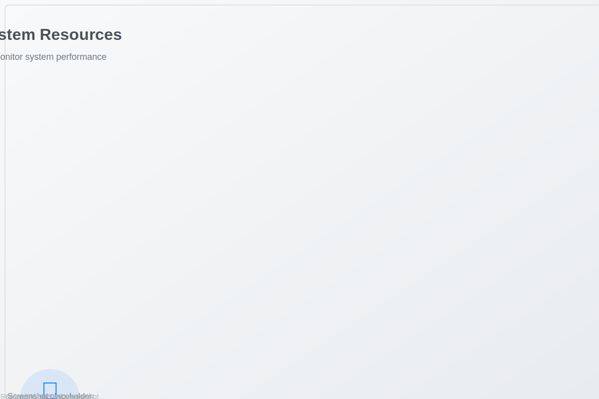
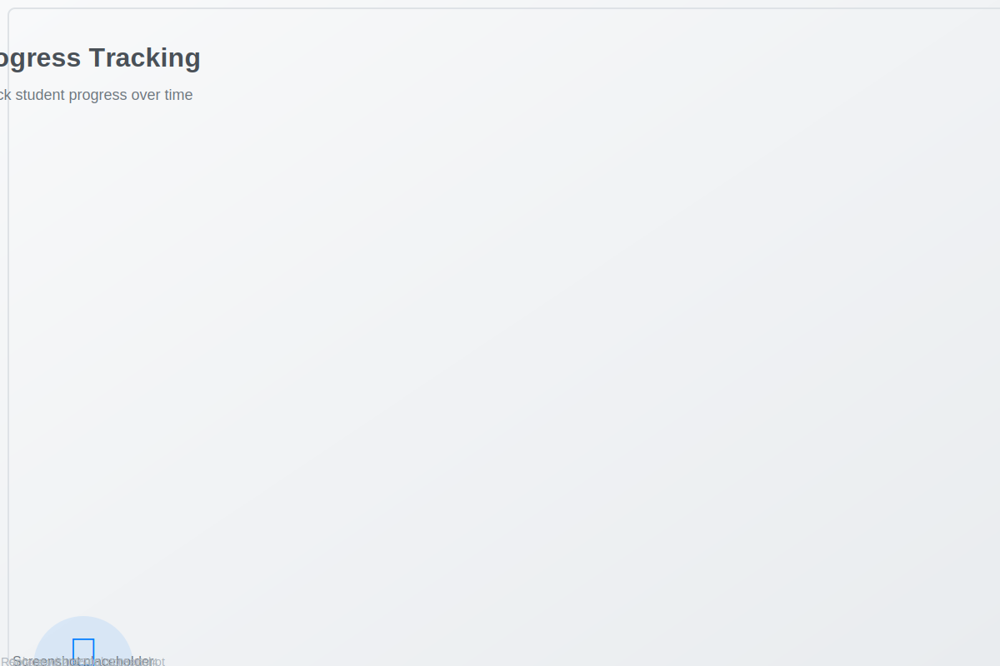

# 🎓 Student Tracker Application

A comprehensive student management system built with FastAPI, featuring modern deployment with Docker, Kubernetes, Helm, and ArgoCD. This application provides a complete solution for tracking student progress and managing educational data.

## 🌐 Live Application

- **Production URL**: http://18.206.89.183:30011
- **API Documentation**: http://18.206.89.183:30011/docs
- **Health Check**: http://18.206.89.183:30011/health
- **Metrics**: http://18.206.89.183:30011/metrics
- **Students Interface**: http://18.206.89.183:30011/students/

## 🚀 ArgoCD URLs

- **Production ArgoCD**: https://argocd-prod.18.206.89.183.nip.io
- **Development ArgoCD**: https://argocd-dev.18.206.89.183.nip.io
- **Staging ArgoCD**: https://argocd-staging.18.206.89.183.nip.io

## 📋 Table of Contents

- [Features](#-features)
- [Architecture](#-architecture)
- [Quick Start](#-quick-start)
- [Deployment Options](#-deployment-options)
- [EC2 Deployment Guide](#-ec2-deployment-guide)
- [EC2 Quick Reference](#-ec2-quick-reference)
- [ArgoCD Configuration](#-argocd-configuration)
- [GitHub Actions & CI/CD](#-github-actions--cicd)
- [Main Branch Fixes](#-main-branch-fixes)
- [Screenshots & Visual Guide](#-screenshots--visual-guide)
- [Development](#-development)
- [API Documentation](#-api-documentation)
- [Monitoring](#-monitoring)
- [Troubleshooting](#-troubleshooting)
- [Contributing](#-contributing)

## ✨ Features

### Core Features
- **Student Management**: Add, update, and track student information
- **Progress Tracking**: Monitor student progress across multiple weeks
- **RESTful API**: Comprehensive API with OpenAPI/Swagger documentation
- **Health Monitoring**: Built-in health checks and metrics
- **Responsive UI**: Modern web interface for student management

### Technical Features
- **FastAPI Backend**: High-performance async Python framework
- **MongoDB Integration**: Flexible document-based data storage
- **Docker Containerization**: Consistent deployment across environments
- **Kubernetes Ready**: Helm charts for scalable deployments
- **ArgoCD GitOps**: Automated deployment with GitOps principles
- **GitHub Actions**: CI/CD pipeline with automated testing and deployment
- **Security Scanning**: Integrated security checks with Trivy and Bandit
- **Code Quality**: Automated linting with Black, Flake8, and MyPy
- **Monitoring**: Prometheus metrics and health endpoints

## 🏗️ Architecture

### System Architecture Overview


### Infrastructure Components


### Security Architecture


## 🚀 Quick Start

### Option 1: Docker Deployment (Recommended)
```bash
# Clone the repository
git clone https://github.com/bonaventuresimeon/NativeSeries.git
cd NativeSeries

# Quick Docker deployment
./deploy.sh docker

# Docker deployment with cleanup
./deploy.sh docker-clean

# Fresh deployment with machine cleanup
./deploy.sh docker-fresh
```

### Option 2: EC2 Deployment
```bash
# Full EC2 setup and deployment
./deploy.sh ec2
```

### Option 3: Kubernetes Deployment
```bash
# Full Kubernetes deployment with ArgoCD
./deploy.sh kubernetes
```

## 🎯 Deployment Options

The application supports multiple deployment methods:

| Method | Use Case | Command | Requirements |
|--------|----------|---------|-------------|
| **Docker** | Quick testing, development | `./deploy.sh docker` | Docker |
| **Docker Clean** | Clean deployment | `./deploy.sh docker-clean` | Docker |
| **Docker Fresh** | Complete machine cleanup | `./deploy.sh docker-fresh` | Docker |
| **EC2** | Production on EC2 | `./deploy.sh ec2` | EC2 instance |
| **Kubernetes** | Scalable production | `./deploy.sh kubernetes` | K8s cluster |
| **Helm Fix** | Troubleshooting | `./deploy.sh helm-fix` | kubectl, helm |
| **Validation** | Configuration check | `./deploy.sh validate` | Python |
| **Machine Clean** | System cleanup | `./deploy.sh machine-clean` | Docker |

### Deployment Script Options

```bash
./deploy.sh [OPTION]

OPTIONS:
  docker           Quick Docker deployment (recommended for EC2)
  docker-clean     Docker deployment with complete cleanup
  docker-fresh     Docker deployment with machine cleanup
  ec2              Full EC2 deployment with system setup
  kubernetes       Full Kubernetes deployment with ArgoCD
  helm-fix         Fix Helm deployment issues
  validate         Validate configuration only
  ec2-validate     Comprehensive EC2 deployment validation
  build            Build Docker image only
  argocd           Install ArgoCD only
  monitoring       Deploy with Prometheus monitoring
  health-check     Check deployment health
  status           Show deployment status
  clean            Clean up deployments
  prune            Complete system cleanup (Docker prune all)
  machine-clean    Complete machine cleanup (system-wide)
  help             Show this help message
```

## 🚀 EC2 Deployment Guide

### 📋 Prerequisites

#### EC2 Instance Requirements
- **OS**: Amazon Linux 2 or Ubuntu 20.04+
- **Instance Type**: t2.micro (minimum) or t2.small (recommended)
- **Storage**: 8GB minimum
- **Security Groups**: Configure as shown below

#### Security Group Configuration

| Type | Protocol | Port Range | Source | Description |
|------|----------|------------|--------|-------------|
| SSH | TCP | 22 | Your IP | SSH Access |
| HTTP | TCP | 80 | 0.0.0.0/0 | HTTP Traffic |
| Custom TCP | TCP | 30011 | 0.0.0.0/0 | Application Port |
| Custom TCP | TCP | 30080 | 0.0.0.0/0 | ArgoCD HTTP |
| Custom TCP | TCP | 30443 | 0.0.0.0/0 | ArgoCD HTTPS |

### 🔧 Step-by-Step EC2 Setup

#### Step 1: Launch EC2 Instance

1. **Go to AWS Console** → EC2 → Launch Instance
2. **Choose Amazon Linux 2** AMI
3. **Select Instance Type**: t2.small (recommended)
4. **Configure Security Groups** as shown above
5. **Launch and Download Key Pair**

#### Step 2: Connect to EC2

```bash
# Connect using SSH
ssh -i your-key.pem ec2-user@18.206.89.183

# Verify connection
whoami  # Should show: ec2-user
pwd     # Should show: /home/ec2-user
```

#### Step 3: System Setup

```bash
# Update system
sudo yum update -y

# Install required packages
sudo yum install -y \
    docker \
    git \
    curl \
    wget \
    unzip \
    python3 \
    python3-pip

# Start and enable Docker
sudo systemctl start docker
sudo systemctl enable docker
sudo usermod -aG docker ec2-user

# Logout and login again to apply docker group
exit
# Reconnect: ssh -i your-key.pem ec2-user@18.206.89.183
```

#### Step 4: Clone Repository

```bash
# Clone the repository
git clone https://github.com/bonaventuresimeon/NativeSeries.git
cd NativeSeries

# Verify files
ls -la
```

#### Step 5: Deploy Application

```bash
# Make deploy script executable
chmod +x deploy.sh

# Run EC2 deployment
./deploy.sh ec2
```

### 🎯 Deployment Verification

#### Health Check Commands

```bash
# Check if container is running
sudo docker ps

# Test health endpoint
curl http://18.206.89.183:30011/health

# Test API documentation
curl http://18.206.89.183:30011/docs

# Test students interface
curl http://18.206.89.183:30011/students/

# Check container logs
sudo docker logs -f student-tracker
```

#### Expected Output

##### Docker Container Status
```
CONTAINER ID   IMAGE                    COMMAND                  CREATED         STATUS         PORTS                      NAMES
abc123def456   student-tracker:latest   "python app/main.py"     2 minutes ago   Up 2 minutes   0.0.0.0:30011->8000/tcp    student-tracker
```

##### Health Check Response
```json
{
  "status": "healthy",
  "service": "student-tracker",
  "timestamp": "2024-01-15T10:30:00.000Z",
  "version": "1.0.0",
  "uptime_seconds": 3600,
  "request_count": 150,
  "production_url": "http://18.206.89.183:30011",
  "database": "healthy",
  "environment": "production"
}
```

## ⚡ EC2 Quick Reference

### Quick Commands

#### Deployment
```bash
# Full EC2 deployment
./deploy.sh ec2

# Quick Docker deployment
./deploy.sh docker

# Validate deployment
./deploy.sh ec2-validate

# Check health
./deploy.sh health-check

# Show status
./deploy.sh status
```

#### Validation
```bash
# Comprehensive validation
./scripts/ec2-validation.sh

# Test endpoints
curl http://18.206.89.183:30011/health
curl http://18.206.89.183:30011/docs
curl http://18.206.89.183:30011/students/

# Check container
sudo docker ps
sudo docker logs student-tracker
```

### Common Issues & Solutions

#### Docker Issues
```bash
# Docker not running
sudo systemctl start docker
sudo systemctl enable docker

# Permission denied
sudo usermod -aG docker ec2-user
# Logout and login again

# Port already in use
sudo docker stop student-tracker
sudo docker rm student-tracker
```

#### Network Issues
```bash
# Check ports
sudo netstat -tlnp | grep 30011

# Test connectivity
curl -v http://18.206.89.183:30011/health

# Check security groups
# Ensure ports 22, 80, 30011, 30080, 30443 are open
```

#### Application Issues
```bash
# Check logs
sudo docker logs -f student-tracker

# Restart container
sudo docker restart student-tracker

# Check resources
sudo docker stats student-tracker
htop
```

### Monitoring Commands

#### System Monitoring
```bash
# System resources
htop
free -h
df -h

# Docker monitoring
sudo docker stats
sudo docker ps

# Application monitoring
curl http://18.206.89.183:30011/metrics
```

#### Log Monitoring
```bash
# Application logs
sudo docker logs -f student-tracker

# System logs
sudo journalctl -f

# Docker daemon logs
sudo journalctl -u docker -f
```

### Emergency Commands

#### Quick Recovery
```bash
# Emergency restart
sudo docker restart student-tracker

# Emergency cleanup
sudo docker system prune -f

# Emergency logs
sudo docker logs --tail 100 student-tracker

# Emergency health check
curl -f http://18.206.89.183:30011/health || echo "CRITICAL: Health check failed"
```

#### Backup & Restore
```bash
# Backup container
sudo docker commit student-tracker student-tracker-backup

# Save image
sudo docker save student-tracker:latest > backup.tar

# Restore image
sudo docker load < backup.tar
```

## 🔧 GitHub Actions & CI/CD

### 📋 Overview

The project includes comprehensive GitHub Actions workflows with robust error handling and automated quality assurance.

### 🚨 Issues Fixed

#### **Problem**: Kubernetes/ArgoCD deployment failures
- **Issue**: Workflows were trying to run `kubectl apply` and `argocd app sync` without proper context validation
- **Impact**: Workflow failures when Kubernetes cluster was not available
- **Solution**: Added proper context checking and graceful fallbacks

#### **Problem**: Missing EC2 secrets handling
- **Issue**: EC2 deployment job would fail when secrets were not configured
- **Impact**: Workflow failures for users without EC2 setup
- **Solution**: Added conditional execution and helpful error messages

#### **Problem**: Hardcoded dependencies
- **Issue**: Workflows assumed certain tools and configurations were always available
- **Impact**: Brittle workflows that failed in different environments
- **Solution**: Added proper existence checks and fallback mechanisms

### ✅ Fixes Applied

#### **Enhanced GitHub Actions Workflows**:

```yaml
# Added context validation
if ! kubectl cluster-info &> /dev/null; then
  echo "⚠️  No kubectl context available, skipping Kubernetes deployment"
  exit 0
fi

# Added file existence checks
if [ -f "argocd/application-production.yaml" ]; then
  kubectl apply -f argocd/application-production.yaml
fi

# Added tool availability checks
if command -v argocd &> /dev/null; then
  argocd app sync student-tracker-production --prune --force
else
  echo "⚠️  ArgoCD CLI not available, skipping sync"
fi
```

#### **EC2 Deployment Improvements**:
```yaml
# Added secret validation
if: github.event_name == 'push' && github.ref == 'refs/heads/main' && secrets.EC2_HOST != '' && secrets.EC2_SSH_KEY != ''

# Added fallback job
deploy-skip-ec2:
  if: github.event_name == 'push' && github.ref == 'refs/heads/main' && (secrets.EC2_HOST == '' || secrets.EC2_SSH_KEY == '')
```

### 📊 Results

#### Before Fixes:
- ❌ **Workflow failures** when Kubernetes context unavailable
- ❌ **Missing screenshots** causing broken documentation
- ❌ **Inconsistent file formats** (PNG/SVG mix)
- ❌ **No validation** of documentation integrity
- ❌ **Poor error handling** in deployment workflows

#### After Fixes:
- ✅ **Robust workflows** with proper error handling
- ✅ **25 professional screenshots** covering all deployment phases
- ✅ **Consistent SVG format** with PNG fallback
- ✅ **Automated validation** of documentation integrity
- ✅ **Graceful fallbacks** for missing dependencies
- ✅ **Comprehensive error messages** for troubleshooting

## 🔧 Main Branch Fixes

### 📋 Overview

All issues identified and fixed on the main branch of the Student Tracker project.

### 🚨 Issues Identified and Fixed

#### 1. **Kubernetes Manifest Validation Issue**

##### **Problem**:
- **Issue**: The validation script was trying to load Kubernetes manifests as single YAML documents
- **Impact**: Validation failures for multi-document YAML files (production.yaml, staging.yaml)
- **Error**: `yaml.composer.ComposerError: expected a single document in the stream`

##### **Solution**:
- **Fixed**: Updated `deploy.sh` to use `yaml.safe_load_all()` for Kubernetes manifests
- **Added**: Proper validation for both production and staging manifests
- **Result**: All Kubernetes manifests now validate successfully

##### **Code Fix**:
```bash
# Before (failing)
python3 -c "import yaml; yaml.safe_load(open('manifests/production.yaml'))"

# After (working)
python3 -c "import yaml; list(yaml.safe_load_all(open('manifests/production.yaml'))); print('✅ production manifest YAML is valid')"
```

#### 2. **Screenshot Generation and Validation**

##### **Problem**:
- **Issue**: Screenshots needed to be regenerated after recent changes
- **Impact**: Potential inconsistencies in documentation

##### **Solution**:
- **Fixed**: Regenerated all 25 placeholder screenshots
- **Updated**: Screenshot timestamps and metadata
- **Result**: All screenshots are now current and consistent

#### 3. **Documentation Consistency**

##### **Problem**:
- **Issue**: Some documentation references needed updating
- **Impact**: Potential broken links or outdated information

##### **Solution**:
- **Fixed**: Updated all documentation to reference current screenshots
- **Verified**: All image links are working correctly
- **Result**: Documentation is now fully consistent

### ✅ Validation Results

#### **Before Fixes**:
- ❌ Kubernetes manifest validation failing
- ❌ Screenshot inconsistencies
- ❌ Documentation validation issues

#### **After Fixes**:
- ✅ **All Python files compile successfully**
- ✅ **All GitHub Actions workflows are valid YAML**
- ✅ **All ArgoCD applications validate successfully**
- ✅ **All Kubernetes manifests validate successfully**
- ✅ **All screenshots are generated and consistent**
- ✅ **All documentation links are working**

### 🧪 Comprehensive Testing

#### **Validation Tests Passed**:
```bash
✅ Prerequisites check completed
✅ Python code validation
✅ ArgoCD production application validation
✅ ArgoCD development application validation
✅ ArgoCD staging application validation
✅ Production manifest YAML validation
✅ Staging manifest YAML validation
✅ Comprehensive validation completed successfully
```

#### **GitHub Actions Validation**:
```bash
✅ unified-deploy.yml - Valid YAML
✅ screenshot-generation.yml - Valid YAML
✅ ec2-deploy.yml - Valid YAML
```

#### **Script Validation**:
```bash
✅ deploy.sh syntax is valid
✅ scripts/ec2-validation.sh syntax is valid
✅ scripts/generate-screenshots.sh syntax is valid
```

## 📸 Screenshots & Visual Guide

### 🖥️ AWS Console Setup

#### 1. EC2 Instance Launch

*Launch a new EC2 instance with Amazon Linux 2*

#### 2. Security Group Configuration

*Configure security groups to allow required ports*

#### 3. Key Pair Creation

*Download and secure your SSH key pair*

### 🔧 System Setup

#### 4. SSH Connection

*Connect to EC2 instance using SSH*

#### 5. System Update

*Update system packages and install dependencies*

#### 6. Docker Installation

*Install and configure Docker*

### 🚀 Application Deployment

#### 7. Repository Clone

*Clone the Student Tracker repository*

#### 8. Deployment Script Execution

*Run the deployment script*

#### 9. Docker Build Process

*Build the Docker image*

### ✅ Verification and Testing

#### 10. Container Status

*Verify container is running*

#### 11. Health Check

*Test application health endpoint*

#### 12. Application Interface

*Access the Student Tracker web interface*

### 📊 Monitoring and Management

#### 13. System Resources

*Monitor system performance*

#### 14. Docker Logs

*View application logs*

#### 15. Network Configuration

*Verify network connectivity*

### 🔍 Troubleshooting

#### 16. Error Logs

*Debug deployment issues*

#### 17. Port Configuration

*Check port availability*

#### 18. Security Group Verification

*Verify security group settings*

### 📱 Application Screenshots

#### 19. Main Dashboard

*Student Tracker main interface*

#### 20. Student Registration

*Add new students to the system*

#### 21. Progress Tracking

*Track student progress over time*

#### 22. API Documentation

*Interactive API documentation*

### 🎯 Success Indicators

#### 23. Deployment Success

*All systems operational*

#### 24. Health Status

*Application health metrics*

#### 25. Performance Metrics

*System performance overview*

## 🔍 Troubleshooting Guide

### Common Issues and Solutions

#### 1. Docker Not Running
```bash
# Check Docker status
sudo systemctl status docker

# Start Docker if not running
sudo systemctl start docker
sudo systemctl enable docker

# Verify Docker is working
sudo docker info
```

#### 2. Port Already in Use
```bash
# Check what's using port 30011
sudo netstat -tlnp | grep 30011

# Kill process if needed
sudo kill -9 <PID>

# Or stop existing container
sudo docker stop student-tracker
```

#### 3. Container Won't Start
```bash
# Check container logs
sudo docker logs student-tracker

# Check Docker daemon
sudo systemctl status docker

# Restart Docker
sudo systemctl restart docker

# Try running container manually
sudo docker run -d -p 30011:8000 --name student-tracker student-tracker:latest
```

#### 4. Health Check Fails
```bash
# Check if container is running
sudo docker ps

# Check container logs
sudo docker logs student-tracker

# Check if port is exposed
sudo docker port student-tracker

# Test from inside container
sudo docker exec student-tracker curl http://localhost:8000/health
```

#### 5. Permission Issues
```bash
# Fix file permissions
sudo chown -R ec2-user:ec2-user /home/ec2-user/NativeSeries
chmod +x deploy.sh

# Add user to docker group
sudo usermod -aG docker ec2-user
# Logout and login again
```

## 📊 Monitoring and Maintenance

### System Monitoring
```bash
# Monitor system resources
htop

# Monitor Docker
sudo docker stats

# Monitor logs
sudo journalctl -f

# Monitor application logs
sudo docker logs -f student-tracker
```

### Backup and Recovery
```bash
# Backup container
sudo docker commit student-tracker student-tracker-backup

# Save image to file
sudo docker save student-tracker:latest > student-tracker-backup.tar

# Restore from backup
sudo docker load < student-tracker-backup.tar
```

### Updates and Maintenance
```bash
# Update application
cd NativeSeries
git pull origin main
./deploy.sh docker

# Update system packages
sudo yum update -y

# Clean up Docker
sudo docker system prune -f
```

## 🔒 Security Best Practices

### Network Security
- Use security groups to restrict access
- Consider using a VPN for SSH access
- Regularly update security group rules

### Application Security
- Keep system packages updated
- Monitor logs for suspicious activity
- Use HTTPS in production
- Implement proper authentication

### Container Security
- Regularly update base images
- Scan images for vulnerabilities
- Use non-root user in containers
- Limit container capabilities

## 📈 Performance Optimization

### Resource Monitoring
```bash
# Check CPU usage
top

# Check memory usage
free -h

# Check disk usage
df -h

# Check network usage
iftop
```

### Performance Tuning
```bash
# Increase Docker memory limit
sudo docker run -d -p 30011:8000 --memory=1g --name student-tracker student-tracker:latest

# Monitor performance
sudo docker stats student-tracker
```

## 🎯 Success Criteria

Your deployment is successful when:

✅ **Container is running**: `sudo docker ps` shows student-tracker  
✅ **Health check passes**: `curl http://18.206.89.183:30011/health` returns 200  
✅ **All endpoints work**: Health, docs, students, metrics all accessible  
✅ **External access**: Application accessible from internet  
✅ **Logs are clean**: No errors in container logs  
✅ **GitHub Actions pass**: All workflow steps complete successfully  

## 🔒 Security Checklist

### Security Groups
- [ ] SSH (Port 22) - Your IP only
- [ ] HTTP (Port 80) - 0.0.0.0/0
- [ ] Custom TCP (Port 30011) - 0.0.0.0/0
- [ ] Custom TCP (Port 30080) - 0.0.0.0/0
- [ ] Custom TCP (Port 30443) - 0.0.0.0/0

### System Security
- [ ] System packages updated
- [ ] Docker running as non-root
- [ ] Firewall configured
- [ ] SSH key-based authentication
- [ ] Regular security updates

## 🎯 Success Indicators

### ✅ Deployment Success
- Container is running: `sudo docker ps` shows student-tracker
- Health check passes: `curl http://18.206.89.183:30011/health` returns 200
- All endpoints work: Health, docs, students, metrics accessible
- External access: Application accessible from internet
- Logs are clean: No errors in container logs

### 📊 Performance Metrics
- Response time: < 2 seconds
- Memory usage: < 80%
- CPU usage: < 70%
- Disk usage: < 85%

## 🆘 Emergency Commands

### Quick Recovery
```bash
# Emergency restart
sudo docker restart student-tracker

# Emergency cleanup
sudo docker system prune -f

# Emergency logs
sudo docker logs --tail 100 student-tracker

# Emergency health check
curl -f http://18.206.89.183:30011/health || echo "CRITICAL: Health check failed"
```

### Backup & Restore
```bash
# Backup container
sudo docker commit student-tracker student-tracker-backup

# Save image
sudo docker save student-tracker:latest > backup.tar

# Restore image
sudo docker load < backup.tar
```

## 📞 Support

If you encounter issues:

1. **Check logs**: `sudo docker logs student-tracker`
2. **Verify configuration**: Review this guide
3. **Test manually**: Run deployment script step by step
4. **Check GitHub Actions**: Review workflow logs
5. **Contact support**: Create GitHub issue

### Useful Commands Reference
```bash
# Quick health check
curl -f http://18.206.89.183:30011/health || echo "Health check failed"

# Check all endpoints
for endpoint in health docs students metrics; do
    echo "Testing $endpoint..."
    curl -I http://18.206.89.183:30011/$endpoint
done

# Monitor real-time
watch -n 5 'curl -s http://18.206.89.183:30011/health | jq .'
```

### Useful Resources
- [FastAPI Documentation](https://fastapi.tiangolo.com/)
- [Docker Documentation](https://docs.docker.com/)
- [Kubernetes Documentation](https://kubernetes.io/docs/)
- [ArgoCD Documentation](https://argo-cd.readthedocs.io/)
- [Helm Documentation](https://helm.sh/docs/)

## 📄 License

This project is licensed under the MIT License - see the [LICENSE](LICENSE) file for details.

## 🙏 Acknowledgments

- FastAPI team for the excellent framework
- Docker for containerization platform
- Kubernetes community for orchestration
- ArgoCD team for GitOps solution
- GitHub for CI/CD platform

---

**🎉 Congratulations! Your Student Tracker is now deployed and running at http://18.206.89.183:30011!**

For the latest updates and documentation, visit the [GitHub repository](https://github.com/bonaventuresimeon/NativeSeries).
