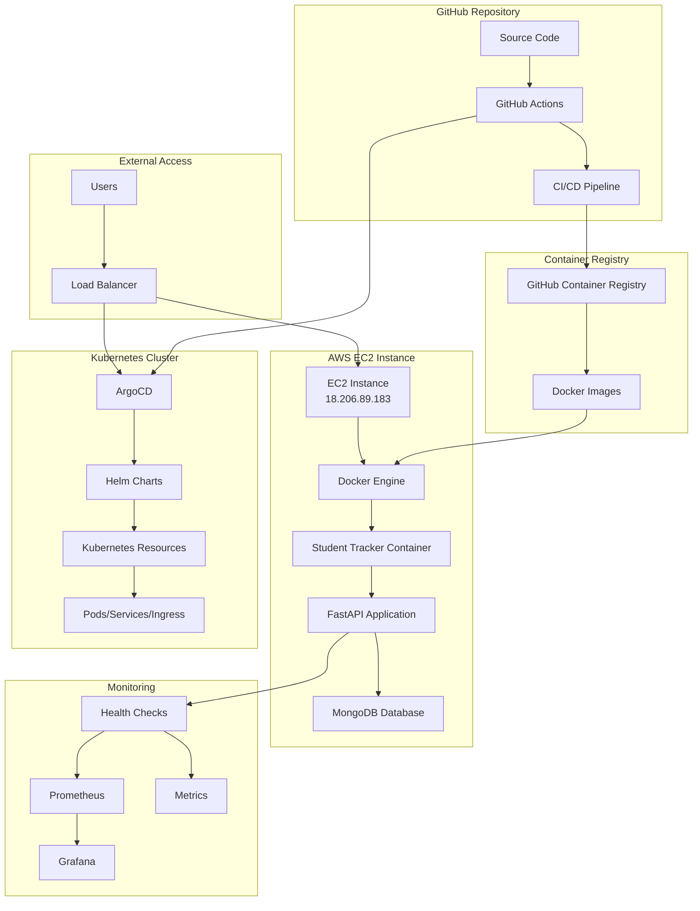
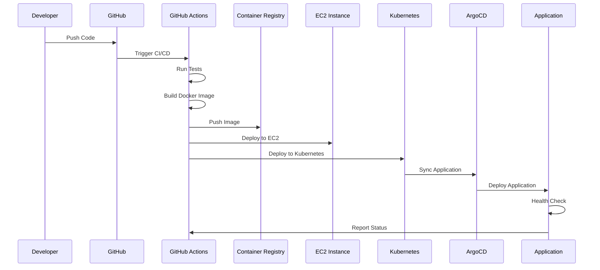
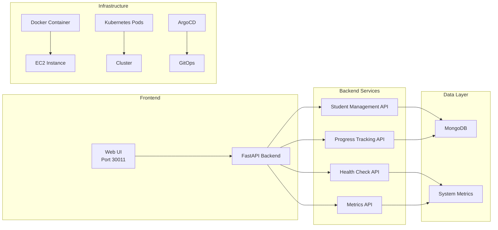
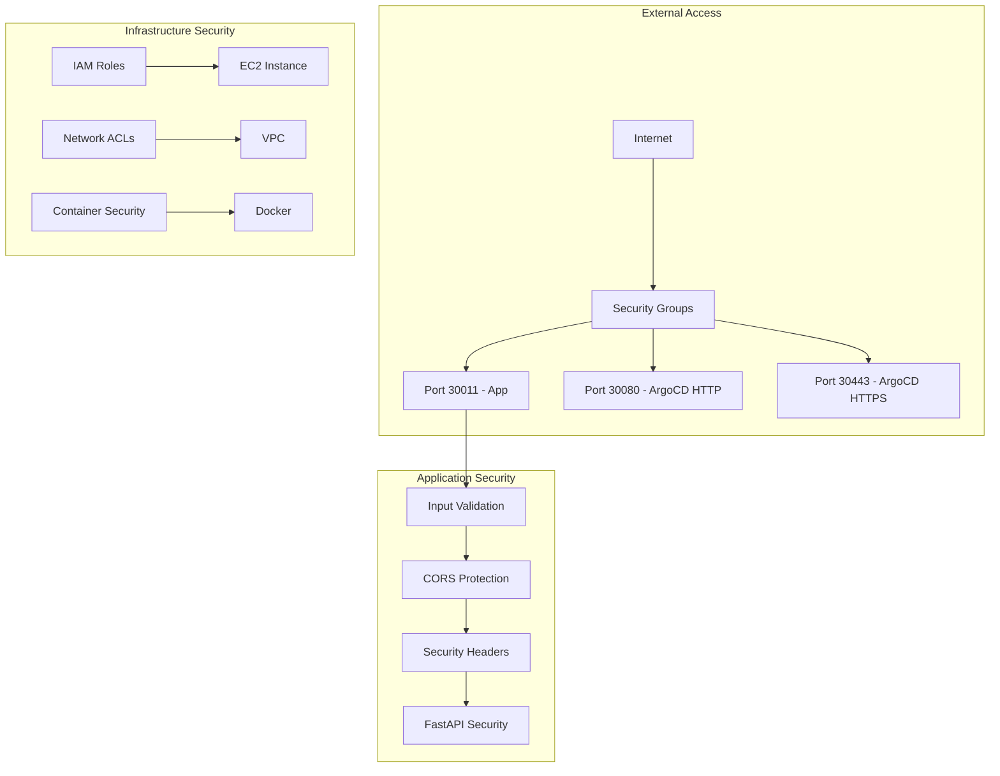
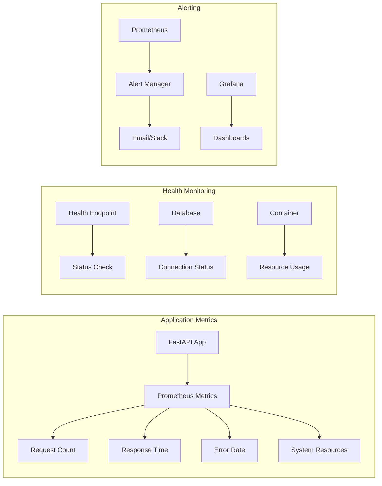

# Student Tracker Architecture Diagrams

## System Architecture Overview

```mermaid
graph TB
    subgraph "GitHub Repository"
        A[Source Code] --> B[GitHub Actions]
        B --> C[CI/CD Pipeline]
    end
    
    subgraph "Container Registry"
        C --> D[GitHub Container Registry]
        D --> E[Docker Images]
    end
    
    subgraph "AWS EC2 Instance"
        F[EC2 Instance<br/>18.206.89.183] --> G[Docker Engine]
        G --> H[Student Tracker Container]
        H --> I[FastAPI Application]
        I --> J[MongoDB Database]
    end
    
    subgraph "Kubernetes Cluster"
        K[ArgoCD] --> L[Helm Charts]
        L --> M[Kubernetes Resources]
        M --> N[Pods/Services/Ingress]
    end
    
    subgraph "External Access"
        O[Users] --> P[Load Balancer]
        P --> F
        P --> K
    end
    
    subgraph "Monitoring"
        Q[Prometheus] --> R[Grafana]
        S[Health Checks] --> T[Metrics]
    end
    
    E --> G
    B --> K
    I --> S
    S --> Q
```

## Deployment Flow

```mermaid
sequenceDiagram
    participant Dev as Developer
    participant GH as GitHub
    participant GA as GitHub Actions
    participant CR as Container Registry
    participant EC2 as EC2 Instance
    participant K8s as Kubernetes
    participant ArgoCD as ArgoCD
    participant App as Application
    
    Dev->>GH: Push Code
    GH->>GA: Trigger CI/CD
    GA->>GA: Run Tests
    GA->>GA: Build Docker Image
    GA->>CR: Push Image
    GA->>EC2: Deploy to EC2
    GA->>K8s: Deploy to Kubernetes
    K8s->>ArgoCD: Sync Application
    ArgoCD->>App: Deploy Application
    App->>App: Health Check
    App->>GA: Report Status
```

## Infrastructure Components

```mermaid
graph LR
    subgraph "Frontend"
        A[Web UI<br/>Port 30011] --> B[FastAPI Backend]
    end
    
    subgraph "Backend Services"
        B --> C[Student Management API]
        B --> D[Progress Tracking API]
        B --> E[Health Check API]
        B --> F[Metrics API]
    end
    
    subgraph "Data Layer"
        C --> G[MongoDB]
        D --> G
        E --> H[System Metrics]
        F --> H
    end
    
    subgraph "Infrastructure"
        I[Docker Container] --> J[EC2 Instance]
        K[Kubernetes Pods] --> L[Cluster]
        M[ArgoCD] --> N[GitOps]
    end
```

## Security Architecture

```mermaid
graph TB
    subgraph "External Access"
        A[Internet] --> B[Security Groups]
        B --> C[Port 30011 - App]
        B --> D[Port 30080 - ArgoCD HTTP]
        B --> E[Port 30443 - ArgoCD HTTPS]
    end
    
    subgraph "Application Security"
        C --> F[Input Validation]
        F --> G[CORS Protection]
        G --> H[Security Headers]
        H --> I[FastAPI Security]
    end
    
    subgraph "Infrastructure Security"
        J[IAM Roles] --> K[EC2 Instance]
        L[Network ACLs] --> M[VPC]
        N[Container Security] --> O[Docker]
    end
```

## Monitoring and Observability

```mermaid
graph LR
    subgraph "Application Metrics"
        A[FastAPI App] --> B[Prometheus Metrics]
        B --> C[Request Count]
        B --> D[Response Time]
        B --> E[Error Rate]
        B --> F[System Resources]
    end
    
    subgraph "Health Monitoring"
        G[Health Endpoint] --> H[Status Check]
        I[Database] --> J[Connection Status]
        K[Container] --> L[Resource Usage]
    end
    
    subgraph "Alerting"
        M[Prometheus] --> N[Alert Manager]
        N --> O[Email/Slack]
        P[Grafana] --> Q[Dashboards]
    end
```