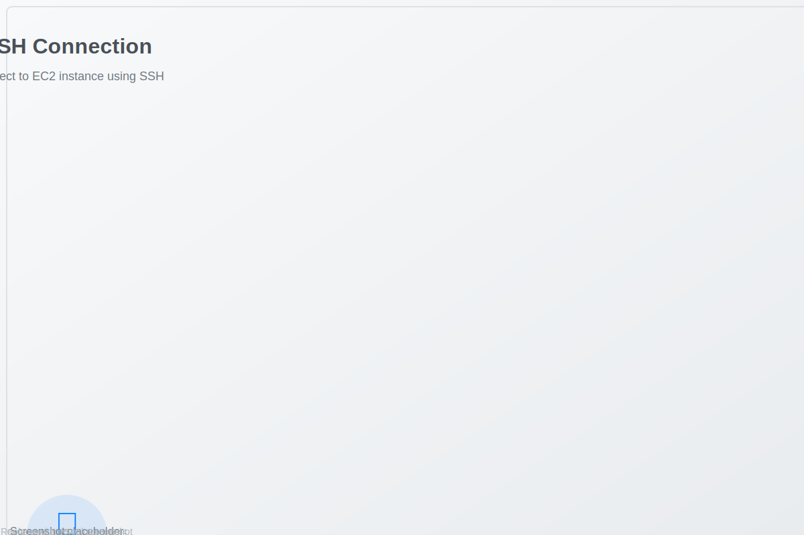
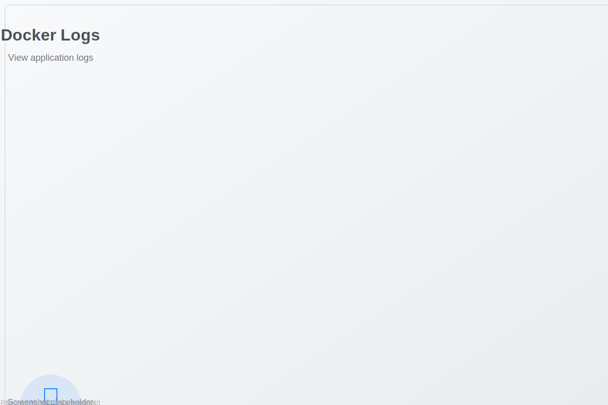
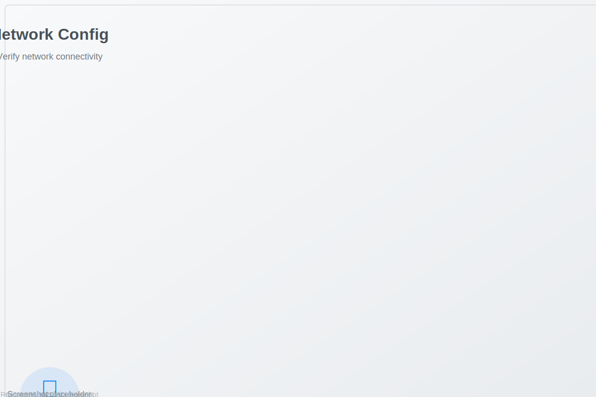
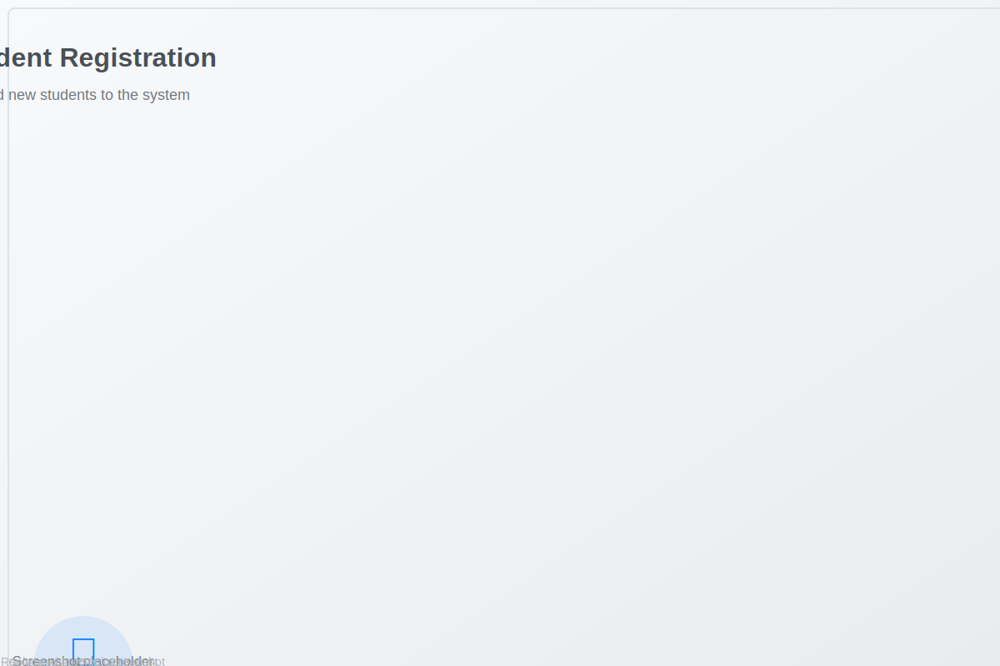
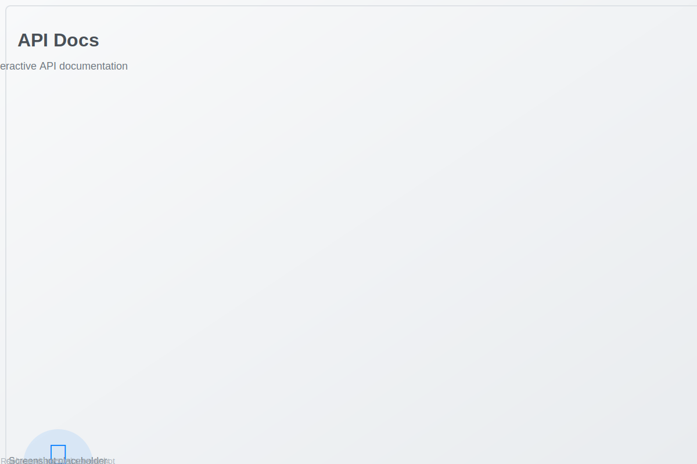
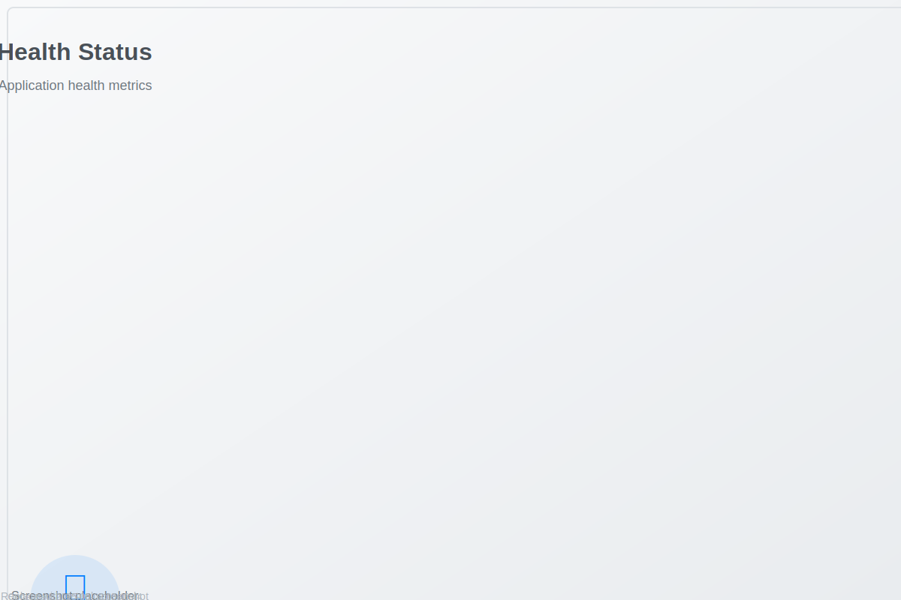
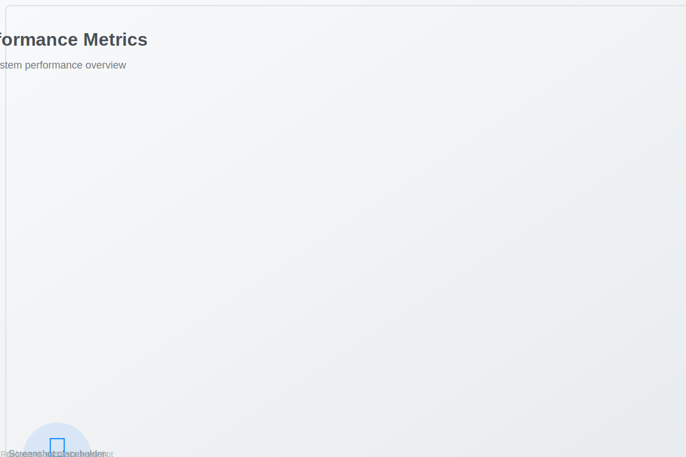

# 📸 EC2 Deployment Screenshots

## 🖥️ AWS Console Setup

### 1. EC2 Instance Launch

*Launch a new EC2 instance with Amazon Linux 2*

### 2. Security Group Configuration

*Configure security groups to allow required ports*

### 3. Key Pair Creation

*Download and secure your SSH key pair*

## 🔧 System Setup

### 4. SSH Connection

*Connect to EC2 instance using SSH*

### 5. System Update

*Update system packages and install dependencies*

### 6. Docker Installation

*Install and configure Docker*

## 🚀 Application Deployment

### 7. Repository Clone

*Clone the Student Tracker repository*

### 8. Deployment Script Execution

*Run the deployment script*

### 9. Docker Build Process

*Build the Docker image*

## ✅ Verification and Testing

### 10. Container Status

*Verify container is running*

### 11. Health Check

*Test application health endpoint*

### 12. Application Interface

*Access the Student Tracker web interface*

## 📊 Monitoring and Management

### 13. System Resources

*Monitor system performance*

### 14. Docker Logs

*View application logs*

### 15. Network Configuration

*Verify network connectivity*

## 🔍 Troubleshooting

### 16. Error Logs

*Debug deployment issues*

### 17. Port Configuration

*Check port availability*

### 18. Security Group Verification

*Verify security group settings*

## 📱 Application Screenshots

### 19. Main Dashboard

*Student Tracker main interface*

### 20. Student Registration

*Add new students to the system*

### 21. Progress Tracking

*Track student progress over time*

### 22. API Documentation

*Interactive API documentation*

## 🎯 Success Indicators

### 23. Deployment Success

*All systems operational*

### 24. Health Status

*Application health metrics*

### 25. Performance Metrics

*System performance overview*

---

## 📝 Screenshot Instructions

To capture these screenshots during deployment:

1. **AWS Console**: Use browser developer tools to capture full-page screenshots
2. **Terminal**: Use `script` command or terminal screenshot tools
3. **Application**: Use browser screenshot extensions or built-in tools
4. **System Monitoring**: Use `htop`, `docker stats`, and other monitoring tools

### Recommended Tools
- **Screenshot Tools**: Flameshot, Shutter, or browser extensions
- **Terminal Recording**: `script` command or asciinema
- **Video Recording**: OBS Studio or similar screen recording software

### File Naming Convention
- Use descriptive names: `ec2-launch-instance.svg`
- Include step numbers: `01-ec2-launch-instance.svg`
- Group by category: `setup/`, `deployment/`, `verification/`

### Image Optimization
- Compress images for web viewing
- Maintain readability of text and details
- Use consistent dimensions where possible
- Include alt text for accessibility